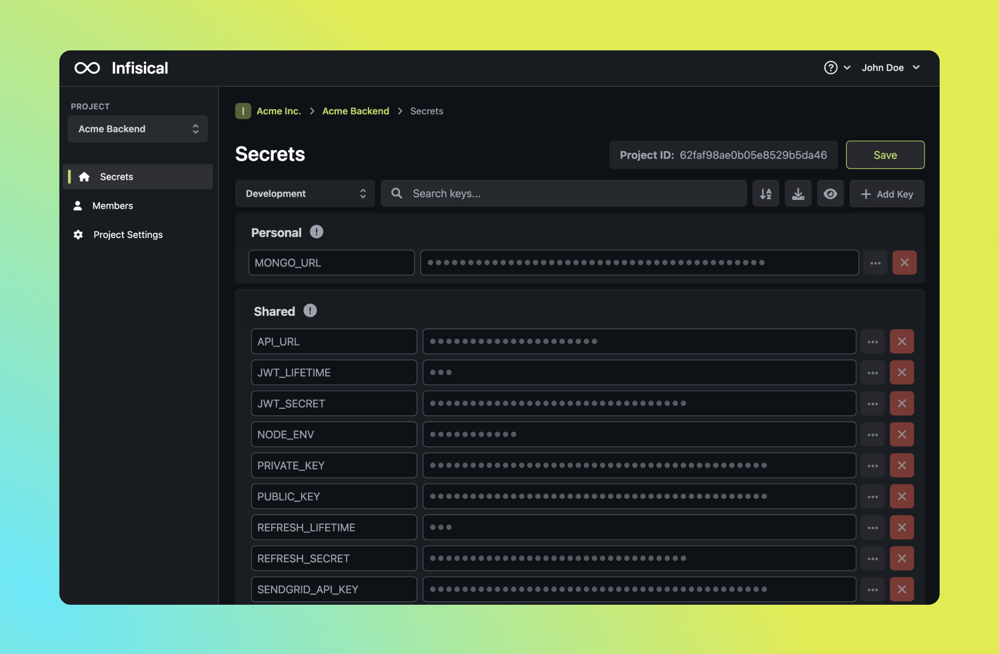

  <h1 align="center">Infisical</h1>
  
Simple, open-source, E2EE platform to sync environment variables

[Infisical](https://infisical.com) is a simple, open source platform to help organizations manage and sync environment variables across their development workflow and infrastructure. It's designed to be simple and end-to-end encrypted.

- **User-Friendly Dashboard** to manage your organization's environment variables within projects.
- **Language-Agnostic** CLI that pulls and injects environment variables into your local workflow.
- **Authentication/Authorization** for projects (read/write controls coming soon).
- **Multiple Environments** per project (e.g. development, staging, production, etc.)
- **Personal/Shared** scoping for environment variables.
- **1-Click Deploy** to Digital Ocean (other providers coming soon).
- **Integrations** with CI/CD and production infrastructure (coming soon).
- **Automatic Secret Rotation** (coming soon).
- **2FA** (coming soon).
- **Access Logs** (coming soon).
- **Slack Integration** (coming soon).

And more.

## What's cool about this?

XX

## Documentation

For full documentation, visit [infisical.com/docs](https://infisical.com/docs).

To see how to contribute, visit [Getting Started](./DEVELOPERS.md).

## Integrations

We're currently setting the foundation and building integrations so secrets can be synced everywhere.

- [x] Docker
- [x] Docker Compose
- [x] Heroku
- [ ] Vercel
- [ ] Kubernetes
- [ ] AWS
- [ ] GCP
- [ ] Azure
- [ ] Digital Ocean
- [ ] GitLab
- [ ] CircleCI

## Community & Support

- [Community Forum]() for help with building and discussion.
- [GitHub Issues](https://github.com/Infisical/infisical-cli/issues) for any bugs and errors you encounter using Infisical.
- [Slack](https://infisical.slack.com/ssb/redirect) for hanging out with the community and quick communication with the team.

## Status

- [x] Public Alpha: Anyone can sign up over at [infisical.com](https://infisical.com) but go easy on us, there are kinks and we're just getting started.
- [ ] Public Beta: Stable enough for most non-enterprise use-cases.
- [ ] Public: Production-ready.

We're currently in Public Alpha.

## Open-source vs. paid

This repo is entirely MIT licensed, with the exception of the `ee` directory which will contain premium enterprise features requring a Infisical license in the future. We're currently focused on developing non-enterprise offerings first that should suit most use-cases.

## Security

Looking to report a security vulnerability? Please refer to our [SECURITY.md](./SECURITY.md) file.
