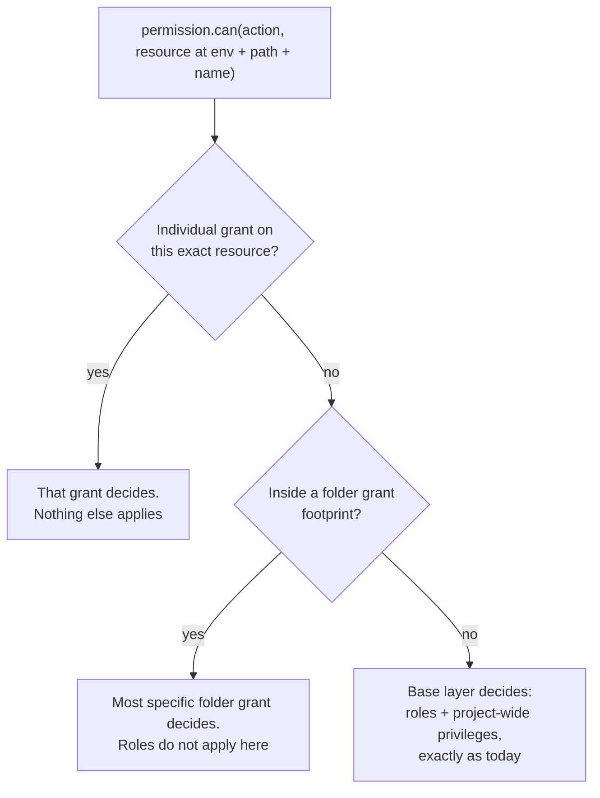
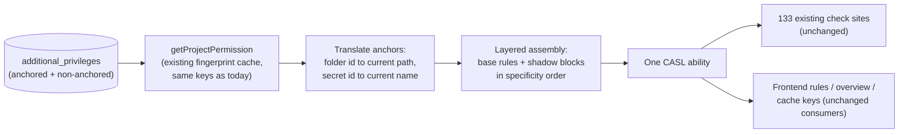

Owner: @Daniel
Implementer: TBD
Reviewer(s): @Scott & @Maidul

# Resource-Based Access

Claude Design PoC implementation: https://claude.ai/design/p/63cf253d-ee04-43f5-8a19-6edfa813b06c?file=Resource+Access.dc.html&via=share

## Overview

Today, everything a user or identity can do inside a project is decided by project roles which carry a flat set of permissions. We take all of their roles and all of their additional privileges, flatten them into a single list of rules, and evaluate every check against that combined list. Creating new project roles and managing a users access through roles makes it harder to assign granular access to resources, and increases the entry barrier for the secrets management product as a whole.

As we're sunsetting custom roles for non-enterprise users, custom RBAC can only be done through traditional additional privileges, which have historically been very cumbersome for users to navigate and use.

To counteract this, we've come up with a path forward for assigning direct access to folders and secrets resources without the need to manage traditional additional privileges, and without creating custom roles.

The model is **override-based**, built around a new concept we call a **resource grant**. A resource grant comes in two shapes:

- **Folder grant.** Anchored to a folder. It means "everything in this folder," and the permissions are specified per resource type: what the actor can do with static secrets in the folder, what they can do with dynamic secrets, and so on. By default it covers exactly that folder (or its sub-folders).
- **Individual resource grant.** Anchored directly to one specific resource: a single static secret, a single dynamic secret, a single rotation. You open the resource and manage access inline.

The two shapes are peers. An individual grant is not a refinement of a folder grant; it stands on its own.

When the actor touches something the grant is anchored to (such as a folder or a static secret), the grant fully defines what they can do with it. Their roles and project-wide privileges do not apply there. Everywhere else in the project, nothing changes. This is the opposite of how permissions combine today. It lets an admin say "you have broad access to this project, but on these payment secrets you can only read values", instead of having everything bound by project roles.

When grants overlap, the most specific one wins: an individual grant on a secret beats a folder grant covering that secret, and a grant on a deeper folder beats a subtree grant from above.

We build this on top of the existing additional privileges system. No new tables are needed. A resource grant is an additional privilege row with a resource anchor on it, and evaluation happens inside the same single CASL ability that every permission check in the codebase already uses.

## Background

### How project permissions work today

Every project actor has memberships carrying one or more roles, and additional privileges. When a request comes in, `getProjectPermission` fetches all of them, flattens the rules into one array, and builds a single CASL ability out of it. That ability is what every service checks against.

```ts
ForbiddenError.from(permission).throwUnlessCan(
  ProjectPermissionSecretActions.ReadValue,
  subject(ProjectPermissionSub.Secrets, { environment, secretPath, secretName })
);
```

Two properties of this setup matter a lot for this design:

1. **Permission resolution is resource-blind.** The ability is built once per actor per project, before we know which folder or secret will be checked. The resource identity (environment, secret path, secret name) only enters later when doing the check, as condition data on the subject.
2. **CASL evaluates rules as last-match-wins.** For any check, CASL walks the rule array from the end and the first rule that matches decides the outcome. Rule order is already meaningful today: it is the only reason a deny rule beats an allow rule.

The result is heavily cached (a Redis fingerprint cache plus per-request memoization), and the single rules array is also the transport format: the frontend evaluates the same rules for UI gating, the access overview builds abilities from them, and response caches hash them into their keys.

### Why now

Resource-level access is where the broader access model is heading. We have already shipped it for PKI resources, and for PAM as apart of the revamp. Folder-level access for secrets is a recurring ask: teams want to hand a contractor, a CI identity, or a neighboring team scoped access to one folder without reasoning about how it interacts with every role the actor holds.

The current model cannot express this. Because everything unions together, the only way to narrow someone's access to a folder is to carefully avoid ever granting them anything broad, which falls apart the moment they are in a group or hold a second role.

### What we are solving

When an actor has a resource grant, that grant should be the complete truth about their access to whatever it is anchored to.

The constraints that helped coming up with the design:

- Permission checks are extremely hot. Whatever we do has to ride the existing caches, not multiply them.
- Batch operations (recursive listing, imports, reference expansion) evaluate one actor's access against hundreds of folders in a single request, sometimes inside synchronous callbacks. The design cannot require a lookup per folder.
- The rules array is consumed in a lot of places (frontend, overview, cache keys, etc). The semantics have to survive all of them without reimplementing everything.
- Grants must support time-bound access, per grant. One actor can have permanent access to `/folder-a` and a 4-hour window on folder `/folder-b` at the same time.

### Approaches we considered

| Approach | How it works | Why it was rejected |
| --- | --- | --- |
| Union into the flat set (status quo mechanics) | Store resource grants as normal additional privileges and let them merge in | Merging is exactly the wrong semantic. The grant would only ever add access, never scope it |
| Per-resource permission resolution (the cert-manager model) | Resolve a dedicated ability per resource, like `getResourcePermission` does for cert-manager apps | Works only when the resource is known at the route boundary and requests touch one resource. Secrets are path-addressed and batch-heavy: the resource set is discovered mid-function, and reference expansion reaches folders you cannot know in advance, inside sync callbacks. See the deep dive below |
| New first-class data structure (folder-scoped memberships) | Add `scopeResourceType`/`scopeResourceId` memberships for folders, mirroring cert-manager | Does not fix any of the evaluation problems, since those live on the consumption side, not the storage side. Also loses what additional privileges give us for free: per-row time-bound access and the access approval integration. Kept as a future direction if folders become first-class product objects |
| **Composite ability with layered rules (selected)** | Keep one ability per actor per project, but assemble its rules in layers so resource grants shadow the base permissions inside their footprint | One artifact, zero call-site changes, all caches and consumers inherit the semantics automatically |

A note on the data structure question specifically, because it came up during design discussions with Scott / Maidul. we get little to no value from a new structure since the additional privileges architecture is already in place, and there is a harder problem with consolidating grants into a single record per actor. Time-bound access is per grant. A user can have different expiry windows on different folders and resources, so we need one row per grant regardless, each with its own temporary window. That is exactly the shape additional privileges already have.

## How the override works

### Layered rule assembly

We keep building one ability per actor per project. What changes is how the rule array inside it is assembled:

1. **Base layer.** All roles and all project-wide (non-anchored) additional privileges, flattened and sorted exactly as today.
2. **Shadow blocks.** For each active resource grant, appended after the base layer: first a scoped deny rule covering every action on the grant's footprint, then the grant's own allow rules on the same footprint.
3. **Specificity ordering.** Shadow blocks are appended in increasing specificity: subtree folder grants first (shallowest path first), then exact folder grants, then individual resource grants. Because CASL is last-match-wins, whichever block is appended last decides any overlap, which is how "most specific wins" is implemented. It is an ordering rule at assembly time, nothing more.

Any check whose subject falls inside a footprint hits the most specific shadow block covering it and is decided entirely by that grant. Everything else falls through to the base layer, untouched.



Concretely, here is what each grant shape compiles to. A folder grant on `dev:/payments` giving readValue on static secrets and lease on dynamic secrets:

```json
[
  { "action": ["<all secret actions>"],         "subject": "secrets",         "inverted": true,
    "conditions": { "environment": "dev", "secretPath": { "$glob": "/payments" } } },
  { "action": ["<all dynamic secret actions>"], "subject": "dynamic-secrets", "inverted": true,
    "conditions": { "environment": "dev", "secretPath": { "$glob": "/payments" } } },
  { "action": ["readValue", "describeSecret"],  "subject": "secrets",
    "conditions": { "environment": "dev", "secretPath": { "$glob": "/payments" } } },
  { "action": ["lease"],                        "subject": "dynamic-secrets",
    "conditions": { "environment": "dev", "secretPath": { "$glob": "/payments" } } }
]
```

Note that the deny side spans every folder-resident resource type, not just the ones the grant mentions. A folder grant is the complete truth for the folder: if it says nothing about dynamic secrets, the actor cannot touch dynamic secrets there. With the subfolder toggle on, the glob becomes `/payments{,/**}` (the folder plus its whole subtree); the default is the exact folder only.

An individual resource grant on the secret `DB_PASSWORD` in `dev:/payments`, giving readValue only:

```json
[
  { "action": ["<all secret actions>"], "subject": "secrets", "inverted": true,
    "conditions": { "environment": "dev", "secretPath": { "$glob": "/payments" }, "secretName": "DB_PASSWORD" } },
  { "action": ["readValue"],            "subject": "secrets",
    "conditions": { "environment": "dev", "secretPath": { "$glob": "/payments" }, "secretName": "DB_PASSWORD" } }
]
```

The individual grant's deny is pinned to that one resource: exact folder path plus name. It says nothing about the rest of the folder, so the other secrets in `/payments` still resolve through the actor's normal roles (or through a folder grant, if one covers them).

The footprint matching uses the same `$glob` condition and the same `conditionsMatcher` as every permission condition that exists today, so there is no second matching implementation to keep in parity.

This is validated by a working PoC at `backend/src/ee/services/permission/resource-override-poc.test.ts`, which pins the override behavior, the fallthrough behavior, and the two sharp edges described below.

### Strict override, spelled out

Inside a grant's footprint, the actions the grant does not include are denied, even if the actor's roles would allow them. Example: Alice's role gives her full access to the whole project, and she receives a folder grant on `/payments` with edit and create only. Inside `/payments` she can edit and create, and she can no longer read values or delete, because the grant is the complete truth there.

Why not fall back to her roles for the actions the grant omits? Because that quietly recreates the union model: the grant could then never take anything away, and "scope this person down on this folder" would be impossible to express, which is the entire feature. Action granularity is fully preserved, to be clear: what you select in the grant is exactly what the actor can do inside the footprint. Strict override is just what makes that selection actually mean something.

### The two sharp edges (both handled)

**Rule ordering is load-bearing.** Today, `buildProjectPermissionRules` sorts inverted rules to the end of the whole array. Applied across layers, that sort would move the shadow denies after the grant allows and break the override (the PoC has a test proving exactly this failure). The fix is that the sort applies within the base layer only; shadow blocks are appended after in specificity order and never re-sorted. This lives in one assembly function, and the spec tests are the guardrail.

**Type-only capability probes.** Some code asks `permission.can(action, ProjectPermissionSub.Secrets)` with no instance data, meaning "can this actor possibly do this somewhere." CASL skips condition-scoped deny rules for these checks, so probes keep their "possibly, somewhere" meaning and a shadow block cannot accidentally black-hole UI gating. Verified in the PoC.

### Request flow



Anchors are stored as IDs and translated to current coordinates at assembly time: the folder ID resolves to its current environment and path, the secret ID to its current name. That is what makes grants follow renames and moves instead of silently detaching. The translation joins ride in the same query and the same cached Redis payload, and the fingerprint covers the anchored rows and their referenced resources, so a rename, a folder move, or a grant change invalidates the cache within the normal marker window.

Time-bound grants are filtered by the same per-request active-window check that temporary roles use today, so an expired grant stops contributing its shadow block immediately, regardless of cache state, and access falls back to whatever governs next (a less specific grant, or the base layer).

## Data structures

### additional_privileges (new columns, no new table)

Resource grants are additional privilege rows with an anchor:

- **New field:** `resourceType`, nullable enum: `folder` in phase 1, later `secret`, `dynamic-secret`, `secret-rotation`. Null means a project-wide privilege, i.e. every existing row, whose behavior is completely unchanged.
- **New fields:** one nullable FK column per anchor type, starting with `folderId` (FK to `secret_folders`, `ON DELETE CASCADE`, indexed). Phase 2 adds `secretId`, `dynamicSecretId`, and so on as those types land. A polymorphic single `resourceId` column would lose real foreign keys, and with them the cascade that cleans up grants when their resource is deleted, so we spend a column per type instead. A check constraint enforces that exactly the column matching `resourceType` is set.
- **New field:** `includeSubfolders`, boolean, default false. Only meaningful for folder grants.

Everything else comes free from the existing table: actor columns for users and identities, the temporary access fields (`isTemporary`, `temporaryAccessStartTime`, `temporaryAccessEndTime`, etc.), and the access approval linkage.

### The one critical DAL change

`permissionDAL.getPermission` currently joins all of an actor's additional privileges into the flat set. It must exclude anchored rows from that flatten (`WHERE resourceType IS NULL`) and return them as a separate collection, joined to their anchor rows for the current path and name. This is the single most important correctness point in the implementation: if an anchored privilege leaks into the base layer, it unions in, which is precisely the behavior we are replacing. The fingerprint query gets the mirror-image treatment so grant and anchor changes invalidate the cache within the normal marker window.

## Permission model

Creating, updating, and deleting resource grants is gated by the same permission that gates additional privileges today (`GrantPrivileges`). One consequence deserves to be called out explicitly, because it changes what that permission means:

**Granting a resource grant can now reduce access.** Under the old model, an additional privilege could only ever add. Under override semantics, giving someone a narrow grant on `/payments` strips their other access inside `/payments`. Whoever holds `GrantPrivileges` effectively holds targeted revocation power. We think this is the correct semantic (it is the entire feature), but it needs to be plainly stated in the docs and the UI, and it is why the product naming uses "resource grant" rather than "additional privilege" for the anchored variant.

## Surfaces that must be audited

The composite design means most consumers inherit the semantics automatically, but "automatically" only holds if nothing between assembly and evaluation reorders the rules. These are the places to verify during implementation, each with a test:

- `expandLegacyForbidActions` and the OAuth scope narrowing (`applyOauthScopeToProjectRules`), both of which transform the rules array after assembly. They must be order-preserving.
- The frontend deserialization path, which must evaluate rules in the order it receives them (CASL does this by default, the audit is that nothing re-sorts).
- `getProjectPermissions` (the bulk access overview), which flattens roles and privileges per user with its own copy of the union logic. It needs the same layered assembly or the overview will misreport who can access what.
- The secret approval flow and any other place that replays or simulates an actor's permissions.

## Terraform

The existing additional privileges resource (oddly named `infisical_project_identity_specific_privilege`) stays as-is for backwards compatibility.

We roll out a new resource, working name `infisical_secrets_project_resource_access` (name TBD). Under the hood it creates an anchored additional privilege, but the inputs are shaped for the actual use case instead of exposing raw permission rules: actor, project, folder (or, in phase 2, a specific resource), per-type permission sets, the subfolder toggle, and optionally a time window. The goal is that scoping a CI identity to one folder is a five-line resource block, not a CASL rules exercise.

## Phase 1 scope

- **Folder grants only.** Individual resource grants are phase 2. Nothing in the phase 1 schema or assembly forecloses them; they are additional anchor columns and one more specificity tier in an ordering rule that already exists.
- A folder grant covers **exactly the anchored folder** by default. The `includeSubfolders` toggle extends it to the folder plus its whole subtree.
- Permissions in a folder grant are specified **per resource type** (static secrets, dynamic secrets, rotations). The shadow deny spans all folder-resident resource types regardless, so anything the grant does not mention is inaccessible inside the footprint.
- **Strict override.** Actions not included in the grant are denied inside the footprint, full stop. See "Strict override, spelled out" above.
- **Most specific wins** among overlapping folder grants: an exact-folder grant beats a subtree grant covering the same folder, and a deeper subtree grant beats a shallower one. Two grants at the same specificity on the same anchor union with each other, consistent with how multiple privileges combine today.
- Existing additional privileges (anchor null) behave exactly as before. No migration needed.

## Future phases

**Phase 2: individual resource grants.** Anchors on specific static secrets, dynamic secrets, and rotations, managed from the resource itself in the UI. Compiled exactly like folder grants but with the footprint pinned to the resource's exact folder path and current name, and appended after all folder grants so they win any overlap. The per-type FK columns and the specificity ordering land in phase 1, so phase 2 is additive: new anchor columns, new UI surface, same compiler. One prerequisite to verify per resource type: that its check sites pass an identifying field (name) in the subject. Static secret checks already do; dynamic secrets and rotations need an audit before we promise per-item granularity for them.

**More resource types.** The anchor model is deliberately generic; certificates and PKI subscribers are natural follow-ups once the secrets flow has settled.

**First-class folder memberships.** If folders grow into product objects with their own access tab, the cert-manager-style membership model becomes attractive for its queryability ("who has access to this folder" as a WHERE clause). Because all evaluation is behind the assembly function, that would be a storage and assembly migration, with zero changes to the 133 check sites.

**"Why" tooling.** CASL can report which rule decided any given check, and with layered assembly that rule maps directly to "this role," "this folder grant," or "this individual grant." A debug endpoint answering "why does this actor have this access here" is cheap to build on top and valuable well beyond this feature.

## Open questions

- **Admin lockout.** Should project admins be exempt from override, or can an admin be scoped down by a grant like anyone else (including scoping themselves down by accident)? Current lean: no exemption, admins are actors like any other, but the grant UI should warn when the target holds the admin role.
- **Compliance denies.** Should an explicit deny rule in a base role be able to pierce a shadow block, i.e. remain forbidden even if a grant allows it? The current design says no (the grant is the complete truth inside its footprint). If we need pierce-through denies, the assembly gains a third layer, which is easy to add but should be decided before GA.
- **Access approval.** Approved access requests materialize as additional privileges today. Should users be able to request resource grants through the same flow in phase 1, or does that come later?
- **Folder-resident subject list.** The shadow deny for folder grants must enumerate every subject type that lives inside folders (secrets, dynamic secrets, rotations, imports, subfolder management). The exact list is an implementation checklist item and needs a test so a newly added subject type cannot silently escape the override.
- **Terraform resource naming.** `infisical_secrets_project_resource_access` is the working name.

## FAQ

**Does this change behavior for anyone who has no resource grants?** No. The base layer is assembled exactly as today, and with zero anchored privileges the rule array is byte-identical to the current output.

**Why can a grant remove access? I thought additional privileges only add.** That is the feature. The grant is a statement of "here is your access to this thing." If it merely added, there would be no way to scope anyone down, which is the problem we are solving. This is also why the product naming is "resource grant" rather than "additional privilege."

**Does a grant on `/payments` cover `/payments/stripe`?** Not by default. A folder grant covers exactly the anchored folder; the `includeSubfolders` toggle extends it to the whole subtree. The default matches how cross-project folder grants behave: explicit over implicit.

**What happens when a folder grant and an individual grant overlap?** The individual grant wins for that resource. If Alice has a readValue folder grant on `/payments` and an edit-only individual grant on `DB_PASSWORD` inside it, then on `DB_PASSWORD` she can edit and not read, and on everything else in the folder she can read. Most specific wins, always. The UI should surface "this resource is governed by an individual grant" so admins are not confused about why the folder grant is not applying.

**Does an individual grant affect the rest of the folder?** No. Its deny is pinned to exactly that resource (folder path plus name). The other resources in the folder resolve through whatever governs them: a folder grant if one exists, otherwise the actor's normal roles.

**What happens when a grant expires?** The active-window filter runs on every request, same as temporary roles today. The moment the window closes, the shadow block stops being assembled and access falls back to the next thing that governs. No cache flush needed.

**What happens when the anchored folder or resource is deleted?** The FK cascade deletes the grant with it. Nothing dangles.

**What happens when the anchored folder or secret is renamed or moved?** The grant follows it. Anchors are IDs, and the translation to current path and name happens at assembly time, with the fingerprint cache picking up the change within the normal invalidation window.

**Can I grant based on tags or name patterns?** No, and deliberately. Pattern-based access already exists through permission conditions in the project RBAC system. Resource grants are concrete by design: this folder, or this exact resource. That is what keeps them understandable and auditable.

**Why not build a new table for this?** The consumption-side problems (batch evaluation, sync reference expansion, one-artifact caching) are the hard part, and they are identical no matter where grants are stored. Additional privileges already give us per-row time-bound windows, actor plumbing for users and identities, and the access approval integration. A new structure would buy queryability and cost everything else.

**Is the rule-ordering trick fragile?** It is concentrated rather than fragile. Rule order is already semantically meaningful in this codebase (the inverted-last sort is why deny beats allow today). The layered assembly extends that in exactly one function, and the PoC test suite pins every behavior including the known failure mode, so a regression breaks tests rather than production.

**Does this affect performance?** No new queries on the hot path (anchored rows and their translation joins come from the same fetch), no new cache keys, and a handful of extra rules in the CASL array per grant. Evaluation cost is unchanged in the common case of zero grants.
