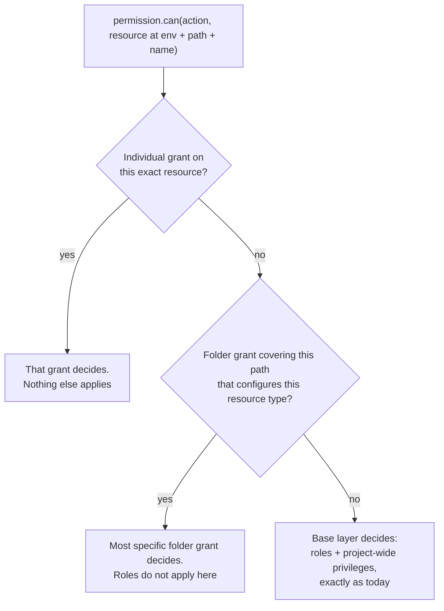
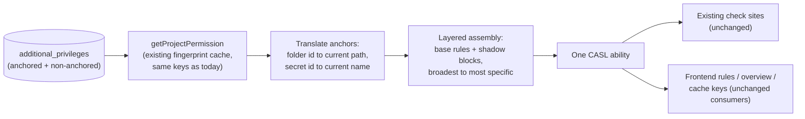

Owner: @Daniel
Implementer: TBD
Reviewer(s): @Scott & @Maidul

# Resource-Based Access

Claude Design PoC implementation: https://claude.ai/design/p/63cf253d-ee04-43f5-8a19-6edfa813b06c?file=Resource+Access.dc.html&via=share

## Overview

Today, everything a user or identity can do inside a project is decided by project roles which carry a flat set of permissions. We take all of their roles and all of their additional privileges, flatten them into a single list of rules, and evaluate every check against that combined list. Creating new project roles and managing a user's access through roles makes it harder to assign granular access to resources, and increases the entry barrier for the secrets management product as a whole.

As we're sunsetting custom roles for non-enterprise users, custom RBAC can only be done through traditional additional privileges, which have historically been very cumbersome for users to navigate and use.

To counteract this, we've come up with a path forward for assigning direct access to folders and secrets resources without the need to manage traditional additional privileges, and without creating custom roles.

The model is **override-based**, built around a new concept we call a **resource grant**. A resource grant comes in two shapes:

- **Folder grant.** Anchored to a folder. It means "everything in this folder," and the permissions are specified per resource type: what the actor can do with static secrets in the folder, what they can do with dynamic secrets, and so on. Any resource type left unconfigured keeps following the actor's project role. By default the grant covers exactly that folder, with an option to also include all sub-folders.
- **Individual resource grant.** Anchored directly to one specific resource: a single static secret, a single dynamic secret, a single rotation. You open the resource and manage access inline.

The two shapes are peers. An individual grant is not a refinement of a folder grant; it stands on its own.

When the actor touches something the grant is anchored to (such as a folder or a static secret), the grant fully defines what they can do with it. Their roles and project-wide privileges do not apply there. Everywhere else in the project, nothing changes. This is the opposite of how permissions combine today. It lets an admin say "you have broad access to this project, but on these payment secrets you can only read values", instead of having everything bound by project roles.

When grants overlap, the most specific one wins: an individual grant on a secret beats a folder grant covering that secret, and a grant on a deeper folder beats a subtree grant from above.

We build this on top of the existing additional privileges system. No new tables are needed. A resource grant is an additional privilege row with a resource anchor on it, and evaluation happens inside the same single CASL ability that every permission check in the codebase already uses.

## Terminology

A handful of terms are used throughout this document. Good to understand these at a high level before diving deeper:

- **Resource grant**: the new concept this document introduces. An additional privilege that is anchored to a resource and overrides the actor's other permissions there, instead of adding to them.
- **Folder grant**: a resource grant anchored to a folder, covering the resources inside it.
- **Individual resource grant**: a resource grant anchored to one specific resource, such as a single static secret.
- **Anchor**: the folder or resource a grant is attached to. Stored as an ID, so the grant follows renames and moves.
- **Footprint**: the area a grant covers at evaluation time, i.e. what the anchor translates to: an environment plus folder path, plus the resource name for individual grants.
- **CASL ability**: the compiled set of permission rules that every action is checked against, built once per actor per project. CASL is the permission library used across backend and frontend.
- **Base layer**: the rules an actor gets from their project roles and project-wide additional privileges. This is exactly what exists today.
- **Shadow block**: the small set of rules a resource grant compiles into, appended after the base layer so it takes priority inside the grant's footprint.

## Background

### How project permissions work today

Every project actor has memberships carrying one or more roles, and additional privileges. When a request comes in, `getProjectPermission` fetches all of them, flattens the rules into one array, and builds a single CASL ability out of it. That ability is what every service checks against.

```ts
ForbiddenError.from(permission).throwUnlessCan(
  ProjectPermissionSecretActions.ReadValue,
  subject(ProjectPermissionSub.Secrets, { environment, secretPath, secretName })
);
```

Two properties of this setup matter a lot for this design:

1. **Permission resolution is resource-blind.** The ability is built once per actor per project, before we know which folder or secret will be checked. The resource identity (environment, secret path, secret name) only enters later when doing the check, as condition data on the subject.
2. **CASL evaluates rules as last-match-wins.** For any check, CASL walks the rule array from the end and the first rule that matches decides the outcome. Rule order is already meaningful today: it is the only reason a deny rule beats an allow rule.

The result is heavily cached, and the single rules array is also the transport format: the frontend evaluates the same rules for UI gating, and the access overview builds abilities from them.

### Why now

Resource-level access is where the broader access model is heading. We have already shipped it for PKI resources, and for PAM as a part of the revamp. Folder-level access for secrets is a recurring ask: teams want to hand a contractor, a CI identity, or a neighboring team scoped access to one folder without reasoning about how it interacts with every role the actor holds.

The current model cannot express this. Because everything unions together, the only way to narrow someone's access to a folder is to carefully avoid ever granting them anything broad, which falls apart the moment they are in a group or hold a second role.

### What we are solving

When an actor has a resource grant, that grant should be the complete truth about their access to whatever it is anchored to, for the resource types the grant configures.

The constraints that helped coming up with the design:

- Permission checks are extremely hot. Whatever we do has to ride the existing caches, not multiply them.
- Batch operations (recursive listing, imports, reference expansion) evaluate one actor's access against hundreds of folders in a single request, sometimes inside synchronous callbacks. The design cannot require a lookup per folder.
- The rules array is consumed in a lot of places (frontend, overview, cache keys, etc). The semantics have to survive all of them without reimplementing everything.
- Grants must support time-bound access, per grant. One actor can have permanent access to `/folder-a` and a 4-hour window on folder `/folder-b` at the same time.

### Approaches we considered

| Approach | How it works | Why it was rejected |
| --- | --- | --- |
| Union into the flat set (status quo mechanics) | Store resource grants as normal additional privileges and let them merge in | Merging gives the wrong behavior for this feature: the grant could only ever add access, never scope it down |
| Per-resource permission resolution (the PKI model) | Resolve a dedicated ability per resource, like `getResourcePermission` does for PKI resources | Fits well when the resource is known up front and each request touches one resource. Secrets endpoints usually discover the folders they touch midway through a request, so this model does not map cleanly onto them (more on this below) |
| New first-class data structure (folder-scoped memberships) | Add `scopeResourceType`/`scopeResourceId` memberships for folders, mirroring PKI | Does not solve the evaluation problems, since those live on the consumption side rather than the storage side. Also loses what additional privileges give us for free: per-row time-bound access and the access approval integration. Kept as a future direction if folders become first-class product objects |
| **Composite ability with layered rules (selected)** | Keep one ability per actor per project, but assemble its rules in layers so resource grants shadow the base permissions inside their footprint | One artifact, no call-site changes, and caches and consumers pick up the behavior without modification |

On per-resource resolution: it works for PKI because those endpoints carry the target resource directly in the request. Secrets endpoints rarely do. Listing, imports, and reference expansion figure out which folders they touch while handling the request, sometimes hundreds at once, so there is no clean point to resolve a per-resource permission up front, and juggling a separate permission object per folder is easy to get wrong.

On the data structure question (from design discussions with Scott / Maidul): time-bound access is per grant, so a user can have different expiry windows on different folders. That forces one row per grant no matter what, which is exactly the shape additional privileges already have.

## Data structures

Everything in this design rests on a few column additions to one existing table.

### additional_privileges (new columns, no new table)

Resource grants are additional privilege rows with an anchor:

- **New field:** `resourceType`, nullable enum: `folder` in phase 1, later `secret`, `dynamic-secret`, `secret-rotation`. Null means a project-wide privilege, i.e. every existing row, whose behavior is completely unchanged.
- **New fields:** one nullable FK column per anchor type, starting with `folderId` (FK to `secret_folders`, `ON DELETE CASCADE`, indexed). Phase 2 adds `secretId`, `dynamicSecretId`, and so on. A column per type (instead of one polymorphic `resourceId`) keeps real foreign keys, so grants are cleaned up automatically when their resource is deleted. A check constraint enforces that the column matching `resourceType` is set.
- **New field:** `includeSubfolders`, boolean, default false. Only meaningful for folder grants.

Everything else comes free from the existing table: actor columns for users and identities, the temporary access fields (`isTemporary`, `temporaryAccessStartTime`, `temporaryAccessEndTime`, etc.), and the access approval linkage.

The permissions payload needs to distinguish "not configured" (inherit from project role) from "configured as None" (deny everything): absence of a type means unconfigured, a type with an empty action list means None.

### The important DAL change

`permissionDAL.getPermission` currently joins all of an actor's additional privileges into the flat set. It needs to exclude anchored rows (`WHERE resourceType IS NULL`) and return them separately, joined to their anchors for the current path and name. If an anchored privilege leaks into the base layer, it unions in, which is the old behavior we are moving away from. The fingerprint query needs the same treatment so grant and anchor changes invalidate the cache.

## How the override works

### Layered rule assembly

We keep building one ability per actor per project. What changes is how the rule array inside it is assembled:

1. **Base layer.** All roles and all project-wide (non-anchored) additional privileges, flattened and sorted exactly as today.
2. **Shadow blocks.** For each active resource grant, appended after the base layer: per resource type the grant configures, a scoped deny rule covering every action on the grant's footprint, followed by the grant's allow rules for that type on the same footprint. Resource types the grant does not configure get no rules, so they keep resolving through the base layer.
3. **Broadest first, most specific last.** Shadow blocks are appended in a fixed order: subtree folder grants first (shallowest path first), then exact folder grants, then individual resource grants. Because CASL is last-match-wins, whichever block is appended last decides any overlap, which gives us "most specific wins" without any extra machinery.

Any check whose subject falls inside a footprint hits the most specific shadow block covering it and is decided entirely by that grant. Everything else falls through to the base layer, untouched.



As an example, a folder grant on `dev:/payments` giving readValue on static secrets and lease on dynamic secrets would compile to something like:

```json
[
  { "action": ["<all secret actions>"],         "subject": "secrets",         "inverted": true,
    "conditions": { "environment": "dev", "secretPath": { "$glob": "/payments" } } },
  { "action": ["<all dynamic secret actions>"], "subject": "dynamic-secrets", "inverted": true,
    "conditions": { "environment": "dev", "secretPath": { "$glob": "/payments" } } },
  { "action": ["readValue", "describeSecret"],  "subject": "secrets",
    "conditions": { "environment": "dev", "secretPath": { "$glob": "/payments" } } },
  { "action": ["lease"],                        "subject": "dynamic-secrets",
    "conditions": { "environment": "dev", "secretPath": { "$glob": "/payments" } } }
]
```

The shadow block is built only for the resource types the grant configures. If the grant above left dynamic secrets unconfigured, no dynamic secret rules would be emitted and that access would keep resolving through the project role (shown as "From project role" in the access matrix). Setting a type to "None" is different: it emits the deny with no allows. With the subfolder toggle on, the glob widens to cover the whole subtree.

Individual resource grants compile the same way, except the conditions are pinned to that one resource: exact folder path plus resource name. Their deny only covers that single resource, so everything else in the folder resolves through whatever governs it otherwise.

The footprint matching uses the same `$glob` conditions permission checks use today. There is a working PoC at `backend/src/ee/services/permission/resource-override-poc.test.ts` covering the override, the fallthrough, and the two sharp edges below.

### Strict override

Inside a grant's footprint, the actions the grant does not include are denied, even if the actor's roles would allow them. Example: Alice's role gives her full access to the whole project, and she receives a folder grant on `/payments` with edit and create only. Inside `/payments` she can edit and create, and she can no longer read values or delete, because the grant now defines her access there.

This applies per configured resource type. If Alice's grant configures static secrets but says nothing about dynamic secrets, her dynamic secret access in `/payments` still comes from her project role, shown as "From project role" in the folder access matrix.

Why not fall back to her roles for the omitted actions within a configured type? Because that would recreate the union model: the grant could never take anything away, and scoping someone down would again be impossible. What you select in the grant is what the actor can do inside the footprint.

### Two sharp edges to be aware of

**Rule ordering matters.** Today, `buildProjectPermissionRules` sorts inverted rules to the end of the whole array. Applied across layers, that sort would move the shadow denies after the grant allows and break the override (the PoC has a test covering this failure mode). The fix is that the sort applies within the base layer only; shadow blocks are appended after it and never re-sorted.

**Type-only capability probes.** Some code asks `permission.can(action, ProjectPermissionSub.Secrets)` with no instance data, meaning "can this actor possibly do this somewhere." CASL skips condition-scoped deny rules for these checks, so probes keep their "possibly, somewhere" meaning and a shadow block should not accidentally break UI gating. Verified in the PoC.

### Request flow



Anchors are stored as IDs and translated to current coordinates at assembly time (folder ID to environment and path, secret ID to name), which is what makes grants follow renames and moves. The translation joins ride in the same query and cached payload, and the fingerprint covers the anchored rows and their resources, so changes invalidate the cache as usual.

Time-bound grants use the same per-request active-window filtering as temporary roles, so an expired grant stops applying immediately, regardless of cache state.

## Permission model

Creating, updating, and deleting resource grants is gated by the same permission that gates additional privileges today (`GrantPrivileges`). One consequence deserves to be called out explicitly, because it changes what that permission means:

**Granting a resource grant can now reduce access.** Under the old model, an additional privilege could only add. Under override semantics, giving someone a narrow grant on `/payments` strips their other access inside `/payments`, so whoever holds `GrantPrivileges` effectively holds targeted revocation power too. We believe this is the right semantic, but it should be stated plainly in the docs and the UI.

## Surfaces that must be audited

Most consumers inherit the semantics automatically, but only if nothing between assembly and evaluation reorders the rules. Places to verify during implementation, each with a test:

- `expandLegacyForbidActions` and the OAuth scope narrowing (`applyOauthScopeToProjectRules`), both of which transform the rules array after assembly. They must be order-preserving.
- The frontend deserialization path, which must evaluate rules in the order it receives them (CASL does this by default, the audit is that nothing re-sorts).
- `getProjectPermissions` (the bulk access overview), which flattens roles and privileges per user with its own copy of the union logic. It needs the same layered assembly or the overview will misreport who can access what.
- The secret approval flow and any other place that replays or simulates an actor's permissions.

## Terraform

The existing additional privileges resource (oddly named `infisical_project_identity_specific_privilege`) stays as-is for backwards compatibility.

We roll out a new resource, working name `infisical_secrets_project_resource_access` (name TBD). Under the hood it creates an anchored additional privilege, but the inputs are shaped for the actual use case instead of exposing raw permission rules: actor, project, folder (or, in phase 2, a specific resource), per-type permission sets, the subfolder toggle, and optionally a time window. The goal is that scoping a CI identity to one folder is a five-line resource block, not a CASL rules exercise.

## Phase 1 scope

- **Folder grants only.** Individual resource grants are phase 2; they slot in as additional anchor columns plus one more step in the existing grant ordering.
- A folder grant covers **exactly the anchored folder** by default. The `includeSubfolders` toggle extends it to the folder plus its whole subtree.
- Permissions in a folder grant are specified **per resource type** (static secrets, dynamic secrets, rotations, and so on). The override only applies to the types the grant configures. A type left unconfigured keeps following the actor's project role, and a type explicitly set to "None" becomes inaccessible inside the footprint.
- **Strict override.** Actions not included in the grant are denied inside the footprint. See the strict override section above.
- **Most specific wins** among overlapping folder grants: an exact-folder grant beats a subtree grant covering the same folder, and a deeper subtree grant beats a shallower one. Two grants on the same anchor combine with each other, consistent with how multiple privileges combine today.
- Existing additional privileges (anchor null) behave exactly as before. No migration needed.

## Future phases

**Phase 2: individual resource grants.** Anchors on specific static secrets, dynamic secrets, and rotations, managed from the resource itself in the UI. Compiled like folder grants but pinned to the resource's exact folder path and name, and appended after all folder grants so they win overlaps. One prerequisite per resource type: its check sites must pass an identifying field (name) in the subject. Static secrets already do; dynamic secrets and rotations need an audit first.

**More resource types.** The anchor model is generic; certificates and PKI subscribers are natural follow-ups once the secrets flow has settled.

**First-class folder memberships.** If folders grow into product objects with their own access tab, PKI-style memberships become attractive for queryability ("who has access to this folder" as a WHERE clause). Since evaluation sits behind the assembly function, that would be a storage migration without touching check sites.

**"Why" tooling.** CASL can report which rule decided a check, and with layered assembly that rule maps directly to a role or a specific grant. A debug endpoint answering "why does this actor have this access here" would be cheap to build on top.

## Open questions

- **Admin lockout.** Should project admins be exempt from override, or can an admin be scoped down by a grant like anyone else (including scoping themselves down by accident)? My current thoughts are that we can disallow admins from resource grants as apart of phase 1. It seems highly unlikely to me that an admin would need restricted access to resources.
- **Access approval.** Approved access requests materialize as additional privileges today. Should users be able to request resource grants through the same flow in phase 1, or does that come later?
- **Resource type to subject mapping.** Each configurable resource type in the grant UI (static secrets, dynamic secrets, rotations, and so on) needs a mapping to its CASL subject so the compiler knows which rules to emit. This is an implementation checklist item. A type without a mapping simply keeps inheriting from the project role, so nothing breaks, but the grant UI and the compiler have to stay in sync on the list. 

## FAQ

**Does this change behavior for anyone who has no resource grants?** No. The base layer is assembled the same way as today, and with no anchored privileges the resulting rule array is unchanged from the current output.

**Why can a grant remove access? I thought additional privileges only add.** That is intentional. The grant is a statement of "here is your access to this thing." If it merely added, there would be no way to scope anyone down, which is the problem we are solving. This is also why the product naming is "resource grant" rather than "additional privilege."

**What happens when a folder grant and an individual grant overlap?** The individual grant wins for that resource. If Alice has a `readValue` folder grant on `/payments` and an edit-only individual grant on `DB_PASSWORD` inside it, then on `DB_PASSWORD` she can edit and not read, and on everything else in the folder she can read. Most specific wins. The UI should surface "this resource is governed by an individual grant" so admins are not confused about why the folder grant is not applying.

**What happens to resource types the folder grant doesn't configure?** They inherit from the project role, exactly as if the grant did not exist for that type. In the folder access matrix this shows as "From project role". If you want to shut a type off inside the folder, configure it as "None", which is an explicit statement rather than an omission.

**Does an individual grant affect the rest of the folder?** No. Its deny is pinned to exactly that resource (folder path plus name). The other resources in the folder resolve through whatever governs them: a folder grant if one exists, otherwise the actor's normal roles.

**Why not build a new table for this?** The consumption-side problems (batch evaluation, reference expansion, caching) are the hard part, and they look the same no matter where grants are stored. Additional privileges already give us per-row time-bound windows, actor plumbing for users and identities, and the access approval integration (possibly something we'd want to explore further in the future)

**How does this affect performance?** No new queries on the hot path (anchored rows and their translation joins come from the same fetch), no new cache keys, and a handful of extra rules in the CASL array per grant. Evaluation cost is unchanged in the common case of zero grants.
