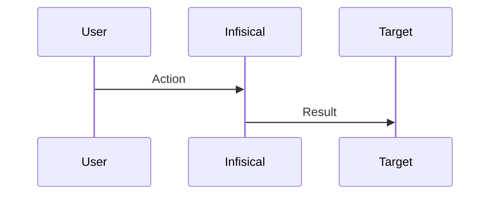

# Infisical Documentation Style Guide

## 1. Purpose and Scope

This document is the **single source of truth** for all Infisical documentation standards. It governs content produced by human writers, AI creation agents, and AI review agents.

It covers:
- Document classification and structure (Diataxis)
- Mintlify component usage
- Tone, voice, and terminology
- Formatting, linking, and media conventions
- Quality rules with severity ratings for automated review

It does NOT cover:
- Auto-generated API reference pages
- Changelog or release note formatting
- Marketing or blog content

When this guide conflicts with inline rules in agent prompts, **this guide takes precedence**.

---

## 2. Diataxis Document Types

Every Infisical document MUST be classified as exactly ONE of the four Diataxis types. If content spans types, split it into separate documents and cross-link them. A document that cannot be classified into a single type is a **BLOCKING** structural issue.

---

### 2.1 Tutorial

**Definition:** A learning-oriented lesson that takes a beginner through a complete experience to build confidence and skill.

**When to use:**
- The reader has never used this feature before.
- The goal is to teach, not to accomplish a production task.
- The reader needs to be walked through end-to-end with visible results at each step.

**When NOT to use:**
- The reader already knows the basics and needs to accomplish a specific task (use How-to).
- The content is a lookup table or parameter list (use Reference).
- The content explains why something works the way it does (use Explanation).

**Required sections (in order):**
1. **Learning objective** — One sentence: "In this tutorial, you will..." followed by 2-4 bullet outcomes.
2. **Prerequisites** — Bulleted list of what the reader needs before starting. Every item links to its setup doc.
3. **Steps** — Sequential steps using `<Steps>` component. Every step produces a visible, verifiable result. Tell the reader what they should see.
4. **Verification** — A final check confirming the tutorial outcome works.
5. **Cleanup** *(if the tutorial creates resources)* — How to tear down what was created.
6. **Next steps** — 2-4 links to logical follow-on actions.

**Optional sections:**
- FAQ (`<AccordionGroup>`)

**Voice:**
- First-person plural for framing: "We will configure..." / "In this tutorial, we will..."
- Second-person imperative for instructions: "Create a new project." / "Run the following command."

**Anti-patterns (MUST NOT appear):**
- Alternatives or choices ("You can also use X instead" — pick one path)
- Extended explanation or theory (link to Explanation docs instead)
- Assumptions about prior knowledge without stating prerequisites
- Steps that do not produce a visible result

**Pattern example — step verification:** [`/documentation/guides/kubernetes-operator`](/documentation/guides/kubernetes-operator) demonstrates verification checkpoints after key steps and explicit learning outcomes in the intro.

---

### 2.2 How-to Guide

**Definition:** A task-oriented guide that helps a competent user accomplish a specific real-world goal.

**When to use:**
- The reader knows what they want to do but needs the steps.
- The goal is to solve a problem or complete a task, not to learn.
- The reader has basic familiarity with the product.

**When NOT to use:**
- The reader is a complete beginner (use Tutorial).
- The content is a parameter list or config reference (use Reference).
- The content explains design decisions or architecture (use Explanation).

**Required sections (in order):**
1. **Goal statement** — One sentence describing what this guide accomplishes. Format: "This guide shows you how to..."
2. **Prerequisites** — Bulleted list. Every item links to its setup doc.
3. **Steps** — Sequential steps using `<Steps>` component. Use `<Tabs>` for UI vs API paths where applicable.
4. **Verification / Result** — How to confirm the task succeeded.

**Optional sections:**
- FAQ (`<AccordionGroup>`)
- Related resources (bullet list, NOT `<CardGroup>`)

**Voice:**
- Imperative mood: "Create a...", "Configure the...", "Run the..."
- Conditional imperatives for optional steps: "If you need X, do Y."
- No teaching. No "let's" or "we will." Get to the steps quickly.

**Anti-patterns (MUST NOT appear):**
- Extended conceptual explanations (link to Explanation docs)
- Teaching tone ("Let's learn about...")
- Unnecessary context before the first step (get to the point)
- Conceptual explanations after the final step (link instead)

**Pattern example — progressive disclosure:** [`/documentation/platform/pki/ca/acme-ca`](/documentation/platform/pki/ca/acme-ca) demonstrates using Tabs to separate provider variants and an Advanced section to keep the core flow clean.

---

### 2.3 Reference

**Definition:** An information-oriented technical description that provides complete, accurate facts for lookup during work.

**When to use:**
- The reader needs to look up a specific detail (parameter, field, endpoint, config option).
- The content describes the structure of a system, API, or configuration.
- Completeness and accuracy are the primary goals.

**When NOT to use:**
- The reader needs step-by-step instructions (use How-to).
- The reader needs conceptual understanding (use Explanation).
- The reader is learning for the first time (use Tutorial).

**Required sections:**
1. **Overview** — One paragraph describing what is being documented.
2. **Technical content** — Parameters, fields, endpoints, or options using `<ParamField>`, tables, or consistent repeating structure.
3. **Examples** — Code examples illustrating usage (not instructing).

**Optional sections:**
- Related resources (bullet list)
- Warnings for deprecated fields or breaking changes

**Voice:**
- Declarative, third-person: "The `timeout` parameter specifies..."
- Neutral and austere. No persuasion, no tutorial-style language.
- State facts. Do not instruct.

**Anti-patterns (MUST NOT appear):**
- Step-by-step instructions (link to How-to)
- Opinions or recommendations (link to Explanation)
- Incomplete parameter documentation (reference MUST be exhaustive)
- Inconsistent structure across items (every item follows the same format)

**Pattern example — exhaustive structure:** [`/documentation/platform/pki/certificates/request-cert-csr`](/documentation/platform/pki/certificates/request-cert-csr) demonstrates consistent repeating structure across items with a requirements table and multiple code variants.

---

### 2.4 Explanation

**Definition:** An understanding-oriented discussion that provides context, background, and reasoning to deepen comprehension.

**When to use:**
- The reader needs to understand *why* something works the way it does.
- The content covers architecture, design decisions, or conceptual background.
- The content compares approaches or discusses tradeoffs.

**When NOT to use:**
- The reader needs to accomplish a task (use How-to).
- The reader needs to look up a detail (use Reference).
- The reader is a complete beginner needing hands-on guidance (use Tutorial).

**Required sections:**
1. **Context** — Why this topic matters. What problem or question it addresses.
2. **Concept progression** — Build ideas in order. Do not reference something before explaining it.
3. **Cross-links** — Link to actionable how-to guides and reference pages.

**Optional sections:**
- Mermaid diagrams for architecture or flows
- Comparison tables for approaches
- FAQ (`<AccordionGroup>`)

**Voice:**
- Second-person, conversational but precise: "This works because...", "The reason for..."
- May include perspective and opinion where appropriate.
- Longer, more discursive prose is acceptable.

**Anti-patterns (MUST NOT appear):**
- Step-by-step procedures (link to How-to)
- Parameter tables or API specs (link to Reference)
- "Just do X" instructions without context

**Pattern example — concept visualization:** [`/documentation/platform/secret-rotation/overview`](/documentation/platform/secret-rotation/overview) demonstrates using Mermaid diagrams to illustrate lifecycles and Tabs to compare related concepts (dual-phase vs single-phase).

---

## 3. Content Structure Templates

Copy-pasteable MDX skeletons for each Diataxis type. Use these as starting points.

### 3.1 Tutorial Template

```mdx
---
title: "Tutorial title"
sidebarTitle: "Short nav label"
description: "Learn how to accomplish X with Infisical."
---

{/* Enterprise callout if applicable — see Section 8 */}

In this tutorial, you will:
- Outcome 1
- Outcome 2
- Outcome 3

## Prerequisites

Before you begin, make sure you have:
- [Prerequisite 1](/link/to/setup)
- [Prerequisite 2](/link/to/setup)

<Steps>
  <Step title="Action-oriented step title">
    Instruction text.

    ```bash
    example-command
    ```

    You should see output similar to:
    ```
    expected output
    ```
  </Step>
  <Step title="Next step title">
    Instruction text.

    
  </Step>
</Steps>

## Verify the result

Describe how to confirm the tutorial outcome works.

## Clean up

If you created resources during this tutorial that you no longer need:
1. Step to remove resource
2. Step to remove resource

## Next steps

- [Logical follow-on action 1](/link)
- [Logical follow-on action 2](/link)
- [Logical follow-on action 3](/link)
```

### 3.2 How-to Guide Template

```mdx
---
title: "How to accomplish X"
sidebarTitle: "Short nav label"
description: "Learn how to accomplish X in Infisical."
---

{/* Enterprise callout if applicable — see Section 8 */}

This guide shows you how to [goal statement].

## Prerequisites

- [Prerequisite 1](/link/to/setup)
- [Prerequisite 2](/link/to/setup)

<Steps>
  <Step title="Action-oriented step title">
    Instruction text.

    <Tabs>
      <Tab title="Infisical UI">
        UI instructions with screenshots.

        
      </Tab>
      <Tab title="API">
        ```bash
        curl --request POST \
          --url https://app.infisical.com/api/v1/endpoint \
          --header 'Authorization: Bearer your-access-token' \
          --header 'Content-Type: application/json' \
          --data '{
            "field": "value"
          }'
        ```
      </Tab>
    </Tabs>
  </Step>
</Steps>

## Verify the result

Describe how to confirm the task succeeded.

## Related resources

- [Related doc 1](/link)
- [Related doc 2](/link)
```

### 3.3 Reference Template

```mdx
---
title: "Feature name reference"
sidebarTitle: "Feature name"
description: "Complete reference for Feature name configuration and parameters."
---

Brief overview of what this reference covers.

## Parameters

<ParamField path="parameter-name" type="string" required>
  Description of the parameter.
</ParamField>

<ParamField path="optional-param" type="number" optional default="30">
  Description with default value.
</ParamField>

## Examples

```json
{
  "parameter-name": "value",
  "optional-param": 60
}
```

## Related resources

- [How to use Feature name](/link/to/how-to)
- [About Feature name](/link/to/explanation)
```

### 3.4 Explanation Template

```mdx
---
title: "About Feature name"
sidebarTitle: "Feature name"
description: "Understand how Feature name works and why it is designed this way."
---

{/* Enterprise callout if applicable — see Section 8 */}

## Why this matters

Context paragraph explaining the problem or question this topic addresses.

## How it works

Concept explanation. Build ideas in order.



## Comparison of approaches

| Approach | Pros | Cons |
|----------|------|------|
| Approach A | Benefit | Drawback |
| Approach B | Benefit | Drawback |

## Learn more

- [How to set up Feature name](/link/to/how-to)
- [Feature name reference](/link/to/reference)
```

---

## 4. Frontmatter Standards

Every MDX file MUST include YAML frontmatter.

| Field | Required? | Rules |
|-------|-----------|-------|
| `title` | Always | Full descriptive title. Sentence case. Max 60 characters. No trailing period. |
| `sidebarTitle` | When `title` exceeds 25 characters | Short nav label. Max 25 characters. |
| `description` | Always | SEO meta description. Start with a verb or "Learn how to...". Max 160 characters. Ends with a period. |

**Rules:**
- No feature-tier information in frontmatter. Use a callout in the body (see Section 8).
- No trailing periods in `title` or `sidebarTitle`.
- `description` MUST end with a period.
- Use sentence case for all frontmatter text.

---

## 5. Tone and Voice

### 5.1 Person

Use **second person** ("you") for all doc types. First-person plural ("we") is acceptable only in tutorial introductions ("In this tutorial, we will...").

Never use "the user", "one", or "they" to refer to the reader.

### 5.2 Mood

- **Imperative** for instructions: "Create a new project." Not "You should create a new project."
- **Declarative** for descriptions: "The endpoint returns a JSON object." Not "The endpoint will return a JSON object."
- Never subjunctive: "You might want to..." — either instruct or omit.

### 5.3 Tense

**Present tense always.** "This command installs the package." Not "This command will install the package."

### 5.4 Active Voice

Required. Flag any passive construction where the agent is the product or user.

- YES: "The API returns a 404 error."
- NO: "A 404 error is returned by the API."

### 5.5 Word Choice

Use the simplest accurate word.

| Preferred | Avoid |
|-----------|-------|
| use | utilize |
| start | initiate |
| end | terminate |
| run | execute |
| set up (verb) | setup (verb) |
| setup (noun) | set up (noun) |
| make sure | ensure (when addressing the reader) |
| let | allow / enable (when addressing the reader) |
| about | approximately |
| need | require (when addressing the reader) |
| show | display (unless referring to a UI element labeled "Display") |

### 5.6 Filler Phrases to Eliminate

Remove these on sight. They add no meaning:

- "It is important to note that"
- "In order to" (use "To")
- "Please note that" / "Please be aware"
- "Basically" / "Essentially" / "Fundamentally"
- "Simply" / "Just" (as minimizers — they imply the task is easy)
- "As mentioned earlier" / "As previously stated"
- "It should be noted that"
- "At this point in time" (use "Now")
- "In the event that" (use "If")
- "Due to the fact that" (use "Because")
- "Make sure to" (use the imperative directly)

### 5.7 Sentence Length

Maximum **25 words** per sentence. One idea per sentence. If a sentence has a comma before an independent clause, split it into two sentences.

### 5.8 Paragraph Length

Maximum **3-4 sentences** per paragraph.

---

## 6. Mintlify Component Usage Rules

### 6.1 Steps / Step

**Purpose:** Sequential procedures in tutorials and how-to guides.

**When to use:** Any ordered sequence of actions the reader performs.

**When NOT to use:** Non-sequential information. Reference content. Lists of options.

**Key props:**
- `<Steps>`: `titleSize` — use `h3` as default. Use `h2` only for top-level major phases.
- `<Step>`: `title` (required), `icon` (optional), `stepNumber` (optional override), `id` (optional, for deep linking)

**Rules:**
- Every `<Step>` title MUST start with a verb: "Create...", "Configure...", "Deploy..."
- Include at least one of: code block, screenshot, or expected output in each step.
- Minimum 2 steps. If there is only 1 step, use a heading instead.

```mdx
<Steps>
  <Step title="Create a machine identity">
    Navigate to **Organization Settings > Machine Identities** and create a new identity.

    
  </Step>
  <Step title="Configure authentication">
    Select an authentication method for the identity.
  </Step>
</Steps>
```

### 6.2 Tabs / Tab

**Purpose:** Mutually exclusive alternatives (UI vs API, OS variants, provider-specific instructions).

**When to use:** The reader chooses ONE path. All tabs accomplish the same goal differently.

**When NOT to use:** Supplementary content that all readers should see. Additive information.

**Key props:**
- `<Tab>`: `title` (required)

**Rules:**
- Minimum 2 tabs. Never a single tab.
- Never nest `<Tabs>` inside `<Tabs>`.
- Use consistent tab labels across the docs site:
  - `Infisical UI` / `API` (not "Dashboard" / "REST")
  - `macOS` / `Linux` / `Windows` (not "Mac" / "Unix")

```mdx
<Tabs>
  <Tab title="Infisical UI">
    Navigate to **Project Settings > Access** and click **Add Member**.
  </Tab>
  <Tab title="API">
    ```bash
    curl --request POST \
      --url https://app.infisical.com/api/v1/members \
      --header 'Authorization: Bearer your-access-token'
    ```
  </Tab>
</Tabs>
```

### 6.3 Accordion / AccordionGroup

**Purpose:** Collapsible content for FAQs, troubleshooting, and optional detail most readers skip.

**When to use:** FAQ sections. Troubleshooting. Advanced detail that is not part of the main flow.

**When NOT to use:** Required content. Critical steps. Information every reader needs.

**Rules:**
- Wrap multiple `<Accordion>` items in `<AccordionGroup>`.
- Accordion titles SHOULD be phrased as questions in FAQ sections.
- Never put required procedural steps inside an accordion.

```mdx
<AccordionGroup>
  <Accordion title="Why do I need a machine identity?">
    Machine identities provide non-human authentication for...
  </Accordion>
  <Accordion title="Can I use multiple authentication methods?">
    Yes, each machine identity supports one authentication method...
  </Accordion>
</AccordionGroup>
```

### 6.4 Card / CardGroup

**Purpose:** Navigation cards on overview/landing pages linking to sub-pages.

**When to use:** Overview pages listing related guides. "Choose your path" pages.

**When NOT to use:** Inline content. Within a step. As a replacement for bullet lists.

**Key props:**
- `<CardGroup>`: `cols` (use `2` or `3`)
- `<Card>`: `title`, `href`, `icon`, `color` (optional)

```mdx
<CardGroup cols={2}>
  <Card title="Set up RBAC" href="/documentation/platform/access-controls/role-based-access-controls" icon="address-book">
    Manage permissions through predefined roles.
  </Card>
  <Card title="Configure SSO" href="/documentation/platform/sso/overview" icon="key">
    Set up single sign-on for your organization.
  </Card>
</CardGroup>
```

### 6.5 Columns

**Purpose:** Flexible multi-column layout. Alternative to `<CardGroup>` for non-navigation content.

**Key props:** `cols` (use `2`)

**When to use:** Side-by-side comparison content. Feature highlights on landing pages.

### 6.6 ParamField

**Purpose:** API and configuration parameter documentation in reference docs.

**Key props:**
- `path` — Parameter name (required)
- `type` — Data type: `string`, `number`, `boolean`, `object`, `array` (required)
- `required` — Boolean flag
- `optional` — Boolean flag
- `default` — Default value
- `query` — Use instead of `path` for query parameters

**Rules:**
- Always specify `type`.
- Always specify `required` or `optional`.
- Use `<Expandable>` for nested object properties.

```mdx
<ParamField path="name" type="string" required>
  A descriptive name for the policy.
</ParamField>

<ParamField path="options" type="object" optional>
  <Expandable title="properties">
    <ParamField path="timeout" type="number" default="30">
      Request timeout in seconds.
    </ParamField>
  </Expandable>
</ParamField>
```

### 6.7 CodeGroup

**Purpose:** Same operation shown in multiple languages or tools.

**When to use:** SDK examples across languages. CLI vs SDK comparison.

**Rules:**
- Always label each tab with the language/tool name.
- Minimum 2 code blocks.

### 6.8 Mermaid Diagrams

**Purpose:** Architecture flows, protocol sequences, system interactions.

**When to use:** Any complex flow that benefits from visualization. Especially in Explanation docs and How-to guides with multi-system interactions.

**Rules:**
- Keep diagrams under 15 nodes for readability.
- Use `sequenceDiagram` for request/response flows.
- Use `flowchart` for decision trees or architecture.
- Wrap in standard markdown code fence with `mermaid` language tag.

### 6.9 Import Snippets

**Purpose:** Reusable content shared across 3+ documents.

**When to use:** Prerequisites blocks, setup steps, or configuration fragments that appear in multiple docs.

**Path convention:** `/snippets/documentation/{domain}/{snippet-name}.mdx`

```mdx
import RequestCertSetup from "/snippets/documentation/platform/pki/guides/request-cert-setup.mdx";

<RequestCertSetup />
```

---

## 7. Callout Decision Matrix

| Callout | Severity | Use when | Example |
|---------|----------|----------|---------|
| `<Note>` | Low | Supplementary info that is helpful but not critical. Clarifications, related context. | "By default, tokens expire after 24 hours." |
| `<Info>` | Medium | Feature availability, tier requirements, system behavior context. | Enterprise tier callout. Prerequisites assumptions. |
| `<Tip>` | Low | Best practices, efficiency suggestions, non-obvious shortcuts. | "Use environment variables to avoid hardcoding secrets." |
| `<Warning>` | High | Destructive actions, irreversible operations, security implications. | "Revoking a CA invalidates all issued certificates." |
| `<Danger>` | Critical | Data loss, security vulnerabilities, breaking changes. | "This operation permanently deletes all secrets in the project." |
| `<Check>` | Low | Verification or success confirmation after a procedure. | "You should now see the certificate listed in your inventory." |

### Callout Rules

- **Maximum 2 callouts per section** (between headings). More than 2 dilutes their impact.
- **Never nest callouts** inside other callouts.
- **Never use callouts for required procedural content.** That belongs in the step itself.
- **Callout text SHOULD be 1-3 sentences.** If longer, the content belongs in the main body.
- **Never use `<Warning>` or `<Danger>` for feature tier information.** Use `<Info>`.
- **Use `<Note>` as the default** when unsure. Escalate to `<Warning>` only for genuinely risky content.

---

## 8. Enterprise Feature Callout Pattern

Every document covering a paid or enterprise feature MUST include this callout **immediately after the frontmatter, before any body content**.

### For Enterprise Tier features:

```mdx
<Info>
  This feature is available under the **Enterprise Tier**. If you're using
  Infisical Cloud, contact [sales](https://infisical.com/schedule-demo) to
  upgrade. If you're self-hosting, contact team@infisical.com to purchase an
  enterprise license.
</Info>
```

### For Pro Tier features:

```mdx
<Info>
  This feature is available under the **Pro Tier** and **Enterprise Tier** on Infisical Cloud.

  If you're self-hosting Infisical, contact team@infisical.com to purchase an
  enterprise license.
</Info>
```

### Rules:

- Use `<Info>`, not `<Note>` or `<Warning>`.
- Include both Cloud and self-hosted paths.
- Contact addresses: `sales@infisical.com` for upgrade inquiries, `team@infisical.com` for license purchases.
- Place at the very top of the body. Do not bury tier information in the middle of a document.

---

## 9. Code Example Conventions

### 9.1 Language Tags

Always specify a language in fenced code blocks. Never use bare ` ``` ` without a language tag.

Common languages: `bash`, `json`, `yaml`, `typescript`, `javascript`, `python`, `go`, `hcl`, `sql`, `xml`

### 9.2 Placeholder Convention

Use `your-` prefix in **lowercase kebab-case** for user-supplied values:

- `your-access-token`
- `your-project-id`
- `your-organization-id`
- `your-infisical-url`

**Do NOT use:**
- `<angle-bracket>` placeholders (conflict with MDX/JSX parsing)
- `{{mustache}}` syntax
- `SCREAMING_CASE` for placeholders (reserve for actual environment variable names)
- `[bracket]` placeholders

**For environment variable names** that are actual names (not placeholders), use SCREAMING_CASE: `INFISICAL_TOKEN`, `DATABASE_URL`.

### 9.3 Completeness

Code examples MUST be copy-pasteable after replacing placeholders. Include all required headers, flags, and structure.

### 9.4 Request / Response Pairs

For API examples, show both request and response:

```bash
curl --request POST \
  --url https://app.infisical.com/api/v1/secrets \
  --header 'Authorization: Bearer your-access-token' \
  --header 'Content-Type: application/json' \
  --data '{
    "secretName": "DATABASE_URL",
    "secretValue": "postgresql://...",
    "environment": "prod",
    "secretPath": "/"
  }'
```

Response:

```json
{
  "secret": {
    "id": "0fccb6ee-1381-4ff1-8d5f-0cb93c6cc4d6",
    "secretName": "DATABASE_URL",
    "version": 1
  }
}
```

### 9.5 Indentation

- **JSON, YAML:** 2 spaces
- **TypeScript, JavaScript:** 2 spaces
- **Go:** tabs (language convention)
- **Python:** 4 spaces (language convention)

---

## 10. Screenshot and Image Conventions

### 10.1 Alt Text

**REQUIRED on every image.** Alt text MUST describe what the image shows, not be decorative.

```mdx

```

Not:

```mdx


```

**Missing alt text is a BLOCKING issue.**

### 10.2 Path Convention

`/images/{domain}/{feature}/{descriptive-name}.png`

- Use kebab-case for all path segments and file names.
- Domain matches the docs path (e.g., `platform`, `integrations`, `sdks`).
- File name describes the content, not the step number.

### 10.3 Placement

Place screenshots **immediately after** the instruction that references them. Never before.

### 10.4 Captions

Not required, but encouraged for complex screenshots. Use italicized text on the line below the image:

```mdx

*The Approvals page showing configured access policies.*
```

---

## 11. Cross-Referencing Rules

### 11.1 First-Mention Linking

Link product terms and features on their **first meaningful mention** in a document. Do not re-link the same target in subsequent mentions within the same section.

### 11.2 Link Text

Use descriptive anchor text. The linked text MUST make sense out of context.

- YES: "Configure [role-based access controls](/documentation/platform/access-controls/role-based-access-controls) for your project."
- NO: "For RBAC, see [this page](/documentation/platform/access-controls/role-based-access-controls)."
- NO: "Click [here](/documentation/platform/access-controls/role-based-access-controls) to learn about RBAC."

### 11.3 Internal Link Format

Use absolute paths from the docs root:

```mdx
[Access Requests](/documentation/platform/access-controls/access-requests)
```

Not full URLs:

```mdx
[Access Requests](https://infisical.com/docs/documentation/platform/access-controls/access-requests)
```

### 11.4 Deep Links

Use `#anchor` format when linking to a specific section:

```mdx
[DNS CNAME delegation](/documentation/platform/pki/ca/acme-ca#dns-cname-delegation)
```

### 11.5 No Self-Links

A document MUST NOT link to itself.

### 11.6 Prerequisites Linking

Every prerequisite item MUST link to the relevant setup or installation doc.

### 11.7 Next Steps

Tutorials and how-to guides SHOULD end with 2-4 links to logical follow-on actions. Use a bullet list:

```mdx
## Next steps

- [Set up temporary access](/documentation/platform/access-controls/temporary-access)
- [Configure approval workflows](/documentation/platform/pr-workflows)
```

Do not use `<CardGroup>` for end-of-document next steps in how-to guides (reserve cards for overview/landing pages).

---

## 12. Heading Conventions

### 12.1 Heading Levels

- **H1 (`#`):** Never use in the MDX body. Mintlify renders the frontmatter `title` as H1.
- **H2 (`##`):** Major sections. Top-level content divisions.
- **H3 (`###`):** Subsections within an H2.
- **H4 (`####`):** Use sparingly, only within an H3.

### 12.2 No Skipped Levels

**BLOCKING:** H2 followed directly by H4 (skipping H3) is forbidden.

### 12.3 Case

**Sentence case** for all headings: "Guide to connecting Infisical to an ACME-compatible CA"

Not title case: ~~"Guide to Connecting Infisical to an ACME-Compatible CA"~~

Exception: Proper nouns and acronyms retain their casing (ACME, AWS, HashiCorp, Kubernetes).

### 12.4 No Trailing Punctuation

Headings MUST NOT end with a period, colon, or other punctuation. Question marks are acceptable in FAQ accordion titles only.

### 12.5 Action-Oriented Headings

In how-to guides and tutorials, headings SHOULD start with a verb or describe an action:

- YES: "Set up an access policy"
- YES: "Configure authentication"
- NO: "Access policy" (too vague)
- NO: "Authentication configuration" (noun phrase, not action)

In reference and explanation docs, descriptive noun phrases are acceptable: "Parameter reference", "How it works".

---

## 13. Terminology Glossary

Use these canonical terms consistently. Agents SHOULD flag inconsistent terminology.

| Canonical Term | Definition | Never Use |
|----------------|-----------|-----------|
| Machine Identity | A non-human identity for service-to-service authentication | service account, bot identity, API identity |
| Secret | A sensitive configuration value (API key, password, certificate) | env var (when referring to Infisical objects), credential (generic) |
| Project | A logical container for secrets, CAs, and configurations in Infisical | workspace, repository, vault |
| Organization | The top-level entity in Infisical's hierarchy | org (in prose; acceptable in code/CLI), team, tenant |
| Dynamic Secret | A secret generated on-demand with a TTL | rotating secret (different feature), ephemeral secret |
| App Connection | A configured connection to an external service | integration (when referring to the connection object itself) |
| Certificate Authority (CA) | An entity that issues digital certificates | cert authority |
| Certificate Profile | A template defining certificate issuance parameters | cert template, certificate template |
| Secret Sync | The mechanism to push secrets to external destinations | sync integration, secret push |
| Gateway | A self-hosted relay for connecting to private resources | proxy, tunnel, bridge |
| Access Request | A request for access to specific environments/paths requiring approval | permission request, access ticket |
| Approval Workflow | A policy-driven review process for secret changes | PR workflow (acceptable as legacy alias only), change request |
| Additional Privilege | A specific permission granted on top of a user's base role | extra permission, specific privilege |
| Enforcement Level | Hard (strict) or Soft (allows break-glass bypass) | strictness level, policy mode |
| Break-glass | Emergency bypass of a soft-enforcement policy by a designated bypasser | override, emergency access |
| Bypasser | A user or group designated to perform break-glass bypasses | override user, emergency approver |

**Capitalization rules:**
- Capitalize when referring to the Infisical feature or object: "Create a new Machine Identity."
- Lowercase when using generically: "The machine identity authenticates with the API."
- Always capitalize on first use in a document.

---

## 14. Anti-Patterns

Explicit blocklist for review agents. Each item has a severity label.

### BLOCKING (must fix before publishing)

1. **Mixed Diataxis types** — A single document that is part how-to, part explanation, part reference.
2. **Missing prerequisites** — A how-to guide or tutorial that does not list what the reader needs before starting.
3. **No verification step** — A how-to or tutorial that does not confirm the outcome after the final step.
4. **Incorrect product behavior** — Any claim that contradicts the codebase.
5. **Images without alt text** — Every `` must have descriptive alt text.
6. **Skipped heading levels** — H2 followed by H4 without H3.
7. **Broken internal links** — Links to pages or anchors that do not exist.
8. **Missing enterprise callout** — A paid feature doc without the tier callout at the top.
9. **Hallucinated features** — Describing capabilities that do not exist in the codebase.
10. **Broken step numbering** — Numbered lists that skip numbers (e.g., 1, 2, 3, 5).

### NON-BLOCKING (should fix, not a gate)

11. **Missing learning objectives** — A tutorial without "In this tutorial, you will..." at the top.
12. **Missing cleanup section** — A tutorial that creates resources but does not explain how to remove them.
13. **Missing or vague next steps** — A how-to or tutorial without follow-on links.
14. **Inconsistent placeholders** — Code blocks using `<angle>`, `{{mustache}}`, or mixed styles instead of `your-` prefix.
15. **Passive voice in instructions** — "The key is created by clicking..." instead of "Click ... to create the key."
16. **Filler phrases** — Any phrase from the elimination list in Section 5.6.
17. **Missing first-mention links** — Product features referenced without linking to their docs on first use.
18. **Tier information buried** — Enterprise/Pro callout appearing mid-document instead of at the top.
19. **Excessive callouts** — More than 2 callouts between consecutive headings.
20. **Code blocks without language tags** — Fenced code blocks with no language specified.
21. **Non-descriptive link text** — "Click here", "this page", "here" as link anchors.

---

## 15. Pattern Examples

These existing docs demonstrate specific techniques well. Reference them for the named pattern only — not as holistic templates.

> **Important:** Do not treat any single doc as a model to replicate wholesale. Each pattern example demonstrates one technique. Apply the technique when the content calls for it, not because an example doc used it.

| Pattern | Example doc | What to learn from it |
|---------|-------------|----------------------|
| **Step verification** | [`kubernetes-operator`](/documentation/guides/kubernetes-operator) | Verification checkpoints after key steps; explicit learning outcomes in the intro |
| **Progressive disclosure** | [`acme-ca`](/documentation/platform/pki/ca/acme-ca) | Tabs to separate provider variants; Advanced section isolated from core flow |
| **Dual-path (UI + API)** | [`request-cert-csr`](/documentation/platform/pki/certificates/request-cert-csr) | Tabs to offer both UI and API workflows; requirements table with algorithm specs |
| **Concept visualization** | [`secret-rotation/overview`](/documentation/platform/secret-rotation/overview) | Mermaid diagram for lifecycle; Tabs to compare related concepts |
| **Integration prerequisites** | [`azure-adcs`](/documentation/platform/pki/ca/azure-adcs) | Network/IP requirements upfront; limitations documented before steps; troubleshooting with specific error messages |
| **FAQ for edge cases** | [`request-cert-csr`](/documentation/platform/pki/certificates/request-cert-csr) | Accordion FAQ addressing common failure scenarios without cluttering the main flow |
| **Reusable components** | [`acme-ca`](/documentation/platform/pki/ca/acme-ca) | Imported shared component (`RequestCertSetup`) for steps that appear in multiple docs |

---

## 16. Agent Parsing Notes

This section is for AI review and creation agents consuming this guide.

### Keyword Semantics

This guide uses RFC 2119 keywords:
- **MUST / MUST NOT** — Absolute requirement or prohibition. Violation is BLOCKING.
- **SHOULD / SHOULD NOT** — Recommended. Violation is NON-BLOCKING.
- **MAY** — Optional. No flag required.

### Evaluation Process

When evaluating a document:

1. **Classify the Diataxis type first.** If the document cannot be classified into a single type, that itself is BLOCKING.
2. **Apply type-specific rules** from Section 2 for the classified type.
3. **Apply universal rules** (Sections 4-14) to all documents regardless of type.
4. **Check against anti-patterns** (Section 14) as a final sweep.

### Flag Mapping

- Rules marked BLOCKING → produce `[BLOCKING]` issues in the review pipeline.
- Rules marked NON-BLOCKING → produce advisory flags.
- Unresolved flags from this guide MUST appear in the Human Review Checklist.

### Terminology Checking

When the Verification Agent encounters a product term, check it against the glossary in Section 13. If the document uses a term from the "Never Use" column, flag it as NON-BLOCKING with a suggested replacement.

---

## 17. Changelog

| Date | Change | Author |
|------|--------|--------|
| 2026-03-18 | Initial version. Built from Diataxis framework, HashiCorp patterns, and Mintlify component reference. | Documentation team |
