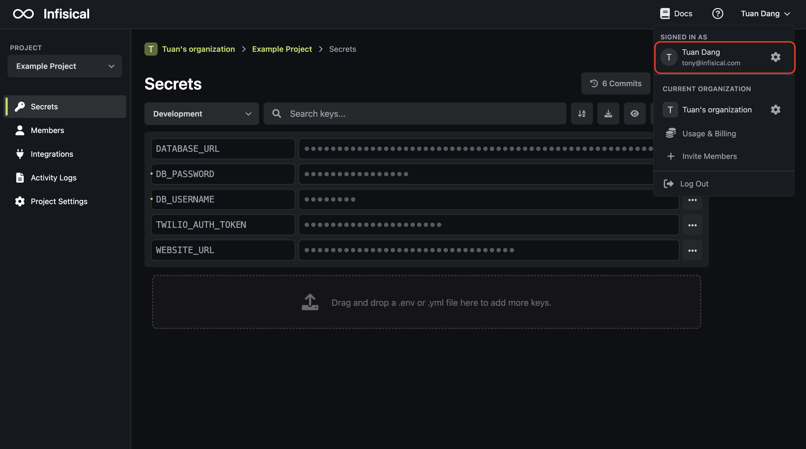
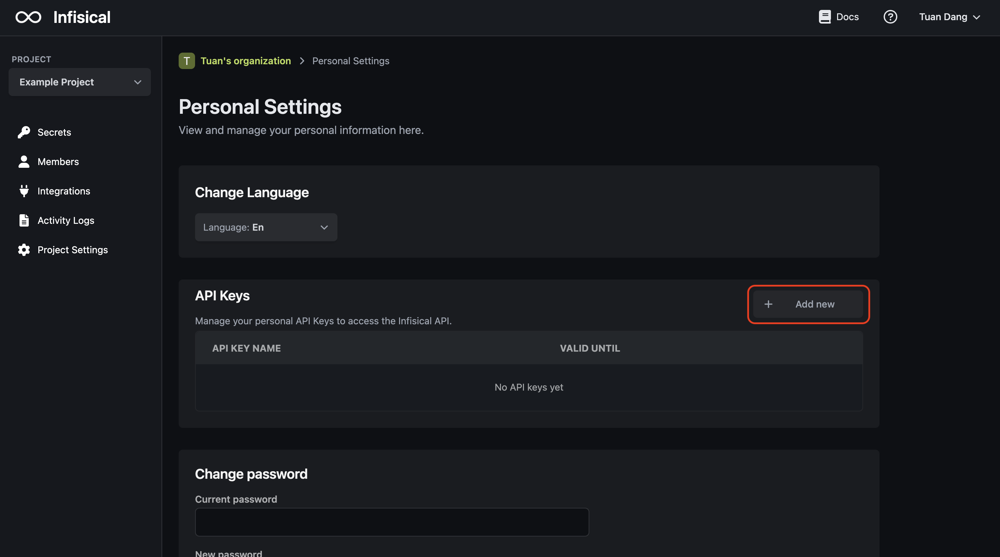

## Essentials

The Public API accepts multiple modes of authentication being via API Key, Service Account credentials, or [Infisical Token](../../../getting-started/dashboard/token).

- API Key: Provides full access to all endpoints representing the user.
- [Service Account](): Provides scoped access to an organization and select projects representing a machine such as a VM or application client. 
- [Infisical Token](../../../getting-started/dashboard/token): Provides short-lived, scoped CRUD access to the secrets of a specific project and environment.

<AccordionGroup>
<Accordion title="API Key">
The API key mode uses an API key to authenticate with the API.

To authenticate requests with Infisical using the API Key, you must include an API key in the `X-API-KEY` header of HTTP requests made to the platform. 

You can obtain an API key in User Settings > API Keys

</Accordion>
<Accordion title="Service Account">
The Service Account mode uses an Access Key to authenticate with the API and a Public Key and Private Key to perform any cryptographic operations.

To authenticate requests with Infisical using the Access Key, you must include it in the `Authorization` header of HTTP requests made to the platform with the value `Bearer <access_key>`.

You can create a Service Account in Organization Settings > Service Accounts

</Accordion>
<Accordion title="Infisical Token">

The Infisical Token mode uses an Infisical Token to authenticate with the API.

To authenticate requests with Infisical using the Infisical Token, you must include your Infisical Token in the `Authorization` header of HTTP requests made to the platform with the value `Bearer <infisical_token>`.

You can obtain an Infisical Token in Project Settings > Service Tokens.

</Accordion>
</AccordionGroup>

## Use Cases

Depending on your use case, it may make sense to use one or another authentication mode:

- API Key (not recommended): Use if you need full access to the Public API without needing to access any secrets endpoints (because API keys can't encrypt/decrypt secrets).
- Service Account (recommeded): Use if you need access to multiple projects and environments in an organization; service accounts can generate short-lived access tokens, making them useful for some complex setups.
- Service Token (recommeded): Use if you need short-lived, scoped CRUD access to the secrets of a specific project and environment.