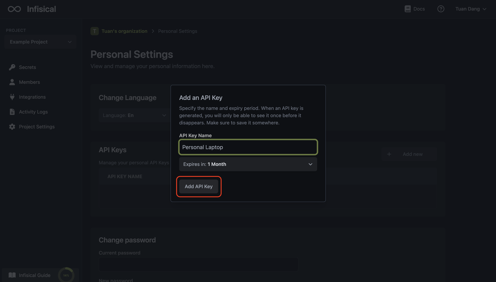

To authenticate requests with Infisical, you must include an API key in the `X-API-KEY` header of HTTP requests made to the platform. You can obtain an API key in User Settings > API Keys

<Info>
  It's important to keep your API key secure, as it grants access to your
  secrets in Infisical. For added security, set a reasonable expiration time and
  rotate your API key on a regular basis.
</Info>
