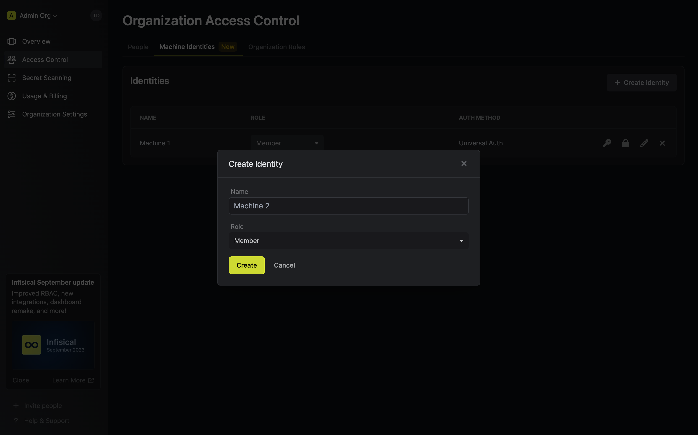
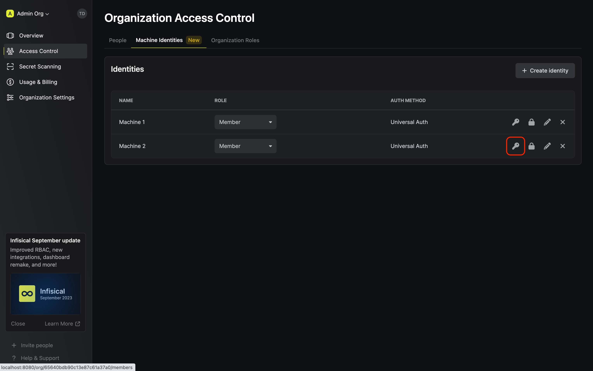
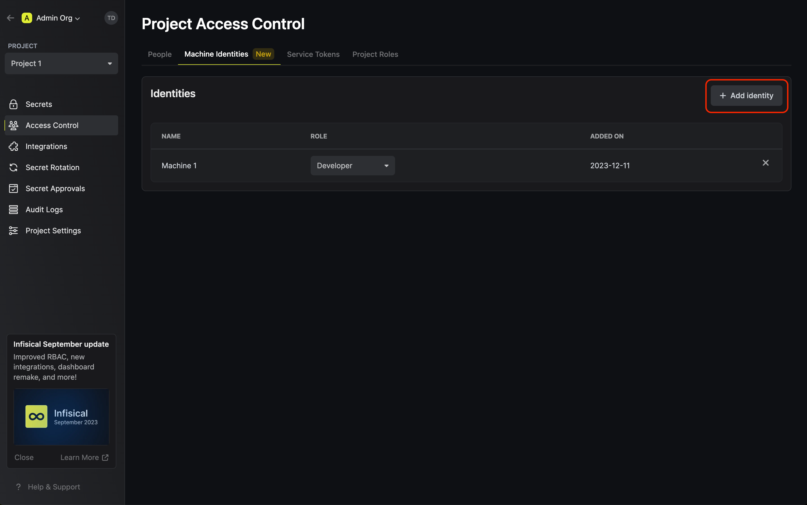
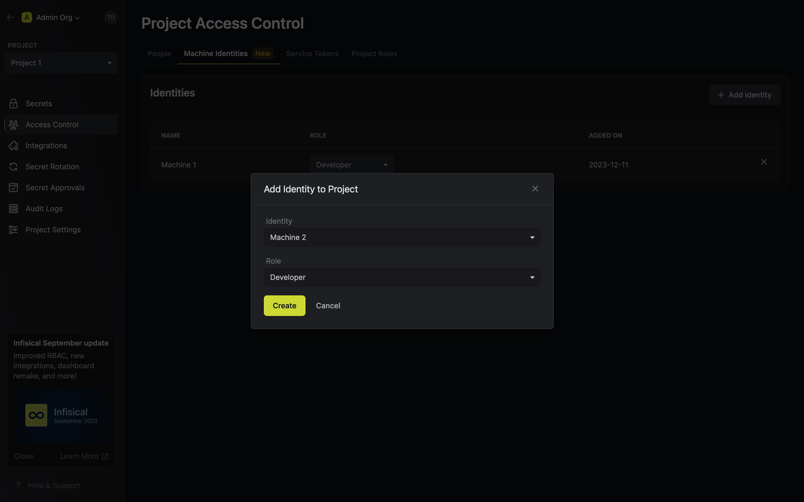

You can authenticate with the Infisical API using [Identities](/documentation/platform/identities/overview) with the [Universal Auth](/documentation/platform/identities/universal-auth) authentication method.

In the following steps, we explore how to create an identity representing a workload or application to access the Infisical API.

<Steps>
  <Step title="Create an identity">
    To create an identity, head to your Organization Settings > Access Control > Machine Identities and press **Create identity**.

    
    
    When creating an identity, you specify an organization level [role](/documentation/platform/role-based-access-controls) for it to assume; you can configure roles in Organization Settings > Access Control > Organization Roles.
    
    
    
    Once you've created an identity, you'll be prompted to configure the **Universal Auth** authentication method for it.
    
    

  </Step>
  <Step title="Create a Client Secret">
    In order to use the identity, you'll need the non-sensitive **Client ID**
    of the identity and a **Client Secret** for it; you can think of these credentials akin to a username
    and password used to authenticate with the Infisical API. With that, press on the key icon on the identity to generate a **Client Secret**
    for it.
    
    
    
    
  </Step>
  <Step title="Add an identity to a project">
    To enable the identity to access project-level resources such as secrets within a specific project, you should add it to that project.

    To do this, head over to the project you want to add the identity to and go to Project Settings > Access Control > Machine Identities and press **Add identity**.

    Next, select the identity you want to add to the project and the role you want to assign it.

    
    
    
  </Step>
  <Step title="Access the Infisical API with the identity">
    To access the Infisical API as the identity, you should first perform a login operation
    that is to exchange the **Client ID** and **Client Secret** of the identity for an access token
    by making a request to the `/api/v1/auth/universal-auth/login` endpoint.
    
    #### Sample request

    ```
    curl --location --request POST 'https://app.infisical.com/api/v1/auth/universal-auth/login' \
      --header 'Content-Type: application/x-www-form-urlencoded' \
      --data-urlencode 'clientSecret=...' \
      --data-urlencode 'clientId=...'
    ```
    
    #### Sample response
    
    ```
    {
      "accessToken": "...",
      "expiresIn": 7200,
      "tokenType": "Bearer"
    }
    ```

    Next, you can use the access token to authenticate with the [Infisical API](/api-reference/overview/introduction)
    
    <Note>
      Each identity access token has a time-to-live (TLL) which you can infer from the response of the login operation;
      the default TTL is `7200` seconds which can be adjusted.

      If an identity access token expires, it can no longer authenticate with the Infisical API. In this case,
      a new access token should be obtained from the aforementioned login operation.
    </Note>
  </Step>
</Steps>

**FAQ**

<AccordionGroup>
<Accordion title="What happened to the Service Token and API Key authentication modes?">
    The Service Token and API Key authentication modes are being deprecated out in favor of [Identities](/documentation/platform/identity).
    We expect to make a deprecation notice in the coming months alongside a larger deprecation initiative planned for Q1/Q2 2024.

    With identities, we're improving significantly over the shortcomings of Service Tokens and API Keys. Amongst many differences, identities provide broader access over the Infisical API, utilizes the same role-based
    permission system used by users, and comes with ample more configurable security measures.
</Accordion>
<Accordion title="Why can I not create, read, update, or delete an identity?">
  There are a few reasons for why this might happen:
  
  - You have insufficient organization permissions to create, read, update, delete identities.
  - The identity you are trying to read, update, or delete is more privileged than yourself.
  - The role you are trying to create an identity for or update an identity to is more privileged than yours.
</Accordion>
<Accordion title="Why is the Infisical API rejecting my identity credentials?">
  There are a few reasons for why this might happen:
  
  - The client secret or access token has expired.
  - The identity is insufficently permissioned to interact with the resources you wish to access.
  - You are attempting to access a `/raw` secrets endpoint that requires your project to disable E2EE.
  - The client secret/access token is being used from an untrusted IP.
</Accordion>
</AccordionGroup>