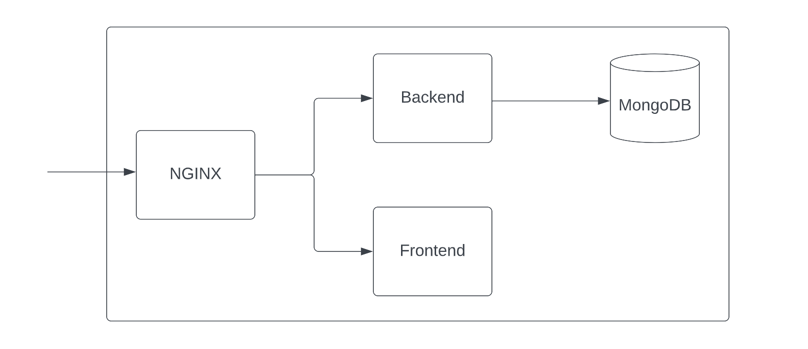

Infisical is an open-source collection of services for simple secret management built on top of Typescript, Javascript (ongoing conversion to TS), and Go. It's all dockerized and can be spun up with Docker Compose.

## NGINX

NGINX is a reverse-proxy and load balancer that sits in front of Infisical. It forwards requests to the frontend and backend services.

## Frontend

The frontend service renders the Web UI using Next.js.

## Backend

The backend service provides the back-of-house logic for secret management.

## Database

The (MongoDB) database stores all data and (encrypted) secrets.

## CLI

The platform-agnostic CLI allows you to inject environment variables from Infisical into apps and infrastructure.
