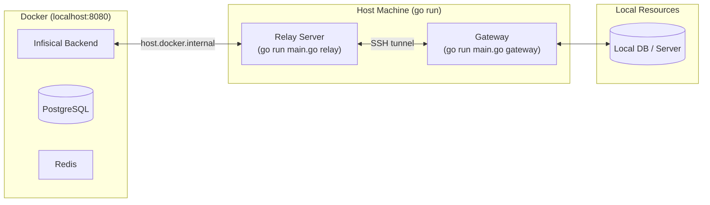

This guide covers setting up the relay and gateway components for local PAM (Privileged Access Management) development. It assumes you already have the Infisical platform running locally.

<Note>
If you haven't set up the Infisical platform yet, follow the [local development guide](/contributing/platform/developing) first.
</Note>

## Local Development Setup

In a local dev environment, the Infisical platform runs inside Docker while the relay and gateway run directly on your host machine:



| Component | Where it runs | What it does |
|-----------|---------------|--------------|
| **Infisical Platform** | Docker | Backend API, database, Redis |
| **Relay Server** | Host machine | Routes traffic between backend and gateway |
| **Gateway** | Host machine | Proxies connections to local resources |

<Note>
The relay uses `host.docker.internal` so the Dockerized backend can reach it on your host machine.
</Note>

For more details on the production architecture, see:
- [Gateway Overview](/documentation/platform/gateways/overview)
- [PAM Architecture](/documentation/platform/pam/architecture)

## Prerequisites

- Infisical platform running locally via `docker compose -f docker-compose.dev.yml up`
- [Go](https://golang.org/dl/) installed
- A machine identity with Token Auth configured (see [Token Auth docs](/documentation/platform/identities/token-auth))

## Clone the CLI Repository

The relay and gateway live in the [Infisical CLI repository](https://github.com/Infisical/cli). For local development, run them via `go run main.go` rather than the pre-built binary:

```bash
git clone https://github.com/Infisical/cli.git
cd cli
```

## Start the Relay Server

From the CLI repository root:

```bash
go run main.go relay start \
  --name=local-relay \
  --token=<your-token> \
  --domain=http://localhost:8080 \
  --host=host.docker.internal
```

<Note>
Use `host.docker.internal` because the Infisical backend runs inside Docker and needs to reach the relay on your host machine.
</Note>

Verify registration at **Organization Settings** > **Networking** > **Relays**.

For all available flags, see the [Relay CLI Reference](/cli/commands/relay).

## Start the Gateway

In a new terminal, from the CLI repository root:

```bash
go run main.go gateway start \
  --token=<your-token> \
  --domain=http://localhost:8080 \
  --target-relay-name=local-relay \
  --name=local-gateway \
  --pam-session-recording-path=$(pwd)/session
```

Verify registration at **Organization Settings** > **Networking** > **Gateways**.

For all available flags, see the [Gateway CLI Reference](/cli/commands/gateway).

## Quick Reference

| Component | Command |
|-----------|---------|
| Relay | `go run main.go relay start --name=local-relay --token=<token> --domain=http://localhost:8080 --host=host.docker.internal` |
| Gateway | `go run main.go gateway start --token=<token> --domain=http://localhost:8080 --target-relay-name=local-relay --name=local-gateway --pam-session-recording-path=$(pwd)/session` |

## Troubleshooting

<AccordionGroup>
<Accordion title="Relay/Gateway cannot connect to Infisical">
Ensure the backend is fully started before running relay/gateway. Check logs:

```bash
docker compose -f docker-compose.dev.yml logs -f backend
```
</Accordion>

<Accordion title="Gateway cannot connect to relay">
- Verify relay is running and registered in the UI
- Check `--target-relay-name` matches relay's `--name`
- Ensure port 2222 is not blocked
</Accordion>

<Accordion title="Cannot reach local resources through gateway">
- Check resource connection details are correct
- Ensure target resource is running and accessible from your machine
</Accordion>
</AccordionGroup>

## Next Steps

- [Create PAM resources](/documentation/platform/pam/getting-started/resources) and test connections through the gateway
- Explore [session recording](/documentation/platform/pam/product-reference/session-recording) functionality
