Infisical's REST API is the most flexible way to read/write secrets for your application.

In this brief, we'll explore how to fetch a secret back from a project on [Infisical Cloud](https://app.infisical.com) via the REST API.

<Steps>
    <Step title="Create a project with a secret">
        To create a project, head to your Organization Overview and press **Add New Project**; we'll call the project **Demo App**.
        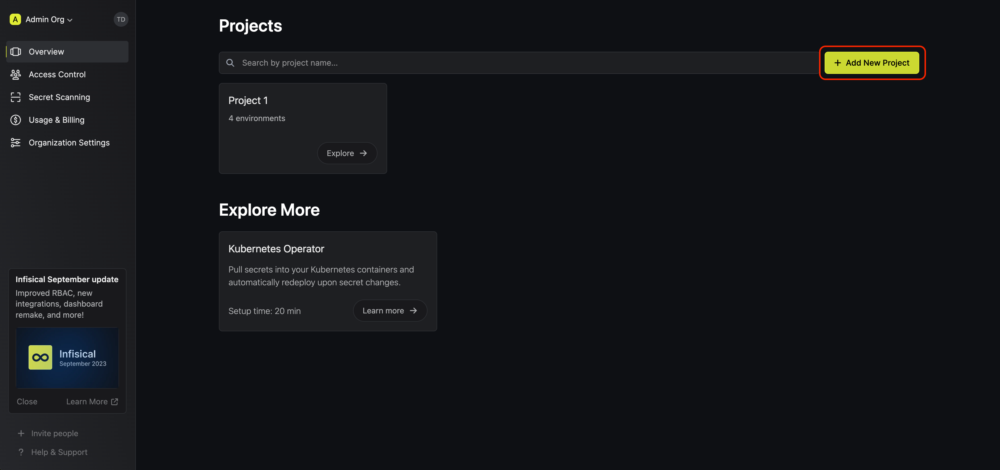

        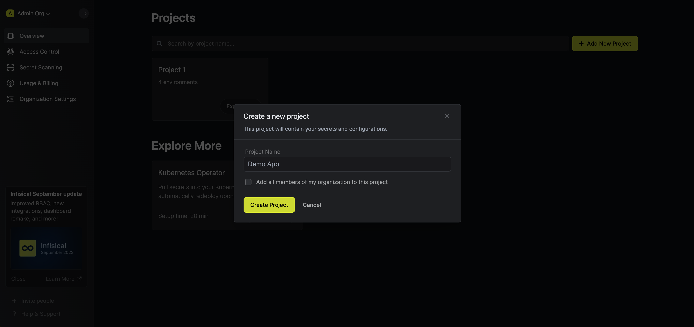

        Next, let's head to the **Development** environment of the project and add a secret `FOO=BAR` to it.

        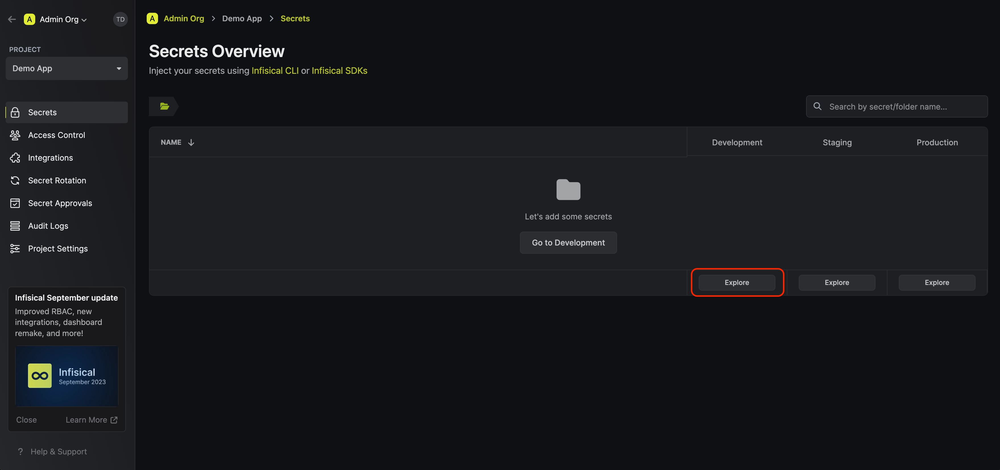

        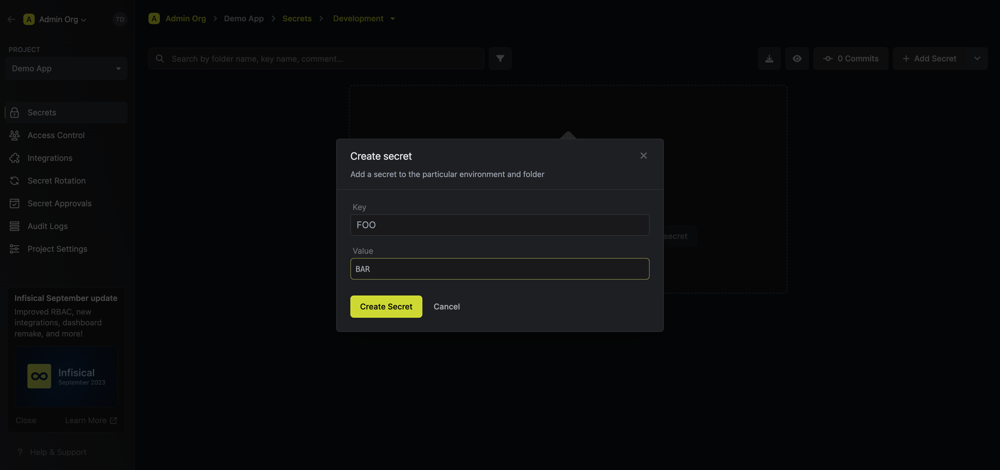

        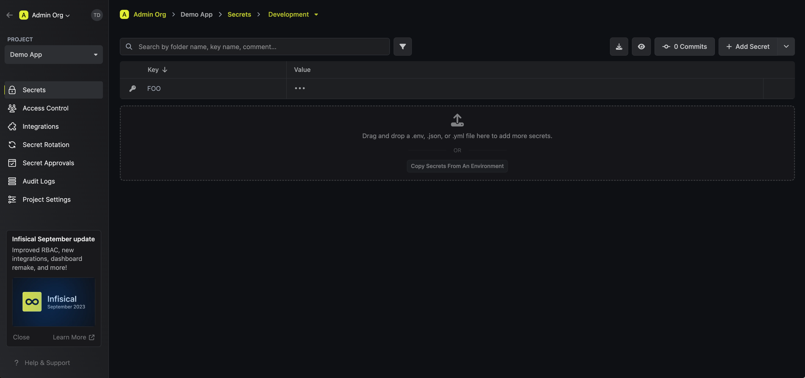

        <Note>
            For this brief, you'll need to disable end-to-end encryption in your Project Settings
        </Note>
    </Step>
    <Step title="Create an identity">
        Next, we need to create an identity to represent your application. To create one, head to your Organization Settings > Access Control > Machine Identities and press **Create identity**.

        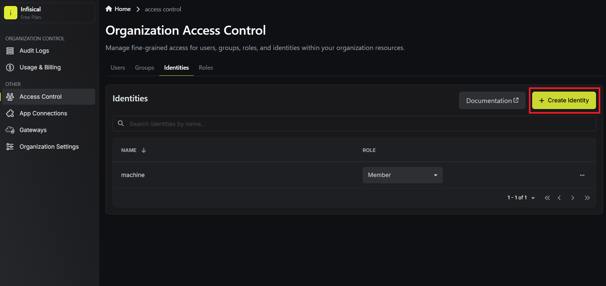

        When creating an identity, you specify an organization level [role](/documentation/platform/role-based-access-controls) for it to assume; you can configure roles in Organization Settings > Access Control > Organization Roles.

        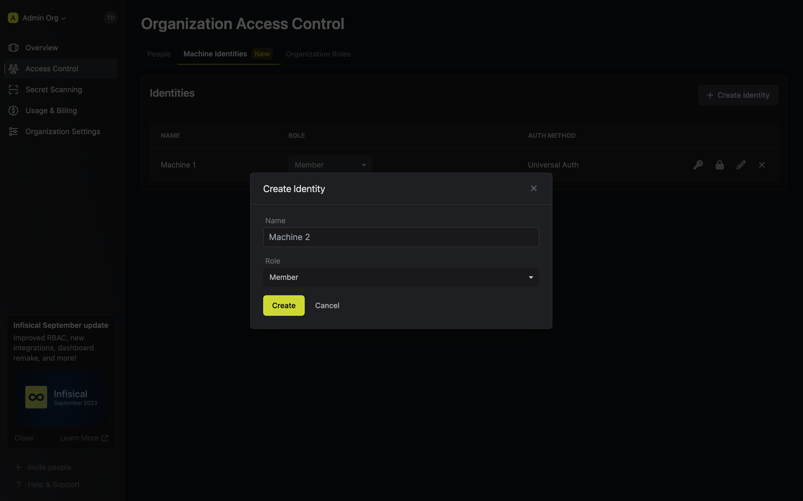

        Once you've created an identity, you'll be prompted to configure the **Universal Auth** authentication method for it.

        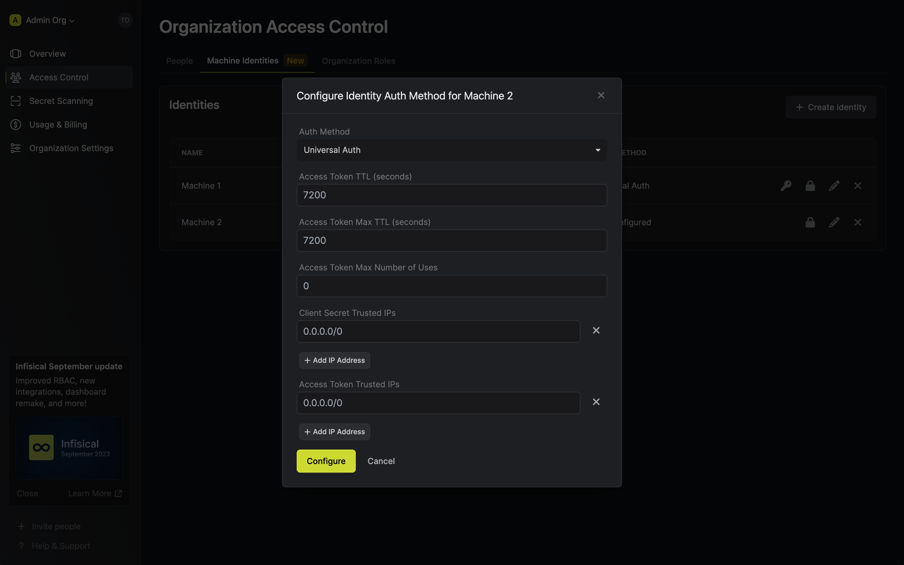

    </Step>
    <Step title="Create a Client Secret">
        In order to use the identity, you'll need the non-sensitive **Client ID**
        of the identity and a **Client Secret** for it; you can think of these credentials akin to a username
        and password used to authenticate with the Infisical API. With that, press on the key icon on the identity to generate a **Client Secret**
        for it.

        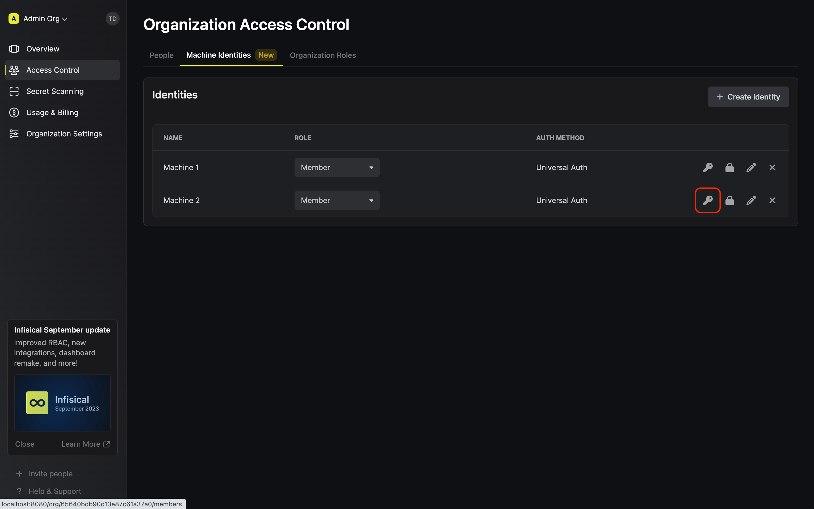
        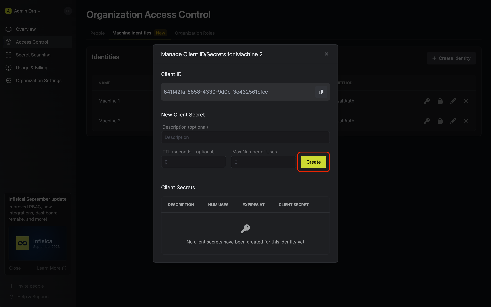
        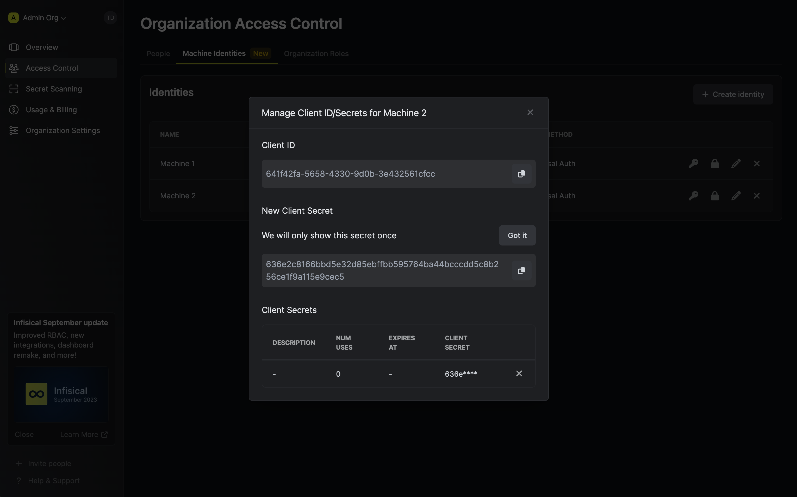
    </Step>
    <Step title="Add the identity to the project">
        To enable the identity to access your project, we need to add it to the project. To do this, head over to the **Demo App** Project Settings > Access Control > Machine Identities and press **Add identity**.

        Next, select the identity you want to add to the project and the role you want to assign it.

        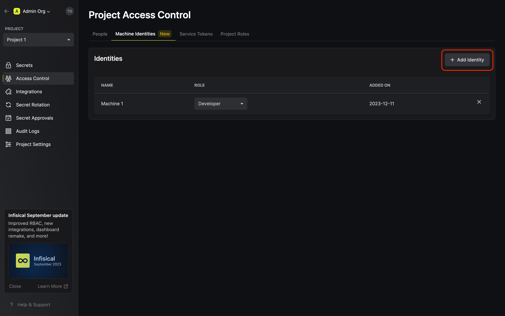

        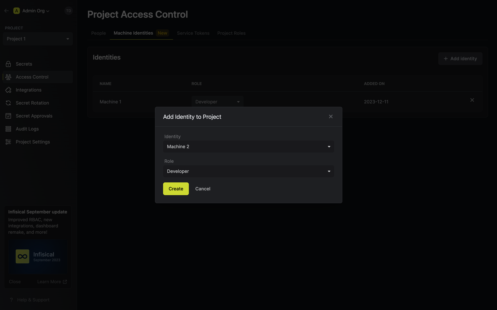
    </Step>
    <Step title="Get an access token for the Infisical API">
        To access the Infisical API as the identity, you should first perform a login operation
        that is to exchange the **Client ID** and **Client Secret** of the identity for an access token
        by making a request to the `/api/v1/auth/universal-auth/login` endpoint.

        #### Sample request

        ```
        curl --location --request POST 'https://app.infisical.com/api/v1/auth/universal-auth/login' \
        --header 'Content-Type: application/x-www-form-urlencoded' \
        --data-urlencode 'clientSecret=<client_secret>' \
        --data-urlencode 'clientId=<client_id>'
        ```

        #### Sample response

        ```
        {
        "accessToken": "...",
        "expiresIn": 7200,
        "tokenType": "Bearer"
        }
        ```

        Next, we can use the access token to authenticate with the [Infisical API](/api-reference/overview/introduction) to read/write secrets

        <Note>
        Each identity access token has a time-to-live (TTL) which you can infer from the response of the login operation;
        the default TTL is `7200` seconds which can be adjusted.

        If an identity access token expires, it can no longer authenticate with the Infisical API. In this case,
        a new access token should be obtained from the aforementioned login operation.
        </Note>
    </Step>
    <Step title="Fetch back secret">
        Finally, you can fetch the secret `FOO=BAR` back from **Step 1** by including the access token in the previous step in another request to the `/api/v3/secrets/raw/{secretName}` endpoint.

        ### Sample request

        ```
        curl --location --request GET 'http://localhost:8080/api/v3/secrets/raw/FOO?workspaceId=657830d579cfc8415d06ce5b&environment=dev' \
            --header 'Authorization: Bearer <access_token>'
        ```

        ### Sample response

        ```
        {
            "secret": {
                "_id": "6564234b934d634e1fcd6cdf",
                "version": 1,
                "workspace": "6564173e934d634e1fcd6950",
                "type": "shared",
                "environment": "dev",
                "secretKey": "FOO2",
                "secretValue": "BAR2",
                "secretComment": ""
            }
        }
        ```

        Note that you can fetch a list of secrets back by making a request to the `/api/v3/secrets/raw` endpoint.
    </Step>
</Steps>

See also:

- [API Reference](/api-reference/overview/introduction)
