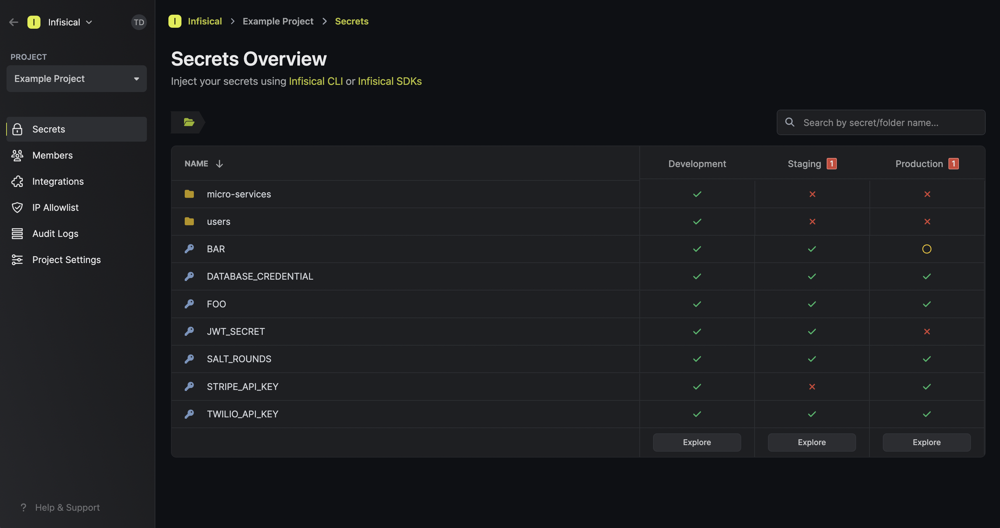
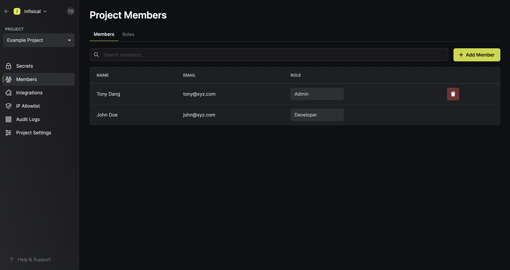

Infisical is an [open-source](https://opensource.com/resources/what-open-source), [end-to-end encrypted](https://en.wikipedia.org/wiki/End-to-end_encryption) secret management platform that enables teams to easily store, manage, and sync 
application configuration and secrets like API keys, database credentials, and environment variables across applications and infrastructure. 
It also has secret scanning capabilities for detecting leaked secrets in codebases.

This quickstart provides an overview of functionalities offered by Infisical.

## Managing your Organization

When you first make an account with Infisical, you also create a new **organization** where you are assigned the `admin` role by default.
From there, you can invite external members to the organization and start creating **projects** to house secrets.

### Projects

The **Projects** page shows you all the projects that you have access to within your organization.
Here, you can also create a new project. 

### Members

The **Members** page lets you add or remove external members to your organization. 
Note that you can configure your organization in Infisical to have members authenticate with the platform via protocols like SAML 2.0.

## Managing your Projects

As mentioned before, projects house secrets which are further organized into environments such as development, testing and production.
A project can be anything from a single application to a collection of micro-services that you wish to manage secrets for.

### Secrets Overview

The **Secrets Overview** screen provides a bird's-eye view of all the secrets in a project and is useful for comparing secrets and identifying missing ones across environments.

In the above image, you can already see that:
- `STRIPE_API_KEY` is missing from the **Staging** environment.
- `JWT_SECRET` is missing from the **Production** environment.
- `BAR` is `EMPTY` in the **Production** environment.

### Dashboard

The secrets dashboard lets you manage secrets for a specific environment in a project. 
Here, developers can [override secrets](//project#personal-overrides), [version secrets](/documentation/platform/secret-versioning), [rollback projects to any point in time](/documentation/platform/pit-recovery), and much more.

### Integrations

The integrations page provides native integrations to sync secrets from a project environment to a [host of ever-expanding integrations](/integrations/overview).

<Tip>
    Depending on your infrastructure setup and compliance requirements, you may or may not prefer to use these native integrations since they break end-to-end encryption (E2EE).
    
    You will learn about various ways to integrate with Infisical and maintain E2EE in subsequent quickstart sections.
</Tip>

### Members

The members page lets you add/remove members to/from a project and provision them access to environments via roles. By default, Infisical provides the `admin`, `developer`, and `viewer` roles
which you can assign to members.

That's it for the platform quickstart! — We encourage you to continue exploring the documentation to gain a deeper understanding of the extensive features and functionalities that Infisical has to offer.

Next, head back to [Getting Started > Introduction](/documentation/getting-started/overview) to explore ways to fetch secrets from Infisical to your apps and infrastructure.