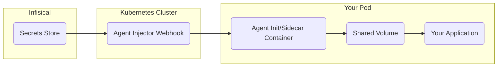

The [Infisical Kubernetes Agent Injector](https://infisical.com/docs/integrations/platforms/kubernetes-injector) provides a seamless way to inject secrets from Infisical directly into your Kubernetes pods without modifying your application code. It works by automatically adding an [Infisical Agent](/integrations/platforms/infisical-agent) sidecar or init container to your pods, which fetches secrets from Infisical and writes them to a shared volume that your application can read.

In this guide, we'll walk through how to:

1. **Install the Infisical Agent Injector** on your Kubernetes cluster using Helm.
2. **Create a Machine Identity** in Infisical and configure it with Kubernetes Authentication.
3. **Set up RBAC and Service Accounts** for secure token review.
4. **Create a ConfigMap** that tells the injector which secrets to fetch and how to render them.
5. **Deploy a sample application** that reads injected secrets from a file.
6. **Explore different injection modes** (init, sidecar, and sidecar-init).

## How It Works

The Agent Injector uses [Kubernetes Mutating Admission Webhooks](https://kubernetes.io/docs/reference/access-authn-authz/admission-controllers) to watch for pod creation and update events. When a pod is annotated with `org.infisical.com/inject: "true"`, the injector automatically patches the pod spec to include an Infisical Agent container. This agent authenticates with Infisical using a Machine Identity, fetches the requested secrets, and renders them into files on a shared volume that your application containers can access.



<Note>
  The Agent Injector is namespace-agnostic and watches pods in all namespaces, but it only modifies pods that have the required annotations.
</Note>

## Prerequisites

Before we begin, make sure your environment is ready:

1. **Installed tools**
    - [Helm](https://helm.sh/docs/intro/install/) (package manager for Kubernetes)
    - [kubectl](https://kubernetes.io/docs/tasks/tools/) (Kubernetes command-line tool)
    - [git](https://git-scm.com/downloads) (to clone the sample code)
2. **Kubernetes cluster**
    - A running cluster that you can connect to with `kubectl`. If you don't have one, you can use [minikube](https://minikube.sigs.k8s.io/docs/start/), [kind](https://kind.sigs.k8s.io/), or a managed cluster (EKS, GKE, AKS).
3. **Access to an Infisical instance**
    - Either [Infisical Cloud](https://app.infisical.com/) (free tier available) or a [self-hosted instance](/self-hosting/overview).
4. **Clone the sample source code**
    - Clone the [infisical-guides-source-code](https://github.com/Infisical/infisical-guides-source-code) repository, which contains all the YAML manifests used in this guide:
    ```bash
    git clone https://github.com/Infisical/infisical-guides-source-code.git
    cd infisical-guides-source-code/kubernetes-agent-injector-demo
    ```

## Step-By-Step Guide

<Steps titleSize="h2">

  <Step title="Install the Infisical Agent Injector">

The Agent Injector runs as a deployment inside your cluster and intercepts pod creation events via a mutating webhook. Install it using the Infisical Helm chart:

```bash
helm repo add infisical-helm-charts 'https://dl.cloudsmith.io/public/infisical/helm-charts/helm/charts/'
helm repo update
helm install --generate-name infisical-helm-charts/infisical-agent-injector
```

After installing, verify the injector pod is running:

```bash
kubectl get pods | grep infisical-agent-injector
```

You should see output similar to:

```
infisical-agent-injector-xxxxxxxxx-xxxxx   1/1     Running   0          30s
```

You can also check the injector logs to confirm it started successfully:

```bash
kubectl logs deployment/infisical-agent-injector
```

Expected output:

```
Starting infisical-agent-injector...
Generating self-signed certificate...
Creating directory: /tmp/tls
Writing cert to: /tmp/tls/tls.crt
Writing key to: /tmp/tls/tls.key
Starting HTTPS server on port 8585...
Attempting to update webhook config (attempt 1)...
Successfully updated webhook configuration with CA bundle
```

<Tip>
  If the injector pod fails to start, check that your cluster has admission webhooks enabled. Most managed Kubernetes services (EKS, GKE, AKS) have this enabled by default.
</Tip>

  </Step>

  <Step title="Create a Machine Identity and Set Up a Project">

The Agent Injector authenticates with Infisical using a [Machine Identity](https://infisical.com/docs/documentation/platform/identities/machine-identities) with the [Kubernetes Auth Method](https://infisical.com/docs/documentation/platform/identities/kubernetes-auth). This allows pods in your cluster to securely authenticate without storing any static credentials.

<Steps>
  <Step title="Create the Machine Identity">
    1. Log in to [Infisical](https://app.infisical.com/).
    2. Navigate to **Organization Access Control** from the sidebar.
    3. Click **Create Identity** and give it a descriptive name (e.g., `k8s-agent-injector`).
    4. Assign it a role (e.g., **Member**).
    5. Once created, copy the **Identity ID** — you will need this later.
  </Step>
  <Step title="Add Kubernetes Authentication">
    1. Select the Machine Identity you just created.
    2. Click **Add Authentication Method** and choose **Kubernetes**.
    3. Configure the following fields:
        - **Allowed Service Account Names**: `default` (or the service account your pods will use)
        - **Allowed Namespaces**: `default` (or the namespace you'll deploy to)
        - **Kubernetes Host URL**: Run the command below and use the URL shown for the Kubernetes control plane:
          ```bash
          kubectl cluster-info
          ```
        - **Token Reviewer JWT**: Leave blank for now — we will generate and add this in the next step.
        - **CA Certificate**: Leave blank for now — we will generate and add this in the next step.
    4. Save the authentication method.
  </Step>
  <Step title="Create an Infisical Project and Add Secrets">
    1. Go back to the Infisical dashboard and click **Add New Project**.
    2. Set the **Project Name** (e.g., `k8s-injector-demo`) and select **Secrets Management**.
    3. Navigate into the project and add some test secrets. For this guide, add the following in the **Development** environment:

        | Key | Value |
        |-----|-------|
        | `API_KEY` | `sk_test_abc123` |
        | `DATABASE_URL` | `postgresql://user:pass@db:5432/myapp` |
        | `APP_SECRET` | `my-super-secret-value` |

    4. Go to the **Project Access Control** tab and add your Machine Identity with **Admin** permissions (for demonstration purposes).

    <Warning>
      In production, always follow the principle of least privilege. Grant only the minimum permissions necessary (e.g., **Read** access to specific environments and paths).
    </Warning>
  </Step>
</Steps>

  </Step>

  <Step title="Set Up RBAC, Service Accounts, and Token Reviewer">

For Kubernetes Auth to work, Infisical needs to validate the service account tokens presented by pods. This requires a token reviewer service account with the `system:auth-delegator` ClusterRole.

Navigate to the sample code directory:

```bash
cd infisical-guides-source-code/kubernetes-agent-injector-demo
```

<Tabs>
  <Tab title="Apply all at once">
    Apply all the RBAC manifests in one command:

    ```bash
    kubectl apply -f rbac/
    ```
  </Tab>
  <Tab title="Apply step-by-step">
    If you prefer to understand each resource, apply them individually:

**1. Create the Token Reviewer Service Account**

This service account is used by Infisical to validate Kubernetes tokens during authentication:

```yaml rbac/infisical-reviewer-service-account.yaml
apiVersion: v1
kind: ServiceAccount
metadata:
  name: infisical-token-reviewer
  namespace: default
```

```bash
kubectl apply -f rbac/infisical-reviewer-service-account.yaml
```

**2. Create a Token for the Reviewer Service Account**

This generates a long-lived JWT token that Infisical will use to perform token review requests:

```yaml rbac/service-account-reviewer-token.yaml
apiVersion: v1
kind: Secret
metadata:
  name: infisical-token-reviewer-token
  namespace: default
  annotations:
    kubernetes.io/service-account.name: infisical-token-reviewer
type: kubernetes.io/service-account-token
```

```bash
kubectl apply -f rbac/service-account-reviewer-token.yaml
```

**3. Create the ClusterRoleBinding**

This binds the `infisical-token-reviewer` service account to the built-in `system:auth-delegator` ClusterRole. Without this, the service account cannot validate tokens:

```yaml rbac/cluster-role-binding.yaml
apiVersion: rbac.authorization.k8s.io/v1
kind: ClusterRoleBinding
metadata:
  name: infisical-token-reviewer-binding
roleRef:
  apiGroup: rbac.authorization.k8s.io
  kind: ClusterRole
  name: system:auth-delegator
subjects:
  - kind: ServiceAccount
    name: infisical-token-reviewer
    namespace: default
```

```bash
kubectl apply -f rbac/cluster-role-binding.yaml
```

  </Tab>
</Tabs>

Now extract the **Token Reviewer JWT** and **CA Certificate** and add them to your Machine Identity's Kubernetes Auth configuration in Infisical:

```bash
# Get the Token Reviewer JWT
kubectl get secret infisical-token-reviewer-token -n default -o jsonpath='{.data.token}' | base64 -d
```

```bash
# Get the CA Certificate
kubectl get secret infisical-token-reviewer-token -n default -o jsonpath='{.data.ca\.crt}' | base64 -d
```

Go back to the Machine Identity's **Kubernetes Auth** settings in Infisical and paste the JWT output into the **Token Reviewer JWT** field. Then paste the CA certificate output into the **CA Certificate** field (found under the **Advanced** tab).

  </Step>

  <Step title="Verify Service Accounts and Tokens">

Before proceeding, confirm everything was created correctly:

```bash
# Check service accounts
kubectl get serviceaccount -n default | grep infisical
```

Expected output:

```
infisical-token-reviewer   0         1m
```

```bash
# Check secrets/tokens
kubectl get secrets -n default | grep infisical
```

Expected output:

```
infisical-token-reviewer-token   kubernetes.io/service-account-token   3      1m
```

  </Step>

  <Step title="Create the Agent Configuration ConfigMap">

The ConfigMap tells the Infisical Agent what secrets to fetch and where to write them. It contains the agent configuration as a YAML string under the `config.yaml` key.

<Tabs>
  <Tab title="Basic Secrets (Key=Value)">
    This configuration fetches all secrets and renders them as `KEY=VALUE` pairs:

```yaml configmap/agent-config.yaml
apiVersion: v1
kind: ConfigMap
metadata:
  name: infisical-agent-config
  namespace: default
data:
  config.yaml: |
    infisical:
      address: "https://app.infisical.com"
      auth:
        type: "kubernetes"
        config:
          identity-id: "YOUR_MACHINE_IDENTITY_ID"
    templates:
      - destination-path: "/infisical/secrets"
        template-content: |
          {{- with secret "YOUR_PROJECT_ID" "dev" "/" }}
          {{- range . }}
          {{ .Key }}={{ .Value }}
          {{- end }}
          {{- end }}
```

  </Tab>
  <Tab title="JSON Format">
    Render secrets as a JSON object for applications that prefer JSON config:

```yaml configmap/agent-config-json.yaml
apiVersion: v1
kind: ConfigMap
metadata:
  name: infisical-agent-config
  namespace: default
data:
  config.yaml: |
    infisical:
      address: "https://app.infisical.com"
      auth:
        type: "kubernetes"
        config:
          identity-id: "YOUR_MACHINE_IDENTITY_ID"
    templates:
      - destination-path: "/infisical/secrets.json"
        template-content: |
          {
          {{- with secret "YOUR_PROJECT_ID" "dev" "/" }}
          {{- range $i, $secret := . }}
          {{- if $i }},{{ end }}
            "{{ .Key }}": "{{ .Value }}"
          {{- end }}
          {{- end }}
          }
```

  </Tab>
  <Tab title="Specific Secret">
    Fetch a single secret by name using the `getSecretByName` function:

```yaml configmap/agent-config-single.yaml
apiVersion: v1
kind: ConfigMap
metadata:
  name: infisical-agent-config
  namespace: default
data:
  config.yaml: |
    infisical:
      address: "https://app.infisical.com"
      auth:
        type: "kubernetes"
        config:
          identity-id: "YOUR_MACHINE_IDENTITY_ID"
    templates:
      - destination-path: "/infisical/api-key"
        template-content: |
          {{- with getSecretByName "YOUR_PROJECT_ID" "dev" "/" "API_KEY" }}
          {{ .Value }}
          {{- end }}
```

  </Tab>
</Tabs>

Replace the placeholder values:
- **your-machine-identity-id**: The Identity ID you copied in Step 2.
- **your-project-id**: Found in your Infisical project under **Settings > General**.

<Note>
  If you are using a self-hosted Infisical instance, change the `infisical.address` field to your instance's URL.
</Note>

Apply the ConfigMap:

```bash
kubectl apply -f configmap/agent-config.yaml
```

  </Step>

  <Step title="Deploy the Demo Application">

Now let's deploy a sample nginx application that uses the Agent Injector to fetch secrets. The key annotations on the pod tell the injector what to do:

- `org.infisical.com/inject: "true"` — Enables the injector for this pod.
- `org.infisical.com/inject-mode: "init"` — Uses an init container to fetch secrets before the main container starts.
- `org.infisical.com/agent-config-map: "infisical-agent-config"` — Points to the ConfigMap we created.

```yaml app/demo-deployment.yaml
apiVersion: apps/v1
kind: Deployment
metadata:
  name: demo-app
  namespace: default
  labels:
    app: demo-app
spec:
  replicas: 1
  selector:
    matchLabels:
      app: demo-app
  template:
    metadata:
      labels:
        app: demo-app
      annotations:
        org.infisical.com/inject: "true"
        org.infisical.com/inject-mode: "init"
        org.infisical.com/agent-config-map: "infisical-agent-config"
    spec:
      containers:
        - name: demo-app
          image: nginx:alpine
          command: ["/bin/sh", "-c"]
          args:
            - |
              echo "--- Secrets injected by Infisical Agent ---"
              cat /infisical/secrets
              echo ""
              echo "--- Loading secrets as environment variables ---"
              export $(cat /infisical/secrets | xargs)
              echo "API_KEY is: $API_KEY"
              echo "--- Starting nginx ---"
              nginx -g "daemon off;"
```

Apply the deployment:

```bash
kubectl apply -f app/demo-deployment.yaml
```

Wait for the pod to become ready (this may take 30-60 seconds as the init container fetches secrets):

```bash
kubectl get pods -l app=demo-app -w
```

You should see the pod transition through these states:

```
NAME                        READY   STATUS     RESTARTS   AGE
demo-app-xxxxxxxxx-xxxxx    0/1     Init:0/1   0          5s
demo-app-xxxxxxxxx-xxxxx    0/1     PodInitializing   0   15s
demo-app-xxxxxxxxx-xxxxx    1/1     Running    0          20s
```

<Tip>
  The `Init:0/1` state indicates the Infisical Agent init container is running and fetching secrets. Once it completes, the main container starts.
</Tip>

  </Step>

  <Step title="Verify the Secrets Are Injected">

Check that your secrets were successfully injected into the pod:

**1. Read the secrets file directly:**

```bash
kubectl exec -it $(kubectl get pod -l app=demo-app -o jsonpath='{.items[0].metadata.name}') -- cat /infisical/secrets
```

Expected output:

```
API_KEY=sk_test_abc123
DATABASE_URL=postgresql://user:pass@db:5432/myapp
APP_SECRET=my-super-secret-value
```

**2. Check the container logs to see the secrets loaded as environment variables:**

```bash
kubectl logs $(kubectl get pod -l app=demo-app -o jsonpath='{.items[0].metadata.name}')
```

Expected output:

```
Defaulted container "demo-app" out of: demo-app, infisical-agent-init (init)
--- Secrets injected by Infisical Agent ---
API_KEY=sk_test_abc123
DATABASE_URL=postgresql://user:pass@db:5432/myapp
APP_SECRET=my-super-secret-value

--- Loading secrets as environment variables ---
API_KEY is: sk_test_abc123
--- Starting nginx ---
```

  </Step>

  <Step title="Explore Injection Modes">

The Agent Injector supports three injection modes. Choose the one that best fits your use case:

<AccordionGroup>
  <Accordion title="Init Mode (inject-mode: init)">
    **How it works:** An init container runs before your application container starts. It fetches the secrets once and writes them to the shared volume. After the init container completes, your application starts with the secrets already available.

    **Best for:** Applications that read configuration at startup and don't need live secret updates.

    ```yaml
    annotations:
      org.infisical.com/inject: "true"
      org.infisical.com/inject-mode: "init"
      org.infisical.com/agent-config-map: "infisical-agent-config"
    ```

    **Pros:**
    - Simplest mode — no extra running containers
    - Secrets are guaranteed to be available before your app starts
    - Lower resource usage

    **Cons:**
    - Secrets are only fetched once at pod startup
    - To pick up secret changes, the pod must be restarted
  </Accordion>

  <Accordion title="Sidecar Mode (inject-mode: sidecar)">
    **How it works:** A sidecar container runs alongside your application and continuously syncs secrets. It polls Infisical at a configurable interval and updates the secrets file whenever changes are detected.

    **Best for:** Long-running applications that need to pick up secret changes without restarting.

    ```yaml
    annotations:
      org.infisical.com/inject: "true"
      org.infisical.com/inject-mode: "sidecar"
      org.infisical.com/agent-config-map: "infisical-agent-config"
    ```

    **Pros:**
    - Secrets are kept in sync with Infisical
    - No pod restarts needed for secret updates

    **Cons:**
    - Secrets may not be available immediately when the main container starts (race condition)
    - Uses additional resources for the sidecar container
  </Accordion>

  <Accordion title="Sidecar-Init Mode (inject-mode: sidecar-init)">
    **How it works:** Combines both modes. An init container fetches secrets before your application starts, and a sidecar container keeps them in sync afterwards. This is the most robust option.

    **Best for:** Production workloads that need both guaranteed initial secrets and continuous synchronization.

    ```yaml
    annotations:
      org.infisical.com/inject: "true"
      org.infisical.com/inject-mode: "sidecar-init"
      org.infisical.com/agent-config-map: "infisical-agent-config"
    ```

    **Pros:**
    - Secrets are guaranteed to be available at startup
    - Secrets stay in sync throughout the pod's lifetime

    **Cons:**
    - Uses the most resources (init container + sidecar)
  </Accordion>
</AccordionGroup>

To try a different mode, update the annotation on your deployment:

```bash
kubectl patch deployment demo-app -p '{"spec":{"template":{"metadata":{"annotations":{"org.infisical.com/inject-mode":"sidecar-init"}}}}}'
```

This triggers a rolling update that recreates the pods with the new injection mode.

  </Step>

  <Step title="Configure Resource Limits and Security (Optional)">

For production deployments, you can fine-tune the injected agent containers using annotations.

<Tabs>
  <Tab title="Resource Limits">
    Control how much CPU and memory the agent containers can use:

    ```yaml
    annotations:
      org.infisical.com/inject: "true"
      org.infisical.com/inject-mode: "sidecar-init"
      org.infisical.com/agent-config-map: "infisical-agent-config"
      org.infisical.com/agent-limits-cpu: "200m"
      org.infisical.com/agent-limits-memory: "128Mi"
      org.infisical.com/agent-requests-cpu: "50m"
      org.infisical.com/agent-requests-memory: "64Mi"
    ```

    **Default resource limits:**

    | Resource | Linux Pods | Windows Pods |
    |----------|-----------|--------------|
    | CPU Limit | 500m | 500m |
    | CPU Request | 100m | 100m |
    | Memory Limit | 128Mi | 512Mi |
    | Memory Request | 64Mi | 256Mi |
  </Tab>
  <Tab title="Security Context">
    Enable a hardened security context on the agent containers:

    ```yaml
    annotations:
      org.infisical.com/inject: "true"
      org.infisical.com/inject-mode: "sidecar-init"
      org.infisical.com/agent-config-map: "infisical-agent-config"
      org.infisical.com/agent-set-security-context: "true"
    ```

    This applies the following security context:

    ```yaml
    securityContext:
      allowPrivilegeEscalation: false
      capabilities:
        drop:
          - ALL
      privileged: false
      readOnlyRootFilesystem: true
      runAsGroup: 2000
      runAsNonRoot: true
      runAsUser: 1000
    ```

    You can customize individual settings:

    ```yaml
    annotations:
      org.infisical.com/agent-set-security-context: "true"
      org.infisical.com/agent-security-context-run-as-user: "1000"
      org.infisical.com/agent-security-context-run-as-group: "2000"
      org.infisical.com/agent-security-context-read-only-root-filesystem: "true"
      org.infisical.com/agent-security-context-privileged: "false"
      org.infisical.com/agent-security-context-allow-privilege-escalation: "false"
    ```
  </Tab>
  <Tab title="Credential Revocation">
    Automatically revoke dynamic secret leases and access tokens when a pod is terminated:

    ```yaml
    annotations:
      org.infisical.com/inject: "true"
      org.infisical.com/inject-mode: "sidecar-init"
      org.infisical.com/agent-config-map: "infisical-agent-config"
      org.infisical.com/agent-revoke-on-shutdown: "true"
    ```

    <Warning>
      Credential revocation relies on the pod receiving a `SIGTERM` signal during shutdown. In disaster scenarios (e.g., node failures or power outages), the signal may not be sent and credentials will not be revoked.
    </Warning>
  </Tab>
</Tabs>

  </Step>

  <Step title="Working With Dynamic Secrets (Optional)">

The Agent Injector can also render [Dynamic Secrets](/documentation/platform/dynamic-secrets/overview) — short-lived, automatically rotated credentials for databases and other services. Dynamic secrets are created on-demand and automatically revoked when they expire.

<Steps>
  <Step title="Create a Dynamic Secret in Infisical">
    1. Navigate to your Infisical project.
    2. Click the dropdown next to **Add Secret** and select **Add Dynamic Secret**.
    3. Select your database type (e.g., **PostgreSQL**).
    4. Enter the connection details for your database.
    5. Give the dynamic secret a name (e.g., `pg-dynamic-creds`).
    6. Set the **Default TTL** (e.g., `1h` for one hour).
    7. Save the dynamic secret.
  </Step>
  <Step title="Update the ConfigMap">
    Use the `dynamic_secret` template function to render dynamic secret credentials:

```yaml configmap/agent-config-dynamic.yaml
apiVersion: v1
kind: ConfigMap
metadata:
  name: infisical-agent-config
  namespace: default
data:
  config.yaml: |
    infisical:
      address: "https://app.infisical.com"
      auth:
        type: "kubernetes"
        config:
          identity-id: "YOUR_MACHINE_IDENTITY_ID"
    templates:
      - destination-path: "/infisical/secrets"
        template-content: |
          {{- with secret "YOUR_PROJECT_ID" "dev" "/" }}
          {{- range . }}
          {{ .Key }}={{ .Value }}
          {{- end }}
          {{- end }}
      - destination-path: "/infisical/db-creds"
        template-content: |
          {{- with dynamic_secret "YOUR_PROJECT_SLUG" "dev" "/" "pg-dynamic-creds" "1h" }}
          DB_USERNAME={{ .DB_USERNAME }}
          DB_PASSWORD={{ .DB_PASSWORD }}
          {{- end }}
```

    Apply the updated ConfigMap:

    ```bash
    kubectl apply -f configmap/agent-config-dynamic.yaml
    ```
  </Step>
  <Step title="Enable Caching for Dynamic Secrets">
    When using `sidecar-init` mode with dynamic secrets, enable caching so the sidecar container reuses the leases created by the init container instead of creating new ones:

    ```yaml
    annotations:
      org.infisical.com/inject: "true"
      org.infisical.com/inject-mode: "sidecar-init"
      org.infisical.com/agent-config-map: "infisical-agent-config"
      org.infisical.com/agent-cache-enabled: "true"
    ```

    <Tip>
      Enabling caching prevents the sidecar from creating duplicate leases. The sidecar will register and manage the leases initially created by the init container.
    </Tip>
  </Step>
</Steps>

  </Step>

  <Step title="Clean Up">

To remove all resources created during this guide:

```bash
kubectl delete deployment demo-app -n default
kubectl delete configmap infisical-agent-config -n default
kubectl delete clusterrolebinding infisical-token-reviewer-binding
kubectl delete secret infisical-token-reviewer-token -n default
kubectl delete serviceaccount infisical-token-reviewer -n default
helm uninstall $(helm list --short | grep infisical-agent-injector)
```

  </Step>

</Steps>

## Troubleshooting

<AccordionGroup>
  <Accordion title="Pod stuck in Init state">
    If your pod is stuck in `Init:0/1` state, the Agent init container is failing. Check its logs:

    ```bash
    kubectl logs POD_NAME -c infisical-agent-init
    ```

    Common causes:
    - **Invalid Machine Identity ID**: Double-check the `identity-id` in your ConfigMap.
    - **Invalid Project ID**: Verify the project ID in the template's `secret` function call.
    - **Authentication failure**: Ensure the Machine Identity's Kubernetes Auth is configured with the correct Token Reviewer JWT, CA certificate, allowed namespaces, and allowed service account names.
    - **Network issues**: If using a self-hosted instance, ensure the pod can reach your Infisical URL.
  </Accordion>

  <Accordion title="Secrets file is empty or missing">
    If the secrets file exists but is empty:
    - Check the template syntax in your ConfigMap. Even small formatting errors in Go templates can cause rendering failures.
    - Verify the environment slug (e.g., `dev`, `staging`, `prod`) matches the environment where your secrets are stored.
    - Ensure the Machine Identity has access to the project and the correct environment.
  </Accordion>

  <Accordion title="Injector not patching pods">
    If the Agent Injector is not modifying your pods:
    - Verify the injector pod is running: `kubectl get pods | grep infisical-agent-injector`
    - Check that the `org.infisical.com/inject: "true"` annotation is on the **pod template** (inside `spec.template.metadata.annotations`), not on the Deployment metadata.
    - Check the injector logs for errors: `kubectl logs deployment/infisical-agent-injector`
    - Ensure the ConfigMap referenced in `org.infisical.com/agent-config-map` exists **in the same namespace** as the pod.
  </Accordion>

  <Accordion title="Permission denied or 401 errors">
    If you see authentication errors in the agent logs:
    - Verify the Token Reviewer JWT hasn't expired. Re-extract it and update the Machine Identity configuration.
    - Confirm the `system:auth-delegator` ClusterRoleBinding is correctly bound to the `infisical-token-reviewer` service account.
    - Make sure the pod's service account name matches one of the **Allowed Service Account Names** in the Machine Identity's Kubernetes Auth settings.
    - Make sure the pod's namespace matches one of the **Allowed Namespaces**.
  </Accordion>
</AccordionGroup>

## Next Steps

Now that you have the Agent Injector running, here are some recommended next steps:

- **Explore the [Kubernetes Operator](/documentation/guides/kubernetes-operator)** for syncing Infisical secrets as native Kubernetes Secrets.
- **Set up [Dynamic Secrets](/documentation/platform/dynamic-secrets/overview)** for databases to eliminate long-lived credentials.
- **Configure [Secret Rotation](/documentation/platform/secret-rotation/overview)** for automatic credential rotation.
- **Review the full [Agent Injector reference](/integrations/platforms/kubernetes-injector)** for all supported annotations and configuration options.
- **Read the [Infisical Agent reference](/integrations/platforms/infisical-agent)** for advanced templating and authentication options.
