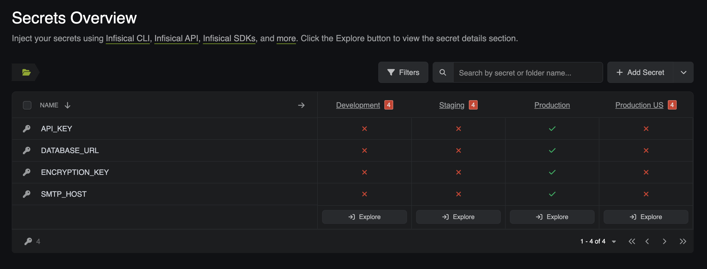
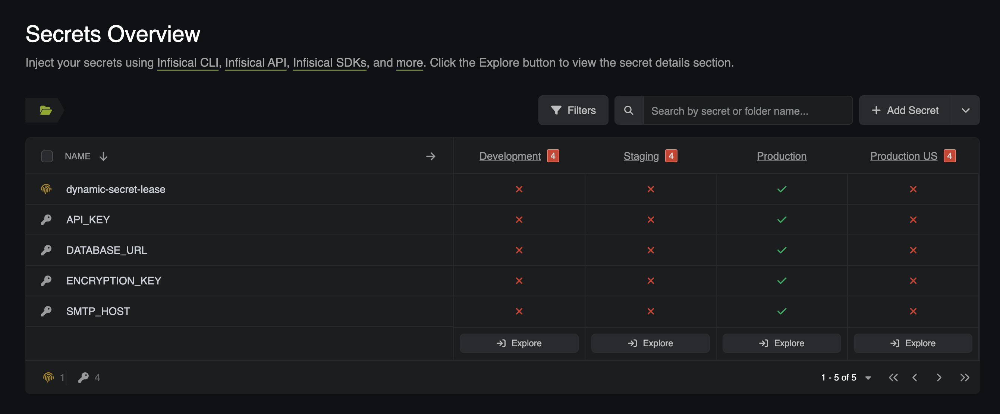
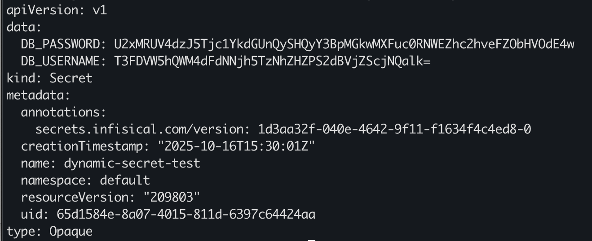

Infisical's Kubernetes Operator provides a seamless, secure, and automated way to synchronize secrets between your Infisical instance and your Kubernetes clusters. The Operator's three Custom Resource Definitions (CRDs) make this possible. In this guide, we provide the necessary CRDs and configurations for your kubernetes cluster, but you can customize them to fit your use-case.

In this guide, we'll walk through how to:

1. **Install the Infisical Operator on your Kubernetes clustser**.
2. **Configure Authentication using Kubernetes Service Accounts**.
3. **Use Each of the three CRDs**.
        - **InfisicalSecret** [Sync secrets from Infisical to Kubernetes]
        - **InfisicalPushSecret** [Sync secrets from Kubernetes to Infisical]
        - **InfisicalDynamicSecret** [Manage Dynamic Secrets and automatically create time-bound leases]

## Prerequisites

Before we begin, make sure your environment is ready
1. Installed tools
    - [helm](https://helm.sh/docs/intro/install/), [git](https://git-scm.com/downloads), [kubectl](https://kubernetes.io/docs/tasks/tools/)
2. Kubernetes Cluster
    - Ensure you have access to a running cluster and connect with kubectl
3. PostgreSQL Cluster (for InfisicalDynamicSecret)
    - Ensure you have a running database that you have access to
4. Clone [infisical-guides-source-code](https://github.com/Infisical/infisical-guides-source-code) repository
5. Access to an Infisical instance (cloud or self-hosted)


<Steps titleSize="h2">

  <Step title="Install the Infisical Operator">

The [Infisical Operator](https://infisical.com/docs/integrations/platforms/kubernetes/overview) runs inside your cluster and is responsible for handling secret synchronization events.

```console
helm repo add infisical-helm-charts 'https://dl.cloudsmith.io/public/infisical/helm-charts/helm/charts/'
helm repo update
helm install infisical-operator infisical-helm-charts/secrets-operator
```

Verify the operator pod is running:

```console
kubectl get pods -n default
```
  </Step>
  <Step title="Create a Machine Identity and Set Up a Project">

The operator uses a [Machine Identity](https://infisical.com/docs/documentation/platform/identities/machine-identities) to authenticate with Infisical thorugh the Kubernetes Auth Method
1. Login to [Infisical](https://app.infisical.com/)
2. Select **Organization Access** from the left navigational pane
3. Create an Identity and give it a name and a role
4. Once the Machine Identity is created, copy the **Identity ID** (will be used later)
5. Select the created Machine Identity, and add a [Kubernetes Authentication Method](https://infisical.com/docs/documentation/platform/identities/kubernetes-auth). Use these configurations:
    - **Allowed Service Account Names**: infisical-service-account, default
    - **Allowed Namespaces**: default
    - **Kubernetes Host URL** can be found by running ```kubectl cluster-info```
    - **Token Reviewer JWT / CA Certificate**: We will be generating these two later and adding them in later, leave it blank for now
6. Once the Machine Identity has been created, navigate back to **Overview**
7. Now select **Add New Project**
    - Add a **Project Name**, and select **Secrets Management** as the product type
    - Add a description (Optional). 
8. Once the Project is created, navigate into the Project to **Add Secrets**. You can add any key-value pair for this example, however if you want to use the InfisicalSecret CRD example provided in this demo, use the following configurations:
    - **Key**: SMTP_HOST
    - **Value**: smtp@gmail.com
    - **Tags**: N/A (Not needed for this demonstration)
    - **Environments**: Production
9. Now lets navigate to the **Project Access** tab on the left hand navigation pane. 
    - Add the machine identity we created, and give it Admin permissions (just for demonstration purposes)


  </Step>
  <Step title="Set Up RBAC, Service Accounts, and Create Tokens">

Now we will be interacting with the local repository you cloned earlier. Make sure you are in the directory that contains the yaml configurations. Assuming you are in your root user directory: 

```console 
cd infisical-guides-source-code
```

1. Create the ```infisical-token-reviewer``` service account. This Manifest creates a **service account** that the Infisical Operator uses to authenticate with Kubernetes for token reviews. It allows Infisical to validate Kubernetes tokens securely during the Machine Identity authentication process. 
```console 
kubectl apply -f infisical-reviewer-service-account.yaml
```
2. Create the token for the reviewer service account. This Yaml defines a **service account token secret** linked to the reviewer account created above. It generates a JWT token that Infisical uses for the Kubernetes Auth Method in your Machine Identity configuration.
```console 
kubectl apply -f service-account-reviewer-token.yaml
```
3. This file binds the ```infisical-token-reviewer``` service account to the built-in ```system:auth-delegator``` ClusterRole. That role allows the service account to perform **token review** and **authentication delegation** requests on behalf of other service accounts - a key part of Kubernetes-based identity verification. Without this binding, the Infisical Operator wouldn't have permission to validate tokens. 
```console 
kubectl apply -f cluster-role-binding.yaml
```
4. Create the service account that will be used by the InfisicalSecret. This file creates a **dedicated service account** ```infisical-service-account``` that the Infisical Operator uses to access and sync secrets within your cluster. It operates as the Operator's working identity in your cluster, separate from the token reviewer. 
```console 
kubectl apply -f infisical-service-account.yaml
```
5. Create the token for the Infisical service account. This manifest defines a **token secret** for the ```infisical-service-account```. It allows the Infisical operator to authenticate against Infisical's API when syncing secrets. The token will then be manually patched and associated with the servicea ccount to make sure Kubernetes mains it persistently. 
```console 
kubectl apply -f infisical-service-account-token.yaml
```
6. Apply the patch to manually associate the token secret
```console 
kubectl patch serviceaccount infisical-service-account -p '{"secrets": [{"name": "infisical-service-account-token"}]}' \ -n default
```
7. Create the **JWT Token** and **Certificate** and add it to the **Machine Identity** we created under **Kubernetes Auth**. For the generated CA, navigate to the **Advanced** tab to paste the certificate:
- JWT Command
```console 
kubectl get secret infisical-token-reviewer-token -n default -o jsonpath='{.data.token}' | base64 -d
```

- CA Command
```console 
kubectl get secret infisical-token-reviewer-token -n default -o jsonpath='{.data.ca\.crt}' | base64 -d
```
  </Step>
  <Step title="Verify Service Accounts and Tokens">

1. Check to see if the service accounts were created

```console 
kubectl get serviceaccount -n default | grep infisical
```

2. Verify the tokens were created and linked

```console
kubectl get secrets -n default | grep infisical
```
  </Step>
  <Step title="Create the InfisicalSecret CRD">

The [InfisicalSecret](https://infisical.com/docs/integrations/platforms/kubernetes/infisical-secret-crd) CRD tells the oeprator the sync secrets from Infisical to Kubernetes. By referencing your ```identityID```, ```projectSlug```, and ```envSlug```, this CRD tells the Infisical Operator whic Infisical secrets to fetch and how to format them into a Kubernetes Secret. Make sure to edit the provided CRD to match your specific Machine Identity ID, Project ID, and which environment your secrets are being pulled from (default is prod).
    - **Project Slug**: Can be found when you select your project and navigate to settings
    - **Identity ID**: Can be found when you select your machine identity from your organization's access control

1. After editing the ```example-infisical-secret-crd.yaml``` to contain your demo-specific values, apply the yaml in your cluster
```console
kubectl apply -f example-infisical-secret-crd.yaml
```
2. Restart the deployment to pick up all of the changes
```console
kubectl rollout restart deployment infisical-opera-controller-manager -n default
```
3. Check the pods after 15-20 seconds to make sure they spin up and are healthy
```console
kubectl get pods -n default
```
  </Step>
  <Step title="Verify the InfisicalSecret Status">

1. Check that the ```InfisicalSecret``` was created successfully
```console
kubectl get infisicalsecret -n default
```
2. Check that the operator created the ```managed-secret```
```console
kubectl get secret managed-secret -n default
```
3. View the secret contents (base64 encoded)
```console
kubectl get secret managed-secret -n default -o jsonpath='{.data}' | jq
```
  </Step>
  <Step title="Deploy the Application">
 
1. Deploy the nginx demo deployment that will use the managed secret. 
```console
kubectl apply -f demo-deployment.yaml
```
2. Wait 15-20 seconds and then verify the deployments
```console
kubectl get deployments
kubectl get pods -l app=nginx
```
  </Step>
  <Step title="Verify the Secret is Injected Into the Pod">

1. Check that the environment variable is in the running pod. If everything was successful, at this point you should be able to see the secret populate in the kubernetes pod and have a successful **sync** from Infisical to Kubernetes.
```console 
kubectl exec -it $(kubectl get pod -l app=nginx -o jsonpath='{.items[0].metadata.name}') -- env | grep SMTP
```
  </Step>
  <Step title="Create a Kubernetes Secret to Push Up to Infisical">

Now that we have successfully synced secrets from Infisical to Kubernetes, lets explore how we can push **Kubernetes Secrets** to Infisical.

    1. Either create a **Kubernetes Secret** via yaml, or use the one in the repository.
```console
kubectl apply -f source-secret.yaml
```
    2. Verify creation of the secret 
```console
kubectl get secret push-secret-demo -n default -o yaml
```
  </Step>
  <Step title="Create the InfisicalPushSecret CRD">

The [InfisicalPushSecret](https://infisical.com/docs/integrations/platforms/kubernetes/infisical-push-secret-crd) CRD tells the operator to sync secrets from Kubernetes to Infisical. Make sure you edit the CRD to include the specific **Project Slug**, and **Identity ID**. The other values present in ```example-push-secret.yaml``` should be configured based on the previously committed yaml configurations. 

    1. Apply the InfisicalPushSecret CRD provided after making the necessary changes
```console
kubectl apply -f example-push-secret-crd.yaml
```

    2. Once your CRD has been configured, go back to your project within Infisical and check to see if your secrets have populated there. 



  </Step>
  <Step title="Create the InfisicalDynamicSecret CRD">

The [InfisicalDynamicSecret](https://infisical.com/docs/integrations/platforms/kubernetes/infisical-dynamic-secret-crd) CRD allows you to sync dynamic secrets and create leases automatically in Kubernetes as native **Kubernetes Secret** resources Any Pod, Deployment, or other Kubernetes resource can make use of dynamic secrets from Infisical just like any other Kubernetes secret. 

    1. Navigate to your Infisical **Project** and click on the dropdown next to **Add Secret**. From here you will seelct **Add Dynamic Secret**
        - Select **SQL Database** as the service you would like to connect to.
        - Make sure to select **PostegreSQL** as the service. Enter in the connection details for your database, specifically the **Host**, **Port**, **User**, **Password**, and **Database Name**.
        - For the **Secret Name**, if you want to use the same name as the one in the cloned **InfisicalDynamicSecret** CRD, use the name **dynamic-secret-lease**. Otherwise you will need to change the **dynamicSecret.secretName** config in the InfisicalDynamicSecret CRD to whatever you name the secret here.
        - In the CA (SSL) section, make sure to upload the **CA Certificate** for your database.
        - Finally, make sure you select **Prod** as the environment (we are keeping this configuration as part of the demonstration).



    2. Make sure you edit the ```dynamic-secret-crd``` with the proper machine **Identity ID**, **Project Slug**, **dynamicSecret.secretName** (same as the **Secret Name** you gave to the dynamic secret in Infisical), and managedSecretReference.secretName (name of the kubernetes secret that Infisical Operator will create/populate in the cluster).
        - If you want to keep the **managedSecretReference.secretName** then you can leave it as **dynamic-secret-test**

    3.  Once the changes have been saved, apply the yaml:

    ```console
    kubectl apply -f dynamic-secret-crd.yaml
    ```

    4. After applying the CRD, you sohuld notive that the dynamic secret lease has been created and synced with your cluster. Verify by running:

```console
kubectl get secret dynamic-secret-test -n default -o yaml
```

    5. Once the dynamic secret lease has been created, you should see that the secret has data that contains the lease credentials.


  </Step>
</Steps>
### Congratulations! You sucessfully synced secrets with Kubernetes.