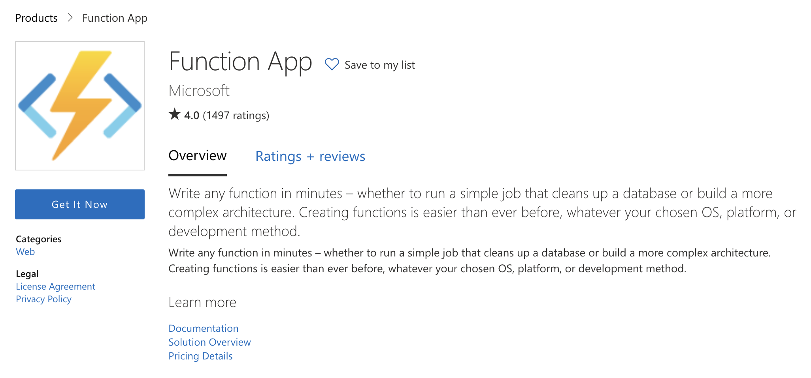
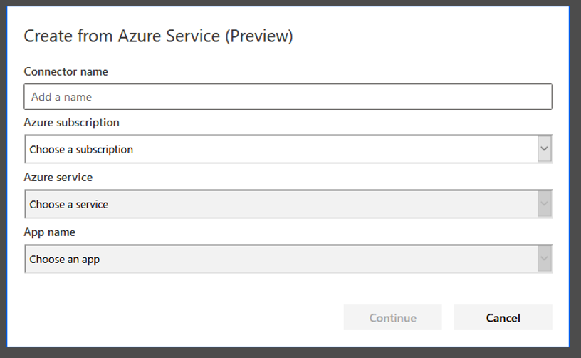

In recent years, there has been a shift towards so-called low-code and no-code platforms. These platforms are particularly appealing to businesses without internal development capabilities, yet teams often discover that some coding is necessary to fully satisfy their business needs.

Low-code platforms have become increasingly sophisticated and useful, leading to a rise in their adoption by businesses. A prime example is Microsoft Power Apps, which offers a range of data sources and service integrations right out of the box. However, even with advanced tools, you might not always find a ready-made solution for every challenge. This means that low-code doesn't equate to no-code, as some coding and customization are still required to cater to specific needs.

Consider the need for data integrations where an HTTP-based call to a web service might be necessary, typically requiring authentication through an API key or another type of secret.

Importantly, it's crucial to avoid hardcoding these secrets, as they would then be accessible to anyone with collaboration rights to the code. This underscores the importance of using a secret management solution like Infisical.

In this article, we'll demonstrate how to retrieve app secrets from Infisical for use in a Power Apps application. We'll create a simple application with a dedicated data connector to illustrate the ease of integrating Infisical with Power Apps. This tutorial assumes some prior programming experience in C#.

Prerequisites: 
- Created Microsoft Power App.

<Steps>
    <Step title="Integrate an Azure Function Call">
        First, let’s create a new Azure Function using the Azure Management Portal. Get the [Function App](https://azuremarketplace.microsoft.com/en-us/marketplace/apps/Microsoft.FunctionApp?tab=Overview) from the [Azure Marketplace](https://azuremarketplace.microsoft.com/en-us/).
        

        Place it in a subscription using any resource group. The name of the function is arbitrary. We&apos;ll use .NET as a runtime stack, but you can use whatever you&apos;re most comfortable with. The OS choice is also up to you. While Linux may look like a lightweight solution, Windows actually has more Azure Functions support. For instance, you cannot edit a Linux-based Azure Function within the Azure management portal.
    
        By using a consumption plan, we&apos;ll only pay for the resources we use when they are requested. This is the classic “serverless” approach, where you do not pay for running servers, only for interactivity.

        Once the new Azure Functions instance is ready, we add a function. In this case, we can do that already from the Azure Management Portal. Use the “HTTP trigger” template and choose the “function” authorization level.

        The code for the first function can be as simple as:

        ```
        using System.Net;

        public static async Task<HttpResponseMessage> Run(HttpRequestMessage req, TraceWriter log)
        {
            log.Info("C# HTTP trigger function processed a request.");
            return req.CreateResponse(HttpStatusCode.OK, "Hello World");
        }
        ```

        <Note>
            The code above is written for the older runtime. As a result, you may need to change the runtime version to 1 for the Azure Power Apps integration to work. If we start at a newer version (for example, 3) this triggers a warning before the migration.
        </Note>

        Finally, we also need to publish the Swagger (or API) definitions and enable cross-origin resource sharing (CORS). While the API definitions are rather easy to set up, the correct CORS value may be tricky. For now, we can use the wildcard option to allow all hosts.

    </Step>
    <Step title="Create Custom Connector">

        Once we set all this up, it’s time to create the custom connector.

        You can create the custom connector via the data pane. When we use “Create from Azure Service (Preview)”, this yields a dialog similar to the following:

        

        We can now fill out the fields using the information for our created function. The combination boxes are automatically filled in order. Once we select one of the reachable subscriptions (tied to the same account we’ve used to log in to create a Power App), the available services are displayed. Once we select our Azure Functions service, we select the function for retrieving the secret.

    </Step>
    <Step title="Set Up Infisical in an Azure Function">

        You can add Infisical in an Azure Function quite easily using the [Infisical SDK for .NET](https://infisical.com/docs/sdks/languages/csharp) (or other languages). This enables the function to communicate with Infisical to obtain secrets, among other things.

        In short, we can simply bring all the necessary classes over and start using the Client class. Essentially, this enables us to write code like this:

        ```
        var settings = new ClientSettings
        {
            ClientId = "CLIENT_ID",
            ClientSecret = "CLIENT_SECRET",
            // SiteUrl = "http://localhost:8080", <-- This line can be omitted if you're using Infisical Cloud.
        };
        var infisical = new InfisicalClient(settings);

        var options = new GetSecretOptions
        {
            SecretName = "TEST",
            ProjectId = "PROJECT_ID",
            Environment = "dev",
        };
        var secret = infisical.GetSecret(options);
        ```

        Knowing the URL of Infisical as well as the Client Id and Client Secret, we can now access the desired values.

        Now it’s time to actually use the secret within a Power App. There are two ways to request a desired target service with a secret retrieved from the function:

        1. Call the function first, retrieve the secret, then call the target service, for example, via another custom connector with the secret as input.

        2. Perform the final API request within the function call — not returning a secret at all, just the response from invoking the target service.

        While the first option is more flexible (and presumably cheaper!), the second option is definitely easier. In the end, you should mostly decide based on whether the function should be reused for other purposes. If the single Power App is the only consumer of the function, it may make more sense to go with the second option. Otherwise, you should use the first option.

        For our simple example, we don’t need to reuse the function. We also don’t want the additional complexity of maintaining two different custom connectors, where we only use one to pass data to the other one.

        Based on the previous snippet, we create the following code (for proxying a GET request from an API accessible via the URL specified in the apiEndpoint variable).

        ```
        using (var client = new HttpClient())
        {
            client.DefaultRequestHeaders
                .Accept
                .Add(new MediaTypeWithQualityHeaderValue("application/json"));

            client.DefaultRequestHeaders.Add("X-API-KEY", secret);

            var result = await client.GetAsync(apiEndpoint);
            var resultContent = await result.Content.ReadAsStringAsync();
            req.CreateResponse(HttpStatusCode.OK, resultContent);
        }
        ```
        This creates a request to the resource protected by an API key that is retrieved from Infisical.

    </Step>
</Steps>