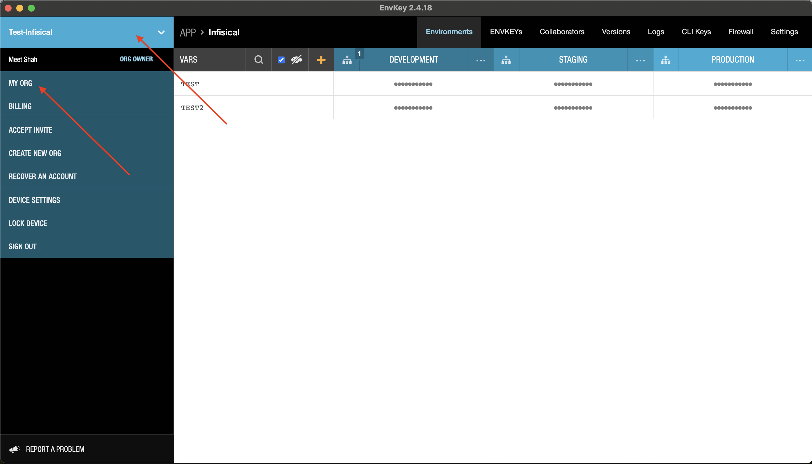
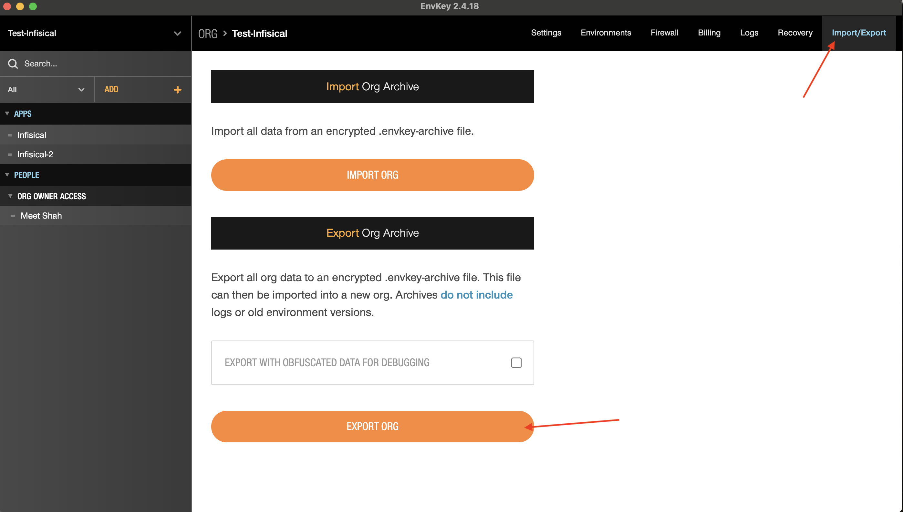
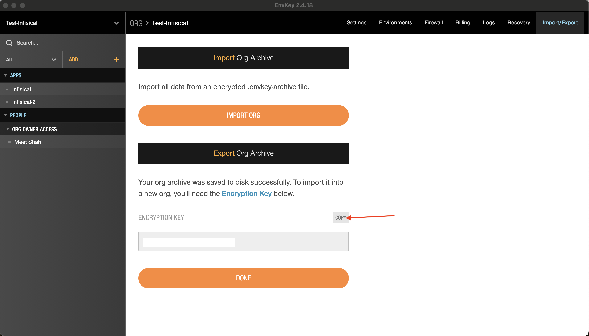
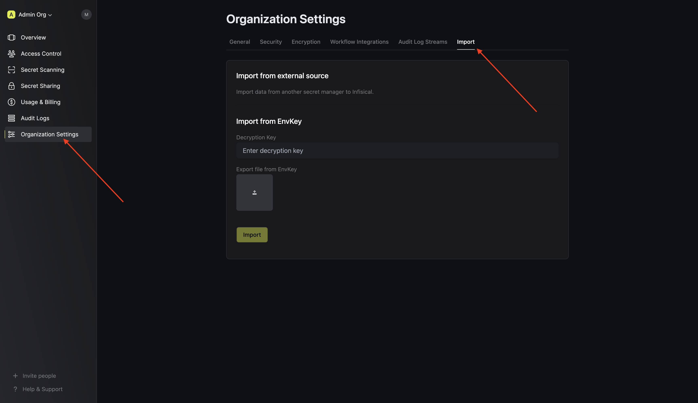
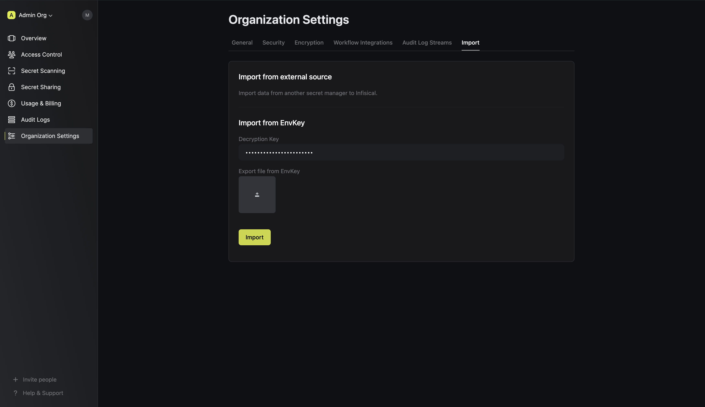

## What is Infisical? 

[Infisical](https://infisical.com) is an open-source all-in-one secret management platform that helps developers manage secrets (e.g., API-keys, DB access tokens, [certificates](https://infisical.com/docs/documentation/platform/pki/overview)) across their infrastructure. In addition, Infisical provides [secret sharing](https://infisical.com/docs/documentation/platform/secret-sharing) functionality, ability to [prevent secret leaks](https://infisical.com/docs/cli/scanning-overview), and more.

Infisical is used by 10,000+ organizations across all industries including First American Financial Corporation, Delivery Hero, and [Hugging Face](https://infisical.com/customers/hugging-face).

## Migrating from EnvKey

<Steps>
<Step>
Open the EnvKey dashboard and go to My Org.

</Step>
<Step>
Go to Import/Export on the top right corner, Click on Export Org and save the exported file.

</Step>
<Step>
Click on copy to copy the encryption key and save it.

</Step>
<Step>
Open the Infisical dashboard and go to Organization Settings > Import.

</Step>
<Step>
Upload the exported file from EnvKey, paste the encryption key and click Import.

</Step>
</Steps>

## Talk to our team

To make the migration process even more seamless, you can [schedule a meeting with our team](https://infisical.cal.com/vlad/migration-from-envkey-to-infisical) to learn more about how Infisical compares to EnvKey and discuss unique needs of your organization. You are also welcome to email us at [support@infisical.com](mailto:support@infisical.com) to ask any questions or get any technical help.
