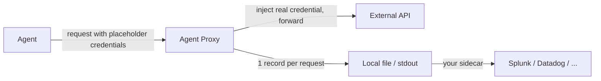

Every time the agent proxy handles a request, it writes one record of what happened to stdout or a local file. You manage and ship these records yourself, so Infisical never ingests or stores them. This is separate from the proxy's own operational logging.

The model is the same as HashiCorp Vault: the proxy produces a clean stream of activity locally, and shipping it is yours to own. Point a sidecar (Fluent Bit, Logstash, the OpenTelemetry Collector) at the stream to forward it to Splunk, Datadog, Elastic, or anywhere else.



<Note>
  Only requests that reach the forwarding stage are recorded, i.e. after the agent has been authenticated. Anything rejected before that appears only in the proxy's operational logs, not here.
</Note>

## What's in a record

Each record captures the request line, the scoped folder, the matched service, the credentials that were applied, and the outcome. The `json` format uses these field names (the `pretty` format renders the same data as a columnar line):

| Field | Meaning |
| --- | --- |
| `@timestamp` | When the proxy handled the request (UTC) |
| `http.request.method` / `http.response.status_code` | The method, and the resulting status: upstream status on `brokered` / `passthrough`, `403` on `blocked`, `502` on `error` |
| `server.address` / `server.port` | The upstream host and port |
| `url.path` | The request path, before substitution (so it shows the placeholder, never a real secret) |
| `user.id` / `user.name` | The agent that made the request, read from its access token |
| `infisical.decision` | `brokered`, `passthrough`, `blocked`, or `error` (see below) |
| `infisical.project.id` / `infisical.environment` / `infisical.secret_path` | The folder the request was scoped to |
| `infisical.service.id` / `infisical.service.name` | The matched proxied service, or omitted when none matched |
| `infisical.credentials` | What was injected: each entry's secret key (or, for a dynamic secret, its name and output field), and the header or surfaces it landed in |

Records also carry standard ECS `event.*` fields (`event.action`, `event.outcome`) and `infisical.schema_version`.

| `decision` | Meaning |
| --- | --- |
| `brokered` | A service matched and its credentials were injected |
| `passthrough` | No service matched; the request was forwarded untouched (`--unmatched-host=allow`) |
| `blocked` | No service matched; the request was rejected with `403` (`--unmatched-host=block`) |
| `error` | The proxy could not complete the call (upstream unreachable, substitution failure); `502` |

<Warning>
  A record never contains a real secret. The proxy logs the request as the agent sent it, before the real value is swapped in, so `path` only ever shows the placeholder. The `credentials` list records secret **key names** and where they were applied, never values, and header values and request bodies are never logged.
</Warning>

## Formats

Set the format with [`--activity-log-format`](/cli/commands/agent-proxy). It defaults to `pretty` on a terminal and `json` otherwise.

<Tabs>
  <Tab title="json (machine)">
    Newline-delimited JSON, one object per line. Fields follow [Elastic Common Schema](https://www.elastic.co/guide/en/ecs/current/index.html) with [OpenTelemetry semantic-convention](https://opentelemetry.io/docs/specs/semconv/) names (`http.request.method`, `server.address`, `url.path`, `user.id`, ...), with everything Infisical-specific under a namespaced `infisical.*` object. This drops into an OpenTelemetry or Elastic pipeline (or the OTel Collector's `filelog` receiver) with no field mapping.

    ```json
    {"@timestamp":"2026-07-14T14:32:07.421Z","event":{"kind":"event","category":["network"],"action":"agent-proxy.request","outcome":"success","dataset":"infisical.agent_proxy"},"http":{"request":{"method":"POST"},"response":{"status_code":200}},"url":{"path":"/v1/accounts/placeholder_acme_account/orders"},"server":{"address":"api.acme.com","port":443},"user":{"id":"9c1e40cf-...","name":"claude-agent"},"infisical":{"schema_version":1,"decision":"brokered","project":{"id":"53c8b330-..."},"environment":"prod","secret_path":"/ai-agents","service":{"id":"ac21f4de-...","name":"acme-api"},"credentials":[{"key":"ACME_API_KEY","role":"header-rewrite","header":"Authorization"}]}}
    ```
  </Tab>
  <Tab title="pretty (human)">
    A compact, columnar line, colorized by decision on a terminal and plain when piped. Handy for watching activity live.

    ```text
    14:32:07  brokered     claude-agent  53c8b330../prod:/ai-agents  acme-api    POST  api.acme.com/v1/accounts/placeholder_acme_account/orders  200  header:ACME_API_KEY
    14:32:10  passthrough  claude-agent  53c8b330../prod:/ai-agents  -           GET   registry.npmjs.org/react                                  200
    14:32:11  blocked      claude-agent  53c8b330../prod:/ai-agents  -           GET   evil.example.com/                                         403
    14:32:15  error        claude-agent  53c8b330../prod:/ai-agents  github-api  GET   api.github.com/user                                       502  header:GITHUB_TOKEN
    ```
  </Tab>
</Tabs>

The `credentials` column uses a shorthand: `header:KEY` for a header rewrite and `surfaces:KEY` for a substitution (for example `path,query:ACME_ACCOUNT`). A dynamic secret shows as `name/field` in place of the key (for example `header:my-postgres-creds/DB_PASSWORD`).

## Choosing what to log

Use [`--activity-log-filter`](/cli/commands/agent-proxy) to control the volume:

| Filter | Logs |
| --- | --- |
| `all` (default) | Every decision, including `passthrough` |
| `brokered` | `brokered`, `blocked`, and `error` (drops `passthrough` noise) |
| `errors` | `blocked` and `error` only |

Set [`--activity-log=false`](/cli/commands/agent-proxy) to turn logging off entirely.

## Shipping and rotation

Activity records go to **stdout**; the proxy's operational logs go to **stderr**. This keeps the two cleanly separable:

```bash
# Records to a file, operational logs still on the terminal
infisical secrets agent-proxy start > activity.log
```

<Tabs>
  <Tab title="Containers">
    Log to stdout (the default) and let your platform collect and rotate it. `kubectl logs`, the Docker json-file driver, and journald all pick it up, and a Fluent Bit or OTel Collector sidecar can tail and forward it. Our [Fluent Bit audit-log streaming guide](/documentation/platform/audit-log-streams/audit-log-streams-with-fluentbit) applies directly.
  </Tab>
  <Tab title="A file on disk">
    Write to a file with [`--activity-log-file`](/cli/commands/agent-proxy). The proxy reopens the file on `SIGHUP`, so rotate it with any standard tool (such as `logrotate`) and send the proxy a `SIGHUP` after rotating.
  </Tab>
</Tabs>

## Next steps

<CardGroup cols={2}>
  <Card title="agent-proxy CLI reference" icon="terminal" href="/cli/commands/agent-proxy">
    Every flag for `start` and `connect`, including the `--activity-log` options.
  </Card>
  <Card title="Audit Logs" icon="scroll" href="/documentation/platform/audit-logs">
    Configuration changes to your proxied services are recorded in Infisical's own audit trail.
  </Card>
</CardGroup>
