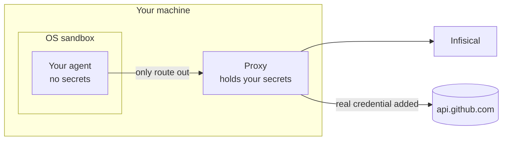

A local proxy runs an agent on your own computer. You never start a proxy: `agent-proxy run` starts one alongside your agent and stops it when the agent exits. It all happens on the one machine, with the agent sandboxed away from your credentials:

```bash
infisical secrets agent-proxy run --projectId=<project-id> --env=dev --path=/coding-agent -- claude
```

To set one up, follow the **Local proxy** tab of the [Quickstart](/documentation/platform/agent-proxy/quickstart). This page is the reference behind it: what the sandbox allows and denies, how certificates work, and every flag `run` takes.

## What you set up

Two things exist, and you already have both:

```text
   +------------------------------+          +--------------------+
   |        your computer         |          |      Infisical     |
   |                              | <------> |                    |
   |  one command:                |          |  your secret and   |
   |  agent-proxy run -- claude   |          |  proxied service   |
   +------------------------------+          +--------------------+
```

That is the entire setup. No host to provision, no machine identities to create, no service to keep running, and no proxy address to configure: you are logged in, so `run` authenticates as you, and it starts and stops its own proxy around the agent.

For agents running anywhere else it is the other way round: a [standalone proxy](/documentation/platform/agent-proxy/standalone-agent-proxy) buys a stronger boundary, but there is real infrastructure to stand up first.

## What the sandbox is for

The proxy holds real credentials, and it runs on the same machine as the agent. Something has to keep the agent away from them, and that something is an **OS-level sandbox**: the agent cannot read the proxy's files, your keyring, or your credential files, and it cannot reach the network except through the proxy.

You do not assemble any of this. `run` builds it each time you start an agent, and takes it down when the agent exits:



<Warning>
  **`run` cannot be pointed at a proxy running elsewhere.** It always starts its own, so `--proxy` is rejected with an error rather than silently ignored. To route an agent through a proxy on another host, see [Standalone Agent Proxy](/documentation/platform/agent-proxy/standalone-agent-proxy).
</Warning>

## Before you begin

- The [Infisical CLI](/cli/overview) installed, and `infisical login` completed.
- At least one [proxied service](/documentation/platform/agent-proxy/proxied-services) in the folder you point `run` at. Brokering only happens for hosts a service matches; if you have none, everything simply passes through uncredentialed.
- macOS, or Linux with [bubblewrap](https://github.com/containers/bubblewrap) installed. The sandbox comes from the operating system, so what you install depends on which one you are on:

<Tabs>
  <Tab title="macOS">
    Nothing to install. The sandbox is part of macOS.
  </Tab>
  <Tab title="Debian / Ubuntu">
    ```bash
    sudo apt install bubblewrap
    ```
  </Tab>
  <Tab title="Fedora / RHEL">
    ```bash
    sudo dnf install bubblewrap
    ```
  </Tab>
  <Tab title="Arch">
    ```bash
    sudo pacman -S bubblewrap
    ```
  </Tab>
  <Tab title="Alpine">
    ```bash
    apk add bubblewrap
    ```
  </Tab>
</Tabs>

On a Linux distribution not listed above, look for `bubblewrap` in your package manager. It provides the `bwrap` binary that `run` calls. See [Platform support](#platform-support) for what happens where the sandbox is unavailable.

## Running an agent

Every option resolves the same way: **the flag → an environment variable → `.infisical.json` → the default.** Run it from a directory that has an `.infisical.json` (created by `infisical init`) and the project, environment, and path come from there, so most of the flags fall away:

| Option | Flag | Environment variable | `.infisical.json` |
| --- | --- | --- | --- |
| Project | `--projectId` | `INFISICAL_PROJECT_ID` | `workspaceId` |
| Environment slug | `--env` | `INFISICAL_ENVIRONMENT` | `defaultEnvironment` |
| Secret path | `--path` | `INFISICAL_SECRET_PATH` | `defaultSecretPath` |
| Instance | `--domain` | `INFISICAL_DOMAIN` | `domain` |
| Sandbox | `--sandbox` / `--no-sandbox` | `INFISICAL_AGENT_PROXY_SANDBOX` | — |

Everything after `--` is your agent's own command, run as-is. From a project directory:

```bash
infisical secrets agent-proxy run -e dev -- claude
infisical secrets agent-proxy run -e dev -- codex

# any command works: this one sends only the placeholder, and GitHub still answers as you
infisical secrets agent-proxy run -e dev -- \
  sh -c 'curl -sS https://api.github.com/user -H "Authorization: Bearer $GITHUB_TOKEN"'
```

## What a run does

1. **Resolves your identity**, from your keyring login or `--token`.
2. **Fetches your proxied services and the real secret values** into its own memory. They are never written to disk and never reach the agent.
3. **Checks the sandbox will hold on this host**, then starts the proxy and launches your agent inside it.
4. **On exit**, revokes any dynamic-secret leases, drops the cached credentials, and removes the temporary directory.

A per-run `0700` temporary directory holds the only things that touch disk:

```text
  /tmp/infisical-agent-proxy-run-XXXXXX/     mode 0700, removed on exit
  |
  |-- local-ca.pem      public CA cert, the agent's HTTP clients point here
  +-- proxy.sock        Linux only, how the isolated agent reaches the proxy

  never written anywhere:
     real secret values . your login token . the CA private key
```

## The sandbox

The sandbox is on by default, and it is what makes brokering safe when the proxy and the agent share a machine. Its restrictions are deliberate, and a few are surprising the first time, so this is the part worth reading before you use `run` for real work.

```text
                                  |
        the agent asks for ...    |    ... and gets
                                  |
   read  ./src/main.go            |  yes   reads are broadly allowed
   write ./build/output           |  yes   the working directory is writable
   write ~/.claude/history        |  yes   agent state directories are writable
   read  /usr/lib, /etc/hosts     |  yes   system paths are readable
   exec  git, node, rg            |  yes   subprocesses are allowed
   open  a pty for its TUI        |  yes   interactive agents work normally
                                  |
   read  ~/.aws/credentials       |  no    credential path
   read  ~/.infisical             |  no    your token lives here
   read  the login keychain       |  no    keychain services are blocked
   write ~/.ssh/authorized_keys   |  no    credential paths deny writes too
   use   your ssh-agent           |  no    socket variable scrubbed
   resolve api.github.com         |  no    no resolver inside
   connect 1.1.1.1:443            |  no    no route out
                                  |
   GET   https://api.github.com   |  ->    through the proxy,
                                  |        real credential applied
                                  |
                            sandbox wall
```

### Platform support

| Platform | Mechanism | Network isolation |
| --- | --- | --- |
| **macOS** | Seatbelt (`sandbox-exec`), deny-by-default profile generated per run | Enforced: outbound is permitted only to the proxy's loopback port |
| **Linux** | bubblewrap with an empty network namespace | Enforced: no network interface exists inside at all |
| **Linux**, private netns unavailable | bubblewrap sharing the host network | Advisory only, with a warning (see below) |
| **Windows** | None | `run` refuses to start unless you pass `--no-sandbox` |

On Linux, `run` checks the sandbox before starting your agent. If the private network is unavailable but the rest of the sandbox works, it falls back to shared networking and warns you. If the sandbox cannot start at all (unprivileged user namespaces restricted, as on stock Ubuntu 24.04), it stops and tells you how to fix the host rather than running your agent uncontained.

<Warning>
  On the shared-network fallback the agent can reach the network directly, so routing through the proxy depends on the agent honoring the proxy environment variables: a tool that ignores them is not brokered, and its traffic leaves unproxied. Everything else is unchanged, including the environment scrub, the keyring block, and the credential-path denies. Allow unprivileged user namespaces on the host to restore the enforced fence.
</Warning>

### Network: the proxy is the only way out

Under both enforced modes the agent has exactly one route to the outside, the proxy. Direct connections fail, including connections straight to an IP with no hostname involved. Only HTTP and HTTPS are brokered, so SSH cannot be: use HTTPS with a brokered token, which is how `git` and `gh` work.

**DNS is deliberately unavailable inside the sandbox.** The agent does not need a resolver: it hands the hostname to the proxy in a `CONNECT` or an absolute-URI request, and the proxy resolves it on the host, outside the sandbox. Blocking it buys two things. A tool that ignores the proxy variables fails loudly instead of quietly going direct, and DNS lookups cannot be used to smuggle data out. So `Could not resolve host` inside a sandboxed agent is expected, and it means the failing tool is not using the proxy.

Both letter cases of every proxy variable are set (`HTTP_PROXY` and `http_proxy`, and so on), because some tools read only one, and `NO_PROXY` always covers `localhost` and `127.0.0.1`.

Two consequences for local servers are worth knowing, since the fence applies to loopback as well as the internet:

- The agent **cannot reach a service running on your machine** outside the sandbox, such as a database on `127.0.0.1:5432`. Loopback bypasses the proxy by design, and the fence denies the direct connection, so it fails.
- A server the **agent** starts is reachable from your machine on macOS, but not on Linux: there the agent gets its own private network, so a dev server it launches is invisible from outside. Start long-lived local servers yourself, outside the agent.

### Filesystem: broad read, credentials denied

Reads are allowed nearly everywhere, which is what keeps agents useful. Writes are limited to the working directory, the per-run temporary directory, `/tmp`, and the state directories of the agents `run` knows about (`~/.claude`, `~/.claude.json`, `~/.codex`), so interactive sessions keep their history and settings. Any other directory an agent writes to needs `--allow-write`. Carved out of the broad read is everywhere credentials live:

```text
  $HOME
  |
  |-- code/my-project/          read + WRITE     <- your working directory
  |-- .claude/  .claude.json    read + WRITE     <- agent state
  |-- .codex/                   read + WRITE     <- agent state
  |
  |-- .infisical/               DENIED   your token, the local CA key
  |-- infisical-keyring         DENIED   file-vault credential store
  |-- .aws/    .azure/          DENIED
  |-- .ssh/    .gnupg/          DENIED
  |-- .kube/   .netrc           DENIED
  |-- .npmrc   .git-credentials DENIED
  |-- .docker/config.json       DENIED
  |-- .config/gcloud/           DENIED
  |-- .config/gh/               DENIED
  |-- .config/infisical/        DENIED
  |
  +-- everything else           read-only

  outside $HOME
  |-- /tmp                      read + WRITE
  +-- /usr, /etc, /opt, ...     read-only
```

On Linux the agent gets a private `/tmp`, so files it writes there are not visible from the rest of your machine. Have it write to your working directory instead of `/tmp` if you need to open the result yourself.

Credential paths deny **writes** as well as reads. That matters when you launch an agent from `$HOME`, where the writable-working-directory rule would otherwise let it append to `~/.ssh/authorized_keys`.

If your agent genuinely needs a denied path, re-open exactly that path instead of disabling the sandbox:

```bash
infisical secrets agent-proxy run -e dev --allow-read ~/.aws/config -- claude
```

That is precise: `~/.aws/config` becomes readable, read-only, while everything else under `~/.aws` (`credentials`, `sso/`) stays denied. `run` prints what it re-opened. `--allow-write <path>` adds a writable path, and both flags can be repeated.

<Warning>
  Re-opening `~/.infisical` would hand the agent your login token and the local CA private key, which defeats the whole design. Prefer naming a single file over a directory.
</Warning>

### Environment: scrubbed

The agent inherits your environment with the credential-shaped parts removed:

- **Anything whose name looks like a secret** is dropped: names containing `TOKEN`, `SECRET`, `PASSWORD`, `PASSWD`, `CREDENTIAL`, `API_KEY`, `APIKEY`, `PRIVATE_KEY`, or `ACCESS_KEY`. The sweep is intentionally coarse and will catch variables you wanted.
- **Infisical's own variables**, including `INFISICAL_TOKEN`, `INFISICAL_DOMAIN`, and any machine identity credentials. The agent is given no Infisical token at all, so it cannot act as you against the API.
- **Agent-socket and IPC addresses**: `SSH_AUTH_SOCK`, `SSH_AGENT_PID`, `GPG_AGENT_INFO`, `DBUS_SESSION_BUS_ADDRESS`, `DBUS_SYSTEM_BUS_ADDRESS`, `XDG_RUNTIME_DIR`. An agent socket lets a program sign and authenticate as you without ever reading a key file, which would sidestep the `~/.ssh` deny entirely.

In their place `run` sets the proxy variables, the CA trust variables, and a placeholder for each [secret-substitution](/documentation/platform/agent-proxy/proxied-services#secret-substitution) credential in the folder. Services that use a [header rewrite](/documentation/platform/agent-proxy/proxied-services#header-rewrites) need nothing in the environment; the proxy sets the header itself.

<Note>
  `run` never injects real secret values into the agent's environment, even for secrets you can read. If the agent needs a literal value, pass it yourself with `--set-env`.
</Note>

Add back what the sweep took, one variable at a time:

```bash
--pass-env ANTHROPIC_API_KEY     # let one of your real variables through
--set-env  GH_CONFIG_DIR=/tmp/gh # set a literal value in the agent
```

A placeholder wins over a variable of the same name from your own environment, and `--set-env` wins over everything, including a placeholder.

## Certificates and the macOS keychain prompt

For the proxy to apply credentials to HTTPS requests it terminates TLS, so the agent has to trust the certificates it presents. `run` uses a **self-signed local root**, generated on your machine; it never involves your organization's root CA, and the private key stays on the parent side of the sandbox. Leaf certificates are minted per hostname from it.

Tools split into two groups by how they decide what to trust:

- **Environment-variable trust** (Claude Code, Codex, `curl`, Python, Node, Deno). `run` points `SSL_CERT_FILE`, `NODE_EXTRA_CA_CERTS`, `REQUESTS_CA_BUNDLE`, `CURL_CA_BUNDLE`, `GIT_SSL_CAINFO`, and `DENO_CERT` at the local root. Nothing to do.
- **System trust** (`gh` and most Go-based tools). These ignore those variables and consult the OS trust store.

To serve the second group on macOS, `run` keeps the local root under `~/.infisical/agent-proxy` (a sandbox-denied path, so the agent cannot read the key) and adds it to your **login keychain** once. That is the one password prompt you see on the first run; later runs are silent because the root persists. It grants **certificate trust only**: keychain secret access stays blocked inside the sandbox, so your Infisical login token remains unreadable. Decline it and everything still works except natively-trusting tools, and `run` says so instead of failing.

On Linux the root is generated fresh in memory for each run and the environment variables are sufficient, so there is no trust-store step.

## Permissions: it all runs as you

`run` involves no agent identity and no `Proxy` permission check at all. Every API call is made with your own token: **`Read` on proxied services** to find them, **`Read Value` on the secrets** they reference to broker them, and **`Lease`** to mint a dynamic one. A default project member already has all three.

That is deliberate. You are running an agent as yourself, on your own machine, against secrets you could already read; a permission boundary between you and yourself would be theater. The sandbox is the security boundary here. The only question `run` asks is whether you can read the value.

[Activity records](/documentation/platform/agent-proxy/activity-logs) attribute requests to your email (or `token` when you pass `--token`), since there is no agent token to derive an identity from, and a brokered service's **last used** time is reported under your own account.

### Dynamic secrets

[Dynamic secrets](/documentation/platform/agent-proxy/proxied-services#using-dynamic-secrets) are brokered like any other credential, with one thing to know about who mints them. The proxy leases lazily on the first request that needs the credential, caches the output fields in memory, renews before expiry, and revokes on a clean exit. With `run` it mints using **your** token, so your own `Lease` permission on that dynamic secret is the gate. A dynamic credential you cannot lease is skipped up front, with a single warning in the log file naming the secret, rather than failing every request that needs it.

<Note>
  If you have read that an identity holding `Lease` on a brokered dynamic secret is a misconfiguration, that rule is about *agent* identities and does not apply here. You are the minter, so you need it. The agent still cannot mint for itself: it has no token and no route to Infisical.
</Note>

## Watching what it does

Nothing is logged unless you ask for it. Pass `--log-file` and the proxy writes a record per request to that path, which you can follow in another terminal:

```bash
infisical secrets agent-proxy run -e dev --log-file=/tmp/broker.log -- claude

# in another terminal
tail -f /tmp/broker.log
```

Every request records a decision: `brokered` (a service matched and a credential was applied), `passthrough` (no service matched, forwarded untouched), `blocked` (rejected by `--unmatched-host=block`), or `error`. Records carry the same fields as in [Activity Logs](/documentation/platform/agent-proxy/activity-logs), written in the human-readable console format.

Without `--log-file` you still see problems: warnings and errors print to your terminal, including a credential the proxy had to skip and a dropped authorization. What you lose is the per-request trail, so reach for `--log-file` when you need to see what happened on a specific request.

`passthrough` is the one decision left out by default, and it is usually the bulk of an agent's traffic, so a log stays small. `--log-level debug` adds it, which is useful when you are working out why a host is not being brokered and noisy the rest of the time.

<Note>
  A path you pass to `--log-file` is appended to on every run and never rotated for you, so rotate it with `logrotate` (`copytruncate`) if you keep one around.
</Note>

## Troubleshooting

<AccordionGroup>
  <Accordion title="Could not resolve host">
    Expected: DNS is blocked inside the sandbox on purpose. It means the tool that failed is not routing through the proxy. Check whether it reads `HTTP_PROXY` / `HTTPS_PROXY`.
  </Accordion>
  <Accordion title="Certificate errors">
    The tool is not reading the injected CA. Most honor one of the six trust variables; Go-based tools on macOS use the system trust store, which is what the one-time keychain prompt covers. If you declined that prompt, those tools fail here.
  </Accordion>
  <Accordion title="A tool refuses to start, complaining it cannot read its own config">
    For example `failed to read configuration: open ~/.config/gh/hosts.yml: operation not permitted`. The file exists but is unreadable, and many tools treat that as fatal rather than falling back to "no config". Re-opening it with `--allow-read` is usually the wrong fix, because for `gh` that file *is* the GitHub token.

    Point the tool at a throwaway config location so it never touches the denied path and picks up the placeholder from the environment instead:

    ```bash
    infisical secrets agent-proxy run -e dev --set-env GH_CONFIG_DIR=/tmp/gh-cfg -- claude
    ```

    The same pattern applies to any tool with a config-directory override.
  </Accordion>
  <Accordion title="Everything is passthrough, nothing is brokered">
    No proxied service matched the host. Check the [host pattern](/documentation/platform/agent-proxy/proxied-services#host-patterns) against the exact hostname the agent calls, that the service is enabled, and that you are pointed at the folder the service lives in.
  </Accordion>
  <Accordion title="A 401 from the upstream API">
    The credential was not applied and the request was forwarded as the agent sent it; the proxy does not block the call. Check the activity log for the decision, and that you have `Read Value` on the secret the service references.
  </Accordion>
  <Accordion title="The sandbox will not start on Linux">
    Either bubblewrap is missing (install it as shown in [Before you begin](#before-you-begin)) or unprivileged user namespaces are restricted on the host. The error says which. `run` refuses to start rather than running your agent uncontained.
  </Accordion>
  <Accordion title="A tool cannot prompt for a password">
    On Linux the agent runs in its own session, which is what stops a sandboxed process from pushing keystrokes into your terminal. Its stdin and stdout are still terminals, so TUIs behave normally, but a tool that opens `/dev/tty` directly to prompt, `sudo` for instance, cannot. Run that step yourself, outside the agent.
  </Accordion>
  <Accordion title="The agent cannot read a file it needs">
    It is probably in a denied credential path. Re-open just that file with `--allow-read <path>`. Reach for `--no-sandbox` last, not first.
  </Accordion>
</AccordionGroup>

## Turning the sandbox off

```bash
infisical secrets agent-proxy run -e dev --no-sandbox -- claude
```

Brokering still works and the environment is still scrubbed, but the agent is uncontained: it can read your keyring and credential files and reach the network directly, bypassing the proxy. `run` prints a warning saying so. This is a debugging tool, and the only option on Windows.

`INFISICAL_AGENT_PROXY_SANDBOX=0` does the same thing. Neither can be set from `.infisical.json`, deliberately, so a committed file cannot quietly disable the boundary for everyone who runs the agent.

## Next steps

<CardGroup cols={2}>
  <Card title="agent-proxy CLI reference" icon="terminal" href="/cli/commands/agent-proxy">
    Every flag for `run`, `start`, and `connect`, with examples.
  </Card>
  <Card title="Proxied Services" icon="right-left" href="/documentation/platform/agent-proxy/proxied-services">
    Host patterns, header rewrites, and secret substitution in depth.
  </Card>
</CardGroup>
