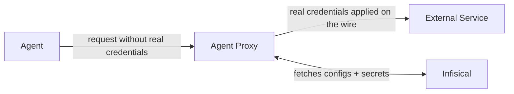

You want an AI agent to do real work: push code, file tickets, call external APIs. That work needs credentials, and the **Infisical Agent Proxy** lets the agent do all of it without ever being handed one.

It works like this: the agent makes an API call with no real credential (or a dummy placeholder, where one is expected). On its way out, the request passes through the agent proxy. The proxy attaches the real credential and forwards the request to the API. The API sees a normal authenticated call. The agent never saw the key, so there is nothing to leak.

A credential that enters an untrusted code execution environment is exposed in more ways than one:

- A prompt injection can talk the agent into sending its keys to an attacker (**credential exfiltration**).
- Anything in the agent's environment can end up in its context window, and from there in LLM provider logs and transcripts, or even training data.
- Keys leak sideways into shell history, log files, and error reports as the agent works.
- A stolen key works from anywhere until someone notices and rotates it.

Brokered credentials sidestep all of it: they cannot be exfiltrated, logged, or memorized from inside the agent, they only work through the proxy for the services you configured, and an agent's access can be revoked centrally at any time.

<Note>
  The agent proxy is not limited to AI agents. Any untrusted code execution environment that respects an HTTP proxy can run behind it, with no code changes.
</Note>

## How It Works

1. **Keep your secrets in Infisical**, exactly as you do today. Next to them, define [proxied services](/documentation/platform/agent-proxy/proxied-services): small configs that say, for example, "requests to `api.stripe.com` get `STRIPE_API_KEY` as a Bearer token".
2. **Run the agent proxy** with one command: `infisical secrets agent-proxy start`.
3. **Launch your agent through the wrapper**: `infisical secrets agent-proxy connect -- claude`. The wrapper points the agent's traffic at the proxy and starts it. The agent has no real credentials anywhere in its environment, and no idea any of this is happening.

Now the agent calls `api.stripe.com`. The proxy adds the real `STRIPE_API_KEY` and forwards the request. Stripe sees a normal authenticated call.

## The Whole Platform Comes With It

Standalone credential proxies manage their own keys, users, and permissions in isolation, so you end up running a second secrets manager just for your agents. The agent proxy is different: brokered credentials are ordinary Infisical secrets, so everything the platform does applies to them with zero extra setup.

<CardGroup cols={2}>
  <Card title="Secret Rotation" icon="rotate" href="/documentation/platform/secret-rotation/overview">
    Rotate brokered credentials on a schedule. The proxy applies the new value within a minute, with no agent restart and no agent awareness.
  </Card>
  <Card title="Dynamic Secrets" icon="bolt" href="/documentation/platform/dynamic-secrets/overview">
    Generate short-lived, per-use credentials on demand for databases, clouds, Kubernetes, and more, so there is no long-lived key to steal in the first place.
  </Card>
  <Card title="Approval Workflows" icon="check-double" href="/documentation/platform/pr-workflows">
    Require a review before a brokered credential changes, exactly like a code change.
  </Card>
  <Card title="Audit Logs" icon="scroll" href="/documentation/platform/audit-logs">
    Every create, update, and delete of a proxied service is logged with who did it and which secrets it references.
  </Card>
  <Card title="Access Controls" icon="user-lock" href="/documentation/platform/access-controls/role-based-access-controls">
    Scope each agent identity to exactly the environments, paths, and services it should reach.
  </Card>
  <Card title="Versioning & Recovery" icon="clock-rotate-left" href="/documentation/platform/secret-versioning">
    Every brokered credential keeps its full version history, with point-in-time recovery.
  </Card>
</CardGroup>

## What You Work With

<Tabs>
  <Tab title="Proxied Service" icon="right-left">
    A small config that lives in a folder next to your secrets. It says which hosts it covers, which secrets to use, and how to apply them (set a header, or swap a placeholder). You manage it in the secrets dashboard like any other resource.
  </Tab>
  <Tab title="Agent Proxy" icon="server">
    An HTTP(S) forward proxy built into the Infisical CLI (`infisical secrets agent-proxy start`). It runs in your private network, close to your agents, and applies credentials to their outbound traffic. It authenticates to Infisical with its own machine identity, which needs read access to the referenced secrets. A single agent proxy can serve many agents at once while keeping them isolated from each other.
  </Tab>
  <Tab title="Agent" icon="robot">
    Any program that respects an HTTP proxy: Claude Code, Codex, OpenClaw, or any other untrusted code execution environment. Each agent authenticates with its own machine identity and is launched through `infisical secrets agent-proxy connect`, which sets up the proxy routing and trust environment before starting the agent process.
  </Tab>
</Tabs>

<Warning>
  The Agent Proxy is distinct from other similarly named Infisical components: the [Infisical Agent](/integrations/platforms/infisical-agent) is a daemon that fetches secrets to disk for applications, the [Infisical Proxy](/integrations/platforms/infisical-proxy) is a caching proxy for the Infisical API itself, and [Gateways](/documentation/platform/gateways/overview) let Infisical reach into private networks. Those all deliver secrets or connectivity to software you trust. The Agent Proxy does the opposite: it exists so that software you do not trust never receives a secret at all.
</Warning>

## Next Steps

<CardGroup cols={3}>
  <Card title="Quickstart" icon="rocket" href="/documentation/platform/agent-proxy/quickstart">
    Broker your first credential to an agent in a few minutes.
  </Card>
  <Card title="Proxied Services" icon="right-left" href="/documentation/platform/agent-proxy/proxied-services">
    Host patterns, header rewriting, and credential substitution.
  </Card>
  <Card title="Security & Architecture" icon="shield-halved" href="/documentation/platform/agent-proxy/security">
    Agent authentication, isolation, certificates, and high availability.
  </Card>
</CardGroup>
