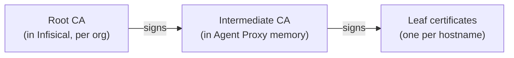

<Info>
  The Agent Proxy is a paid feature on Infisical Cloud (contact [sales@infisical.com](mailto:sales@infisical.com) to enable it) and is enabled by default on self-hosted Infisical.
</Info>

This page covers how the Agent Proxy works under the hood: how agents stay isolated from each other and from real credentials, how requests are authenticated and authorized, how agents connect and route traffic, what access each identity needs, how TLS interception works, and how to deploy and scale it. None of this is required to get started (see the [Quickstart](/documentation/platform/agent-proxy/quickstart)), but it is worth reading before running the Agent Proxy in production.

## Isolation model

The Agent Proxy is pinned to one organization, the one its own [machine identity](/documentation/platform/identities/machine-identities) belongs to, but nothing narrower: no project, environment, path, or services are configured on it. It discovers those per agent. When an agent connects, the Agent Proxy uses the agent's token to look up which proxied services that agent may use in the agent's folder scope. It then fetches the real secret values with its own machine identity. One Agent Proxy instance can serve many agents across projects and environments in the org while keeping them isolated: an agent can never receive credentials it was not granted **Proxy** access to, even on a shared instance.

## Network placement

The Agent Proxy is built for private-network deployment. A well-placed one looks like this:

- **Inside your private network, off the public internet.** The Agent Proxy's listening port should only ever be reachable from within your network.
- **Reachable only by your agent machines.** Restrict inbound access to the Agent Proxy's port to the hosts that run agents, using your usual controls (security groups, firewall rules, network policies).
- **On its own host.** Same network as the agents for low per-request latency, but a separate machine, which keeps the real credentials fully isolated from the agents.
- **Alongside any plain-HTTP upstreams.** Internal services the Agent Proxy reaches over plain HTTP belong inside the same trusted network.
- **Credentials where they are used.** Provision the Agent Proxy identity's client credentials only on its host, and each agent identity's only on its agent machine.

Outbound, the Agent Proxy only needs to reach your Infisical instance and the APIs your proxied services define.

## Deployment

The Agent Proxy is a single long-running process started with `infisical secrets agent-proxy start`. However you run it, provide the Agent Proxy identity's credentials, publish port `17322` to your agent machines only, and set `INFISICAL_DOMAIN` for EU Cloud or self-hosted.

<Tabs>
  <Tab title="CLI (systemd, VM)">
    Install the [CLI](/cli/overview) on the host and run `start` under a process supervisor so it restarts on failure:

    ```bash
    export INFISICAL_UNIVERSAL_AUTH_CLIENT_ID=<agent-proxy-client-id>
    export INFISICAL_UNIVERSAL_AUTH_CLIENT_SECRET=<agent-proxy-client-secret>
    # export INFISICAL_DOMAIN=https://eu.infisical.com   # EU Cloud or self-hosted

    infisical secrets agent-proxy start
    ```
  </Tab>
  <Tab title="Docker">
    The CLI ships as the `infisical/cli` image. Pass credentials as environment variables and publish the port:

    ```bash
    docker run -p 17322:17322 \
      -e INFISICAL_UNIVERSAL_AUTH_CLIENT_ID=<agent-proxy-client-id> \
      -e INFISICAL_UNIVERSAL_AUTH_CLIENT_SECRET=<agent-proxy-client-secret> \
      infisical/cli:latest secrets agent-proxy start
    ```

    Add `-e INFISICAL_DOMAIN=https://eu.infisical.com` for EU Cloud or a self-hosted instance.
  </Tab>
  <Tab title="PaaS (Render, Railway, Fly)">
    Deploy the `infisical/cli` image as a service:

    - **Image:** `infisical/cli:latest`
    - **Start command:** `secrets agent-proxy start`
    - **Environment:** `INFISICAL_UNIVERSAL_AUTH_CLIENT_ID`, `INFISICAL_UNIVERSAL_AUTH_CLIENT_SECRET`, and `INFISICAL_DOMAIN` if not on US Cloud
    - **Port:** `17322`, exposed on a private network your agents can reach, not the public internet

    On Render, this is a private service pointed at the image with the start command above.
  </Tab>
</Tabs>

<Note>
  Keep the Agent Proxy on a private network reachable only by your agent machines (see [Network placement](#network-placement)). To run more than one instance, see [High availability](#high-availability).
</Note>

## Agent authentication

The Agent Proxy's security boundary is machine **identity**: what an agent can reach is decided entirely by its permissions:

- Every proxied request carries the agent's short-lived machine identity token in the proxy-authentication header. A request that arrives with no proxy-authentication header is challenged with `407` and a `Proxy-Authenticate: Basic` response. A request whose token is present but invalid, expired, or revoked is rejected with `403`. Both checks happen before anything else.
- The Agent Proxy grants nothing on its own. For each agent it asks Infisical which proxied services that agent's identity holds the **Proxy** permission on, within the agent's exact project, environment, and folder scope. Credentials are applied only for those services; everything else does not exist as far as that agent is concerned.
- The agent's identity cannot read secret values. Only the Agent Proxy's own identity can, and it lives on a separate machine. Even if an agent is tricked into leaking its token, that token grants no ability to fetch a secret; it can only route traffic through the same services the agent could already reach.
- Authorization is re-checked, not granted once. The Agent Proxy re-validates each active agent's permissions on every poll and fails closed. See [Caching and polling](#caching-and-polling) for the interval and exactly what happens when a grant is revoked.

## Connections

You launch your agent through `infisical secrets agent-proxy connect -- <agent command>`, which sets up the agent's environment and then starts it. No code changes are needed: `connect` points the agent's HTTP clients at the Agent Proxy, so its normal outbound requests route through it. Each request carries the agent's Infisical token and folder scope, which is how the Agent Proxy knows which identity is asking and which of that folder's proxied services apply.

### What `connect` sets in the agent's environment

- **Proxy routing.** `HTTPS_PROXY` and `HTTP_PROXY` point at the Agent Proxy. `NO_PROXY` always includes `localhost,127.0.0.1`; add more hosts with `--no-proxy` or an existing `NO_PROXY`.
- **Certificate trust.** The standard trust variables point at the downloaded root CA so the agent's HTTP clients accept the Agent Proxy's certificates. See [Certificates & TLS interception](#certificates--tls-interception).
- **Placeholders.** A dummy value for each [secret-substitution](/documentation/platform/agent-proxy/proxied-services#secret-substitution) service, so the agent has something to send.
- **Real values (opt-in).** To give the agent a real secret directly, grant its identity **Read Value** on that secret; `connect` then injects the value into the agent's environment, like any secret the identity can read. This is for values the agent uses in its own code; for credentials it sends to an external API, broker them instead. An agent with only the `Proxy` permission gets no real values, just the routing and placeholders above. Brokered credentials are never injected here; the Agent Proxy adds them to each outbound request itself, so they reach the destination but never the agent.

### Connection behaviors

- Both HTTPS and plain-HTTP services are brokered. HTTPS traffic arrives as `CONNECT` tunnels; plain `http://` traffic arrives as regular forward-proxy requests (useful for internal services without TLS). An `https://` URL sent as a plain forward-proxy request is rejected, so the Agent Proxy can never be used to downgrade TLS.
- If the agent identity can already read a secret that one of its proxied services brokers, `connect` refuses to start: the agent would receive that value directly and bypass the Agent Proxy. Pass `--allow-readable-brokered-secrets` to override the guardrail.

### Configuration

Every option resolves from the same sources, in order: **the flag → an environment variable → `.infisical.json` → the built-in default.** An explicitly-passed flag always wins. In a container or CI where the environment variables are already set, the flags fall away and only your agent command remains: `infisical secrets agent-proxy connect -- claude`.

| Option | Flag | Environment variable | `.infisical.json` |
| --- | --- | --- | --- |
| Auth | `--client-id` / `--client-secret` | `INFISICAL_UNIVERSAL_AUTH_CLIENT_ID` / `_SECRET` | — |
| Instance | `--domain` | `INFISICAL_DOMAIN` | `domain` |
| Project | `--projectId` | `INFISICAL_PROJECT_ID` | `workspaceId` |
| Environment slug | `--env` | `INFISICAL_ENVIRONMENT` | `defaultEnvironment` |
| Secret path | `--path` | `INFISICAL_SECRET_PATH` | `defaultSecretPath` |
| Proxy address (`connect`) | `--proxy` | `INFISICAL_AGENT_PROXY_ADDRESS` | `agentProxyAddress` |

See the [CLI reference](/cli/commands/agent-proxy) for the full list, including `--port`, `--unmatched-host`, and `--poll-interval` on `start`.

## Certificates & TLS interception

For the Agent Proxy to read and modify HTTPS requests, agents must trust the certificates it presents. The chain has three tiers, and the sensitive part never leaves Infisical:



The root CA is generated automatically per organization and stored encrypted in Infisical; its private key never leaves the server, and all signing happens server-side. At startup, the Agent Proxy generates a keypair locally and has Infisical sign it into a short-lived intermediate certificate (7 days, re-signed automatically before expiry). This certificate can mint leaf certificates but no further CAs. Leaf certificates (valid 24 hours, cached in memory) are minted locally per hostname, for the exact hostname the agent requested, with no Infisical round-trip.

On the agent machine, the `connect` wrapper downloads the root CA to `~/.infisical/agent-proxy/mitm-ca.pem` and points the standard trust environment variables (`SSL_CERT_FILE`, `NODE_EXTRA_CA_CERTS`, `REQUESTS_CA_BUNDLE`, `CURL_CA_BUNDLE`, `GIT_SSL_CAINFO`, `DENO_CERT`) at it. The Agent Proxy's connection to the real service is standard HTTPS with normal certificate verification, so real credentials always travel encrypted.

## Permissions

Proxied services have their own project-level permission subject. Alongside the usual **Read**, **Create**, **Modify**, and **Remove** actions for managing services, it adds the one that defines the security model: **Proxy**. An identity with **Proxy** has a service's secrets applied to its traffic without ever being able to read the values, which is why it is the permission you grant agent machine identities.

### Roles

Grant each identity the minimum permissions it needs with a [custom role](/documentation/platform/access-controls/role-based-access-controls) or an [additional privilege](/documentation/platform/access-controls/additional-privileges), scoped to the environments and paths its services live in. This is the minimum each identity needs:

| Identity | Minimum permissions | Notes |
| --- | --- | --- |
| **Agent** | `Proxy` on **Proxied Services**, scoped to the environments and paths where its services live | This alone lets it route traffic and have credentials applied. It does not need to read any secret. |
| **Agent Proxy** | `Read Value` and `Describe Secret` on **Secrets**, covering every secret the services reference; plus `Manage Leases` on **Dynamic Secrets** for any dynamic secret a service brokers | This is the identity that actually fetches the real values and mints leases. `Describe Secret` determines whether a secret is visible to the identity at all, `Read Value` reveals its value, and `Manage Leases` lets it mint a brokered dynamic secret. It needs no proxied-service permission. |

<Note>
  An agent identity should be scoped to just the **Proxy** permission, with no secret read access. If an agent also needs real values in its environment, grant its identity **Read Value** on those specific secrets. Avoid granting folder-wide read access to an agent identity: that would also expose the brokered secrets and defeat the purpose of brokering them.
</Note>

The key thing to get right for the Agent Proxy: it needs **Read Value on every secret referenced by every service any of its agents use**, across the relevant environments and paths. If a referenced secret comes from a [secret import](/documentation/platform/agent-proxy/proxied-services#using-secrets-from-other-folders-and-environments), the read permission has to cover the secret's real location (the import source), not just the folder it is imported into. If a grant is missing, that credential is skipped.

For a service that brokers a [dynamic secret](/documentation/platform/agent-proxy/proxied-services#using-dynamic-secrets), the Agent Proxy identity needs `Manage Leases` on that dynamic secret. The agent identity must **not** have `Manage Leases` on it, or `agent-proxy connect` refuses to start.

## Caching and polling

The Agent Proxy keeps everything it needs in memory, so steady-state requests involve no Infisical calls:

- **First request from an agent**: the Agent Proxy discovers all proxied services in the agent's scope and fetches the referenced secret values, then serves every subsequent request from that agent, to any host, from cache.
- **Refresh**: every 60 seconds (configurable via `--poll-interval`), the Agent Proxy re-fetches services, permissions, and secret values for active agents. Changes such as a rotated secret or an edited service take effect within one poll interval, with no agent restart. Authorization fails closed on the same cycle. If an agent's identity, role, or Proxy grant is revoked, or its token expires, the Agent Proxy drops that agent's cached credentials on the next poll and stops applying them.
- **Eviction**: an agent idle for about 10 minutes has its cache dropped and polling stopped. Its next request triggers a fresh discovery.
- **API load**: polling grows with the number of active agents. With a large fleet or a short `--poll-interval`, factor in your instance's API rate limits; a longer interval reduces load at the cost of slower propagation.

## Unmatched hosts

When an agent requests a host no proxied service matches, the `--unmatched-host` flag decides what happens:

- `allow` (default): the request is forwarded untouched, with no credentials applied. This is the normal mode, because much of an agent's traffic does not need a brokered credential at all: reading documentation, cloning public repos, installing packages, or calling services the agent legitimately authenticates to itself. All of that flows through untouched, while matched hosts still get credentials applied.
- `block`: the request is rejected with `403`. Use this to restrict agents to an allowlist of exactly the services you have defined.

<Note>
  `block` applies to every host without a matching proxied service, including your Infisical instance itself. Since agent traffic routes through the Agent Proxy, Infisical CLI commands run from inside the agent (using the `INFISICAL_TOKEN` from its environment) will also be rejected in this mode.
</Note>

## High availability

Run multiple Agent Proxy instances with the same machine identity behind a TCP load balancer. Instances coordinate through Infisical rather than with each other:

- All instances chain to the same per-organization root CA, so agents trust any instance. Each instance signs its own intermediate.
- Each instance keeps its own agent cache. If the load balancer moves an agent to a new instance, that instance does one fresh discovery and then serves from cache.
- Each instance polls Infisical independently. After a secret rotation, instances may briefly apply different values until their next poll (up to one poll interval).
