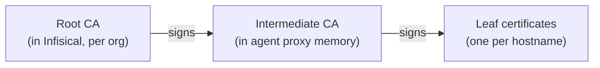

This page covers what is happening under the hood of the agent proxy: how every request is authenticated, how agents stay isolated from each other and from real credentials, how TLS interception works, and how the proxy behaves at scale. You do not need any of this to get started (see the [Quickstart](/documentation/platform/agent-proxy/quickstart)), but it is worth reading before running the proxy in production.

## Isolation Model

The proxy is pinned to one organization, the one its own machine identity belongs to, but nothing narrower: no project, environment, path, or services are configured on it. It discovers those per agent. When an agent connects, the proxy uses the agent's token to look up which proxied services that agent may use in the agent's folder scope, then fetches the real secret values with its own machine identity. This means one proxy instance can serve many agents across projects and environments in the org while keeping them isolated: an agent can never receive credentials it was not granted **Proxy** access to, even on a shared proxy.

## Network Placement

The agent proxy is built for private-network deployment. A well-placed proxy looks like this:

- **Inside your private network, off the public internet.** The proxy's listening port should only ever be reachable from within your network.
- **Reachable only by your agent machines.** Restrict inbound access to the proxy port to the hosts that run agents, using your usual controls (security groups, firewall rules, network policies).
- **On its own host.** Same network as the agents for low per-request latency, but a separate machine, which keeps the real credentials fully isolated from the agents.
- **Alongside any plain-HTTP upstreams.** Internal services the proxy reaches over plain HTTP belong inside the same trusted network.
- **Credentials where they are used.** Provision the proxy identity's client credentials only on the proxy host, and each agent identity's only on its agent machine.

Outbound, the proxy only needs to reach your Infisical instance and the APIs your proxied services define.

## Agent Authentication

The security boundary of the agent proxy is **identity**, not certificates. Certificates only make TLS interception possible; what an agent can reach is decided entirely by machine identity permissions:

- Every proxied request carries the agent's short-lived machine identity token. A request without a valid token is rejected (`407`) before anything else happens.
- The proxy grants nothing on its own. For each agent it asks Infisical which proxied services that agent's identity holds the **Proxy** permission on, within the agent's exact project, environment, and folder scope. Credentials are applied only for those services; everything else does not exist as far as that agent is concerned.
- The agent's identity cannot read secret values. Only the proxy's own identity can, and it lives on a separate machine. Even if an agent is tricked into leaking its token, that token grants no ability to fetch a secret; it can only route traffic through the same services the agent could already reach.
- Authorization is re-checked continuously. The proxy re-validates each active agent's permissions every poll interval (60 seconds by default) and fails closed: revoke the identity, its role, or its Proxy grant, and the proxy drops the cached credentials and stops applying them.

## Connections

Agents do not talk to the proxy directly; they are launched through `infisical secrets agent-proxy connect -- <agent command>`, which prepares the environment. Each proxied request carries the agent's Infisical token and folder scope in the standard proxy authorization mechanism, which is how the proxy knows which agent is asking and which folder's services apply.

A few connection-level behaviors to be aware of:

- Both HTTPS and plain-HTTP services are brokered. HTTPS traffic arrives as standard `CONNECT` tunnels; plain `http://` traffic arrives as regular forward-proxy requests (useful for internal services without TLS). Requests for `https://` URLs sent as plain forward-proxy requests are rejected so the proxy can never be used to downgrade TLS.
- `NO_PROXY` in the agent's environment always includes `localhost,127.0.0.1`, so local traffic bypasses the proxy. Additional bypass hosts can be added via the `--no-proxy` flag on `connect` or an existing `NO_PROXY` variable.
- Requests from an agent whose token has expired or been revoked fail closed: the proxy drops that agent's cached credentials as soon as it notices, and stops applying them.

## Certificates & TLS Interception

For the proxy to read and modify HTTPS requests, agents must trust the certificates it presents. This is trust plumbing rather than access control: the chain exists so the proxy can open TLS traffic that agents deliberately send it, and holding a certificate grants no access to any secret. It has three tiers, and the sensitive part never leaves Infisical:

The root CA is generated automatically per organization and stored encrypted in Infisical; its private key never leaves the server, and all signing happens server-side. At startup, the proxy generates a keypair locally and has Infisical sign it into a short-lived intermediate certificate (7 days, re-signed automatically before expiry) that can mint leaf certificates but no further CAs. Leaf certificates (valid 24 hours, cached in memory) are minted locally per hostname, for the exact hostname the agent requested, with no Infisical round-trip.

On the agent machine, the `connect` wrapper downloads the root CA to `~/.infisical/agent-proxy/mitm-ca.pem` and points the standard trust environment variables (`SSL_CERT_FILE`, `NODE_EXTRA_CA_CERTS`, `REQUESTS_CA_BUNDLE`, `CURL_CA_BUNDLE`, `GIT_SSL_CAINFO`, `DENO_CERT`) at it. The proxy's connection to the real service is standard HTTPS with normal certificate verification, so real credentials always travel encrypted.

<Note>
  Place the proxy according to the [network placement](#network-placement) guidance above; it is built for private-network deployment.
</Note>

## Permissions

Proxied services have their own project-level permission subject, so you can control who manages them and which identities can route traffic through them.

| Action | Description | Admin | Member | Viewer |
| --- | --- | --- | --- | --- |
| **Read** | View proxied services and their configuration | Yes | Yes | Yes |
| **Create** | Create new proxied services | Yes | No | No |
| **Edit** | Update a service's host patterns, secrets, or enabled state | Yes | No | No |
| **Delete** | Delete proxied services | Yes | No | No |
| **Proxy** | Route traffic through the service and have credentials applied | Yes | No | No |

The **Proxy** action is intended for agent machine identities, not humans. An identity with Proxy on a service gets the service's credentials applied to its traffic without ever being able to read the secret values.

### Built-in Roles

Two built-in project roles make setup quick. Both grant broad access across all environments and paths; create a [custom role](/documentation/platform/access-controls/role-based-access-controls) instead if you need tighter scoping.

| Role | Slug | Intended for | What it grants |
| --- | --- | --- | --- |
| **Agent** | `agent` | The agent machine identity | Proxy on all proxied services. No secret read access. |
| **Agent Proxy** | `agent-proxy` | The agent proxy machine identity | Read access to all secret values, so it can fetch the real credentials it applies. No proxied service permissions. |

<Note>
  The Agent role intentionally has no secret read access. If an agent also needs real values in its environment, grant its identity **Read Value** on those specific secrets. Avoid granting folder-wide read access to an agent identity: that would also expose the brokered secrets and defeat the purpose of brokering them.
</Note>

### Custom Roles

The built-in roles grant the right permissions but across all environments and paths. To scope tighter, build a [custom role](/documentation/platform/access-controls/role-based-access-controls) instead. This is the minimum each identity needs:

| Identity | Minimum permissions | Notes |
| --- | --- | --- |
| **Agent** | `Proxy` on **Proxied Services**, scoped to the environments and paths where its services live | This alone lets it route traffic and have credentials applied. It does not need to read any secret. Add `Read Value` on **Secrets** only for values the agent uses directly (not brokered ones). |
| **Agent Proxy** | `Read Value` and `Describe Secret` on **Secrets**, covering every secret the services reference | This is the identity that actually fetches the real values. Both actions are required: `Describe Secret` determines whether a secret is visible to the identity at all, and `Read Value` reveals its value. It needs no proxied-service permission. |

The key thing to get right for the agent proxy: it needs **Read Value on every secret referenced by every service any of its agents use**, across the relevant environments and paths. If a referenced secret comes from a [secret import](/documentation/platform/agent-proxy/proxied-services#using-secrets), the read permission has to cover the secret's real location (the import source), not just the folder it is imported into. If a grant is missing, that credential is skipped.

### How Many Machine Identities Do You Need?

A [machine identity](/documentation/platform/identities/machine-identities) is how Infisical knows who is asking and what they are allowed to access. So the number you need is not a technical limit; it follows from how you want access divided:

- **One for the agent proxy.** A single proxy identity serves any number of agents, and multiple proxy instances behind a load balancer share the same one.
- **One per distinct agent scope.** Agents that should have exactly the same access can share an identity: a fleet of interchangeable workers doing the same job is one scope, so one identity is fine. Agents that reach different services, environments, or paths each get their own.

Sharing one identity between agents that need *different* access also works, but it means granting that identity the union of everything any of them needs: each agent then carries access it does not use, a compromised agent exposes the whole union, revoking the identity cuts off every agent at once, and audit logs cannot tell the agents apart.

## Caching and Polling

The proxy keeps everything it needs in memory, so steady-state requests involve no Infisical calls:

- **First request from an agent**: the proxy discovers all proxied services in the agent's scope and fetches the referenced secret values. This first request is slightly slower; every subsequent request from that agent, to any host, is served from cache.
- **Refresh**: every 60 seconds (configurable via `--poll-interval`), the proxy re-fetches services, permissions, and secret values for active agents. Changes such as a rotated secret, an edited service, or a revoked permission take effect within one poll interval, with no agent restart.
- **Eviction**: an agent idle for about 10 minutes has its cache dropped and polling stopped. Its next request simply triggers a fresh discovery.
- **API load**: polling grows with the number of active agents. With a large fleet or a short `--poll-interval`, factor in your instance's API rate limits; a longer interval reduces load at the cost of slower propagation.

## Unmatched Hosts

When an agent requests a host no proxied service matches, the `--unmatched-host` flag decides what happens:

- `allow` (default): the request is forwarded untouched, with no credentials applied. This is the normal mode, because much of an agent's traffic does not need a brokered credential at all: reading documentation, cloning public repos, installing packages, or calling services the agent legitimately authenticates to itself (for example, with a real secret in its environment because its identity has **Read Value** on it). All of that flows through untouched, while matched hosts still get credentials applied.
- `block`: the request is rejected with `403`. Use this to restrict agents to an allowlist of exactly the services you have defined.

<Note>
  `block` applies to every host without a matching proxied service, including your Infisical instance itself. Since agent traffic routes through the proxy, Infisical CLI commands run from inside the agent (using the `INFISICAL_TOKEN` from its environment) will also be rejected in this mode.
</Note>

## High Availability

Run multiple proxy instances with the same machine identity behind a TCP load balancer. Instances coordinate through Infisical rather than with each other:

- All instances chain to the same per-organization root CA, so agents trust any instance. Each instance signs its own intermediate.
- Each instance keeps its own agent cache. If the load balancer moves an agent to a new instance, that instance does one fresh discovery and then serves from cache.
- Each instance polls Infisical independently. After a secret rotation, instances may briefly apply different values until their next poll (up to one poll interval).
