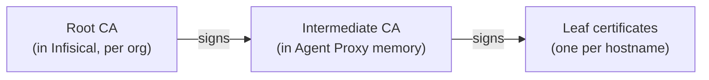

This page covers the Agent Proxy's security model: how agents stay isolated from each other and from real credentials, how requests are authenticated and authorized, how TLS interception works, and what access each identity needs. None of this is required to get started (see the [Quickstart](/documentation/platform/agent-proxy/quickstart)), but it is worth reading before running the Agent Proxy in production.

## Isolation model

The Agent Proxy is pinned to one organization, the one its own [machine identity](/documentation/platform/identities/machine-identities) belongs to, but nothing narrower: no project, environment, path, or services are configured on it. It discovers those per agent. When an agent connects, the Agent Proxy uses the agent's token to look up which proxied services that agent may use in the agent's folder scope. It then fetches the real secret values with its own machine identity. One Agent Proxy instance can serve many agents across projects and environments in the org while keeping them isolated: an agent can never receive credentials it was not granted **Proxy** access to, even on a shared instance.

## Agent authentication

The Agent Proxy's security boundary is machine **identity**: what an agent can reach is decided entirely by its permissions:

- Every proxied request carries the agent's short-lived machine identity token in the proxy-authentication header. A request that arrives with no proxy-authentication header is challenged with `407` and a `Proxy-Authenticate: Basic` response. A request whose token is present but invalid, expired, or revoked is rejected with `403`. Both checks happen before anything else.
- The Agent Proxy grants nothing on its own. For each agent it asks Infisical which proxied services that agent's identity holds the **Proxy** permission on, within the agent's exact project, environment, and folder scope. Credentials are applied only for those services; everything else does not exist as far as that agent is concerned.
- The agent's identity cannot read secret values. Only the Agent Proxy's own identity can, and it lives on a separate machine. Even if an agent is tricked into leaking its token, that token grants no ability to fetch a secret; it can only route traffic through the same services the agent could already reach.
- Authorization is re-checked, not granted once. The Agent Proxy re-validates each active agent's permissions on every poll and fails closed. See [Caching and polling](/documentation/platform/agent-proxy/deployment#caching-and-polling) for the interval and exactly what happens when a grant is revoked.

## Certificates & TLS interception

For the Agent Proxy to read and modify HTTPS requests, agents must trust the certificates it presents. The chain has three tiers, and the sensitive part never leaves Infisical:

The root CA is generated automatically per organization and stored encrypted in Infisical; its private key never leaves the server, and all signing happens server-side. At startup, the Agent Proxy generates a keypair locally and has Infisical sign it into a short-lived intermediate certificate (7 days, re-signed automatically before expiry). This certificate can mint leaf certificates but no further CAs. Leaf certificates (valid 24 hours, cached in memory) are minted locally per hostname, for the exact hostname the agent requested, with no Infisical round-trip.

On the agent machine, the `connect` wrapper downloads the root CA to `~/.infisical/agent-proxy/mitm-ca.pem` and points the standard trust environment variables (`SSL_CERT_FILE`, `NODE_EXTRA_CA_CERTS`, `REQUESTS_CA_BUNDLE`, `CURL_CA_BUNDLE`, `GIT_SSL_CAINFO`, `DENO_CERT`) at it. The Agent Proxy's connection to the real service is standard HTTPS with normal certificate verification, so real credentials always travel encrypted.

## Permissions

Proxied services have their own project-level permission subject. Alongside the usual **Read**, **Create**, **Modify**, and **Remove** actions for managing services, it adds the one that defines the security model: **Proxy**. An identity with **Proxy** has a service's secrets applied to its traffic without ever being able to read the values, which is why it is the permission you grant agent machine identities.

### Roles

Grant each identity the minimum permissions it needs with a [custom role](/documentation/platform/access-controls/role-based-access-controls) or an [additional privilege](/documentation/platform/access-controls/additional-privileges), scoped to the environments and paths its services live in. This is the minimum each identity needs:

| Identity | Minimum permissions | Notes |
| --- | --- | --- |
| **Agent** | `Proxy` on **Proxied Services**, scoped to the environments and paths where its services live | This alone lets it route traffic and have credentials applied. It does not need to read any secret. |
| **Agent Proxy** | `Read Value` and `Describe Secret` on **Secrets**, covering every secret the services reference; plus `Manage Leases` on **Dynamic Secrets** for any dynamic secret a service brokers | This is the identity that actually fetches the real values and mints leases. `Describe Secret` determines whether a secret is visible to the identity at all, `Read Value` reveals its value, and `Manage Leases` lets it mint a brokered dynamic secret. It needs no proxied-service permission. |

<Note>
  An agent identity should be scoped to just the **Proxy** permission, with no secret read access. If an agent also needs real values in its environment, grant its identity **Read Value** on those specific secrets. Avoid granting folder-wide read access to an agent identity: that would also expose the brokered secrets and defeat the purpose of brokering them.
</Note>

The key thing to get right for the Agent Proxy: it needs **Read Value on every secret referenced by every service any of its agents use**, across the relevant environments and paths. If a referenced secret comes from a [secret import](/documentation/platform/agent-proxy/proxied-services#using-secrets-from-other-folders-and-environments), the read permission has to cover the secret's real location (the import source), not just the folder it is imported into. If a grant is missing, that credential is skipped.

For a service that brokers a [dynamic secret](/documentation/platform/agent-proxy/proxied-services#using-dynamic-secrets), the Agent Proxy identity needs `Manage Leases` on that dynamic secret. The agent identity must **not** have `Manage Leases` on it, or `agent-proxy connect` refuses to start.

## Next steps

<CardGroup cols={2}>
  <Card title="Deployment" icon="server" href="/documentation/platform/agent-proxy/deployment">
    Take the Agent Proxy to production: placement, deployment methods, and HA.
  </Card>
  <Card title="Connecting Agents" icon="plug" href="/documentation/platform/agent-proxy/connecting-agents">
    Launch an agent behind the proxy and control what its environment holds.
  </Card>
</CardGroup>
