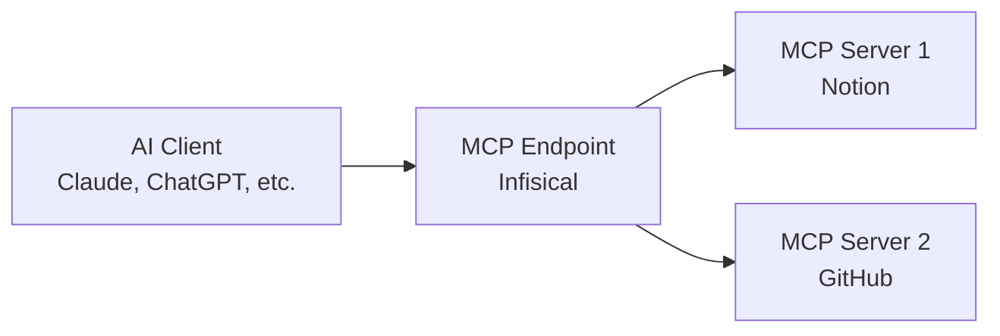

## Concept

MCP Endpoints are the entry points that AI clients (like Claude, ChatGPT, or custom agents) use to access your configured MCP Servers. Instead of connecting AI clients directly to individual MCP servers, you connect them to an Infisical MCP Endpoint which acts as a secure gateway.

This architecture provides several benefits:

<CardGroup cols={2}>
  <Card title="Federation" icon="object-group">
    Combine tools from multiple MCP servers behind a single endpoint.
  </Card>
  <Card title="Tool Selection" icon="list-check">
    Control exactly which tools are available through each endpoint.
  </Card>
  <Card title="Access Control" icon="lock">
    Manage who can use each endpoint.
  </Card>
  <Card title="Centralized Logging" icon="scroll">
    All tool invocations are logged regardless of which MCP server they target.
  </Card>
</CardGroup>

## How It Works

When you create an MCP endpoint, Infisical generates a unique URL that you can add to your AI client's MCP configuration. The AI client connects to this URL and can access all enabled tools from the connected MCP servers.

## Guide to Creating an MCP Endpoint

In the following steps, we explore how to create an MCP endpoint and connect it to an AI client.

<Tabs>
  <Tab title="Infisical UI">
    <Steps>
      <Step title="Navigate to MCP Endpoints">
        Head to your Agent Sentinel project and select **MCP Endpoints** from the sidebar, then click **Create Endpoint**.

        
      </Step>
      <Step title="Configure endpoint details">
        Enter the following details for your endpoint:

        - **Name**: A friendly name to identify this endpoint (e.g., "Engineering Team Endpoint")
        - **Description (Optional)**: A description of the endpoint's purpose
        - **Connected Servers**: A selection of the MCP servers to make available through this endpoint

        
      </Step>
      <Step title="Configure tool selection">
        After creating the endpoint, you'll be taken to the endpoint details page. Here you can configure which tools from each connected server are available through this endpoint.

        For each connected MCP server, you'll see a list of available tools. Toggle tools on or off to control what AI clients can access.

        

        <Note>
          By default, no tools are enabled. You must explicitly enable the tools you want to make available.
        </Note>
      </Step>
      <Step title="Copy the endpoint URL">
        The endpoint details page displays the **Endpoint URL**. Copy this URL—you'll need it to configure your AI client.

        
      </Step>
    </Steps>
  </Tab>
</Tabs>

## Connecting AI Clients

Once you have your endpoint URL, you can connect AI clients to it.

<Tabs>
  <Tab title="Claude">
    Add the endpoint to your Claude MCP configuration:

    1. Open Claude settings
    2. Navigate to the MCP section
    3. Add a new server with your Infisical endpoint URL
    4. Click **Connect**

    When connecting for the first time, Claude will open an authorization page where you grant access to the endpoint. You can configure:

    - **Access Duration**: How long the AI client can use the endpoint (e.g., 30 days)

    After authorization, Claude can use all enabled tools from your endpoint.
  </Tab>
  <Tab title="Other AI Clients">
    Any MCP-compatible AI client can connect to your endpoint using the endpoint URL. 
    
    The general process is:
    1. Locate the MCP server configuration in your AI client
    2. Add your Infisical endpoint URL as a new server
    3. Complete the authorization flow when prompted
    
    Refer to your AI client's documentation for specific configuration steps.
  </Tab>
</Tabs>

## Personal Credentials Authentication

When an MCP endpoint includes servers configured with **Personal Credentials** mode, users must authenticate with each of those servers before they can connect to the endpoint.

### Authentication Flow

When a user connects to an endpoint with servers requiring personal credentials:

1. **Authentication Prompt**: After authorizing access to the endpoint, users are shown a list of all MCP servers that require their personal credentials.

2. **Authenticate Each Server**: Users must authenticate with each server in the list. The authentication method depends on how the server was configured:
   - **OAuth**: Users are redirected to the service (e.g., GitHub, Notion) to authorize access
   - **Bearer Token**: Users enter their personal access token directly

3. **Re-authentication**: Users can update their credentials for servers they've already authenticated with by clicking the **Re-authenticate** button. This is useful when tokens expire or when users want to switch accounts.

4. **Complete All Authentications**: Users must authenticate with **all** servers requiring personal credentials before they can proceed. The connection will only be established once all required authentications are complete.

## Access Control with Permission Conditions

MCP endpoints support granular role-based access control through permission conditions. This allows you to restrict access to specific endpoints based on their name.

### Example Use Cases

- **Team-specific endpoints**: Create a role that only allows access to endpoints matching `engineering-*`
- **Environment separation**: Restrict production endpoints (`prod-*`) to senior team members

### Configuring Permission Conditions

When creating or editing a project role, you can add conditions to MCP endpoint permissions:

1. Navigate to **Access Control** > **Roles**
2. Edit or create a role
3. Under **MCP Endpoints** permissions, click **Add Condition**
4. Select the **Endpoint Name** property
5. Choose an operator (`equal`, `not equal`, `glob match`, or `in`)
6. Enter the value(s) to match

### Supported Operators

| Operator     | Description         | Example                        |
| ------------ | ------------------- | ------------------------------ |
| `equal`      | Exact match         | `engineering-tools`            |
| `not equal`  | Does not match      | `prod-endpoint`                |
| `glob match` | Pattern matching    | `prod-*`, `*-internal`         |
| `in`         | Matches any in list | `["endpoint-1", "endpoint-2"]` |

## FAQ

<AccordionGroup>
  <Accordion title="Can I connect the same MCP server to multiple endpoints?">
    Yes, you can connect an MCP server to as many endpoints as needed. Each endpoint can have different tools enabled, allowing you to create different access profiles.
  </Accordion>
  <Accordion title="What happens when I disable a tool?">
    When you disable a tool, AI clients connected to the endpoint will no longer be able to use it. The tool won't appear in the client's available tools list.
  </Accordion>
  <Accordion title="How long does endpoint authorization last?">
    When an AI client connects to an endpoint, the user chooses an access duration (e.g., 30 days). After this period, the client will need to re-authorize.
  </Accordion>
  <Accordion title="Can I revoke an AI client's access?">
    Yes, you can revoke access by managing authorized sessions in the endpoint settings. This immediately disconnects the AI client.
  </Accordion>
  <Accordion title="What if an MCP server requires personal credentials?">
    If a connected MCP server uses personal credentials, users will be prompted to authenticate when they first connect to the endpoint. The authentication method depends on how the server was configured:

    - **OAuth servers**: Users complete an OAuth authorization flow
    - **Bearer Token servers**: Users enter their personal access token directly

    This is a one-time process per server, and users can re-authenticate at any time if needed.
  </Accordion>
</AccordionGroup>
