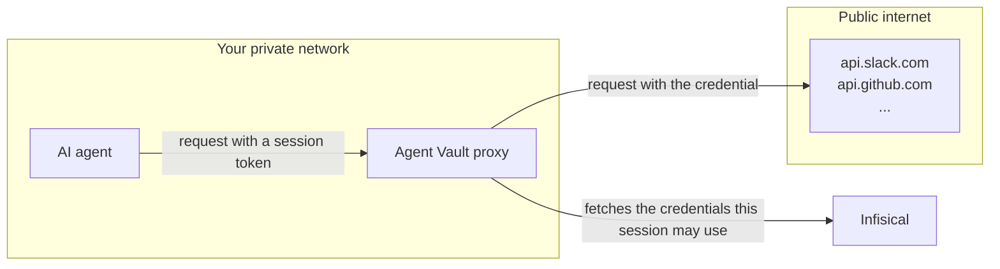

Agent Vault lets an AI agent make authenticated API calls without ever holding the real credentials. Instead, the agent routes its API calls through an Agent Vault proxy, which attaches the credentials on the way out.



## Mental model
 
Agent Vault uses four primitives to create secure sessions for AI agents:

- [**Services**](#services): Individual APIs, each configured with a real credential
- [**Access bundles**](#access-bundles): Groups of services, granted as a unit
- [**Sessions**](#sessions): Short-lived tokens that an agent can use to authenticate with the services in an access bundle
- [**Proxies**](#proxies): The network point that intercepts traffic from a session

Here's how the four concepts connect:

<Steps>
  <Step>
    The access bundle groups the services (external APIs) you want your agent to reach.

    ```mermaid
    flowchart LR
      subgraph bundle["Access bundle"]
        s1["Service"]
        s2["Service"]
        s3["Service"]
      end
    ```
  </Step>
  <Step>
    The session token grants access to that bundle for a limited time.

    ```mermaid
    flowchart LR
      session["Session"] -->|"references"| bundle
      subgraph bundle["Access bundle"]
        s1["Service"]
        s2["Service"]
        s3["Service"]
      end
    ```
  </Step>
  <Step>
    The agent can now call any service inside the bundle, using the session token in place of the real credentials.

    ```mermaid
    flowchart LR
      agent["AI agent"] -->|"runs with"| session["Session"]
      session -->|"references"| bundle
      subgraph bundle["Access bundle"]
        s1["Service"]
        s2["Service"]
        s3["Service"]
      end
    ```
  </Step>
  <Step>
    Every outbound request goes through the proxy before leaving the network. The proxy validates the session.

    ```mermaid
    flowchart LR
      agent["AI agent"] -->|"routes through"| proxy["Proxy"]
      proxy -->|"validates"| session["Session"]
      agent -->|"runs with"| session
      session -->|"references"| bundle
      subgraph bundle["Access bundle"]
        s1["Service"]
        s2["Service"]
        s3["Service"]
      end
    ```
  </Step>
  <Step>
    The proxy swaps the session token for the real credential and forwards the request to the upstream host.

    ```mermaid
    flowchart LR
      agent["AI agent"] -->|"routes through"| proxy["Proxy"]
      proxy -->|"request with real credential"| apis["External APIs"]
      proxy -->|"validates"| session["Session"]
      agent -->|"runs with"| session
      session -->|"references"| bundle
      subgraph bundle["Access bundle"]
        s1["Service"]
        s2["Service"]
        s3["Service"]
      end
    ```
  </Step>
</Steps>

This process allows the agent to authenticate to external APIs, all without having access to any of their real credentials.

## Concepts

Here's a breakdown of each primitive that Agent Vault relies on.

### Services

A service represents one external API, such as GitHub's REST API, Slack's Web API, or Anthropic's messages endpoint. Each service holds three things:

- **Hosts.** The host or hosts the service applies to, like `api.github.com`
- **Authentication scheme.** How the API authenticates: bearer, basic, or pass-through
- **Credential.** The real API token or username and password the proxy attaches to matching requests

You don't hand services to an agent directly. They live inside access bundles.

<Card title="Services" icon="plug" href="/documentation/platform/agent-vault/services">
  Adding services, credential types, host patterns, and conflict resolution.
</Card>

### Access bundles

An access bundle groups a set of services under one name. A **code-review** bundle might hold services for GitHub, Slack, and Anthropic. An **on-call** bundle might hold services for PagerDuty, Datadog, and Slack.

You grant a bundle to a user, group, or machine identity. Whoever holds the grant can create sessions with it.

<Card title="Access bundles" icon="box" href="/documentation/platform/agent-vault/access-bundles">
  Creating bundles, managing services, and granting access to users and identities.
</Card>

### Sessions

A session is a time-bound token that an agent can use to authenticate with the services in an access bundle.

When you create a session, you pick one access bundle and set an expiry. Infisical hands you back a session token: a short-lived reference the agent uses in place of the real API credentials.

The session token is worthless outside the specific bundle it points at. Even if an attacker stole it, they could only reach the hosts the bundle covers, and only until the session expires or you revoke it.

<Card title="Sessions" icon="ticket" href="/documentation/platform/agent-vault/sessions">
  Creating sessions, setting their duration, revoking them, and auditing what agents reached.
</Card>

### Proxies

A proxy runs where your agent's traffic leaves your network. It intercepts every outbound HTTPS request, matches it against the services in the session's access bundle, and swaps the session token for the real credential before forwarding the request to the API.

The proxy is what actually enforces the boundary. The agent's HTTPS client only knows to route through it, using the `HTTPS_PROXY` environment variable.

<Card title="Proxies" icon="route" href="/documentation/platform/agent-vault/proxies">
  Enrolling a proxy, setting its traffic policy, and managing certificate trust.
</Card>

## Example flow: GitHub API

Here's what happens when an agent calls `api.github.com` through an Agent Vault session:

1. The agent's HTTPS client routes the request through the [proxy](#proxies) (because the `HTTPS_PROXY` environment variable points at it), including the [session](#sessions) token as the proxy credential.
2. The proxy looks up the session with Infisical, checking if it's still live and which [access bundle](#access-bundles) it carries.
3. The proxy looks inside the session's access bundle and finds a [service](#services) whose host pattern covers `api.github.com`. The proxy reads the real GitHub token from that service.
4. The proxy opens a new HTTPS connection to `api.github.com`, attaches the real token in the authorization header, and forwards the request.
5. GitHub responds. The proxy pipes the response back to the agent.

<Note>
If the agent had asked for a host that isn't covered by any service in the access bundle (like `api.internal.example.com`), the proxy would either forward the request without credentials or refuse it outright, depending on its [traffic policy](/documentation/platform/agent-vault/proxies#traffic-policy).
</Note>

## Why no code changes are needed

Agent Vault plugs into a mechanism the entire HTTP ecosystem already uses: the `HTTPS_PROXY` environment variable. Any HTTP client that reads it routes through the proxy without any code changes. That includes `curl`, `git`, `gh`, Node's `fetch`, Python's `requests`, and virtually every SDK.

`infisical agent-vault run` sets `HTTPS_PROXY` for the agent, trusts the proxy's certificate authority, and passes the session token as the proxy credential. Everything the agent does after that works without needing to update any code.
