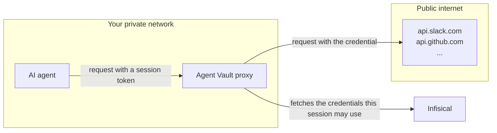

Agent Vault lets an AI agent make authenticated API calls without ever holding the real credentials. Instead, the agent routes its API calls through an Agent Vault proxy, which attaches the credentials on the way out.



## Mental model
 
Agent Vault uses four primitives to create secure sessions for AI agents:

- [**Services**](#services): Individual APIs, each configured with a real credential
- [**Access bundles**](#access-bundles): Groups of services, granted as a unit
- [**Sessions**](#sessions): Time-bound access grants that an agent uses to authenticate to the proxy for the services in an access bundle
- [**Proxies**](#proxies): The forward proxy that intercepts an agent's outbound traffic and attaches real credentials to authorized requests

Here's how the four concepts connect:

<Steps>
  <Step>
    The access bundle groups the services (external APIs) you want your agent to reach.

    ```mermaid
    flowchart LR
      subgraph bundle["Access bundle"]
        s1["Service"]
        s2["Service"]
        s3["Service"]
      end
    ```
  </Step>
  <Step>
    You create a session for the bundle. Infisical returns a session token scoped to that bundle for a limited time.

    ```mermaid
    flowchart LR
      token["Session token"] -->|"scoped to"| bundle
      subgraph bundle["Access bundle"]
        s1["Service"]
        s2["Service"]
        s3["Service"]
      end
    ```
  </Step>
  <Step>
    The agent runs with the session token and uses it to authenticate to the Agent Vault proxy on every outbound request.

    ```mermaid
    flowchart LR
      agent["AI agent"] -->|"holds"| token["Session token"]
      token -->|"scoped to"| bundle
      subgraph bundle["Access bundle"]
        s1["Service"]
        s2["Service"]
        s3["Service"]
      end
    ```
  </Step>
  <Step>
    Every outbound request goes through the proxy, with the session token attached as the proxy credential.

    ```mermaid
    flowchart LR
      agent["AI agent"] -->|"outbound request with session token"| proxy["Proxy"]
      agent -->|"holds"| token["Session token"]
      token -->|"scoped to"| bundle
      subgraph bundle["Access bundle"]
        s1["Service"]
        s2["Service"]
        s3["Service"]
      end
    ```
  </Step>
  <Step>
    The proxy reaches into the access bundle for the matching service's credential, attaches it, and forwards the request to the upstream host.

    ```mermaid
    flowchart LR
      agent["AI agent"] -->|"outbound request with session token"| proxy["Proxy"]
      agent -->|"holds"| token["Session token"]
      proxy -->|"request with real credentials"| apis["External API"]
      proxy -->|"reads credentials from"| bundle
      token -->|"scoped to"| bundle
      subgraph bundle["Access bundle"]
        s1["Service"]
        s2["Service"]
        s3["Service"]
      end
    ```
  </Step>
</Steps>

This process allows the agent to authenticate to external APIs, all without having access to any of their real credentials.

## Concepts

Here's a breakdown of each primitive that Agent Vault relies on.

### Services

A service represents one external API, such as GitHub's REST API, Slack's Web API, or Anthropic's messages endpoint. Each service holds three things:

- **Hosts.** The host or hosts the service applies to, like `api.github.com`
- **Authentication scheme.** How the API authenticates: bearer, basic, or pass-through
- **Credential.** The real API token or username and password the proxy attaches to matching requests

You don't hand services to an agent directly—they're defined within access bundles.

<Card title="Services" icon="plug" href="/documentation/platform/agent-vault/services">
  External APIs that an AI agent can securely call during a session.
</Card>

### Access bundles

An access bundle groups a set of services under one name. A **code-review** bundle might hold services for GitHub, Slack, and Anthropic. An **on-call** bundle might hold services for PagerDuty, Datadog, and Slack.

You grant access to a bundle for a user, group, or machine identity. Anyone with access to that bundle can create sessions that reference it.

<Card title="Access bundles" icon="box" href="/documentation/platform/agent-vault/access-bundles">
  Lists of services that AI agents can access during a session.
</Card>

### Sessions

A session is a time-bound access grant that's scoped to one access bundle. Infisical returns a session token that identifies the session; the agent uses that token to authenticate to the Agent Vault proxy on every outbound request.

When you create a session, you pick one access bundle and set an expiry. The agent never sees the real credentials inside the bundle. All it has is the session token, which only works when the proxy can authorize it against a live session.

Even if an attacker stole the session token, they could only reach hosts that are defined by the access bundle's services, and only until the session expires or you revoke it.

<Card title="Sessions" icon="monitor" href="/documentation/platform/agent-vault/sessions">
  Time-bound grants that let AI agents access services without holding real credentials.
</Card>

### Proxies

A proxy runs where your agent's traffic leaves your network. It intercepts every outbound HTTPS request, authorizes the request against the session's access bundle, attaches the matching service's credential as a header, and forwards the request to the upstream host.

<Card title="Proxies" icon="route" href="/documentation/platform/agent-vault/proxies">
  Forward proxies that intercept an AI agent's requests and attach real credentials on the way out.
</Card>

## Example flow: GitHub API

Here's what happens when an agent calls `api.github.com` through an Agent Vault session:

1. The agent's HTTPS client routes the request through the [proxy](#proxies) (because the `HTTPS_PROXY` environment variable points at it), including the [session](#sessions) token as the proxy credential.
2. The proxy looks up the session with Infisical, checking if it's still live and which [access bundle](#access-bundles) it carries.
3. The proxy looks inside the session's access bundle and finds a [service](#services) whose host pattern covers `api.github.com`. The proxy reads the real GitHub token from that service.
4. The proxy opens a new HTTPS connection to `api.github.com`, attaches the real token in the authorization header, and forwards the request.
5. GitHub responds. The proxy pipes the response back to the agent.

<Note>
If the agent asks for a host that isn't covered by any service in the access bundle (like `api.internal.example.com`), the proxy either forwards the request without credentials or refuses it outright, depending on its [traffic policy](/documentation/platform/agent-vault/proxies#traffic-policy).
</Note>

## Why no code changes are needed

Agent Vault plugs into a mechanism the entire HTTP ecosystem already uses: the `HTTPS_PROXY` environment variable. Any HTTP client that reads `HTTPS_PROXY` routes through the proxy without any code changes. That includes `curl`, `git`, `gh`, Python's `requests`, and most SDKs.

`infisical agent-vault run` sets `HTTPS_PROXY` for the agent, trusts the proxy's certificate authority, and passes the session token as the proxy credential. Everything the agent does after that works without needing to update any code.

<Note>
  Node.js's built-in `fetch` (undici-backed) doesn't read `HTTPS_PROXY` by default. If your agent uses it directly, run Node with `--use-env-proxy` or set `NODE_USE_ENV_PROXY=1` (Node 24 or later). Third-party clients like `axios`, `node-fetch`, and `got` honor the env vars without extra flags.
</Note>
