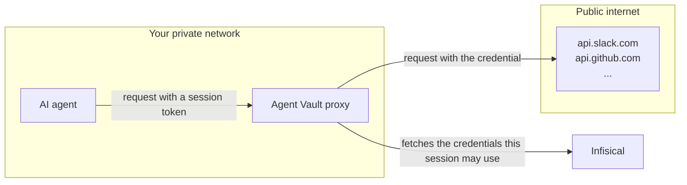

**Infisical Agent Vault** equips AI agents with what they need to do work, starting with secure access to the services they call: LLM providers, GitHub, Slack, and more.

Agents like Claude Code or OpenClaw work as they always do. Their requests leave your network with the real credential attached, and the agent never holds it.

## Why Agent Vault

Traditional secrets management involves returning credentials back to applications and services.

This isn't suitable for AI agents because they're vulnerable to credential exfiltration via [prompt injection](https://en.wikipedia.org/wiki/Prompt_injection); an attacker could craft a malicious prompt or payload and exfiltrate credentials from an agent back to the attacker.

Enter Infisical Agent Vault, which prevents credential exfiltration by brokering access at the network boundary. The agent gets an access session that works only for the services you allowed, and only until it expires or you revoke it.

## How it works

You describe what an agent may use in an access bundle: the services, and the credentials for them. You grant the access bundle to whoever runs agents, and they create a session with it to launch the agent. Requests to those services get the right credential on the way out, and everything else is untouched. The agent needs no code changes.

## Get started

<Card title="Quickstart" icon="rocket" href="/documentation/platform/agent-vault/quickstart">
  Create an access bundle with a GitHub connection, enroll a proxy, and launch an agent that makes authenticated calls with a token it never sees.
</Card>

## Learn more

<CardGroup cols={2}>
  <Card title="Access bundles" icon="box" href="/documentation/platform/agent-vault/access-bundles">
    Connections, credential types, host patterns, and who can run agents with an access bundle.
  </Card>
  <Card title="Sessions" icon="ticket" href="/documentation/platform/agent-vault/sessions">
    Creating one, how long it lives, revoking it, and what a running agent can reach.
  </Card>
  <Card title="Proxies" icon="route" href="/documentation/platform/agent-vault/proxies">
    Where the proxy runs, enrolling it, traffic policy, and certificate trust.
  </Card>
  <Card title="CLI reference" icon="terminal" href="/cli/commands/av">
    Every flag of `infisical av proxy` and `infisical av run`.
  </Card>
</CardGroup>
