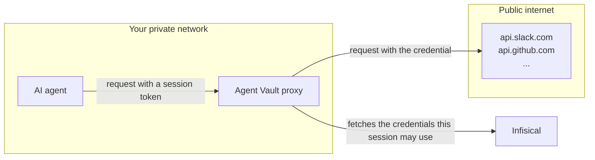

Traditional secrets management involves returning credentials back to applications and services. This isn't suitable for AI agents because they're vulnerable to credential exfiltration via [prompt injection](https://en.wikipedia.org/wiki/Prompt_injection); an attacker could write a malicious prompt or payload and exfiltrate credentials from an agent back to the attacker.

Infisical Agent Vault solves this by preventing credential exfiltration by brokering access at the network boundary. The agent gets an access session that works only for the services you allowed, and only until it expires or you revoke it.

With Agent Vault, agents like Claude Code or OpenClaw don't hold any credentials: instead, their requests are intercepted by Agent Vault at the network boundary. Agent Vault then verifies that the agent has access to the service, attaches the necessary authorization headers, and forwards the authenticated request to the upstream provider.

For the pieces this is built from and how they fit together, see [How it works](/documentation/platform/agent-vault/how-it-works).
