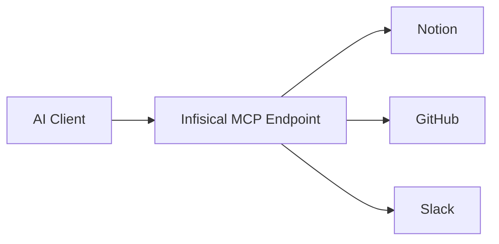

## What is the Model Context Protocol?

The [Model Context Protocol (MCP)](https://modelcontextprotocol.io) is an open standard that enables AI assistants and agents to securely connect to external data sources and tools. It provides a unified way for AI systems to interact with services like Notion, GitHub, Slack, databases, and more.

Think of MCP as a universal adapter between AI systems and the tools they need. Instead of building custom integrations for each AI platform and each tool, MCP provides a standardized protocol that any AI client can use to connect to any MCP-compatible server.

## How Does MCP Work?

MCP follows a client-server architecture:

- **MCP Clients**: AI applications like Claude, ChatGPT, or custom AI agents that need to access external tools.
- **MCP Servers**: Services that expose tools and capabilities through the MCP protocol. These can be first-party servers (like Notion's official MCP server) or custom servers you build.

When an AI assistant needs to perform an action—like searching Notion, creating a GitHub issue, or querying a database—it communicates with the appropriate MCP server using the standardized protocol.

## Why Do You Need Agentic Manager?

While MCP provides the protocol for AI-tool communication, it doesn't solve the governance and security challenges that organizations face:

### The Challenge

- **Credential Sprawl**: Each user connecting AI tools to MCP servers manages their own credentials, creating security blind spots.
- **No Visibility**: Organizations have no insight into what tools AI agents are using or what data they're accessing.
- **Ungoverned Access**: Without centralized control, AI agents may access tools and data they shouldn't.
- **Compliance Risk**: Audit requirements demand logging and monitoring of AI system activities.

### The Solution

Infisical Agentic Manager acts as a secure gateway between AI clients and MCP servers:

This architecture provides:

1. **Centralized Credential Management**: Store and manage MCP server credentials in one place. Choose between **shared credentials** (one credential for all users) or **personal credentials** (each user authenticates individually) based on your security and compliance needs.
2. **Tool Governance**: Control exactly which tools from each MCP server are available through your endpoints.
3. **Complete Audit Trail**: Every tool invocation is logged with full request/response details, user attribution, and timestamps.
4. **Access Control**: Leverage Infisical's existing access control mechanisms to manage who can use which endpoints.

Learn more about [credential modes](/documentation/platform/agentic-manager/mcp-servers#credential-modes) when configuring MCP servers.
