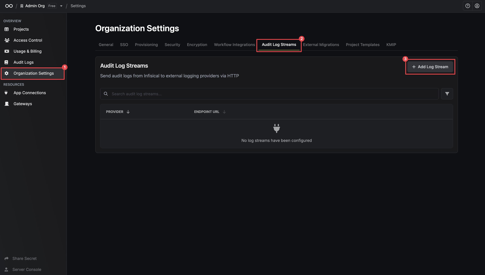
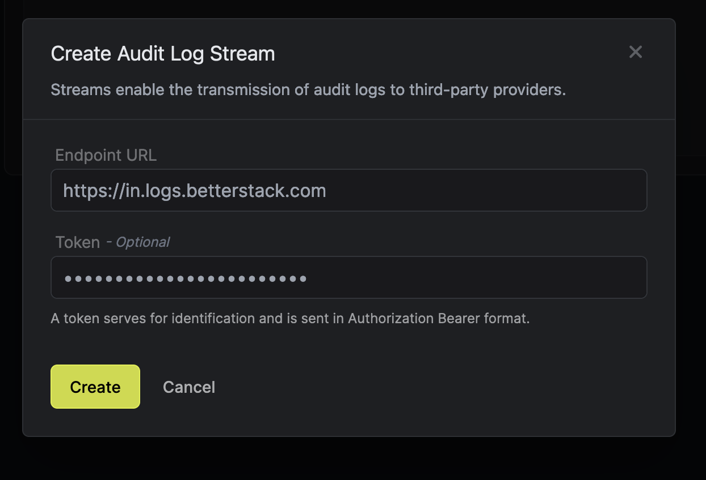
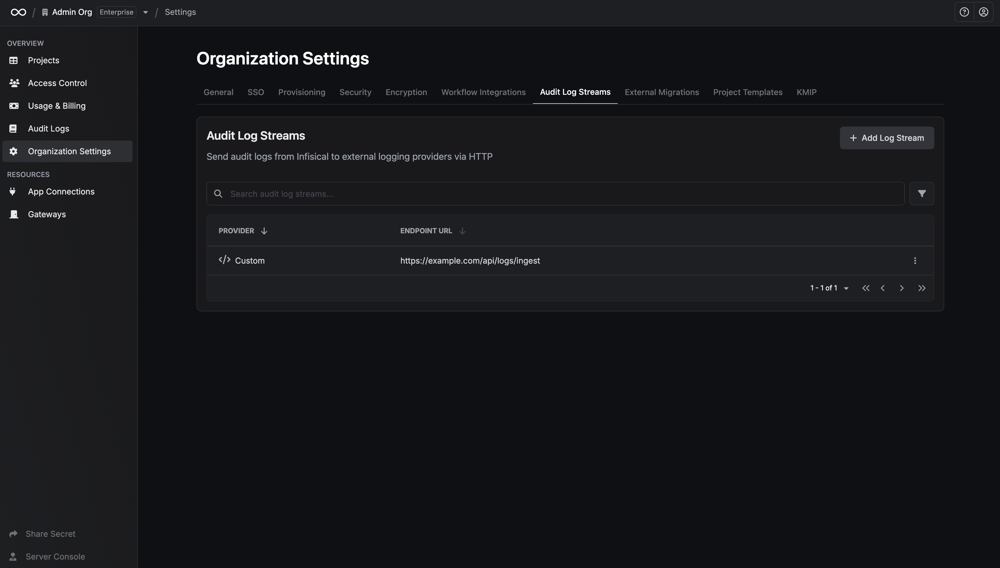
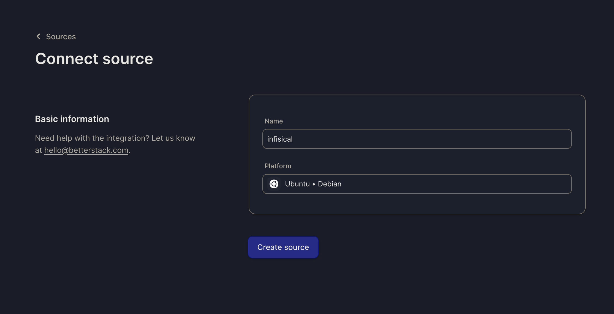
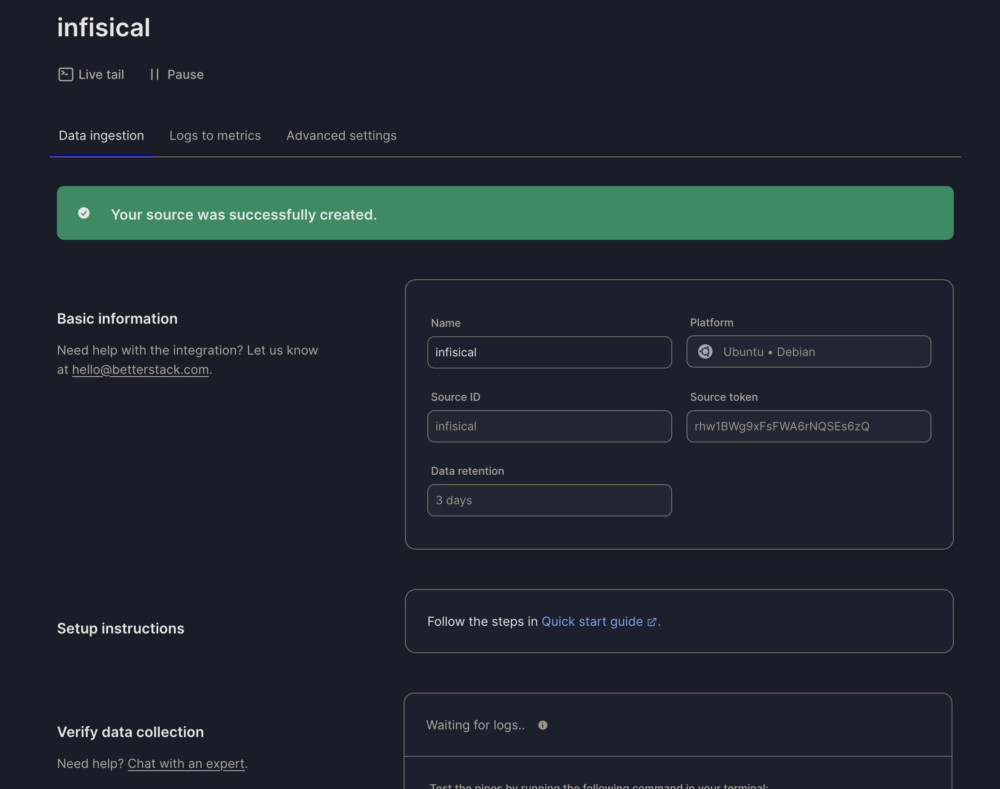
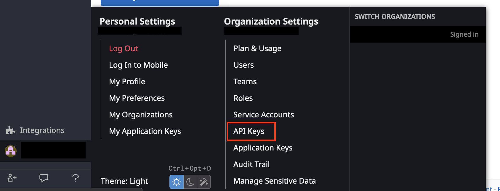
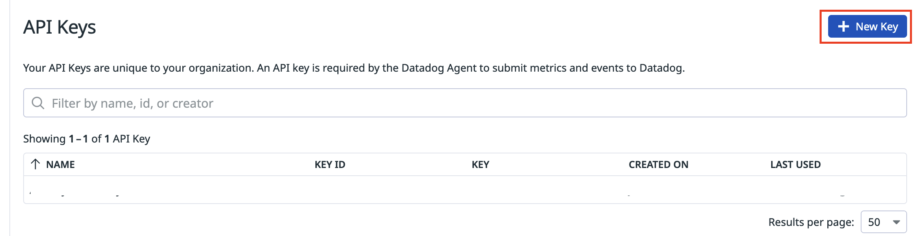
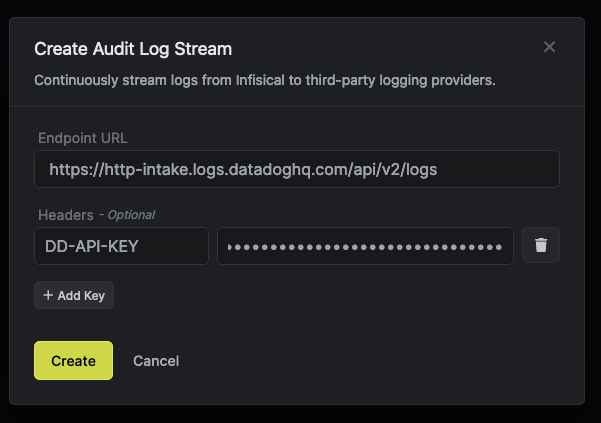

<Info>
    Audit log streams is a paid feature.
   
    If you're using Infisical Cloud, then it is available under the **Enterprise Tier**. If you're self-hosting Infisical,
    then you should contact team@infisical.com to purchase an enterprise license to use it.
</Info>

Infisical Audit Log Streaming enables you to transmit your organization's Audit Logs to external logging providers for monitoring and analysis. 

The logs are formatted in JSON, requiring your logging provider to support JSON-based log parsing.

## Overview

<Steps>
    <Step title="Navigate to Organization Settings in your sidebar." />
    <Step title="Select Audit Log Streams Tab.">
				
		</Step>
		<Step title="Click on Create">
		 

		 Provide the following values
		 <ParamField path="Endpoint URL" type="string" required>
				The HTTPS endpoint URL of the logging provider that collects the JSON stream.
     </ParamField>
		 <ParamField path="Headers" type="string" >
				The HTTP headers for the logging provider for identification and authentication.
     </ParamField>
		</Step>
</Steps>

Your Audit Logs are now ready to be streamed.

## Example Providers

### Better Stack

<Steps>
    <Step title="Select Connect Source">
				
		</Step>
    <Step title="Provide a name and select platform"/>
   <Step title="Provide audit log stream inputs">
				

				1. Copy the **Source token** field from Better Stack to the **Token** field.
				2. Copy the **endpoint** from Better Stack to the **Endpoint URL** field.
		</Step>
</Steps>

### Datadog

<Steps>
    <Step title="Navigate to API Keys section by clicking on sidebar in Datadog">
				
				
		</Step>
    <Step title="Select New Key and provide a key name">
				
		</Step>
   <Step title="Provide audit log stream inputs">
				

				1. Add **https://http-intake.logs.datadoghq.com/api/v2/logs** to the **Endpoint URL** field.
				2. Copy the **API Key** from previous step
				3. Create a new header with key **DD-API-KEY** and use the **API Key** as the value.
		</Step>
</Steps>
