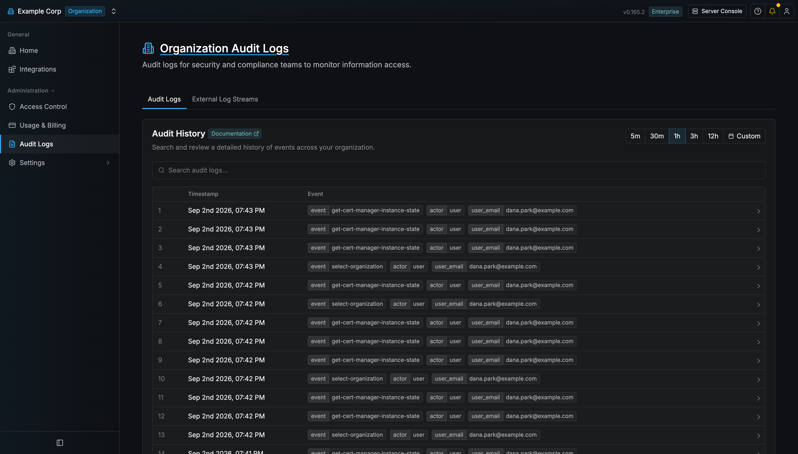

<Info>
  Audit logs are available under Infisical's [Pro, Advanced, and Enterprise](https://infisical.com/pricing) plans, with retention that varies by plan.

  If you're self-hosting Infisical, contact sales@infisical.com to purchase an Enterprise license.
</Info>

Infisical records every action performed in your organization as a structured event, so security and compliance teams can investigate incidents, prove access boundaries to auditors, and answer questions about who did what.

<Frame>

</Frame>

## View audit logs

Anyone with the **Read** permission on **Audit Logs** has access to view audit logs. For more information, check out [Role-based access controls](/documentation/platform/access-controls/role-based-access-controls).

### For an organization

To view all events in an organization across every product:

<Tabs>
  <Tab title="Infisical UI">
    <Steps>
      <Step>
        From your organization's home page, go to **Audit Logs**.
      </Step>
      <Step>
         Narrow down the results with [filters](#filtering-audit-logs).
      </Step>
    </Steps>
  </Tab>
  <Tab title="API">
    Call the endpoint without a `projectId` to get events across the whole organization.

    ```bash
    curl -G "https://app.infisical.com/api/v1/organization/audit-logs" \
      -H "Authorization: Bearer <your-access-token>" \
      --data-urlencode "limit=100"
    ```

    See the [audit log export API reference](/api-reference/endpoints/audit-logs/export-audit-log) for the full parameter list.
  </Tab>
</Tabs>

### For a product

To view all events scoped to a single product:

<Tabs>
  <Tab title="Infisical UI">
    <Steps>
      <Step>
        Open the product from the organization sidebar.
      </Step>
      <Step>
        For **Secrets Management**, **Certificate Manager**, **KMS**, and **Secret Scanning**, select the project you want to audit.
        
        <Note>
        For **Privileged Access Manager** and **Agent Vault**, skip this step.
        </Note>
      </Step>
      <Step>
        Select **Audit Logs** in the product's sidebar.
      </Step>
      <Step>
        Narrow down the results with [filters](#filtering-audit-logs).
      </Step>
    </Steps>
  </Tab>
  <Tab title="API">
    Pass a `projectId` to scope the response to one project's events.

    ```bash
    curl -G "https://app.infisical.com/api/v1/organization/audit-logs" \
      -H "Authorization: Bearer <your-access-token>" \
      --data-urlencode "projectId=<project-id>" \
      --data-urlencode "limit=100"
    ```

    See the [audit log export API reference](/api-reference/endpoints/audit-logs/export-audit-log) for the full parameter list.

    <Note>
      **Privileged Access Manager** and **Agent Vault** use a single project that Infisical manages internally. There's no public API for looking up that project's ID.
      
      Instead, call the organization endpoint (see [For an organization](#for-an-organization)) and filter `eventType` to Privileged Access Manager and Agent Vault [event types](#event-types), (e.g., `eventType=pam-session-start,pam-session-end`).
    </Note>
  </Tab>
</Tabs>

## Log structure

Each log contains the following fields:

<ResponseField name="id" type="string">
  The log entry's UUID.
</ResponseField>

<ResponseField name="ipAddress" type="string">
  The source IP address of the request.
</ResponseField>

<ResponseField name="userAgent" type="string">
  The raw `User-Agent` header of the client.
</ResponseField>

<ResponseField name="userAgentType" type="string">
  The client category: `web`, `cli`, `k8-operator`, `terraform`, `InfisicalPythonSDK`, `InfisicalNodeSDK`, or `other`.
</ResponseField>

<ResponseField name="expiresAt" type="string">
  When Infisical will delete the log entry, based on your plan's retention.
</ResponseField>

<ResponseField name="createdAt" type="string">
  When the action occurred, in ISO 8601 format.
</ResponseField>

<ResponseField name="updatedAt" type="string">
  When the log entry was last updated. Matches `createdAt` for immutable events.
</ResponseField>

<ResponseField name="orgId" type="string">
  The organization the action occurred in.
</ResponseField>

<ResponseField name="projectId" type="string">
  The project the action affected. Empty for organization-level events.
</ResponseField>

<ResponseField name="projectName" type="string">
  The name of the project at the time of the action. Empty for organization-level events.
</ResponseField>

<ResponseField name="event" type="object">
  The action that occurred.
  <Expandable title="properties">
    <ResponseField name="type" type="string">
      The event type (for example, `create-secret`). See [Event types](#event-types) for the full catalog.
    </ResponseField>
    <ResponseField name="metadata" type="object">
      Context specific to the event. The shape depends on `event.type`; a `get-secret` event carries `environment`, `secretPath`, `secretKey`, and `secretVersion`, while a batch event like `create-secrets` carries a `secrets` array.
    </ResponseField>
  </Expandable>
</ResponseField>

<ResponseField name="actor" type="object">
  Who performed the action.
  <Expandable title="properties">
    <ResponseField name="type" type="string">
      The actor category: commonly `user`, `identity`, or `platform`. Machine and system actors add more categories, for example `kmipClient`, `scimClient`, and `gateway`.
    </ResponseField>
    <ResponseField name="metadata" type="object">
      Identifying information for the actor. The shape depends on `actor.type`.
      <Expandable title="user actor">
        <ResponseField name="userId" type="string">
          The user's ID.
        </ResponseField>
        <ResponseField name="email" type="string">
          The user's email.
        </ResponseField>
        <ResponseField name="username" type="string">
          The user's username.
        </ResponseField>
        <ResponseField name="permission" type="object">
          The user's effective permissions at the time of the action.
        </ResponseField>
      </Expandable>
      <Expandable title="identity actor">
        <ResponseField name="identityId" type="string">
          The machine identity's ID.
        </ResponseField>
        <ResponseField name="permission" type="object">
          The identity's effective permissions at the time of the action.
        </ResponseField>
      </Expandable>
    </ResponseField>
  </Expandable>
</ResponseField>

### Example payload

```json expandable
{
   "id": "[UUID]",
   "ipAddress": "[IP_ADDRESS]",
   "userAgent": "[USER_AGENT_STRING]",
   "userAgentType": "web",
   "expiresAt": "[TIMESTAMP]",
   "createdAt": "[TIMESTAMP]",
   "updatedAt": "[TIMESTAMP]",
   "orgId": "[ORGANIZATION_UUID]",
   "projectId": "[PROJECT_UUID]",
   "projectName": "[PROJECT_NAME]",
   "event": {
       "type": "get-secret",
       "metadata": {
           "environment": "prod",
           "secretPath": "/db",
           "secretId": "[SECRET_UUID]",
           "secretKey": "DATABASE_URL",
           "secretVersion": 3
       }
   },
   "actor": {
       "type": "user",
       "metadata": {
           "email": "[EMAIL]",
           "userId": "[USER_UUID]",
           "username": "[USERNAME]",
           "permission": {
               "metadata": {},
               "auth": {}
           }
       }
   }
}
```

## Filtering audit logs

You can filter audit logs to find events more easily. When you set more than one filter, an event needs to match all of them to appear in the results.

<Note>
Every filter is an exact match, so wildcards like `*` aren't supported.
</Note>

### By date

Audit logs default to a rolling window at the top of the page. To narrow the results to a specific timeframe:

<Tabs>
  <Tab title="Infisical UI">
    Use the date range buttons at the top of the audit logs page. Presets include 1 day, 1 week, 1 month, and 3 months, and the custom picker takes any range up to 3 months.
  </Tab>
  <Tab title="API">
    Pass `startDate` and `endDate` as ISO 8601 timestamps, up to 3 months apart.

    ```bash
    curl -G "https://app.infisical.com/api/v1/organization/audit-logs" \
      -H "Authorization: Bearer <your-access-token>" \
      --data-urlencode "startDate=2026-01-01T00:00:00Z" \
      --data-urlencode "endDate=2026-01-31T23:59:59Z"
    ```
  </Tab>
</Tabs>

### Advanced filters

<Tabs>
  <Tab title="Infisical UI">
    Select **Search audit logs** from the audit logs menu and choose the filter you want to add:

    | Filter        | Matches                                                                                        | Requires                                                     |
    | ------------- | ---------------------------------------------------------------------------------------------- | ------------------------------------------------------------ |
    | `event`       | One or more event types (for example, `create-secret`, `update-secret`)                        |                                                              |
    | `actor`       | The actor type (for example, `user`, `identity`, `platform`, `kmipClient`, `scimClient`, and so on)         |                                                              |
    | `actor_id`    | A specific actor ID                                                                            | `actor` set to a type that carries an ID (see below)         |
    | `source`      | The client that made the request: `web`, `cli`, `k8-operator`, `terraform`, an SDK, or `other` |                                                              |
    | `project`     | A single project                                                                               |                                                              |
    | `environment` | An environment slug in that project (for example, `prod`)                                      | `project`; applies to secret events only                     |
    | `secret_path` | The folder path a secret event touched (for example, `/db`)                                    | `project`; applies to secret events only                     |
    | `secret_key`  | The exact key name a secret event touched (for example, `DATABASE_URL`)                        | `project`; applies to secret events only                     |
  </Tab>
  <Tab title="API">
    Pass filters as query parameters to `GET /api/v1/organization/audit-logs`:

    | Parameter       | Matches                                                                                        | Requires                                                          |
    | --------------- | ---------------------------------------------------------------------------------------------- | ----------------------------------------------------------------- |
    | `eventType`     | One or more event types, comma-separated (for example, `create-secret,update-secret`)          |                                                                   |
    | `actorType`     | The actor type (for example, `user`, `identity`, `platform`, `kmipClient`, `scimClient`)         |                                                                   |
    | `actor`         | A specific actor ID                                                                            | `actorType` set to a type that carries an ID (see below)          |
    | `userAgentType` | The client that made the request: `web`, `cli`, `k8-operator`, `terraform`, an SDK, or `other` |                                                                   |
    | `projectId`     | A single project                                                                               |                                                                   |
    | `environment`   | An environment slug in that project (for example, `prod`)                                      | `projectId`; applies to secret events only                        |
    | `secretPath`    | The folder path a secret event touched (for example, `/db`)                                    | `projectId`; applies to secret events only                        |
    | `secretKey`     | The exact key name a secret event touched (for example, `DATABASE_URL`)                        | `projectId`; applies to secret events only                        |
    | `eventMetadata` | A key/value pair inside `event.metadata`. See [Filtering by event metadata](#filtering-by-event-metadata). |                                                       |
  </Tab>
</Tabs>

<Note>
Actor ID filtering is only supported for actor types that carry an ID: `user`, `identity`, `service`, `kmipClient`, `kmipServer`, `gateway`, `relay`, `agentVaultProxy`, `acmeProfile`, `acmeAccount`, `estAccount`, and `scepAccount`.

`platform`, `scimClient`, and `unknownUser` don't have an ID field and can only be filtered by type.
</Note>

### Special characters

Every filter compares the raw string value as-is, so filter values that contain `$`, `.`, `/`, `@`, or any other special character work without escaping.

For example, to filter for a secret key named `$DB/PROD.URL`:

```bash
curl -G "https://app.infisical.com/api/v1/organization/audit-logs" \
  -H "Authorization: Bearer <your-access-token>" \
  --data-urlencode "projectId=<project-id>" \
  --data-urlencode "eventType=get-secret" \
  --data-urlencode "secretKey=\$DB/PROD.URL"
```

In the above example, `\$` is only there to stop the shell from expanding `$DB` as a variable. The filter itself takes `$DB/PROD.URL` as-is.

### Filtering by event metadata

The API accepts an `eventMetadata` query parameter that matches key/value pairs inside `event.metadata`. Pass it as `key1=value1,key2=value2`. Every pair has to match on the same event.

Use it for queries the built-in filters can't express, like every login for a specific identity, or every secret sync run for a specific destination:

```bash
curl -G "https://app.infisical.com/api/v1/organization/audit-logs" \
  -H "Authorization: Bearer <your-access-token>" \
  --data-urlencode "eventType=login-identity-universal-auth" \
  --data-urlencode "eventMetadata=identityId=<identity-id>"
```

<Note>
Values that contain a literal `,` can't be filtered this way, because `,` separates the pairs. Values with `=` work: only the first `=` in each pair is treated as the separator, so the rest of the string passes through.
</Note>

## Common filters

Here are a few common patterns for filtering audit logs.

### Who read a specific secret

Find every read of `DATABASE_URL` in the `prod` environment.

<Tabs>
  <Tab title="Infisical UI">
    <Steps>
      <Step>
        Go to **Organization > Audit Logs**.
      </Step>
      <Step>
        Select **Search audit logs** and add these filters:
        - `event`: `get-secret`
        - `project`: the project holding the secret
        - `environment`: `prod`
        - `secret_key`: `DATABASE_URL`
      </Step>
    </Steps>

    To include folder-level reads, add `get-secrets` to the `event` filter and remove the `secret_key` filter; folder reads don't record a specific key.
  </Tab>
  <Tab title="API">
    ```bash
    curl -G "https://app.infisical.com/api/v1/organization/audit-logs" \
      -H "Authorization: Bearer <your-access-token>" \
      --data-urlencode "projectId=<project-id>" \
      --data-urlencode "environment=prod" \
      --data-urlencode "eventType=get-secret" \
      --data-urlencode "secretKey=DATABASE_URL"
    ```

    To include folder-level reads, add `get-secrets` to `eventType` and drop `secretKey`; folder reads don't record a specific key.
  </Tab>
</Tabs>

### All writes to production

Find every create, update, and delete in a project's `prod` environment over the last 7 days.

<Tabs>
  <Tab title="Infisical UI">
    <Steps>
      <Step>
        Go to **Organization > Audit Logs**.
      </Step>
      <Step>
        Set the date range to the last 7 days.
      </Step>
      <Step>
        Select **Search audit logs** and add these filters:
        - `event`: `create-secret`, `update-secret`, `delete-secret`, `create-secrets`, `update-secrets`, `delete-secrets`
        - `project`: the project you want to audit
        - `environment`: `prod`
      </Step>
    </Steps>

    Include the batch event types (`create-secrets`, `update-secrets`, `delete-secrets`) so that bulk changes from the CLI or SDKs aren't missed. The `environment` filter only applies when a project is set.
  </Tab>
  <Tab title="API">
    Replace `<start-date>` with an ISO 8601 timestamp for 7 days ago (for example, `2026-09-14T00:00:00Z`).

    ```bash
    curl -G "https://app.infisical.com/api/v1/organization/audit-logs" \
      -H "Authorization: Bearer <your-access-token>" \
      --data-urlencode "projectId=<project-id>" \
      --data-urlencode "environment=prod" \
      --data-urlencode "eventType=create-secret,update-secret,delete-secret,create-secrets,update-secrets,delete-secrets" \
      --data-urlencode "startDate=<start-date>"
    ```

    Include the batch event types (`create-secrets`, `update-secrets`, `delete-secrets`) so that bulk changes from the CLI or SDKs aren't missed.
  </Tab>
</Tabs>

### Everything a specific identity did

Investigate every action a machine identity took.

<Tabs>
  <Tab title="Infisical UI">
    <Steps>
      <Step>
        Go to **Organization > Audit Logs**.
      </Step>
      <Step>
        Select **Search audit logs** and add these filters:
        - `actor`: `identity`
        - `actor_id`: the identity's ID
      </Step>
    </Steps>
  </Tab>
  <Tab title="API">
    ```bash
    curl -G "https://app.infisical.com/api/v1/organization/audit-logs" \
      -H "Authorization: Bearer <your-access-token>" \
      --data-urlencode "actor=<identity-id>" \
      --data-urlencode "actorType=identity"
    ```

    Set `actorType` for any non-user actor so the filter targets the right ID column. Only actor types with an ID field can be filtered this way; see the note under [Advanced filters](#advanced-filters) for the full list.
  </Tab>
</Tabs>

### Who deleted a secret

Find who removed a specific secret key. Include the batch event so single and bulk deletes are both matched.

<Tabs>
  <Tab title="Infisical UI">
    <Steps>
      <Step>
        Go to **Organization > Audit Logs**.
      </Step>
      <Step>
        Select **Search audit logs** and add these filters:
        - `event`: `delete-secret`, `delete-secrets`
        - `project`: the project holding the secret
        - `secret_key`: the key that was deleted
      </Step>
    </Steps>

    Read the actor column on each result to see who ran the delete. The `secret_key` filter only applies when a project is set.
  </Tab>
  <Tab title="API">
    ```bash
    curl -G "https://app.infisical.com/api/v1/organization/audit-logs" \
      -H "Authorization: Bearer <your-access-token>" \
      --data-urlencode "projectId=<project-id>" \
      --data-urlencode "eventType=delete-secret,delete-secrets" \
      --data-urlencode "secretKey=DATABASE_URL"
    ```

    Read `actor.type` and `actor.metadata` on each result to see who ran the delete.
  </Tab>
</Tabs>

## Event types

Infisical emits hundreds of event types. Here are some of the most common ones you'll encounter.

<AccordionGroup>
  <Accordion title="Secrets">
    | Event                              | When it fires                                                     |
    | ---------------------------------- | ----------------------------------------------------------------- |
    | `get-secret`                       | A caller read a specific secret.                                  |
    | `get-secrets`                      | A caller listed the secrets in a folder.                          |
    | `reveal-secret`                    | A user revealed a secret value in the UI.                         |
    | `create-secret`, `create-secrets`  | A caller created a secret (single or batch).                      |
    | `update-secret`, `update-secrets`  | A caller edited a secret (single or batch).                       |
    | `delete-secret`, `delete-secrets`  | A caller deleted a secret (single or batch).                      |
    | `move-secrets`                     | A user moved secrets to another folder or environment.            |
    | `duplicate-secret`                 | A user copied a secret to another folder or environment.          |
    | `redact-secret-version-value`      | An admin redacted a value from a secret's version history.        |
  </Accordion>
  <Accordion title="Identities and authentication">
    | Event                                                                                 | When it fires                                                        |
    | ------------------------------------------------------------------------------------- | -------------------------------------------------------------------- |
    | `create-identity`, `update-identity`, `delete-identity`                               | A machine identity was added, edited, or removed.                    |
    | `login-identity-*` (for example, `login-identity-universal-auth`, `login-identity-kubernetes-auth`, `login-identity-oidc-auth`, `login-identity-gcp-auth`, `login-identity-aws-auth`) | A machine identity authenticated. |
    | `login-identity-*-failed`                                                             | A machine identity's authentication attempt failed.                  |
    | `create-identity-universal-auth-client-secret`, `revoke-identity-universal-auth-client-secret` | A universal-auth client secret was issued or revoked.       |
    | `clear-identity-universal-auth-lockouts`, `clear-identity-ldap-auth-lockouts`         | An admin cleared a machine identity's lockout.                       |
  </Accordion>
  <Accordion title="Projects and access">
    | Event                                                                                             | When it fires                                                        |
    | ------------------------------------------------------------------------------------------------- | -------------------------------------------------------------------- |
    | `create-project`, `update-project`, `delete-project`                                              | A project was created, edited, or deleted.                           |
    | `create-identity-project-membership`, `update-identity-project-membership`, `delete-identity-project-membership` | A machine identity joined, changed role in, or left a project. |
    | `update-user-org-membership`, `delete-user-org-membership`                                        | A user's role or membership in the organization changed.             |
  </Accordion>
  <Accordion title="Integrations and secret sync">
    | Event                                                                                 | When it fires                                                              |
    | ------------------------------------------------------------------------------------- | -------------------------------------------------------------------------- |
    | `create-integration`, `delete-integration`, `manual-sync-integration`                 | A legacy integration was added, removed, or manually re-synced.            |
    | `create-secret-sync`, `update-secret-sync`, `delete-secret-sync`                      | A user configured a secret sync destination.                               |
    | `secret-sync-sync-secrets`, `secret-sync-import-secrets`, `secret-sync-remove-secrets`| A sync run pushed, imported, or removed secrets from its destination.      |
  </Accordion>
  <Accordion title="Approvals">
    | Event                                                                                                                                    | When it fires                                             |
    | ---------------------------------------------------------------------------------------------------------------------------------------- | --------------------------------------------------------- |
    | `approval-request-create`, `approval-request-approve`, `approval-request-reject`, `approval-request-cancel`                             | The lifecycle of an approval request.                     |
    | `access-approval-request-create`, `access-approval-request-review`, `access-approval-request-update`, `access-approval-request-revoke`   | The lifecycle of an access approval request.              |
    | `secret-approval-request`, `secret-approval-request-review`, `secret-approval-merged`, `secret-approval-closed`, `secret-approval-reopened` | The lifecycle of a secret change request.               |
    | `approval-policy-create`, `approval-policy-update`, `approval-policy-delete`                                                             | An admin changed an approval policy.                      |
  </Accordion>
  <Accordion title="Audit logs">
    | Event                                                                   | When it fires                                                        |
    | ----------------------------------------------------------------------- | -------------------------------------------------------------------- |
    | `view-audit-logs`                                                       | A user opened the audit log viewer.                                  |
    | `create-audit-report`, `get-audit-report`, `get-audit-reports`, `delete-audit-report` | A user managed a project-level audit report.           |
    | `create-org-audit-report`, `get-org-audit-reports`, `delete-org-audit-report` | A user managed an organization-level audit report.             |
  </Accordion>
</AccordionGroup>

For the full event catalog and every field the API accepts, see the [audit log export API reference](/api-reference/endpoints/audit-logs/export-audit-log).

## Next steps

<CardGroup cols={2}>
  <Card title="Stream audit logs" icon="arrow-up-from-line" href="/documentation/platform/audit-log-streams/audit-log-streams">
    Forward audit logs to a SIEM, storage bucket, or observability stack.
  </Card>
  <Card title="ClickHouse storage backend" icon="database" href="/documentation/platform/audit-logs-clickhouse-setup">
    Keep queries fast when a self-hosted audit log table grows to hundreds of millions of rows.
  </Card>
</CardGroup>
