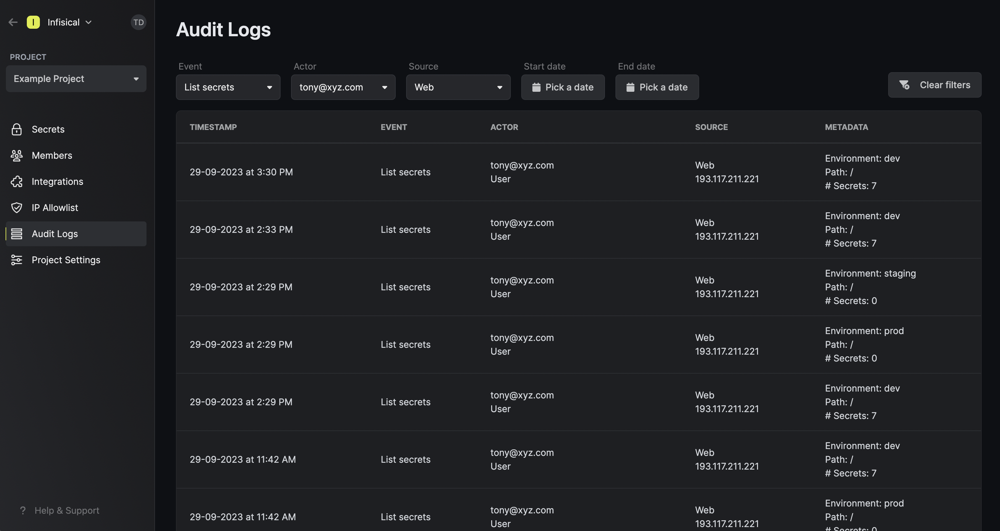

<Info>
    Note that Audit Logs is a paid feature.

    If you're using Infisical Cloud, then it is available under the **Team Tier**, **Pro Tier**,
    and **Enterprise Tier** with varying retention periods. If you're self-hosting Infisical,
    then you should contact team@infisical.com to purchase an enterprise license to use it.
</Info>

Infisical provides audit logs for security and compliance teams to monitor information access. 
With this feature, teams can track 25+ different events; 
filter audit logs by event, actor, source, date or any combination of these filters;
and inspect extensive metadata in the event of any suspicious activity or incident review.

Each log contains the following data:

- Event: The underlying action such as create, list, read, update, or delete secret(s).
- Actor: The entity responsible for performing or causing the event; this can be a user or service.
- Timestamp: The date and time at which point the event occured.
- Source (User agent + IP): The software (user agent) and network address (IP) from which the event was initiated.
- Metadata: Additional data to provide context for each event. For example, this could be the path at which a secret was fetched from etc.