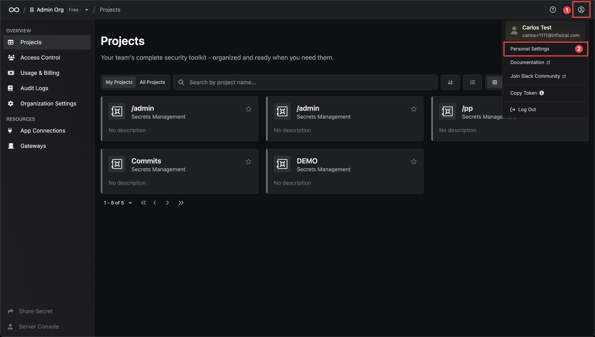

**Email and Password** is the most common authentication method that can be used by user identities for authentication into Web Dashboard and Infisical CLI. It is recommended to utilize [Multi-factor Authentication](/documentation/platform/mfa) in addition to it.

It is currently possible to use the **Email and Password** auth method to authenticate into the Web Dashboard and Infisical CLI.

Every **Email and Password** is accompanied by an emergency kit given to users during signup. If the password is lost or forgotten, emergency kit is only way to retrieve the access to your account. It is possible to generate a new emergency kit with the following steps: 
1. Open the `Personal Settings` menu.

2. Scroll down to the `Emergency Kit` section.
3. Enter your current password and click `Save`.
