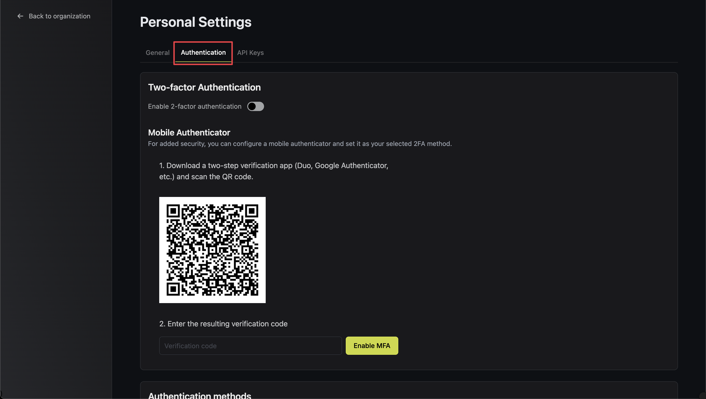
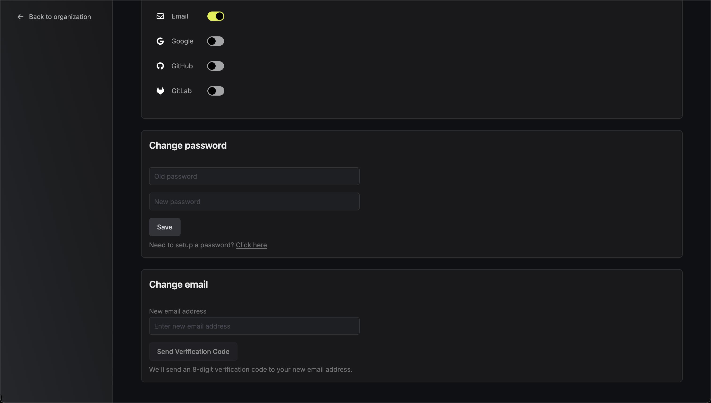
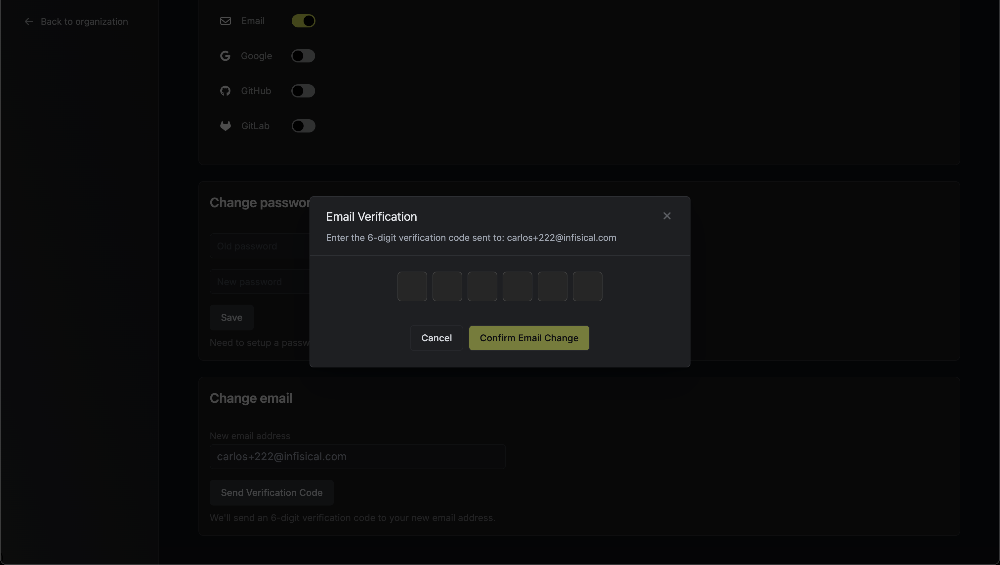

**Email and Password** is the most common authentication method that can be used by user identities for authentication into Web Dashboard and Infisical CLI. It is recommended to utilize [Multi-factor Authentication](/documentation/platform/mfa) in addition to it.

It is currently possible to use the **Email and Password** auth method to authenticate into the Web Dashboard and Infisical CLI.

### Emergency Kit
Every **Email and Password** is accompanied by an emergency kit given to users during signup. If the password is lost or forgotten, emergency kit is only way to retrieve the access to your account. It is possible to generate a new emergency kit with the following steps: 
1. Open the `Personal Settings` menu.

2. Scroll down to the `Emergency Kit` section.
3. Enter your current password and click `Save`.

### Change Password
You can update your account password at any time:
1. Open the `Personal Settings` menu.

2. Navigate to the `Authentication` tab.

3. In the `Change Password` section, enter your current password and new password.

4. Click `Save` to save your new password.

### Change Email
You can update your account email address:
1. Open the `Personal Settings` menu.
2. Navigate to the `Authentication` tab.
3. In the `Change Email` section, enter your new email address.

4. Click `Send Verification Code` to receive an 8-digit verification code at your new email address.
5. Check your new email inbox and enter the verification code in the form.

6. Click `Confirm Email Change` to complete the process.
7. You will be logged out and need to sign in again with your new email address.

<Tip>
Changing your email will remove all connected external authentication methods and terminate all active sessions for security.
</Tip>

<Warning>
Email changes are disabled if SCIM is enabled for any of your organizations. Contact your organization administrator if you need to change your email address in a SCIM-enabled environment.
</Warning>