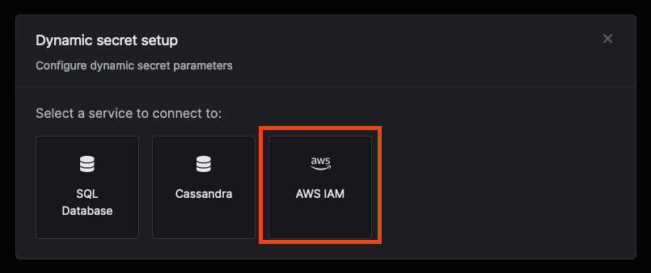
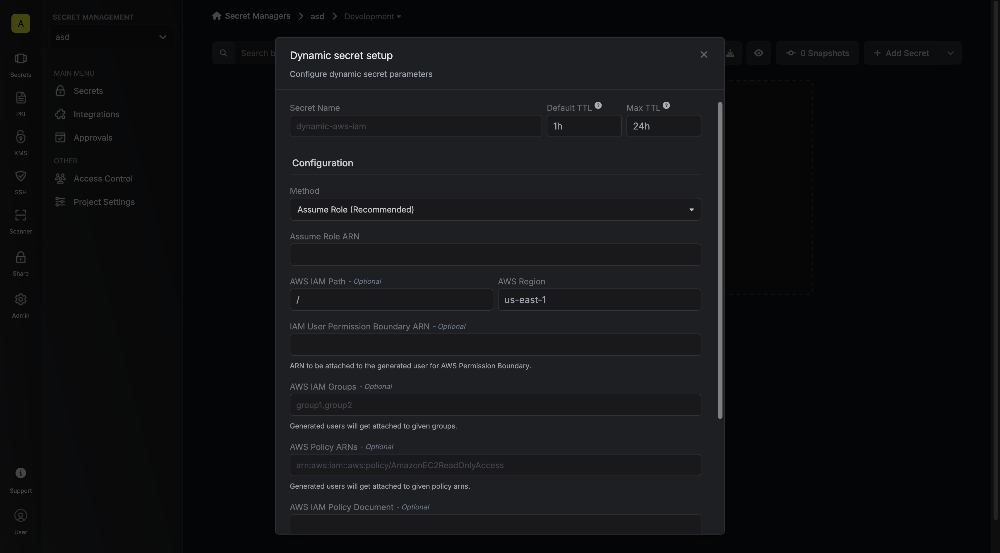
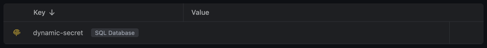
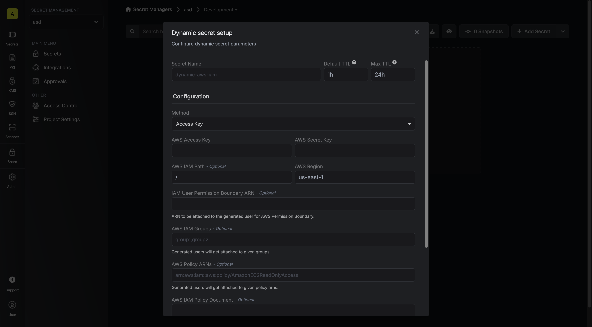

import DynamicSecretUsernameTemplateParamField from "/snippets/documentation/platform/dynamic-secrets/dynamic-secret-username-template-field.mdx";

The Infisical AWS IAM dynamic secret allows you to generate AWS IAM Users and temporary credentials on demand based on a configured AWS policy. Infisical supports several authentication methods to connect to your AWS account, including assuming an IAM Role, using IAM Roles for Service Accounts (IRSA) on EKS, or static Access Keys.

## AWS STS Duration Limits

When using **Temporary Credentials**, AWS STS has specific maximum duration limits:

- **AssumeRole operations**: Maximum 1 hour (3600 seconds) when using temporary credentials
- **GetSessionToken operations** (Access Key & IRSA): Maximum 12 hours (43200 seconds)

<Info>
**Automatic Duration Adjustment**: If you specify a TTL that exceeds these AWS limits, Infisical will automatically use the maximum allowed duration instead of failing the operation. This ensures your dynamic secrets work reliably within AWS constraints.
</Info>

## Prerequisite

Infisical needs an AWS IAM principal (a user or a role) with the required permissions to create and manage other IAM users and temporary credentials. This principal will be responsible for the lifecycle of the dynamically generated users and temporary credentials.

<Accordion title="Required IAM Permissions">

<Tabs>
  <Tab title="IAM User">
    Required permissions for creating temporary IAM users:

    ```json
    {
      "Version": "2012-10-17",
      "Statement": [
        {
          "Effect": "Allow",
          "Action": [
            "iam:AttachUserPolicy",
            "iam:CreateAccessKey",
            "iam:CreateUser",
            "iam:DeleteAccessKey",
            "iam:DeleteUser",
            "iam:DeleteUserPolicy",
            "iam:DetachUserPolicy",
            "iam:GetUser",
            "iam:ListAccessKeys",
            "iam:ListAttachedUserPolicies",
            "iam:ListGroupsForUser",
            "iam:ListUserPolicies",
            "iam:PutUserPolicy",
            "iam:AddUserToGroup",
            "iam:RemoveUserFromGroup",
            "iam:TagUser"
          ],
          "Resource": ["*"]
        }
      ]
    }
    ```

    To minimize managing user access you can attach a resource in format

    > arn:aws:iam::\<account-id\>:user/\<aws-scope-path\>

    Replace **\<account id\>** with your AWS account id and **\<aws-scope-path\>** with a path to minimize managing user access.
  </Tab>

  <Tab title="Temporary Credentials">
    Required permissions for Access Key and Assume Role methods:

    ```json
    {
      "Version": "2012-10-17",
      "Statement": [
        {
          "Effect": "Allow",
          "Action": [
            "sts:GetSessionToken",
            "sts:AssumeRole"
          ],
          "Resource": ["*"]
        }
      ]
    }
    ```


    To minimize managing user access you can attach a resource in format

    > arn:aws:iam::\<account-id\>:user/\<aws-scope-path\>

    Replace **\<account id\>** with your AWS account id and **\<aws-scope-path\>** with a path to minimize managing user access.
  </Tab>
</Tabs>

</Accordion>

## Set up Dynamic Secrets with AWS IAM

<Tabs>
  <Tab title="Assume Role (Recommended)">
    Infisical will assume the provided role in your AWS account securely, without the need to share any credentials.
        <Accordion title="Self-Hosted Instance">
            To connect your self-hosted Infisical instance with AWS, you need to set up an AWS IAM User account that can assume the configured AWS IAM Role.

            If your instance is deployed on AWS, the aws-sdk will automatically retrieve the credentials. Ensure that you assign the provided permission policy to your deployed instance, such as ECS or EC2.

            The following steps are for instances not deployed on AWS:
            <Steps>
                <Step title="Create an IAM User">
                    Navigate to [Create IAM User](https://console.aws.amazon.com/iamv2/home#/users/create) in your AWS Console.
                </Step>
                <Step title="Create an Inline Policy">
                    Attach the following inline permission policy to the IAM User to allow it to assume any IAM Roles:
                    ```json
                    {
                        "Version": "2012-10-17",
                        "Statement": [
                    {
                        "Sid": "AllowAssumeAnyRole",
                        "Effect": "Allow",
                        "Action": "sts:AssumeRole",
                        "Resource": "arn:aws:iam::*:role/*"
                    }
                        ]
                    }
                    ```
                </Step>
                <Step title="Obtain the IAM User Credentials">
                    Obtain the AWS access key ID and secret access key for your IAM User by navigating to **IAM > Users > [Your User] > Security credentials > Access keys**.

                    
                    
                    
                </Step>
                <Step title="Set Up Connection Keys">
                    1. Set the access key as **DYNAMIC_SECRET_AWS_ACCESS_KEY_ID**.
                    2. Set the secret key as **DYNAMIC_SECRET_AWS_SECRET_ACCESS_KEY**.
                </Step>
            </Steps>
        </Accordion>

    <Steps>
         <Step title="Create the Managing User IAM Role for Infisical">
                1. Navigate to the [Create IAM Role](https://console.aws.amazon.com/iamv2/home#/roles/create?step=selectEntities) page in your AWS Console.
                

                2. Select **AWS Account** as the **Trusted Entity Type**.
                3. Select **Another AWS Account** and provide the appropriate Infisical AWS Account ID: use **381492033652** for the **US region**, and **345594589636** for the **EU region**. This restricts the role to be assumed only by Infisical. If self-hosting, provide your AWS account number instead.
                <Note>
                  **For Dedicated Instances**: Your AWS account ID differs from the one provided above. Please reach out to Infisical support to obtain your AWS account ID.
                </Note>
                4. (Recommended) <strong>Enable "Require external ID"</strong> and input your **Project ID** to strengthen security and mitigate the [confused deputy problem](https://docs.aws.amazon.com/IAM/latest/UserGuide/confused-deputy.html).
                5. Assign permission as shared in prerequisite.

                <Warning type="warning" title="Security Best Practice: Use External ID to Prevent Confused Deputy Attacks">
                    When configuring an IAM Role that Infisical will assume, it’s highly recommended to enable the **"Require external ID"** option and specify your **Project ID**.

                    This precaution helps protect your AWS account against the [confused deputy problem](https://docs.aws.amazon.com/IAM/latest/UserGuide/confused-deputy.html), a potential security vulnerability where Infisical could be tricked into performing actions on your behalf by an unauthorized actor.

                    <strong>Always enable "Require external ID" and use your Project ID when setting up the IAM Role.</strong>
                </Warning>
      </Step>
    			<Step title="Copy the AWS IAM Role ARN">
                
            </Step>
      <Step title="Secret Overview Dashboard">
        Navigate to the Secret Overview dashboard and select the environment in which you would like to add a dynamic secret to.
      </Step>
      <Step title="Click on the 'Add Dynamic Secret' button">
        
      </Step>
      <Step title="Select AWS IAM">
        
      </Step>
      <Step title="Provide the inputs for dynamic secret parameters">
        
        <ParamField path="Secret Name" type="string" required>
          Name by which you want the secret to be referenced
        </ParamField>

        <ParamField path="Default TTL" type="string" required>
          Default time-to-live for a generated secret (it is possible to modify this value after a secret is generated)
        </ParamField>

        <ParamField path="Max TTL" type="string" required>
          Maximum time-to-live for a generated secret
        </ParamField>

        <DynamicSecretUsernameTemplateParamField />

        <ParamField path="Tags" type="map<string, string>[]">
          Tags to be added to the created IAM User resource.
        </ParamField>

        <ParamField path="Method" type="string" required>
            Select *Assume Role* method.
        </ParamField>

        <ParamField path="Credential Type" type="string" required>
            Choose the credential generation approach:
            - **IAM User (Default)**: Creates new temporary IAM users in your AWS account
            - **Temporary Credentials**: Generates temporary credentials from your role connection
        </ParamField>

        <ParamField path="Aws Role ARN" type="string" required>
    			   The ARN of the AWS Role to assume.
        </ParamField>

        <ParamField path="AWS Region" type="string" required>
          The AWS data center region.
        </ParamField>

        <Tabs>
          <Tab title="IAM User">
            <ParamField path="AWS IAM Path" type="string">
              [IAM AWS Path](https://aws.amazon.com/blogs/security/optimize-aws-administration-with-iam-paths/) to scope created IAM User resource access.
            </ParamField>

            <ParamField path="IAM User Permission Boundary" type="string">
              The IAM Policy ARN of the [AWS Permissions Boundary](https://docs.aws.amazon.com/IAM/latest/UserGuide/access_policies_boundaries.html) to attach to IAM users created in the role.
            </ParamField>

            <ParamField path="AWS IAM Groups" type="string">
              The AWS IAM groups that should be assigned to the created users. Multiple values can be provided by separating them with commas.
            </ParamField>

            <ParamField path="AWS Policy ARNs" type="string">
              The AWS IAM managed policies that should be attached to the created users. Multiple values can be provided by separating them with commas.
            </ParamField>

            <ParamField path="AWS IAM Policy Document" type="string">
              The AWS IAM inline policy that should be attached to the created users. Multiple values can be provided by separating them with commas.
            </ParamField>

            <DynamicSecretUsernameTemplateParamField />

            <ParamField path="Tags" type="map<string, string>[]">
              Tags to be added to the created IAM User resource.
            </ParamField>
          </Tab>

          <Tab title="Temporary Credentials">
            When **Credential Type** is set to **Temporary Credentials**:

            <Info>
              No additional configuration parameters are required. The generated credentials will:
              - Inherit the permissions of the assumed role
              - Include an AWS Session Token
              - Be valid for the duration specified in Default TTL
            </Info>

            <Warning>
              **Duration Limit**: AssumeRole temporary credentials are limited to 1 hour maximum by AWS. TTL values exceeding this limit will be automatically adjusted to 1 hour.
            </Warning>
          </Tab>
        </Tabs>
      </Step>

      <Step title="Click 'Submit'">
        After submitting the form, you will see a dynamic secret created in the dashboard.
        
      </Step>

      <Step title="Generate dynamic secrets">
        Once you've successfully configured the dynamic secret, you're ready to generate on-demand credentials.
        To do this, simply click on the 'Generate' button which appears when hovering over the dynamic secret item.
        Alternatively, you can initiate the creation of a new lease by selecting 'New Lease' from the dynamic secret lease list section.

        
        

        When generating these secrets, it's important to specify a Time-to-Live (TTL) duration. This will dictate how long the credentials are valid for.

        

        <Tip>
          Ensure that the TTL for the lease falls within the maximum TTL defined when configuring the dynamic secret in step 4.
        </Tip>

        Once you click the `Submit` button, a new secret lease will be generated and the credentials for it will be shown to you.

        **Credentials format depends on your chosen credential type:**

        **IAM User credential type:**
        - AWS Username
        - AWS Access Key ID
        - AWS Secret Access Key

        **Temporary Credentials credential type:**
        - AWS Access Key ID
        - AWS Secret Access Key
        - AWS Session Token

        
      </Step>
    </Steps>
  </Tab>
  <Tab title="IRSA (EKS)">
    This method is recommended for self-hosted Infisical instances running on AWS EKS. It uses [IAM Roles for Service Accounts (IRSA)](https://docs.aws.amazon.com/eks/latest/userguide/iam-roles-for-service-accounts.html) to securely grant permissions to the Infisical pods without managing static credentials.

    <Warning type="warning" title="IRSA Configuration Prerequisite">
        In order to use IRSA, the `KUBERNETES_AUTO_FETCH_SERVICE_ACCOUNT_TOKEN` environment variable must be set to `true` for your self-hosted Infisical instance.
    </Warning>

    <Steps>
        <Step title="Create an IAM OIDC provider for your cluster">
            If you don't already have one, you need to create an IAM OIDC provider for your EKS cluster. This allows IAM to trust authentication tokens from your Kubernetes cluster.
            1. Find your cluster's OIDC provider URL from the EKS console or by using the AWS CLI:
               `aws eks describe-cluster --name <your-cluster-name> --query "cluster.identity.oidc.issuer" --output text`
            2. Navigate to the [IAM Identity Providers](https://console.aws.amazon.com/iam/home#/providers) page in your AWS Console and create a new OpenID Connect provider with the URL and `sts.amazonaws.com` as the audience.

            
        </Step>
        <Step title="Create the Managing User IAM Role for Infisical">
            1. Navigate to the [Create IAM Role](https://console.aws.amazon.com/iamv2/home#/roles/create?step=selectEntities) page in your AWS Console.
            2. Select **Web identity** as the **Trusted Entity Type**.
            3. Choose the OIDC provider you created in the previous step.
            4. For the **Audience**, select `sts.amazonaws.com`.
            
            5. Attach the permission policy detailed in the **Prerequisite** section at the top of this page.
            6. After creating the role, edit its **Trust relationship** to specify the service account Infisical is using in your cluster. This ensures only the Infisical pod can assume this role.

            ```json
            {
                "Version": "2012-10-17",
                "Statement": [
                    {
                        "Effect": "Allow",
                        "Principal": {
                            "Federated": "arn:aws:iam::<ACCOUNT_ID>:oidc-provider/oidc.eks.<REGION>.amazonaws.com/id/<OIDC_ID>"
                        },
                        "Action": "sts:AssumeRoleWithWebIdentity",
                        "Condition": {
                            "StringEquals": {
                                "oidc.eks.<REGION>.amazonaws.com/id/<OIDC_ID>:sub": "system:serviceaccount:<K8S_NAMESPACE>:<INFISICAL_SERVICE_ACCOUNT_NAME>",
                                "oidc.eks.<REGION>.amazonaws.com/id/<OIDC_ID>:aud": "sts.amazonaws.com"
                            }
                        }
                    }
                ]
            }
            ```
            Replace `<ACCOUNT_ID>`, `<REGION>`, `<OIDC_ID>`, `<K8S_NAMESPACE>`, and `<INFISICAL_SERVICE_ACCOUNT_NAME>` with your specific values.
        </Step>
        <Step title="Annotate the Infisical Kubernetes Service Account">
            For the IRSA mechanism to work, the Infisical service account in your Kubernetes cluster must be annotated with the ARN of the IAM role you just created.

            Run the following command, replacing the placeholders with your values:
            ```bash
            kubectl annotate serviceaccount -n <infisical-namespace> <infisical-service-account> \
            eks.amazonaws.com/role-arn=arn:aws:iam::<account-id>:role/<iam-role-name>
            ```
            This annotation tells the EKS Pod Identity Webhook to inject the necessary environment variables and tokens into the Infisical pod, allowing it to assume the specified IAM role.
        </Step>
        <Step title="Secret Overview Dashboard">
            Navigate to the Secret Overview dashboard and select the environment in which you would like to add a dynamic secret to.
        </Step>
        <Step title="Click on the 'Add Dynamic Secret' button">
            
        </Step>
        <Step title="Select AWS IAM">
            
        </Step>
        <Step title="Provide the inputs for dynamic secret parameters">
            
            <ParamField path="Secret Name" type="string" required>
                Name by which you want the secret to be referenced
            </ParamField>
            <ParamField path="Default TTL" type="string" required>
                Default time-to-live for a generated secret (it is possible to modify this value after a secret is generated)
            </ParamField>
            <ParamField path="Max TTL" type="string" required>
                Maximum time-to-live for a generated secret
            </ParamField>
            <DynamicSecretUsernameTemplateParamField />
            <ParamField path="Tags" type="map<string, string>[]">
                Tags to be added to the created IAM User resource.
            </ParamField>
            <ParamField path="Method" type="string" required>
                Select *IRSA* method.
            </ParamField>
            <ParamField path="Credential Type" type="string" required>
                Choose the credential generation approach:
                - **IAM User**: Creates new temporary IAM users in your AWS account
                - **Temporary Credentials**: Generates temporary credentials from your IRSA role connection
            </ParamField>
            <ParamField path="Aws Role ARN" type="string" required>
                The ARN of the AWS IAM Role for the service account to assume.
            </ParamField>

            <ParamField path="AWS Region" type="string" required>
                The AWS data center region.
            </ParamField>

            <Tabs>
              <Tab title="IAM User">
                <ParamField path="AWS IAM Path" type="string">
                    [IAM AWS Path](https://aws.amazon.com/blogs/security/optimize-aws-administration-with-iam-paths/) to scope created IAM User resource access.
                </ParamField>

                <ParamField path="IAM User Permission Boundary" type="string">
                    The IAM Policy ARN of the [AWS Permissions Boundary](https://docs.aws.amazon.com/IAM/latest/UserGuide/access_policies_boundaries.html) to attach to IAM users created in the role.
                </ParamField>

                <ParamField path="AWS IAM Groups" type="string">
                    The AWS IAM groups that should be assigned to the created users. Multiple values can be provided by separating them with commas.
                </ParamField>

                <ParamField path="AWS Policy ARNs" type="string">
                    The AWS IAM managed policies that should be attached to the created users. Multiple values can be provided by separating them with commas.
                </ParamField>

                <ParamField path="AWS IAM Policy Document" type="string">
                    The AWS IAM inline policy that should be attached to the created users. Multiple values can be provided by separating them with commas.
                </ParamField>

                <DynamicSecretUsernameTemplateParamField />

                <ParamField path="Tags" type="map<string, string>[]">
                    Tags to be added to the created IAM User resource.
                </ParamField>
              </Tab>

              <Tab title="Temporary Credentials">
                When **Credential Type** is set to **Temporary Credentials**:

                <Info>
                  No additional configuration parameters are required. The generated credentials will:
                  - Inherit the permissions of the assumed IRSA role
                  - Include an AWS Session Token
                  - Be valid for the duration specified in Default TTL
                </Info>

                <Note>
                  **Duration Limit**: IRSA temporary credentials support up to 12 hours maximum via GetSessionToken. TTL values exceeding this limit will be automatically adjusted.
                </Note>
              </Tab>
            </Tabs>
        </Step>
        <Step title="Click 'Submit'">
            After submitting the form, you will see a dynamic secret created in the dashboard.
            
        </Step>
        <Step title="Generate dynamic secrets">
            Once you've successfully configured the dynamic secret, you're ready to generate on-demand credentials.
            To do this, simply click on the 'Generate' button which appears when hovering over the dynamic secret item.
            Alternatively, you can initiate the creation of a new lease by selecting 'New Lease' from the dynamic secret lease list section.

            
            

            When generating these secrets, it's important to specify a Time-to-Live (TTL) duration. This will dictate how long the credentials are valid for.

            

            <Tip>
                Ensure that the TTL for the lease falls within the maximum TTL defined when configuring the dynamic secret in step 4.
            </Tip>

            Once you click the `Submit` button, a new secret lease will be generated and the credentials for it will be shown to you.

            
        </Step>
    </Steps>
  </Tab>
  <Tab title="Access Key">
        Infisical will use the provided **Access Key ID** and **Secret Key** to connect to your AWS instance.
  <Steps>
      <Step title="Secret Overview Dashboard">
        Navigate to the Secret Overview dashboard and select the environment in which you would like to add a dynamic secret to.
      </Step>
      <Step title="Click on the 'Add Dynamic Secret' button">
        
      </Step>
      <Step title="Select AWS IAM">
        
      </Step>
      <Step title="Provide the inputs for dynamic secret parameters">
        
        <ParamField path="Secret Name" type="string" required>
          Name by which you want the secret to be referenced
        </ParamField>

        <ParamField path="Default TTL" type="string" required>
          Default time-to-live for a generated secret (it is possible to modify this value after a secret is generated)
        </ParamField>

        <ParamField path="Max TTL" type="string" required>
          Maximum time-to-live for a generated secret
        </ParamField>

       <ParamField path="Method" type="string" required>
          Select *Access Key* method.
       </ParamField>

        <ParamField path="Credential Type" type="string" required>
            Choose the credential generation approach:
            - **IAM User**: Creates new temporary IAM users in your AWS account
            - **Temporary Credentials**: Generates temporary credentials from your access key connection
        </ParamField>

        <ParamField path="AWS Access Key" type="string" required>
          The managing AWS IAM User Access Key
        </ParamField>

        <ParamField path="AWS Secret Key" type="string" required>
          The managing AWS IAM User Secret Key
        </ParamField>

        <ParamField path="AWS Region" type="string" required>
          The AWS data center region.
        </ParamField>

        <Tabs>
          <Tab title="IAM User">
            <ParamField path="AWS IAM Path" type="string">
              [IAM AWS Path](https://aws.amazon.com/blogs/security/optimize-aws-administration-with-iam-paths/) to scope created IAM User resource access.
            </ParamField>

            <ParamField path="IAM User Permission Boundary" type="string">
              The IAM Policy ARN of the [AWS Permissions Boundary](https://docs.aws.amazon.com/IAM/latest/UserGuide/access_policies_boundaries.html) to attach to IAM users created in the role.
            </ParamField>

            <ParamField path="AWS IAM Groups" type="string">
              The AWS IAM groups that should be assigned to the created users. Multiple values can be provided by separating them with commas.
            </ParamField>

            <ParamField path="AWS Policy ARNs" type="string">
              The AWS IAM managed policies that should be attached to the created users. Multiple values can be provided by separating them with commas.
            </ParamField>

            <ParamField path="AWS IAM Policy Document" type="string">
              The AWS IAM inline policy that should be attached to the created users. Multiple values can be provided by separating them with commas.
            </ParamField>

            <DynamicSecretUsernameTemplateParamField />

            <ParamField path="Tags" type="map[string]string">
              Tags to be added to the created IAM User resource.
            </ParamField>
          </Tab>

          <Tab title="Temporary Credentials">
            When **Credential Type** is set to **Temporary Credentials**:

            <Info>
              No additional configuration parameters are required. The generated credentials will:
              - Inherit the permissions of your access key connection
              - Include an AWS Session Token
              - Be valid for the duration specified in Default TTL
            </Info>

            <Note>
              **Duration Limit**: Access Key temporary credentials support up to 12 hours maximum via GetSessionToken. TTL values exceeding this limit will be automatically adjusted.
            </Note>
          </Tab>
        </Tabs>

      </Step>

      <Step title="Click 'Submit'">
        After submitting the form, you will see a dynamic secret created in the dashboard.
        
      </Step>

      <Step title="Generate dynamic secrets">
        Once you've successfully configured the dynamic secret, you're ready to generate on-demand credentials.
        To do this, simply click on the 'Generate' button which appears when hovering over the dynamic secret item.
        Alternatively, you can initiate the creation of a new lease by selecting 'New Lease' from the dynamic secret lease list section.

        
        

        When generating these secrets, it's important to specify a Time-to-Live (TTL) duration. This will dictate how long the credentials are valid for.

        

        <Tip>
          Ensure that the TTL for the lease falls within the maximum TTL defined when configuring the dynamic secret in step 4.
        </Tip>

        Once you click the `Submit` button, a new secret lease will be generated and the credentials for it will be shown to you.

        **Credentials format depends on your chosen credential type:**

        **IAM User credential type:**
        - AWS Username
        - AWS Access Key ID
        - AWS Secret Access Key

        **Temporary Credentials credential type:**
        - AWS Access Key ID
        - AWS Secret Access Key
        - AWS Session Token

        
      </Step>
    </Steps>

  </Tab>
</Tabs>

## Audit or Revoke Leases

Once you have created one or more leases, you will be able to access them by clicking on the respective dynamic secret item on the dashboard.
This will allow you to see the lease details and delete the lease ahead of its expiration time.


## Renew Leases

To extend the life of the generated dynamic secret lease past its initial time to live, simply click on the **Renew** button as illustrated below.


<Warning>
  Lease renewals cannot exceed the maximum TTL set when configuring the dynamic
  secret
</Warning>
