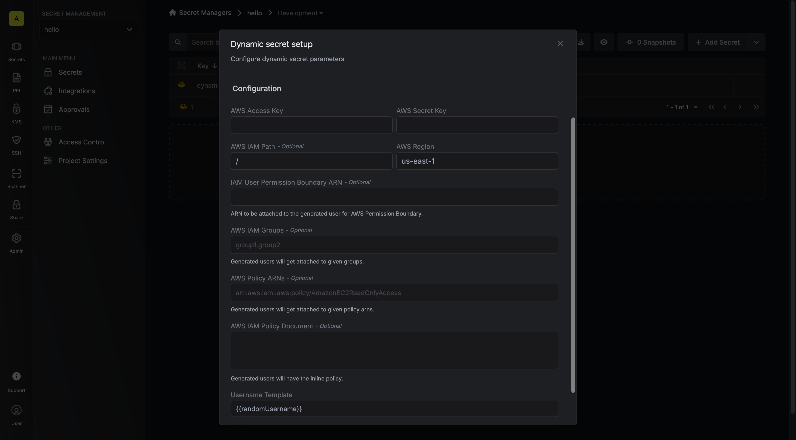

The Infisical AWS IAM dynamic secret allows you to generate AWS IAM Users on demand based on configured AWS policy.

## Prerequisite

Infisical needs an initial AWS IAM user with the required permissions to create sub IAM users. This IAM user will be responsible for managing the lifecycle of new IAM users.

<Accordion title="Managing AWS IAM User minimum permission policy">

```json
{
  "Version": "2012-10-17",
  "Statement": [
    {
      "Effect": "Allow",
      "Action": [
        "iam:AttachUserPolicy",
        "iam:CreateAccessKey",
        "iam:CreateUser",
        "iam:DeleteAccessKey",
        "iam:DeleteUser",
        "iam:DeleteUserPolicy",
        "iam:DetachUserPolicy",
        "iam:GetUser",
        "iam:ListAccessKeys",
        "iam:ListAttachedUserPolicies",
        "iam:ListGroupsForUser",
        "iam:ListUserPolicies",
        "iam:PutUserPolicy",
        "iam:AddUserToGroup",
        "iam:RemoveUserFromGroup"
      ],
      "Resource": ["*"]
    }
  ]
}
```

To minimize managing user access you can attach a resource in format 

> arn:aws:iam::\<account-id\>:user/\<aws-scope-path\>

Replace **\<account id\>** with your AWS account id and **\<aws-scope-path\>** with a path to minimize managing user access.

</Accordion>

## Set up Dynamic Secrets with AWS IAM

<Steps>
  <Step title="Secret Overview Dashboard">
	Navigate to the Secret Overview dashboard and select the environment in which you would like to add a dynamic secret to.
  </Step>
  <Step title="Click on the 'Add Dynamic Secret' button">
	
  </Step>
  <Step title="Select AWS IAM">
	
  </Step>
  <Step title="Provide the inputs for dynamic secret parameters">
	<ParamField path="Secret Name" type="string" required>
		Name by which you want the secret to be referenced
	</ParamField>

	<ParamField path="Default TTL" type="string" required>
		Default time-to-live for a generated secret (it is possible to modify this value when a secret is generate)
	</ParamField>

	<ParamField path="Max TTL" type="string" required>
		Maximum time-to-live for a generated secret
	</ParamField>

	<ParamField path="AWS Access Key" type="string" required>
				The managing AWS IAM User Access Key
  </ParamField>

	<ParamField path="AWS Secret Key" type="string" required>
				The managing AWS IAM User Secret Key
  </ParamField>

	<ParamField path="AWS IAM Path" type="string">
				[IAM AWS Path](https://aws.amazon.com/blogs/security/optimize-aws-administration-with-iam-paths/) to scope created IAM User resource access.
	</ParamField>

	<ParamField path="AWS Region" type="string" required>
				The AWS data center region.
	</ParamField>

	<ParamField path="IAM User Permission Boundary" type="string" required>
				The IAM Policy ARN of the [AWS Permissions Boundary](https://docs.aws.amazon.com/IAM/latest/UserGuide/access_policies_boundaries.html) to attach to IAM users created in the role.
	</ParamField>

	<ParamField path="AWS IAM Groups" type="string">
	The AWS IAM groups that should be assigned to the created users. Multiple values can be provided by separating them with commas	
</ParamField>
 
	<ParamField path="AWS Policy ARNs" type="string">
	The AWS IAM managed policies that should be attached to the created users. Multiple values can be provided by separating them with commas	
</ParamField>

<ParamField path="AWS IAM Policy Document" type="string">
	The AWS IAM inline policy that should be attached to the created users. Multiple values can be provided by separating them with commas	
</ParamField>

	

  </Step>
  <Step title="Click 'Submit'">
  	After submitting the form, you will see a dynamic secret created in the dashboard. 

	
  </Step>
  <Step title="Generate dynamic secrets">
	Once you've successfully configured the dynamic secret, you're ready to generate on-demand credentials. 
	To do this, simply click on the 'Generate' button which appears when hovering over the dynamic secret item. 
	Alternatively, you can initiate the creation of a new lease by selecting 'New Lease' from the dynamic secret lease list section.

	
	

	When generating these secrets, it's important to specify a Time-to-Live (TTL) duration. This will dictate how long the credentials are valid for.

	

	<Tip>
		Ensure that the TTL for the lease fall within the maximum TTL defined when configuring the dynamic secret in step 4.
	</Tip>


	Once you click the `Submit` button, a new secret lease will be generated and the credentials for it will be shown to you. 

	
  </Step>
</Steps>

## Audit or Revoke Leases
Once you have created one or more leases, you will be able to access them by clicking on the respective dynamic secret item on the dashboard. 
This will allow you see the lease details  and delete the lease ahead of its expiration time.


## Renew Leases
To extend the life of the generated dynamic secret lease past its initial time to live, simply click on the **Renew** as illustrated below.


<Warning>
	Lease renewals cannot exceed the maximum TTL set when configuring the dynamic secret
</Warning>
