The Infisical Azure Entra ID dynamic secret allows you to generate Azure Entra ID credentials on demand based on configured role.

## Prerequisites

<Steps>
<Step>
Login to [Microsoft Entra ID](https://entra.microsoft.com/)
</Step>

<Step>
Go to Overview, Copy and store `Tenant Id`
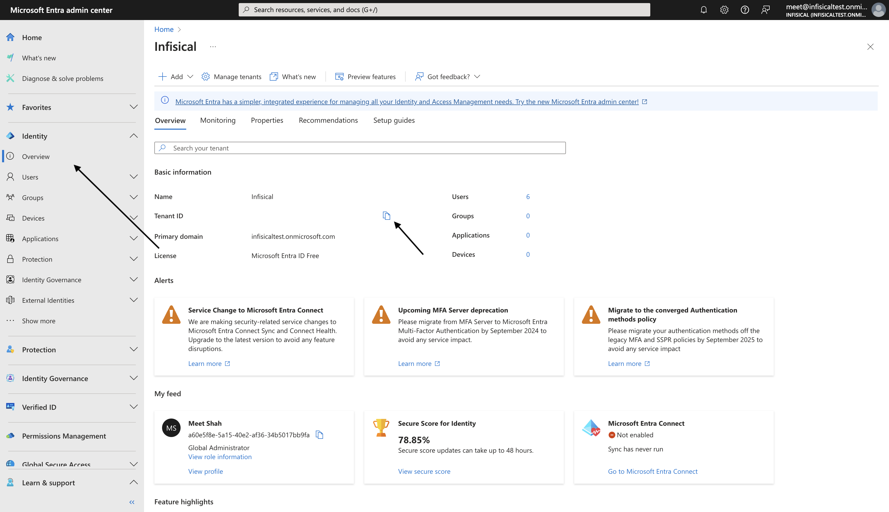
</Step>

<Step>
Go to Applications > App registrations. Select New Registration.
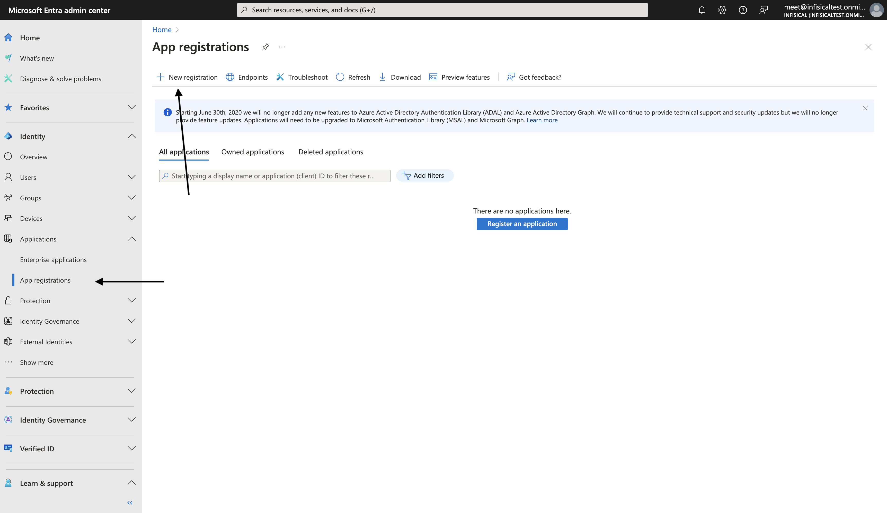
</Step>

<Step>
Enter an application name. Select Register.
</Step>

<Step>
Copy and store `Application Id`.
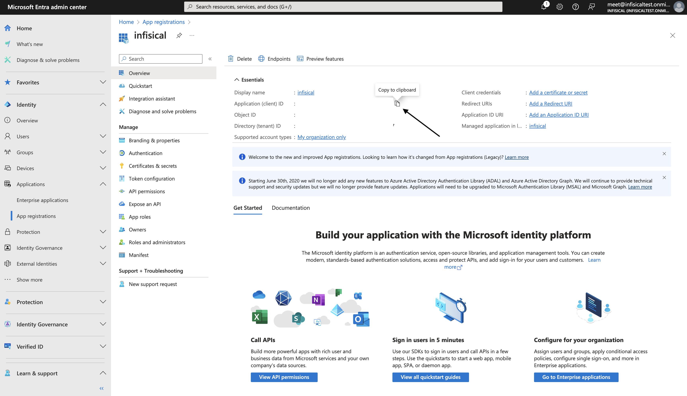
</Step>

<Step>
Go to Clients and Secrets. Select New Client Secret.
</Step>

<Step>
Enter a description, select expiry and select Add.
</Step>

<Step>
Copy and store `Client Secret` value.
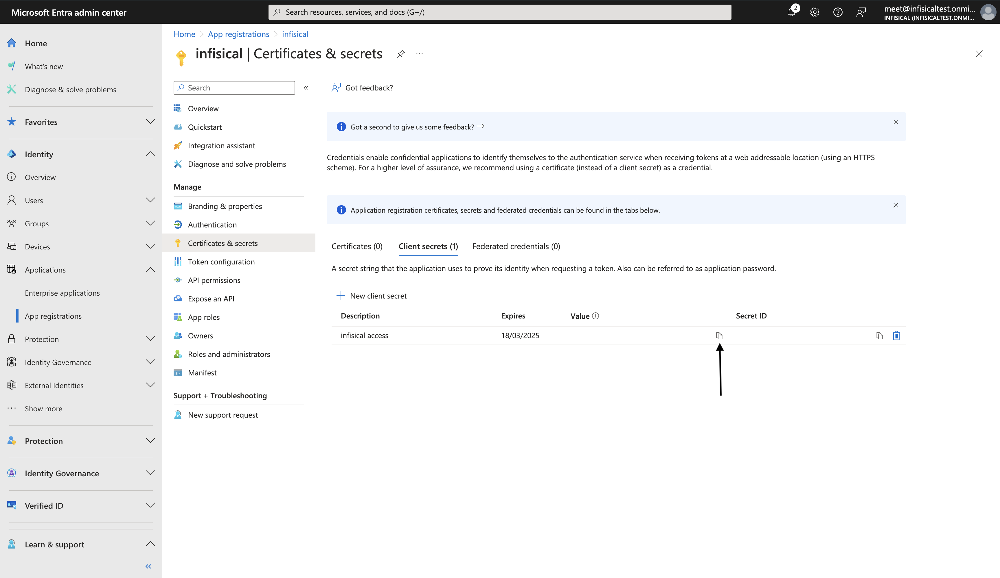
</Step>

<Step>
Go to API Permissions. Select Add a permission.
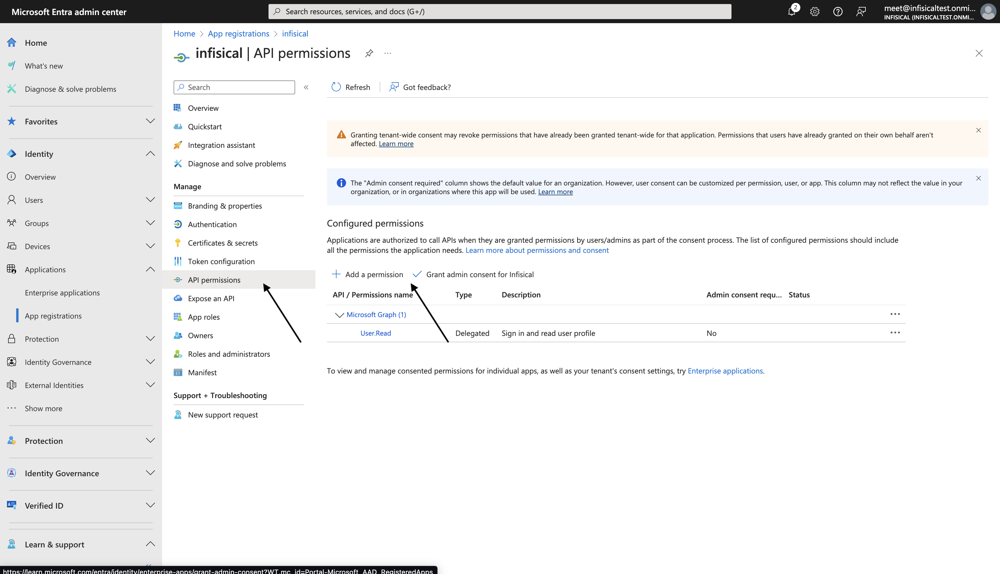
</Step>

<Step>
Select Microsoft Graph.
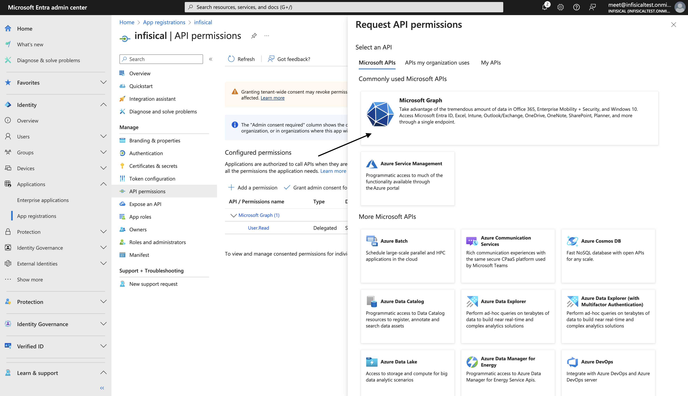
</Step>

<Step>
Select Application Permissions. Search and select `User.ReadWrite.All` and select Add permissions.
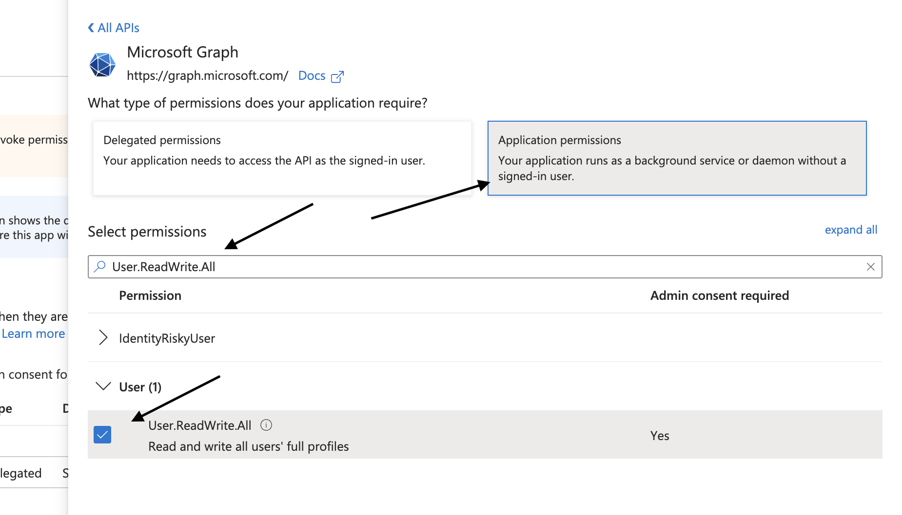
</Step>

<Step>
Select Grant admin consent for app. Select yes to confirm.
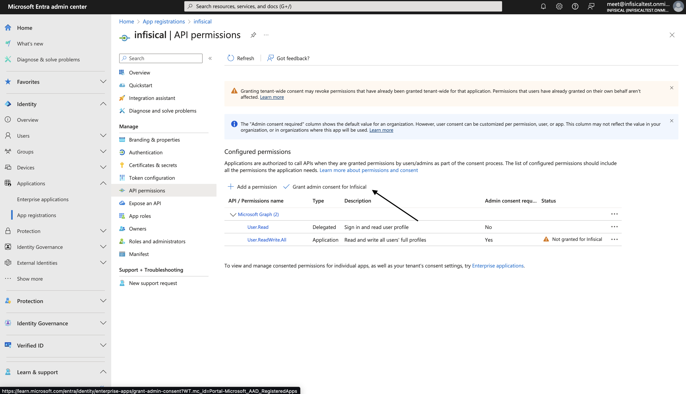
</Step>

<Step>
Go to Dashboard. Select show more.
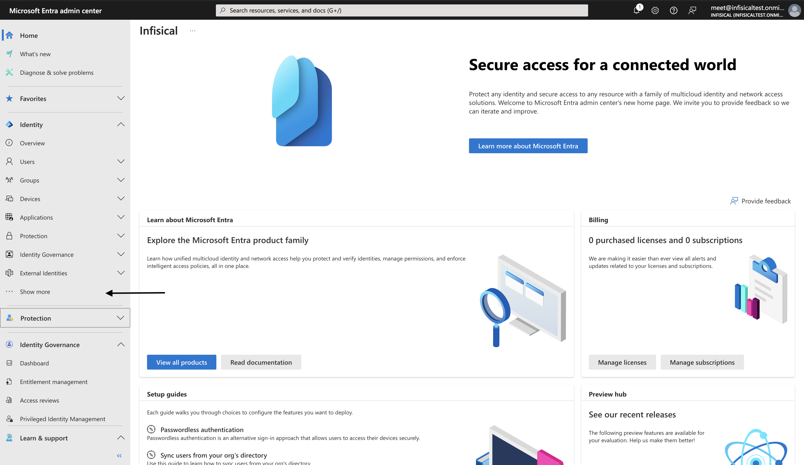
</Step>

<Step>
Select Roles & admins. Search for User Administrator and select it.
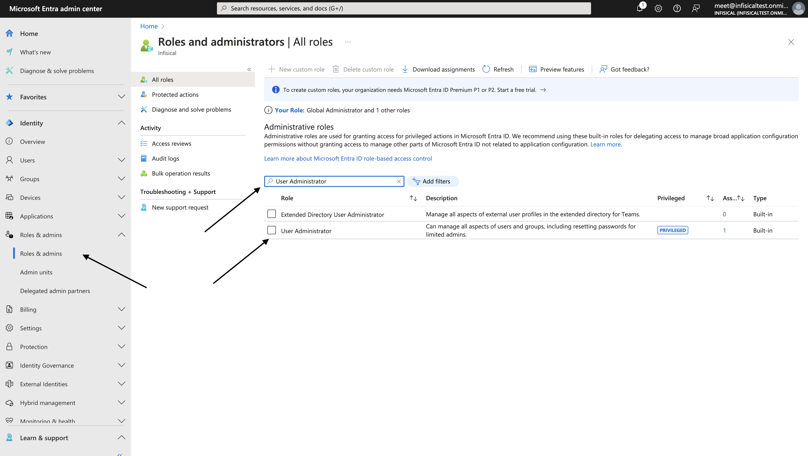
</Step>

<Step>
Select Add assignments. Search for the application name you created and select it. Select Add.
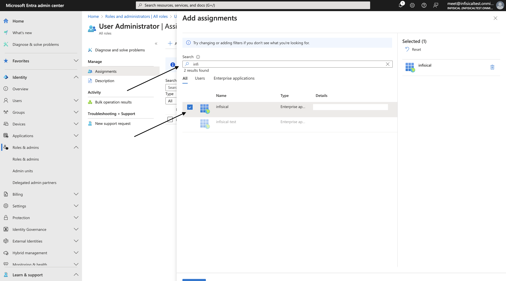
</Step>
</Steps>

## Set up dynamic secrets with Azure Entra ID

<Steps>
  <Step title="Open Secret Overview Dashboard">
	Open the Secret Overview dashboard and select the environment in which you would like to add a dynamic secret.
  </Step>
  <Step title="Click on the 'Add Dynamic Secret' button">
	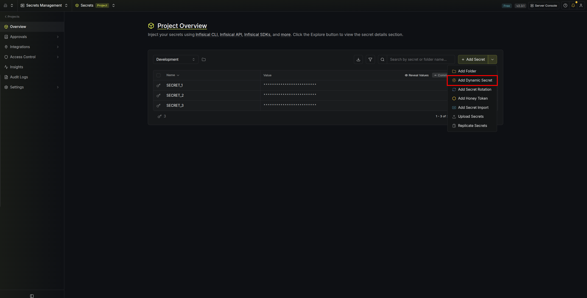
  </Step>
  <Step title="Select 'Azure Entra ID'">
	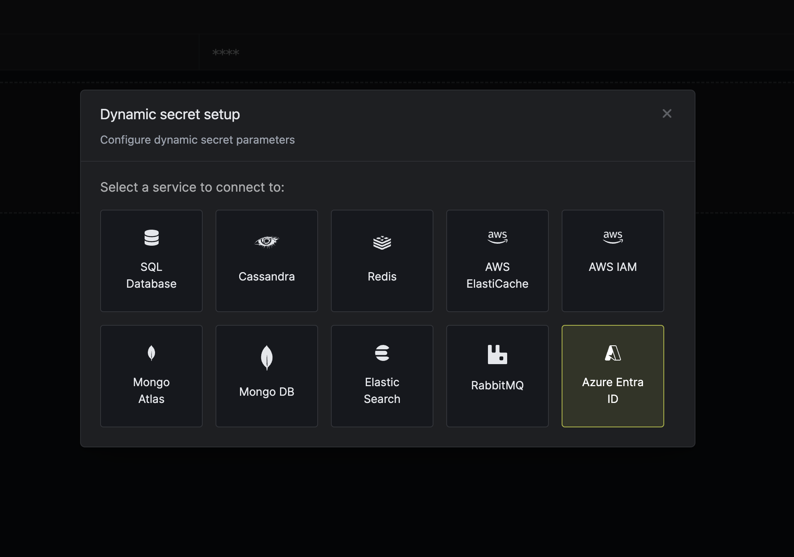
  </Step>
  <Step title="Provide the inputs for dynamic secret parameters">
	<ParamField path="Secret Prefix" type="string" required>
		Prefix for the secrets to be created
	</ParamField>

	<ParamField path="Default TTL" type="string" required>
		Default time-to-live for a generated secret (it is possible to modify this value after a secret is generated)
	</ParamField>

	<ParamField path="Max TTL" type="string" required>
		Maximum time-to-live for a generated secret.
	</ParamField>

	<ParamField path="Tenant ID" type="string" required>
		The Tenant ID of your Azure Entra ID account.
	</ParamField>

	<ParamField path="Application ID" type="string" required>
		The Application ID of the application you created in Azure Entra ID.
	</ParamField>

	<ParamField path="Client Secret" type="string" required>
		The Client Secret of the application you created in Azure Entra ID.
	</ParamField>

	<ParamField path="Users" type="selection" required>
		Multi select list of users to generate secrets for.
	</ParamField>

  </Step>
  <Step title="Click `Submit`">
  	After submitting the form, you'll see a dynamic secret for each user created in the dashboard.
  </Step>

  <Step title="Generate dynamic secrets">
	Once you've successfully configured the dynamic secret, you're ready to generate on-demand credentials.
	To do this, simply select the 'Generate' button which appears when hovering over the dynamic secret item.
	Alternatively, you can initiate the creation of a new lease by selecting 'New Lease' from the dynamic secret lease list section.

	
	

	When generating these secrets, it's important to specify a Time-to-Live (TTL) duration. This will dictate how long the credentials are valid for.

	

	<Tip>
		Ensure that the TTL for the lease falls within the maximum TTL defined when configuring the dynamic secret.
	</Tip>

	Once you click the `Submit` button, a new secret lease will be generated and the credentials from it will be shown to you.

	
  </Step>
</Steps>

## Audit or revoke leases
Once you have created one or more leases, you'll be able to access them by selecting the respective dynamic secret item on the dashboard.
This will allow you to see the expiration time of the lease or delete a lease before its set time to live.

## Renew leases
To extend the life of the generated dynamic secret leases past its initial time to live, simply select the **Renew** button as illustrated below.

<Warning>
	Lease renewals can't exceed the maximum TTL set when configuring the dynamic secret
</Warning>
