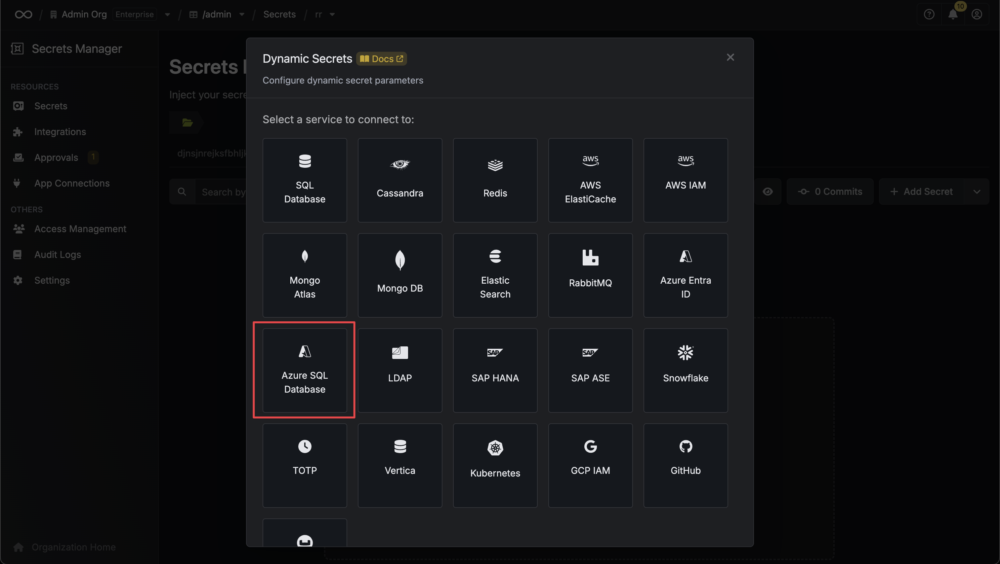
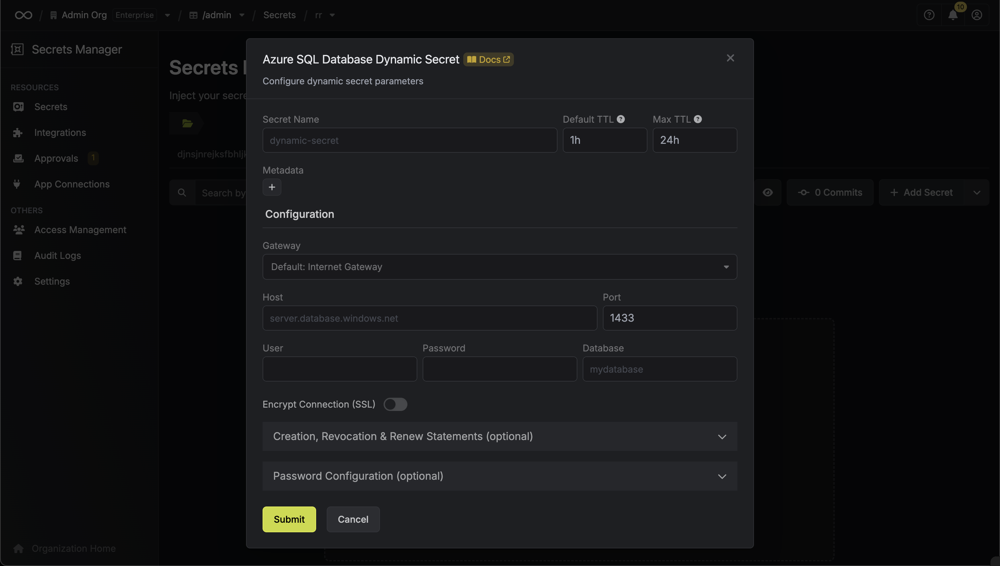
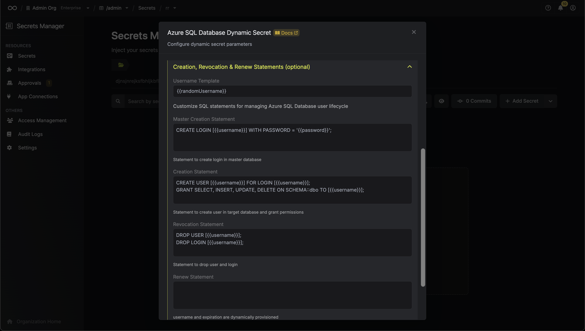

import DynamicSecretUsernameTemplateParamField from "/snippets/documentation/platform/dynamic-secrets/dynamic-secret-username-template-field.mdx";

The Infisical Azure SQL Database dynamic secret allows you to generate Azure SQL Database user credentials on demand based on configured roles.

## How Azure SQL Database Authentication Works

Azure SQL Database uses a two-tier authentication system that differs from traditional SQL Server:

1. **Master Database**: Contains server-level logins that can authenticate to the Azure SQL Database server
2. **User Databases**: Individual databases that contain database users mapped to server logins

When creating dynamic credentials for Azure SQL Database, Infisical performs a two-step process:
1. **Create Login in Master Database**: Creates a server-level login with the specified password
2. **Create User in Target Database**: Creates a database user mapped to the login and grants the necessary permissions

This architecture ensures proper security isolation and follows Azure SQL Database best practices.

## Prerequisite

Create a user with the required permissions in your Azure SQL Database instance. This user will be used to create new accounts on-demand.

The user needs:
- `loginmanager` role in the master database (to create logins)
- `db_owner` role in the target database (to create users and grant permissions)

## Set up Dynamic Secrets with Azure SQL Database

<Steps>
  <Step title="Open Secret Overview Dashboard">
	Open the Secret Overview dashboard and select the environment in which you would like to add a dynamic secret.
  </Step>
  <Step title="Click on the 'Add Dynamic Secret' button">
	
  </Step>
  <Step title="Select `Azure SQL Database`">
	
  </Step>
  <Step title="Provide the inputs for dynamic secret parameters">
	<ParamField path="Secret Name" type="string" required>
		Name by which you want the secret to be referenced
	</ParamField>

    <ParamField path="Default TTL" type="string" required>
    	Default time-to-live for a generated secret (it is possible to modify this value after a secret is generated)
    </ParamField>

    <ParamField path="Max TTL" type="string" required>
    	Maximum time-to-live for a generated secret
    </ParamField>

    <ParamField path="Metadata" type="list" required>
    	List of key/value metadata pairs
    </ParamField>

    <ParamField path="Host" type="string" required>
    	Azure SQL Database server hostname (e.g., myserver.database.windows.net)
    </ParamField>

    <ParamField path="Port" type="number" required>
    	Database port (typically 1433 for Azure SQL Database)
    </ParamField>

    <ParamField path="User" type="string" required>
    	Username that will be used to create dynamic secrets (must have loginmanager role in master and db_owner in target database)
    </ParamField>

    <ParamField path="Password" type="string" required>
    	Password that will be used to create dynamic secrets
    </ParamField>

    <ParamField path="Database" type="string" required>
    	Name of the target database where users will be created and granted permissions
    </ParamField>

    <ParamField path="Encrypt Connection (SSL)" type="boolean">
    	Enable SSL encryption for the database connection (recommended for Azure SQL Database)
    </ParamField>

    <ParamField path="CA(SSL)" type="string">
    	SSL certificate authority certificate. For Azure SQL Database, this is typically not required as Azure manages the certificates.
    </ParamField>

    

  </Step>
  <Step title="Configure SQL Statements">
  

  Azure SQL Database dynamic secrets use predefined SQL statements that follow Azure's security best practices:

  <ParamField path="Master Creation Statement" type="string" default="CREATE LOGIN [{{username}}] WITH PASSWORD = '{{password}}';'">
    SQL statement executed in the master database to create a server-level login. This login allows authentication to the Azure SQL Database server.
  </ParamField>

  <ParamField path="Creation Statement" type="string" default="CREATE USER [{{username}}] FOR LOGIN [{{username}}];\nGRANT SELECT, INSERT, UPDATE, DELETE ON SCHEMA::dbo TO [{{username}}];">
    SQL statement executed in the target database to create a database user and grant permissions. The user is mapped to the login created in the master database.
  </ParamField>

  <ParamField path="Revocation Statement" type="string">
    SQL statements executed when a lease expires or is manually revoked. The system intelligently routes DROP USER commands to the target database and DROP LOGIN commands to the master database for proper cleanup.
  </ParamField>

  <DynamicSecretUsernameTemplateParamField />

  </Step>
  <Step title="Click 'Submit'">
  	After submitting the form, you will see a dynamic secret created in the dashboard.

    <Note>
    	If this step fails, ensure your user has the proper permissions in both the master database (`loginmanager` role) and target database (`db_owner` role).
    </Note>

    

  </Step>
  <Step title="Generate dynamic secrets">
	Once you've successfully configured the dynamic secret, you're ready to generate on-demand credentials.
	To do this, simply click on the 'Generate' button which appears when hovering over the dynamic secret item.
	Alternatively, you can initiate the creation of a new lease by selecting 'New Lease' from the dynamic secret lease list section.

    
    

    When generating these secrets, it's important to specify a Time-to-Live (TTL) duration. This will dictate how long the credentials are valid for.

    

    <Tip>
    	Ensure that the TTL for the lease falls within the maximum TTL defined when configuring the dynamic secret.
    </Tip>

    Once you click the `Submit` button, a new secret lease will be generated and the credentials for it will be shown to you.

    

  </Step>
</Steps>

## Audit or Revoke Leases

Once you have created one or more leases, you will be able to access them by clicking on the respective dynamic secret item on the dashboard.
This will allow you to see the expiration time of the lease or delete the lease before its set time to live.

When a lease is revoked or expires, Infisical automatically:
1. **Drops the user** from the target database
2. **Drops the login** from the master database

This ensures complete cleanup and prevents orphaned credentials.

## Renew Leases

To extend the life of the generated dynamic secret leases past its initial time to live, simply click on the **Renew** button as illustrated below.

<Warning>
  Lease renewals cannot exceed the maximum TTL set when configuring the dynamic secret
</Warning>
