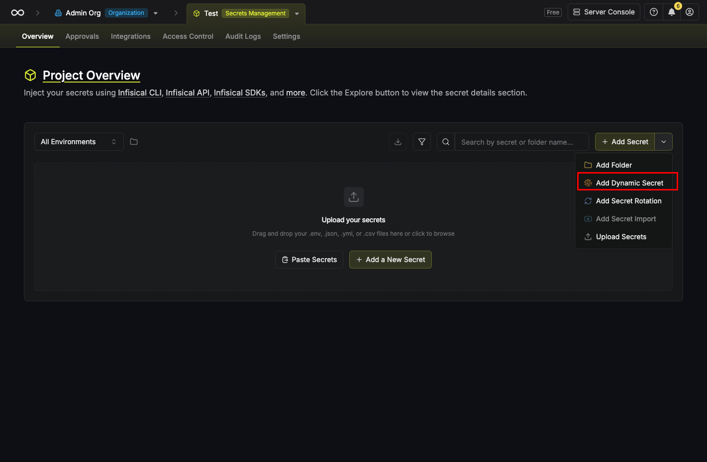
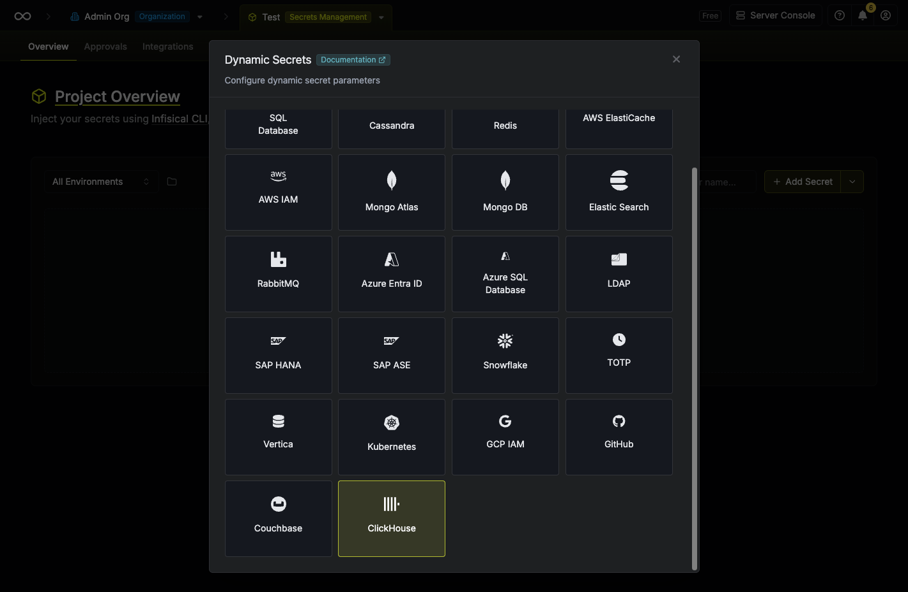
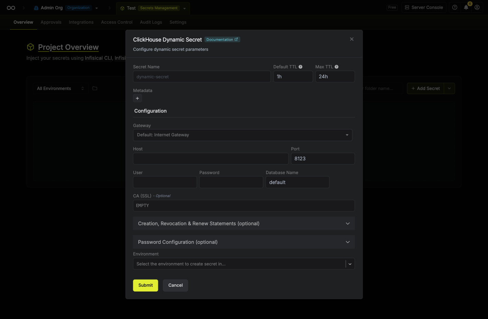
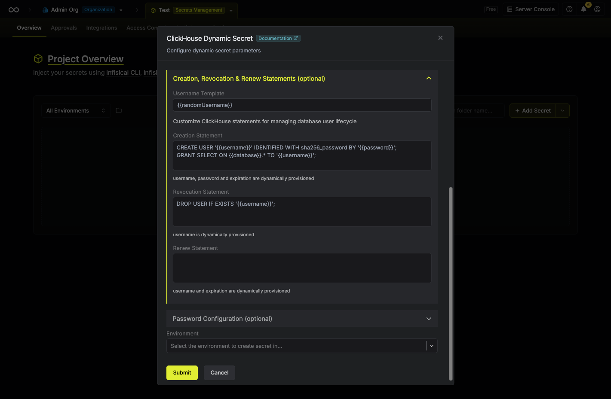
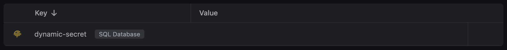

import DynamicSecretUsernameTemplateParamField from "/snippets/documentation/platform/dynamic-secrets/dynamic-secret-username-template-field.mdx";

The Infisical ClickHouse dynamic secret allows you to generate ClickHouse database credentials on demand based on a configured role.

## Prerequisite

Create a user with the required permissions in your ClickHouse instance. This user will be used to create new accounts on-demand.

## Set up Dynamic Secrets with ClickHouse

<Steps>
  <Step title="Open Secret Overview Dashboard">
    Open the Secret Overview dashboard and select the environment in which you would like to add a dynamic secret.
  </Step>
  <Step title="Click on the 'Add Dynamic Secret' button">
    
  </Step>
  <Step title="Select 'ClickHouse'">
    
  </Step>
  <Step title="Provide the inputs for dynamic secret parameters">
    <ParamField path="Secret Name" type="string" required>
      Name by which you want the secret to be referenced
    </ParamField>

    <ParamField path="Default TTL" type="string" required>
      Default time-to-live for a generated secret (it is possible to modify this value after a secret is generated)
    </ParamField>

    <ParamField path="Max TTL" type="string" required>
      Maximum time-to-live for a generated secret
    </ParamField>

    <ParamField path="Metadata" type="list">
      List of key/value metadata pairs
    </ParamField>

    <ParamField path="Host" type="string" required>
      ClickHouse server hostname or IP address (e.g., `https://your-host.clickhouse.cloud`)
    </ParamField>

    <ParamField path="Port" type="number" required>
      ClickHouse HTTP interface port. Use `8123` for HTTP or `8443` for HTTPS / ClickHouse Cloud.
    </ParamField>

    <ParamField path="User" type="string" required>
      Username of the service account that will be used to create dynamic credentials
    </ParamField>

    <ParamField path="Password" type="string" required>
      Password of the service account that will be used to create dynamic credentials
    </ParamField>

    <ParamField path="Database Name" type="string" required>
      Name of the database for which you want to create dynamic secrets. Defaults to `default`.
    </ParamField>

    <ParamField path="Gateway" type="string">
      A gateway may be required if your ClickHouse instance is not publicly accessible (e.g. in a private VPC). Select a configured gateway to route traffic through it.
    </ParamField>

    <ParamField path="CA (SSL)" type="string">
      Only needed if your ClickHouse instance uses a self-signed or private CA certificate. ClickHouse Cloud uses publicly trusted certificates, so no CA is required — just include `https://` in the host. Providing a CA also enables HTTPS automatically.
    </ParamField>

    

  </Step>
  <Step title="(Optional) Modify ClickHouse Statements">
    

    <DynamicSecretUsernameTemplateParamField />

    <ParamField path="Creation Statement" type="string">
      ClickHouse statement used to create the dynamic user. The default creates a user with SHA-256 password authentication and grants `SELECT` on all tables in the configured database.

      Available template variables: `{{username}}`, `{{password}}`, `{{database}}`, `{{expiration}}`.

      ```sql
      CREATE USER '{{username}}' IDENTIFIED WITH sha256_password BY '{{password}}';
      GRANT SELECT ON {{database}}.* TO '{{username}}';
      ```
    </ParamField>

    <ParamField path="Revocation Statement" type="string">
      ClickHouse statement used to revoke the dynamic user when a lease expires or is manually deleted.

      ```sql
      DROP USER IF EXISTS '{{username}}';
      ```
    </ParamField>

    <ParamField path="Renew Statement" type="string">
      Optional ClickHouse statement executed when a lease is renewed. Leave blank if no action is required on renewal.
    </ParamField>

    <Note>
      ClickHouse does not support DDL transactions, so statements are executed sequentially. Ensure that each statement is separated by a semicolon (`;`).
    </Note>

  </Step>
  <Step title="Click 'Submit'">
    After submitting the form, you will see a dynamic secret created in the dashboard.

    <Note>
      If this step fails, verify that the service user has the `CREATE USER`, `DROP USER`, and `GRANT OPTION` privileges, and that the host and port are reachable from Infisical.
    </Note>

    
  </Step>
  <Step title="Generate dynamic secrets">
    Once you've successfully configured the dynamic secret, you're ready to generate on-demand credentials.
    To do this, simply click on the **Generate** button which appears when hovering over the dynamic secret item.
    Alternatively, you can initiate the creation of a new lease by selecting **New Lease** from the dynamic secret lease list section.

    
    

    When generating these secrets, it's important to specify a Time-to-Live (TTL) duration. This will dictate how long the credentials are valid for.

    

    <Tip>
      Ensure that the TTL for the lease falls within the maximum TTL defined when configuring the dynamic secret.
    </Tip>

    Once you click the **Submit** button, a new secret lease will be generated and the credentials from it will be shown to you.

    
  </Step>
</Steps>

## Audit or Revoke Leases
Once you have created one or more leases, you will be able to access them by clicking on the respective dynamic secret item on the dashboard.
This will allow you to see the expiration time of the lease or delete a lease before its set time to live.


## Renew Leases
To extend the life of the generated dynamic secret leases past its initial time to live, simply click on the **Renew** button as illustrated below.


<Warning>
  Lease renewals cannot exceed the maximum TTL set when configuring the dynamic secret
</Warning>
