import DynamicSecretUsernameTemplateParamField from "/snippets/documentation/platform/dynamic-secrets/dynamic-secret-username-template-field.mdx";

The Infisical Couchbase dynamic secret allows you to generate Couchbase Cloud Database user credentials on demand based on configured roles and bucket access permissions.

## Prerequisite

Create an API Key in your Couchbase Cloud following the [official documentation](https://docs.couchbase.com/cloud/get-started/create-account.html#create-api-key).

<Info>The API Key must have permission to manage database users in your Couchbase Cloud organization and project.</Info>

## Set up Dynamic Secrets with Couchbase

<Steps>
  <Step title="Open Secret Overview Dashboard">
	Open the Secret Overview dashboard and select the environment in which you would like to add a dynamic secret.
  </Step>
  <Step title="Click on the 'Add Dynamic Secret' button">
	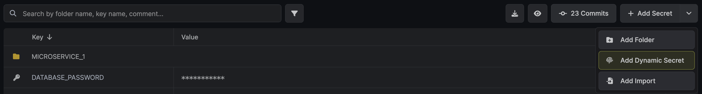
  </Step>
  <Step title="Select Couchbase">
	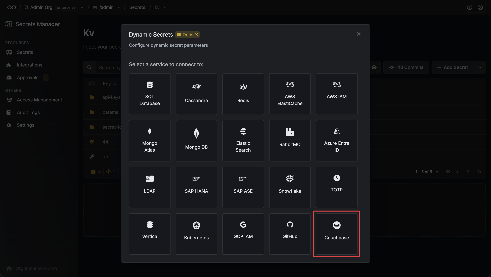
  </Step>
  <Step title="Provide the inputs for dynamic secret parameters">
	<ParamField path="Secret Name" type="string" required>
		Name by which you want the secret to be referenced
	</ParamField>

    <ParamField path="Default TTL" type="string" required>
    	Default time-to-live for a generated secret (it is possible to modify this value after a secret is generated)
    </ParamField>

    <ParamField path="Max TTL" type="string" required>
    	Maximum time-to-live for a generated secret
    </ParamField>

    <ParamField path="URL" type="string" required default="https://cloudapi.cloud.couchbase.com">
    	The Couchbase Cloud API URL
    </ParamField>

    <ParamField path="Organization ID" type="string" required>
    	Your Couchbase Cloud organization ID
    </ParamField>

    <ParamField path="Project ID" type="string" required>
    	Your Couchbase Cloud project ID
    </ParamField>

    <ParamField path="Cluster ID" type="string" required>
    	Your Couchbase Cloud cluster ID where users will be created
    </ParamField>

    <ParamField path="Roles" type="array" required>
       Database credential roles to assign to the generated user. Available options:
    	 - **read**: Read access to bucket data (alias for data_reader)
    	 - **write**: Read and write access to bucket data (alias for data_writer)
    </ParamField>

    <ParamField path="Bucket Access" type="string" required default="*">
       Specify bucket access configuration:
    	 - Use `*` for access to all buckets
    	 - Use comma-separated bucket names (e.g., `bucket1,bucket2,bucket3`) for specific buckets
    	 - Use Advanced Bucket Configuration for granular scope and collection access
    </ParamField>

    <ParamField path="API Key" type="string" required>
    	Your Couchbase Cloud API Key for authentication
    </ParamField>

    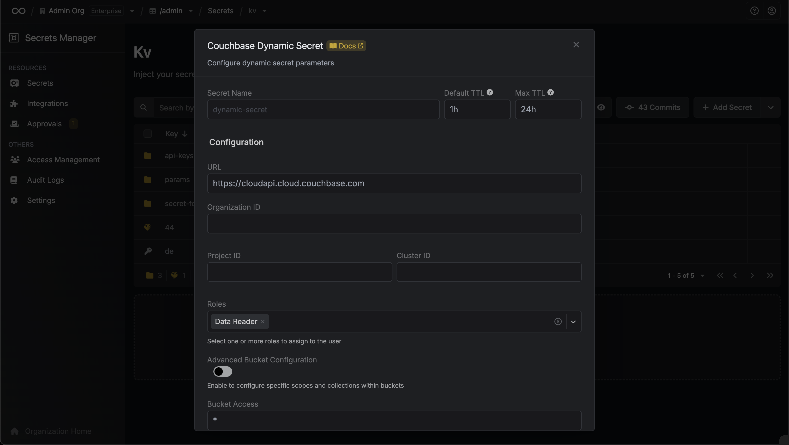

  </Step>
  <Step title="(Optional) Advanced Configuration">

    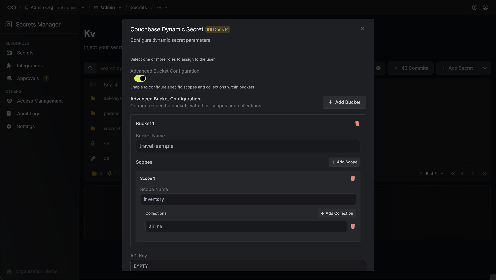

    <ParamField path="Advanced Bucket Configuration" type="boolean" default="false">
        Enable advanced bucket configuration to specify granular access to buckets, scopes, and collections
    </ParamField>

    When Advanced Bucket Configuration is enabled, you can configure:

    <ParamField path="Buckets" type="array">
        List of buckets with optional scope and collection specifications:
        - **Bucket Name**: Name of the bucket (e.g., travel-sample)
        - **Scopes**: Optional array of scopes within the bucket
          - **Scope Name**: Name of the scope (e.g., inventory, _default)
          - **Collections**: Optional array of collection names within the scope
    </ParamField>
    <DynamicSecretUsernameTemplateParamField />
    <ParamField path="Password Configuration" type="object">
        Optional password generation requirements for Couchbase users:
        
        <ParamField path="Password Length" type="number" default="12" min="8" max="128">
            Length of the generated password
        </ParamField>

        <ParamField path="Character Requirements" type="object">
            Minimum required character counts:
            - **Lowercase Count**: Minimum lowercase letters (default: 1)
            - **Uppercase Count**: Minimum uppercase letters (default: 1)
            - **Digit Count**: Minimum digits (default: 1)
            - **Symbol Count**: Minimum special characters (default: 1)
        </ParamField>

        <ParamField path="Allowed Symbols" type="string" default="!@#$%^()_+-=[]{}:,?/~`">
            Special characters allowed in passwords. Cannot contain: `< > ; . * & | £`
        </ParamField>

        <Info>
        Couchbase password requirements: minimum 8 characters, maximum 128 characters, at least 1 uppercase, 1 lowercase, 1 digit, and 1 special character. Cannot contain: `< > ; . * & | £`
        </Info>
    </ParamField>

  </Step>

  <Step title="Click 'Submit'">
  	After submitting the form, you will see a dynamic secret created in the dashboard.

    <Note>
    	If this step fails, you may need to verify your Couchbase Cloud API key permissions and organization/project/cluster IDs.
    </Note>

    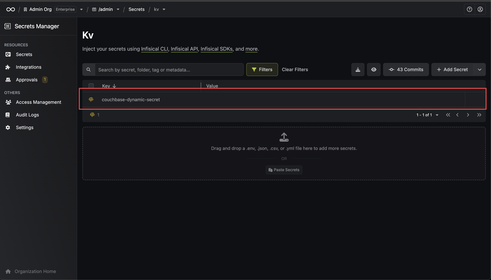

  </Step>
  <Step title="Generate dynamic secrets">
	Once you've successfully configured the dynamic secret, you're ready to generate on-demand credentials.
	To do this, simply click on the 'Generate' button which appears when hovering over the dynamic secret item.
	Alternatively, you can initiate the creation of a new lease by selecting 'New Lease' from the dynamic secret lease list section.

    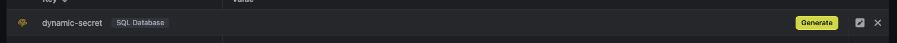
    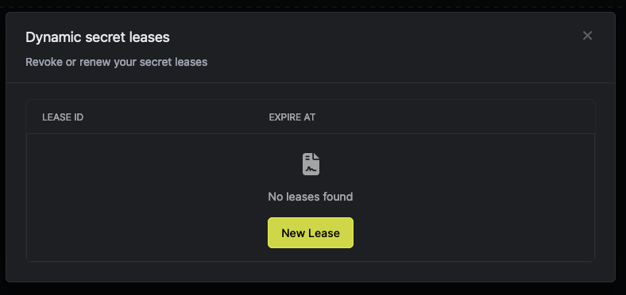

    When generating these secrets, it's important to specify a Time-to-Live (TTL) duration. This will dictate how long the credentials are valid for.

    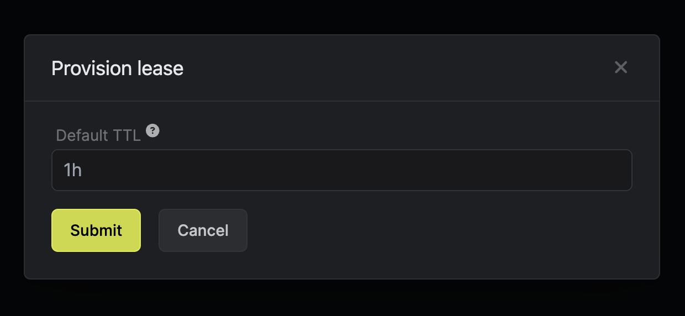

    <Tip>
    	Ensure that the TTL for the lease falls within the maximum TTL defined when configuring the dynamic secret.
    </Tip>

    Once you click the `Submit` button, a new secret lease will be generated and the credentials for it will be shown to you.

    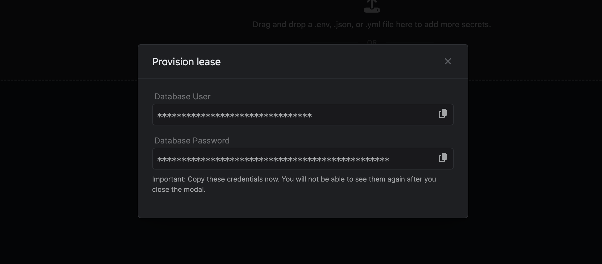

  </Step>
</Steps>

## Advanced Bucket Configuration Examples

The advanced bucket configuration allows you to specify granular access control:

### Example 1: Specific Bucket Access
```json
[
  {
    "name": "travel-sample"
  }
]
```

### Example 2: Bucket with Specific Scopes
```json
[
  {
    "name": "travel-sample",
    "scopes": [
      {
        "name": "inventory"
      },
      {
        "name": "_default"
      }
    ]
  }
]
```

### Example 3: Bucket with Scopes and Collections
```json
[
  {
    "name": "travel-sample",
    "scopes": [
      {
        "name": "inventory",
        "collections": ["airport", "airline"]
      },
      {
        "name": "_default",
        "collections": ["users"]
      }
    ]
  }
]
```

## Audit or Revoke Leases

Once you have created one or more leases, you will be able to access them by clicking on the respective dynamic secret item on the dashboard.
This will allow you to see the expiration time of the lease or delete a lease before its set time to live.

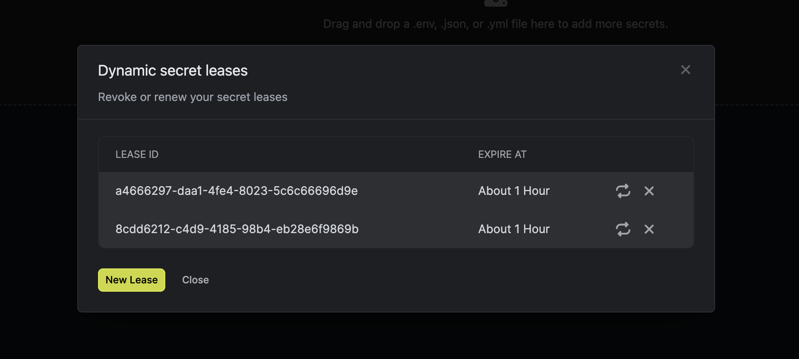

## Renew Leases

To extend the life of the generated dynamic secret leases past its initial time to live, simply click on the **Renew** button as illustrated below.
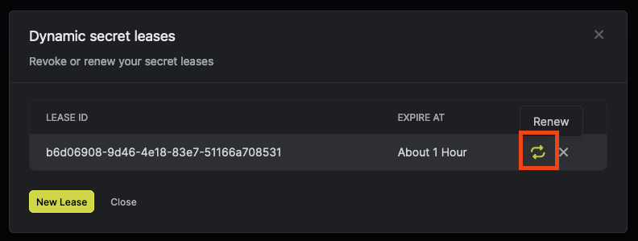

<Warning>
  Lease renewals cannot exceed the maximum TTL set when configuring the dynamic secret
</Warning>

## Couchbase Roles and Permissions

The Couchbase dynamic secret integration supports the following database credential roles:

- **read**: Provides read-only access to bucket data
- **write**: Provides read and write access to bucket data

<Note>
These roles are specifically for database credentials and are different from Couchbase's administrative roles. They provide data-level access to buckets, scopes, and collections based on your configuration.
</Note>

## Troubleshooting

### Common Issues

1. **Invalid API Key**: Ensure your Couchbase Cloud API key has the necessary permissions to manage database users
2. **Invalid Organization/Project/Cluster IDs**: Verify that the provided IDs exist and are accessible with your API key
3. **Role Permission Errors**: Make sure you're using only the supported database credential roles (read, write)
4. **Bucket Access Issues**: Ensure the specified buckets exist in your cluster and are accessible