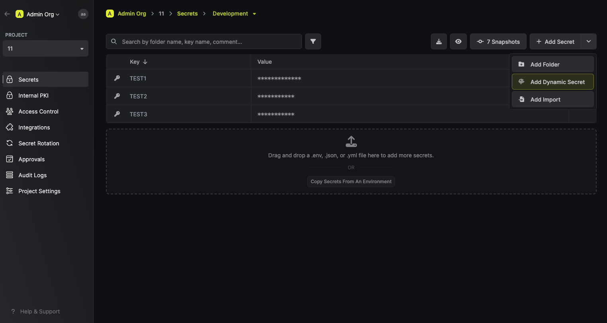
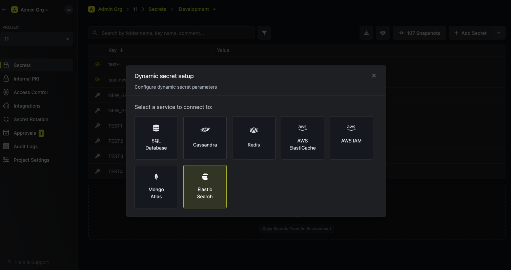

The Infisical Redis dynamic secret allows you to generate Redis Database credentials on demand based on configured role.

## Prerequisites

1. Create a role with at least `manage_security` and `monitor` permissions.
2. Assign the newly created role to your API key or user that you'll use later in the dynamic secret configuration.

<Note>
  For testing purposes, you can also use a highly privileged role like `superuser`, that will have full control over the cluster. This is not recommended in production environments following the principle of least privilege.
</Note>

## Set up Dynamic Secrets with Elastic Search

<Steps>
  <Step title="Open Secret Overview Dashboard">
	Open the Secret Overview dashboard and select the environment in which you would like to add a dynamic secret.
  </Step>
  <Step title="Click on the 'Add Dynamic Secret' button">
	
  </Step>
  <Step title="Select 'Elastic Search'">
	
  </Step>
  <Step title="Provide the inputs for dynamic secret parameters">
	<ParamField path="Secret Name" type="string" required>
		Name by which you want the secret to be referenced
	</ParamField>

	<ParamField path="Default TTL" type="string" required>
		Default time-to-live for a generated secret (it is possible to modify this value when a secret is generate)
	</ParamField>

	<ParamField path="Max TTL" type="string" required>
		Maximum time-to-live for a generated secret.
	</ParamField>

	<ParamField path="Host" type="string" required>
    Your Elastic Search host. This is the endpoint that your instance runs on. _(Example: https://your-cluster-ip)_
	</ParamField>

	<ParamField path="Port" type="string" required>
  The port that your Elastic Search instance is running on. _(Example: 9200)_
	</ParamField>

	<ParamField path="Authentication Method" type="API Key | Username/Password" required>
    Select the authentication method you want to use to connect to your Elastic Search instance.
	</ParamField>

  <ParamField path="Username" type="string" required>
    The username of the user that will be used to provision new dynamic secret leases. Only required if you selected the `Username/Password` authentication method.
	</ParamField>

  <ParamField path="Password" type="string" required>
    The password of the user that will be used to provision new dynamic secret leases. Only required if you selected the `Username/Password` authentication method.
  </ParamField>

  <ParamField path="API Key ID" required>
    The ID of the API key that will be used to provision new dynamic secret leases. Only required if you selected the `API Key` authentication method.
  </ParamField>

  <ParamField path="API Key" required>
    The API key that will be used to provision new dynamic secret leases. Only required if you selected the `API Key` authentication method.
  </ParamField>

	<ParamField path="CA(SSL)" type="string">
		A CA may be required if your DB requires it for incoming connections. This is often the case when connecting to a managed service.
	</ParamField>

  </Step>
  <Step title="(Optional) Modify ElastiCache Statements">
  	If you want to provide specific privileges for the generated dynamic credentials, you can modify the ElastiCache statement to your needs. This is useful if you want to only give access to a specific table(s).

    **Valid JSON attributes for creation statement:**
    - `username` (string): The username of new user that is created when a lease is provisioned. Setting this to `"{{username}}"` will automatically generate a new username for each lease, which is highly recommended.
    - `password` (string): The password of the new user that is created when a lease is provisioned. Setting this to `"{{password}}"` will automatically generate a new password for each lease, which is highly recommended.
    - `refresh` (`true`, `false`, `wait_for`): The refresh state for the newly created user. [Read more here](https://www.elastic.co/guide/en/elasticsearch/reference/current/security-api-put-user.html#security-api-put-user-query-params). Defaults to true.
    - `email` (string): The email of the new user that is created when a lease is provisioned. By default this field is unset.
    - `full_name` (string): The full name of the new user that is created when a lease is provisioned. Defaults to "Managed by Infisical.com".
    - `metadata` (object): Additional metadata to be associated with the new user that is created when a lease is provisioned. By default this field is an empty object.
    - `roles` (array of strings): The roles that the new user that is created when a lease is provisioned will be assigned to. This is a required field. This defaults to `superuser`, which is highly privileged. It is recommended to create a new role with the least privileges required for the lease.

    **Valid JSON attributes for revocation statement:**
    - `username` (string): The username of the user that is being revoked. This is a required field..

	
  </Step>
  <Step title="Click `Submit`">
  	After submitting the form, you will see a dynamic secret created in the dashboard. 

	<Note>
		If this step fails, you may have to add the CA certificate. 
	</Note>

  </Step>
  <Step title="Generate dynamic secrets">
	Once you've successfully configured the dynamic secret, you're ready to generate on-demand credentials. 
	To do this, simply click on the 'Generate' button which appears when hovering over the dynamic secret item. 
	Alternatively, you can initiate the creation of a new lease by selecting 'New Lease' from the dynamic secret lease list section.

	
	

	When generating these secrets, it's important to specify a Time-to-Live (TTL) duration. This will dictate  how long the credentials are valid for.

	

	<Tip>
		Ensure that the TTL for the lease fall within the maximum TTL defined when configuring the dynamic secret.
	</Tip>

	Once you click the `Submit` button, a new secret lease will be generated and the credentials from it will be shown to you. 

	
  </Step>
</Steps>

## Audit or Revoke Leases
Once you have created one or more leases, you will be able to access them by clicking on the respective dynamic secret item on the dashboard. 
This will allow you see the expiration time of the lease or delete a lease before it's set time to live.

## Renew Leases
To extend the life of the generated dynamic secret leases past its initial time to live, simply click on the **Renew** as illustrated below.

<Warning>
	Lease renewals cannot exceed the maximum TTL set when configuring the dynamic secret
</Warning>