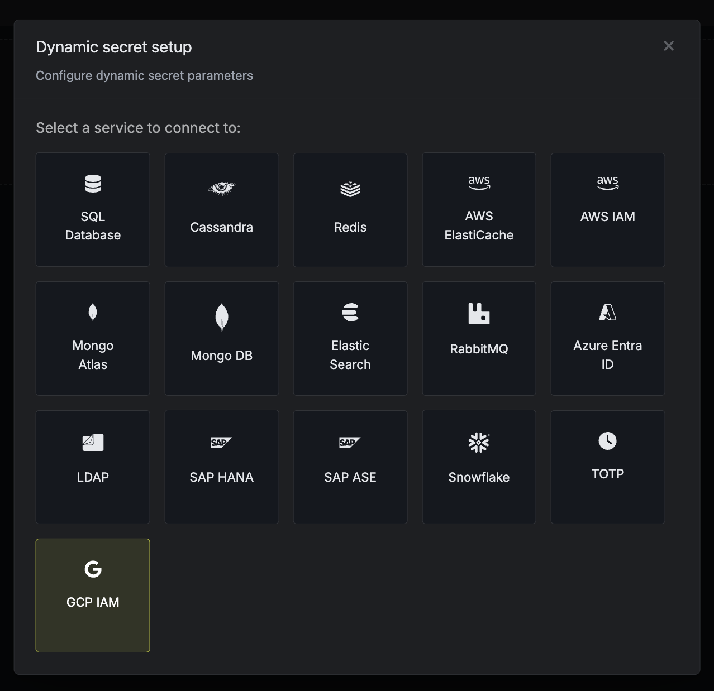

The Infisical GCP IAM dynamic secret allows you to generate GCP service account tokens on demand based on service account permissions.

<Warning>
    GCP service account access tokens cannot be revoked. As such, revoking or regenerating a token does not invalidate the old one; it remains active until it expires.
</Warning>

<Note>
    You must enable the [IAM API](https://console.cloud.google.com/apis/library/iam.googleapis.com) and [IAM Credentials API](https://console.cloud.google.com/apis/library/iamcredentials.googleapis.com) in your GCP console as a prerequisite
</Note>

<Accordion title="Self-Hosted Instance">
    Using the GCP integration on a self-hosted instance of Infisical requires configuring a service account on GCP and
    configuring your instance to use it.

    <Steps>
        <Step title="Enable the IAM Service Account Credentials API">
            
        </Step>
        <Step title="Navigate to IAM & Admin > Service Accounts in Google Cloud Console">
            
        </Step>
        <Step title="Create a Service Account">
            Create a new service account that will be used to impersonate other GCP service accounts for your app connections.
            

            Press "DONE" after creating the service account.
        </Step>
        <Step title="Generate Service Account Key">
            Download the JSON key file for your service account. This will be used to authenticate your instance with GCP.
            
        </Step>
        <Step title="Configure Your Instance">
            1. Copy the entire contents of the downloaded JSON key file.
            2. Set it as a string value for the `INF_APP_CONNECTION_GCP_SERVICE_ACCOUNT_CREDENTIAL` environment variable.

            <Note>
                If you can't directly access and modify environment variables, you can update them using the [Server Admin Console](/documentation/platform/admin-panel/server-admin#environment-variables-tab).
            </Note>

            3. Restart your Infisical instance to apply the changes.
            4. You can now use GCP integration with service account impersonation.
        </Step>
    </Steps>
</Accordion>

## Create GCP Service Account

<Steps>
    <Step title="Navigate to IAM & Admin > Service Accounts">
        
    </Step>
    <Step title="Create Service Account">
        
    </Step>
    <Step title="Configure Service Account Permissions">
        When you assign specific roles and permissions to this service account, any tokens generated through Infisical's dynamic secrets functionality will inherit these exact permissions. This means that applications using these dynamically generated tokens will have the same access capabilities as defined by the service account's role assignments, ensuring proper access control while maintaining the principle of least privilege.

        After configuring the appropriate roles, press "DONE".
    </Step>
    <Step title="Enable Service Account Impersonation">
        To enable service account impersonation, you'll need to grant the **Service Account Token Creator** role to the Infisical instance's service account. This configuration allows Infisical to securely impersonate the new service account.
        - Navigate to the IAM & Admin > Service Accounts section in your Google Cloud Console
        - Select the newly created service account
        - Click on the "PERMISSIONS" tab
        - Click "Grant Access" to add a new principal

        If you're using Infisical Cloud US, use the following service account: `infisical-us@infisical-us.iam.gserviceaccount.com`

        If you're using Infisical Cloud EU, use the following service account: `infisical-eu@infisical-eu.iam.gserviceaccount.com`

        If you're self-hosting, follow the "Self-Hosted Instance" guide at the top of the page and then use service account you created

        
    </Step>
</Steps>

## Set up Dynamic Secrets with GCP IAM

<Steps>
  <Step title="Open Secret Overview Dashboard">
	Open the Secret Overview dashboard and select the environment in which you would like to add a dynamic secret.
  </Step>
  <Step title="Click on the 'Add Dynamic Secret' button">
	
  </Step>
  <Step title="Select 'GCP IAM'">
	
  </Step>
  <Step title="Provide the inputs for dynamic secret parameters">
    	<ParamField path="Secret Name" type="string" required>
    		Name by which you want the secret to be referenced
    	</ParamField>
    	<ParamField path="Default TTL" type="string" required>
    		Default time-to-live for a generated secret (it is possible to modify this value after a secret is generated)
    	</ParamField>
    	<ParamField path="Max TTL" type="string" required>
    		Maximum time-to-live for a generated secret
    	</ParamField>
    	<ParamField path="Service Account Email" type="string" required>
       		The email tied to the service account created in earlier steps.
    	</ParamField>
  </Step>
  <Step title="Click `Submit`">
      After submitting the form, you will see a dynamic secret created in the dashboard.
  </Step>

  <Step title="Generate dynamic secrets">
    	Once you've successfully configured the dynamic secret, you're ready to generate on-demand credentials.
    	To do this, simply click on the 'Generate' button which appears when hovering over the dynamic secret item.
    	Alternatively, you can initiate the creation of a new lease by selecting 'New Lease' from the dynamic secret lease list section.

    	
    	

    	When generating these secrets, it's important to specify a Time-to-Live (TTL) duration. This will dictate how long the credentials are valid for.

    	

    	<Tip>
    		Ensure that the TTL for the lease falls within the maximum TTL defined when configuring the dynamic secret.
    	</Tip>

    	Once you click the `Submit` button, a new secret lease will be generated and the credentials from it will be shown to you.

    	
  </Step>
</Steps>

## Audit or Revoke Leases

Once you have created one or more leases, you will be able to access them by clicking on the respective dynamic secret item on the dashboard.

This will allow you to see the expiration time of the lease or delete a lease before its set time to live.

## Renew Leases

To extend the life of the generated dynamic secret leases past its initial time to live, simply click on the **Renew** button as illustrated below.

<Warning>
	Lease renewals cannot exceed the maximum TTL set when configuring the dynamic secret
</Warning>
