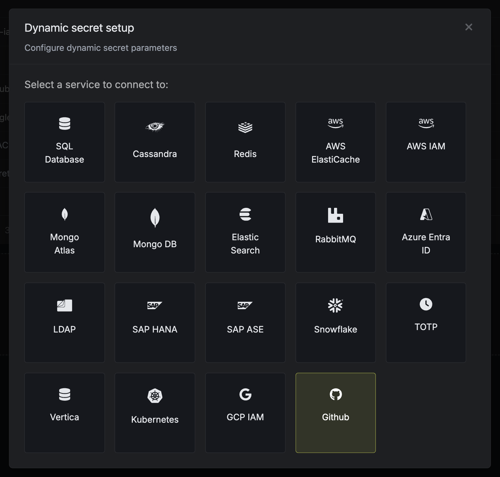

The Infisical GitHub dynamic secret allows you to generate short-lived tokens for a GitHub App on demand based on service account permissions.

## Setup GitHub App

<Steps>
    <Step title="Create an application on GitHub">
        Navigate to [GitHub App settings](https://github.com/settings/apps) and click **New GitHub App**.

        

        Give the application a name and a homepage URL. These values do not need to be anything specific.

        Disable webhook by unchecking the Active checkbox.
        

        Configure the app's permissions to grant the necessary access for the dynamic secret's short-lived tokens based on your use case.

        Create the GitHub Application.
        

        <Note>
            If you have a GitHub organization, you can create an application under it
            in your organization Settings > Developer settings > GitHub Apps > New GitHub App.
        </Note>
    </Step>
    <Step title="Save app credentials">
        Copy the **App ID** and generate a new **Private Key** for your GitHub Application.
        

        Save these for later steps.
    </Step>
    <Step title="Install app">
        Install your application to whichever repositories and organizations that you want the dynamic secret to access.
        

        

        Once you've installed the app, **copy the installation ID** from the URL and save it for later steps.
        
    </Step>
</Steps>

## Set up Dynamic Secrets with GitHub

<Steps>
  <Step title="Open Secret Overview Dashboard">
	Open the Secret Overview dashboard and select the environment in which you would like to add a dynamic secret.
  </Step>
  <Step title="Click on the 'Add Dynamic Secret' button">
	
  </Step>
  <Step title="Select 'GitHub'">
	
  </Step>
  <Step title="Provide the inputs for dynamic secret parameters">
    	<ParamField path="Secret Name" type="string" required>
    		Name by which you want the secret to be referenced
    	</ParamField>
    	<ParamField path="App ID" type="string" required>
       		The ID of the app created in earlier steps.
    	</ParamField>
    	<ParamField path="App Private Key PEM" type="string" required>
       		The Private Key of the app created in earlier steps.
    	</ParamField>
    	<ParamField path="Installation ID" type="string" required>
       		The ID of the installation from earlier steps.
    	</ParamField>
  </Step>
  <Step title="Click `Submit`">
      After submitting the form, you will see a dynamic secret created in the dashboard.
  </Step>

  <Step title="Generate dynamic secrets">
    	Once you've successfully configured the dynamic secret, you're ready to generate on-demand credentials.
    	To do this, simply click on the 'Generate' button which appears when hovering over the dynamic secret item.
    	Alternatively, you can initiate the creation of a new lease by selecting 'New Lease' from the dynamic secret lease list section.

    	
    	

    	When generating these secrets, the TTL will be fixed to 1 hour.

    	

    	Once you click the `Submit` button, a new secret lease will be generated and the credentials from it will be shown to you.

    	
  </Step>
</Steps>

## Audit or Revoke Leases

Once you have created one or more leases, you will be able to access them by clicking on the respective dynamic secret item on the dashboard.

This will allow you to see the expiration time of the lease or delete a lease before its set time to live.

<Warning>
    GitHub App tokens cannot be revoked. As such, revoking a token on Infisical does not invalidate the GitHub token; it remains active until it expires.
</Warning>

## Renew Leases

<Note>
    GitHub App tokens cannot be renewed because they are fixed to a lifetime of 1 hour.
</Note>
