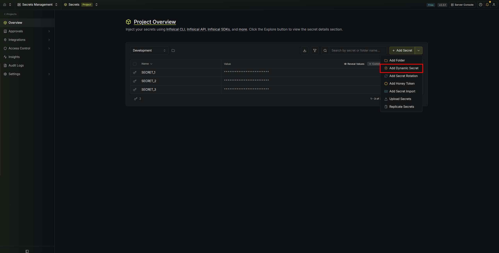

The Infisical IBM API Connect dynamic secret allows you to generate IBM API Connect application credentials (Client ID and Client Secret) on demand based on a configured application.

## Prerequisites

1. You need an active IBM API Connect subscription with a running instance.
2. You need at least one organization, catalog, and application already configured in your IBM API Connect instance.

## Create an API Key in IBM API Connect

<Steps>
  <Step title="Navigate to the Subscriptions page in the IBM SaaS Console and click 'View instances' under your API Connect subscription.">
    
  </Step>
  <Step title="Click 'Open' to open your API Connect instance.">
    
  </Step>
  <Step title="Once inside the API Connect dashboard, click on your profile icon in the top-right corner and select 'My API Keys'.">
    
  </Step>
  <Step title="Click the 'Add' button to create a new API key.">
    
  </Step>
  <Step title="Fill in the API key details and click 'Create'.">
    

    1. **Title** — Give the API key a descriptive name (e.g. `infisical-api-key`).
    2. **Description** — Add a description for the key (e.g. `Key used by Infisical for creating Dynamic Secrets`).
    3. **API key timeout** — Set the timeout to `0` to disable expiration, or configure it based on your needs.
    4. **Enable multiple use** — Check this box to allow the API key to be used multiple times.

    Click **Create** to generate the API key. Copy the generated key and save it securely — you will need it when configuring the dynamic secret in Infisical.
  </Step>
  <Step title="Collect the Instance URL, Client ID, and Client Secret from the 'My API Keys' page.">
    

    1. **Instance URL** — Copy the server URL shown in the CLI command (e.g. `https://platform-api.trial.apiconnect.automation.ibm.com`).
    2. **Client ID** — Found in the `client_id` field of the "Authenticating for the platform REST API" curl snippet.
    3. **Client Secret** — Found in the `client_secret` field of the same curl snippet.

    Save these values along with the API key — you will need all four when configuring the dynamic secret in Infisical.
  </Step>
</Steps>

## Set up Dynamic Secrets with IBM API Connect

<Steps>
  <Step title="Open Secret Overview Dashboard">
    Open the Secret Overview dashboard and select the environment in which you would like to add a dynamic secret.
  </Step>
  <Step title="Click on the 'Add Dynamic Secret' button">
    
  </Step>
  <Step title="Select IBM API Connect">
    
  </Step>
  <Step title="Provide the inputs for dynamic secret parameters">
    <ParamField path="Secret Name" type="string" required>
      Name by which you want the secret to be referenced
    </ParamField>

    <ParamField path="Default TTL" type="string" required>
      Default time-to-live for a generated secret (it is possible to modify this value after a secret is generated)
    </ParamField>

    <ParamField path="Max TTL" type="string" required>
      Maximum time-to-live for a generated secret
    </ParamField>

    <ParamField path="Instance URL" type="string" required>
      The URL of your IBM API Connect platform API (e.g. `https://platform-api.trial.apiconnect.automation.ibm.com`).
    </ParamField>

    <ParamField path="API Key" type="string" required>
      The IBM API Connect API key you created in the previous steps. This will be used to authenticate and provision dynamic secret leases.
    </ParamField>

    <ParamField path="Client ID" type="string" required>
      The client ID used for authenticating with the IBM API Connect platform REST API.
    </ParamField>

    <ParamField path="Client Secret" type="string" required>
      The client secret used for authenticating with the IBM API Connect platform REST API.
    </ParamField>

    Once the credentials are filled in, Infisical will automatically fetch your available organizations, catalogs, and applications.

    <ParamField path="Organization" type="string" required>
      The IBM API Connect organization under which the application credentials will be created.
    </ParamField>

    <ParamField path="Catalog" type="string" required>
      The catalog that owns the application for which credentials will be created.
    </ParamField>

    <ParamField path="Application" type="string" required>
      The application for which dynamic credentials will be generated. Each lease creates a new credential pair on this application.
    </ParamField>
  </Step>
  <Step title="Click `Submit`">
    After submitting the form, you will see a dynamic secret created in the dashboard.

    
  </Step>
  <Step title="Generate dynamic secrets">
    Once you've successfully configured the dynamic secret, you're ready to generate on-demand credentials.
    To do this, simply click on the 'Generate' button which appears when hovering over the dynamic secret item.
    Alternatively, you can initiate the creation of a new lease by selecting 'New Lease' from the dynamic secret lease list section.

    
    

    When generating these secrets, it's important to specify a Time-to-Live (TTL) duration. This will dictate how long the credentials are valid for.

    

    <Tip>
      Ensure that the TTL for the lease falls within the maximum TTL defined when configuring the dynamic secret.
    </Tip>

    Once you click the `Submit` button, a new secret lease will be generated and you will be presented with the generated **Client ID** and **Client Secret**.

    <Warning>
      Copy the credentials immediately — you will not be able to see them again after closing the modal.
    </Warning>
  </Step>
</Steps>

## Audit or Revoke Leases
Once you have created one or more leases, you will be able to access them by clicking on the respective dynamic secret item on the dashboard.
This will allow you to see the expiration time of the lease or revoke a lease before its time to live expires.
When a lease is revoked (either manually or by TTL expiration), Infisical will delete the corresponding application credential from IBM API Connect.

## Renew Leases
To extend the life of the generated dynamic secret leases past its initial time to live, simply click on the **Renew** button as illustrated below.

<Warning>
  Lease renewals cannot exceed the maximum TTL set when configuring the dynamic secret.
</Warning>
