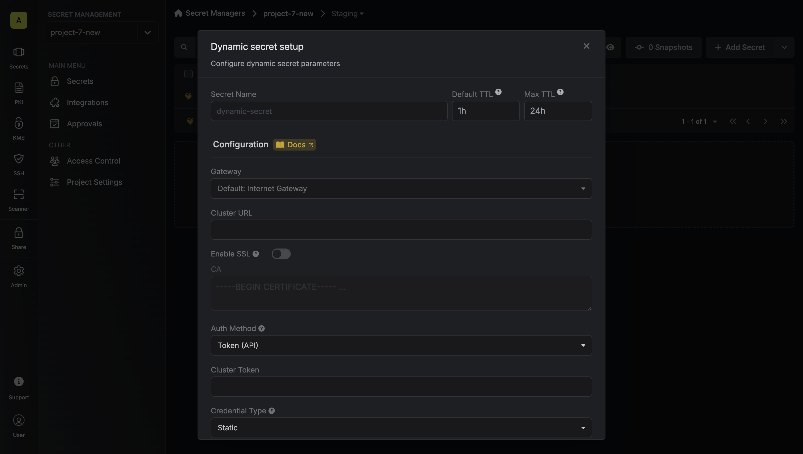
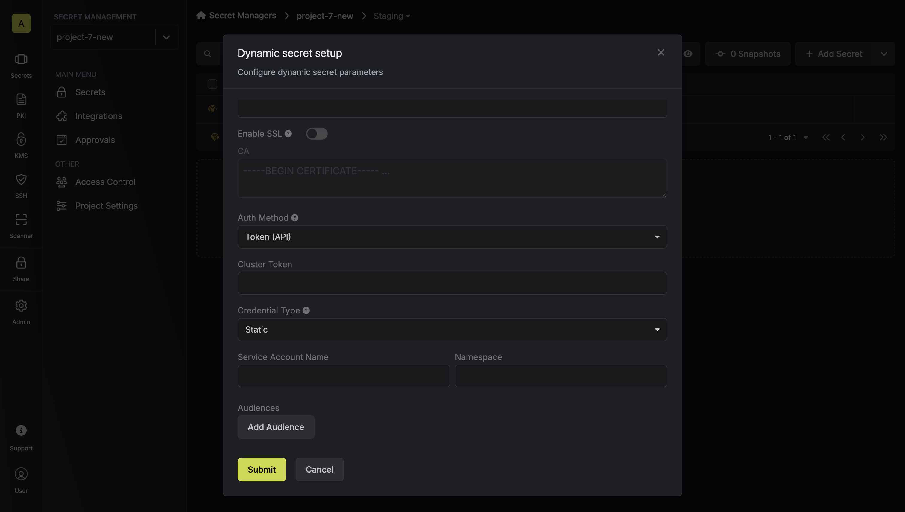

The Infisical Kubernetes dynamic secret allows you to generate short-lived service account tokens on demand.

## Overview

The Kubernetes dynamic secret feature enables you to generate short-lived service account tokens for your Kubernetes clusters. This is particularly useful for:

- **Secure Access Management**: Instead of using long-lived service account tokens, you can generate short-lived tokens that automatically expire, reducing the risk of token exposure.
- **Temporary Access**: Generate tokens with specific TTLs (Time To Live) for temporary access to your Kubernetes clusters.
- **Audit Trail**: Each token generation is tracked, providing better visibility into who accessed your cluster and when.
- **Integration with Private Clusters**: Seamlessly work with private Kubernetes clusters using Infisical's Gateway feature.

<Note>
  Kubernetes service account tokens cannot be revoked once issued. This is why
  it's important to use short TTLs and carefully manage token generation. The
  tokens will automatically expire after their TTL period.
</Note>

<Note>
  Kubernetes service account tokens are JWTs (JSON Web Tokens) with a fixed
  expiration time. Once a token is generated, its lifetime cannot be extended.
  If you need longer access, you'll need to generate a new token.
</Note>

This feature is ideal for scenarios where you need to:

- Provide temporary access to developers or CI/CD pipelines
- Rotate service account tokens frequently
- Maintain a secure audit trail of cluster access
- Manage access to multiple Kubernetes clusters

## Set up Dynamic Secrets with Kubernetes

<Steps>
  <Step title="Open Secret Overview Dashboard">
    Open the Secret Overview dashboard and select the environment in which you would like to add a dynamic secret.
  </Step>
  <Step title="Click on the 'Add Dynamic Secret' button">
    
  </Step>
  <Step title="Select Kubernetes">
    
  </Step>
  <Step title="Choose your configuration options">
    Before proceeding with the setup, you'll need to make two key decisions:

    1. **Credential Type**: How you want to manage service accounts
       - **Static**: Use an existing service account with predefined permissions
       - **Dynamic**: Create temporary service accounts with specific role assignments

    2. **Authentication Method**: How you want to authenticate with the cluster
       - **Token (API)**: Use a service account token for direct API access
       - **Gateway**: Use an Infisical Gateway deployed in your cluster

    <Tabs>
      <Tab title="Static Credentials">
        Static credentials generate service account tokens for a predefined service account. This is useful when you want to:
        - Generate tokens for an existing service account
        - Maintain consistent permissions across token generations
        - Use a service account that already has the necessary RBAC permissions

        ### Prerequisites

        - A Kubernetes cluster with a service account
        - Cluster access token with permissions to create service account tokens
        - (Optional) [Gateway](/documentation/platform/gateways/overview) for private cluster access

        ### Authentication Setup

        Choose your authentication method:

        <AccordionGroup>
          <Accordion title="Token (API) Authentication">
            This method uses a service account token to authenticate with the Kubernetes cluster. It's suitable when:
            - You want to use a specific service account token that you've created
            - You're working with a public cluster or have network access to the cluster's API server
            - You want to explicitly control which service account is used for operations

            <Note>
              With Token (API) authentication, Infisical uses the provided service account token
              to make API calls to your Kubernetes cluster. This token must have the necessary
              permissions to generate tokens for the target service account.
            </Note>

            1. Create a service account:
            ```yaml infisical-service-account.yaml
            apiVersion: v1
            kind: ServiceAccount
            metadata:
              name: infisical-token-requester
              namespace: default
            ```

            ```bash
            kubectl apply -f infisical-service-account.yaml
            ```

            2. Set up RBAC permissions:
            ```yaml rbac.yaml
            apiVersion: rbac.authorization.k8s.io/v1
            kind: ClusterRole
            metadata:
              name: tokenrequest
            rules:
              - apiGroups: [""]
                resources:
                  - "serviceaccounts/token"
                  - "serviceaccounts"
                verbs:
                  - "create"
                  - "get"
            ---
            apiVersion: rbac.authorization.k8s.io/v1
            kind: ClusterRoleBinding
            metadata:
              name: tokenrequest
            roleRef:
              apiGroup: rbac.authorization.k8s.io
              kind: ClusterRole
              name: tokenrequest
            subjects:
              - kind: ServiceAccount
                name: infisical-token-requester
                namespace: default
            ```

            ```bash
            kubectl apply -f rbac.yaml
            ```

            3. Create and obtain the token:
            ```yaml service-account-token.yaml
            apiVersion: v1
            kind: Secret
            type: kubernetes.io/service-account-token
            metadata:
              name: infisical-token-requester-token
              annotations:
                kubernetes.io/service-account.name: "infisical-token-requester"
            ```

            ```bash
            kubectl apply -f service-account-token.yaml
            kubectl patch serviceaccount infisical-token-requester -p '{"secrets": [{"name": "infisical-token-requester-token"}]}' -n default
            kubectl get secret infisical-token-requester-token -n default -o=jsonpath='{.data.token}' | base64 --decode
            ```
          </Accordion>
          <Accordion title="Gateway Authentication">
            This method uses an Infisical Gateway deployed in your Kubernetes cluster. It's ideal when:
            - You want to avoid storing static service account tokens
            - You prefer to use the Gateway's pre-configured service account
            - You want centralized management of cluster operations

            <Note>
              With Gateway authentication, Infisical communicates with the Gateway, which then
              uses its own service account to make API calls to the Kubernetes API server.
              The Gateway's service account must have the necessary permissions to generate
              tokens for the target service account.
            </Note>

            <Note>
              When using Gateway authentication, the Gateway will access the Kubernetes API server
              using its internal cluster URL (typically https://kubernetes.default.svc) and TLS configuration.
              You don't need to specify these values separately in the dynamic secret configuration.
            </Note>

            1. Deploy the Infisical Gateway in your cluster
            2. Set up RBAC permissions for the Gateway's service account:
            ```yaml rbac.yaml
            apiVersion: rbac.authorization.k8s.io/v1
            kind: ClusterRole
            metadata:
              name: tokenrequest
            rules:
              - apiGroups: [""]
                resources:
                  - "serviceaccounts/token"
                  - "serviceaccounts"
                verbs:
                  - "create"
                  - "get"
            ---
            apiVersion: rbac.authorization.k8s.io/v1
            kind: ClusterRoleBinding
            metadata:
              name: tokenrequest
            roleRef:
              apiGroup: rbac.authorization.k8s.io
              kind: ClusterRole
              name: tokenrequest
            subjects:
              - kind: ServiceAccount
                name: infisical-gateway
                namespace: infisical
            ```

            ```bash
            kubectl apply -f rbac.yaml
            ```
          </Accordion>
        </AccordionGroup>

      </Tab>

      <Tab title="Dynamic Credentials">
        Dynamic credentials create a temporary service account, assign it to a defined role/cluster-role, and generate a service account token. This is useful when you want to:
        - Create temporary service accounts with specific permissions
        - Automatically clean up service accounts after token expiration
        - Assign different roles to different users or applications
        - Maintain strict control over service account permissions
        - Support multiple namespaces with a single dynamic secret configuration

        ### Prerequisites

        - A Kubernetes cluster with a service account
        - Cluster access token with permissions to create service accounts and manage RBAC
        - (Optional) [Gateway](/documentation/platform/gateways/overview) for private cluster access

        ### Namespace Support

        When configuring a dynamic secret, you can specify multiple allowed namespaces as a comma-separated list. During lease creation, you can then specify which namespace to use from this allowed list. This provides flexibility while maintaining security by:

        - Allowing a single dynamic secret configuration to support multiple namespaces
        - Restricting service account creation to only the specified allowed namespaces
        - Enabling fine-grained control over which namespaces can be used for each lease

        For example, if you configure a dynamic secret with allowed namespaces "default,kube-system,monitoring", you can create leases that use any of these namespaces while preventing access to other namespaces in your cluster.

        ### Authentication Setup

        Choose your authentication method:

        <AccordionGroup>
          <Accordion title="Token (API) Authentication">
            This method uses a service account token to authenticate with the Kubernetes cluster. It's suitable when:
            - You want to use a specific service account token that you've created
            - You're working with a public cluster or have network access to the cluster's API server
            - You want to explicitly control which service account is used for operations

            <Note>
              With Token (API) authentication, Infisical uses the provided service account token
              to make API calls to your Kubernetes cluster. This token must have the necessary
              permissions to create and manage service accounts, their tokens, and RBAC resources.
            </Note>

            1. Create a service account:
            ```yaml service-account.yaml
            apiVersion: v1
            kind: ServiceAccount
            metadata:
              name: infisical-token-requester
              namespace: default
            ---
            apiVersion: v1
            kind: Secret
            type: kubernetes.io/service-account-token
            metadata:
              name: infisical-token-requester-token
              annotations:
                kubernetes.io/service-account.name: "infisical-token-requester"
            ```

            ```bash
            kubectl apply -f service-account.yaml
            ```

            2. Set up RBAC permissions:
            ```yaml rbac.yaml
            apiVersion: rbac.authorization.k8s.io/v1
            kind: ClusterRole
            metadata:
              name: tokenrequest
            rules:
              - apiGroups: [""]
                resources:
                  - "serviceaccounts/token"
                  - "serviceaccounts"
                verbs:
                  - "create"
                  - "get"
                  - "delete"
              - apiGroups: ["rbac.authorization.k8s.io"]
                resources:
                  - "rolebindings"
                  - "clusterrolebindings"
                verbs:
                  - "create"
                  - "delete"
            ---
            apiVersion: rbac.authorization.k8s.io/v1
            kind: ClusterRoleBinding
            metadata:
              name: tokenrequest
            roleRef:
              apiGroup: rbac.authorization.k8s.io
              kind: ClusterRole
              name: tokenrequest
            subjects:
              - kind: ServiceAccount
                name: infisical-token-requester
                namespace: default
            ---
            apiVersion: rbac.authorization.k8s.io/v1
            kind: ClusterRoleBinding
            metadata:
              name: infisical-dynamic-role-binding-sa
            roleRef:
              apiGroup: rbac.authorization.k8s.io
              kind: ClusterRole
              name: infisical-dynamic-role
            subjects:
              - kind: ServiceAccount
                name: infisical-token-requester
                namespace: default
            ```

            ```bash
            kubectl apply -f rbac.yaml
            ```
          </Accordion>
          <Accordion title="Gateway Authentication">
            This method uses an Infisical Gateway deployed in your Kubernetes cluster. It's ideal when:
            - You want to avoid storing static service account tokens
            - You prefer to use the Gateway's pre-configured service account
            - You want centralized management of cluster operations

            <Note>
              With Gateway authentication, Infisical communicates with the Gateway, which then
              uses its own service account to make API calls to the Kubernetes API server.
              The Gateway's service account must have the necessary permissions to create and
              manage service accounts, their tokens, and RBAC resources.
            </Note>

            <Note>
              When using Gateway authentication, the Gateway will access the Kubernetes API server
              using its internal cluster URL (typically https://kubernetes.default.svc) and TLS configuration.
              You don't need to specify these values separately in the dynamic secret configuration.
            </Note>

            1. Deploy the Infisical Gateway in your cluster
            2. Set up RBAC permissions for the Gateway's service account:
            ```yaml rbac.yaml
            apiVersion: rbac.authorization.k8s.io/v1
            kind: ClusterRole
            metadata:
              name: tokenrequest
            rules:
              - apiGroups: [""]
                resources:
                  - "serviceaccounts/token"
                  - "serviceaccounts"
                verbs:
                  - "create"
                  - "get"
                  - "delete"
              - apiGroups: ["rbac.authorization.k8s.io"]
                resources:
                  - "rolebindings"
                  - "clusterrolebindings"
                verbs:
                  - "create"
                  - "delete"
            ---
            apiVersion: rbac.authorization.k8s.io/v1
            kind: ClusterRoleBinding
            metadata:
              name: tokenrequest
            roleRef:
              apiGroup: rbac.authorization.k8s.io
              kind: ClusterRole
              name: tokenrequest
            subjects:
              - kind: ServiceAccount
                name: infisical-gateway
                namespace: infisical
            ---
            apiVersion: rbac.authorization.k8s.io/v1
            kind: ClusterRoleBinding
            metadata:
              name: infisical-dynamic-role-binding-sa
            roleRef:
              apiGroup: rbac.authorization.k8s.io
              kind: ClusterRole
              name: infisical-dynamic-role
            subjects:
              - kind: ServiceAccount
                name: infisical-gateway
                namespace: infisical
            ```

            ```bash
            kubectl apply -f rbac.yaml
            ```
          </Accordion>
        </AccordionGroup>

        <Note>
          In Kubernetes RBAC, a service account can only create role bindings for resources that it has access to.
          This means that if you want to create dynamic service accounts with access to certain resources,
          the service account creating these bindings (either the token requester or Gateway service account)
          must also have access to those same resources. For example, if you want to create dynamic service
          accounts that can access secrets, the token requester service account must also have access to secrets.
        </Note>

      </Tab>
    </Tabs>

  </Step>
  <Step title="Provide the inputs for dynamic secret parameters">
    <ParamField path="Secret Name" type="string" required>
      Name by which you want the secret to be referenced
    </ParamField>
    <ParamField path="Default TTL" type="string" required>
      Default time-to-live for a generated secret (it is possible to modify this value after a secret is generated)
    </ParamField>
    <ParamField path="Max TTL" type="string" required>
      Maximum time-to-live for a generated secret
    </ParamField>
    <ParamField path="Gateway" type="string">
      Select a gateway for private cluster access. If not specified, the Internet Gateway will be used.
    </ParamField>
    <ParamField path="Cluster URL" type="string" required>
      Kubernetes API server URL (e.g., https://kubernetes.default.svc). Not required when using Gateway authentication as the Gateway will use its internal cluster URL.
    </ParamField>
    <ParamField path="Enable SSL" type="boolean">
      Whether to enable SSL verification for the Kubernetes API server connection. Not required when using Gateway authentication as the Gateway will use its internal TLS configuration.
    </ParamField>
    <ParamField path="CA" type="string">
      Custom CA certificate for the Kubernetes API server. Leave blank to use the system/public CA. Not required when using Gateway authentication as the Gateway will use its internal TLS configuration.
    </ParamField>
    <ParamField path="Auth Method" type="string" required>
      Choose between Token (API) or Gateway authentication. If using Gateway, the Gateway must be deployed in your Kubernetes cluster.
    </ParamField>
    <ParamField path="Cluster Token" type="string" required>
      Token with permissions to create service accounts and manage RBAC (required when using Token authentication)
    </ParamField>
    <ParamField path="Credential Type" type="string" required>
      Choose between Static (predefined service account) or Dynamic (temporary service accounts with role assignments)
    </ParamField>

    <Tabs>
      <Tab title="Static Credentials Parameters">
        <ParamField path="Service Account Name" type="string" required>
          Name of the service account to generate tokens for
        </ParamField>
        <ParamField path="Namespace" type="string" required>
          Kubernetes namespace where the service account exists
        </ParamField>
      </Tab>

      <Tab title="Dynamic Credentials Parameters">
        <ParamField path="Allowed Namespaces" type="string" required>
          Kubernetes namespace(s) where the service accounts will be created. You can specify multiple namespaces as a comma-separated list (e.g., "default,kube-system"). During lease creation, you can specify which namespace to use from this allowed list.
        </ParamField>
        <ParamField path="Role Type" type="string" required>
          Type of role to assign (ClusterRole or Role)
        </ParamField>
        <ParamField path="Role" type="string" required>
          Name of the role to assign to the temporary service account
        </ParamField>
      </Tab>
    </Tabs>

    <ParamField path="Audiences" type="array">
      Optional list of audiences to include in the generated token
    </ParamField>

    
    

  </Step>
  <Step title="Click 'Submit'">
    After submitting the form, you will see a dynamic secret created in the dashboard.
  </Step>
</Steps>

## Generate and Manage Tokens

Once you've successfully configured the dynamic secret, you're ready to generate on-demand service account tokens.
To do this, simply click on the 'Generate' button which appears when hovering over the dynamic secret item.
Alternatively, you can initiate the creation of a new lease by selecting 'New Lease' from the dynamic secret lease list section.


When generating these secrets, it's important to specify a Time-to-Live (TTL) duration. This will dictate how long the credentials are valid for.


<Tip>
  Ensure that the TTL for the lease falls within the maximum TTL defined when
  configuring the dynamic secret.
</Tip>

Once you click the `Submit` button, a new secret lease will be generated and the service account token will be shown to you.


## Audit or Revoke Leases

Once you have created one or more leases, you will be able to access them by clicking on the respective dynamic secret item on the dashboard.
This will allow you to see the lease details and delete the lease ahead of its expiration time.

<Note>
  While you can delete the lease from Infisical, the actual Kubernetes service
  account token cannot be revoked. The token will remain valid until its TTL
  expires. This is why it's crucial to use appropriate TTL values when
  generating tokens.
</Note>


