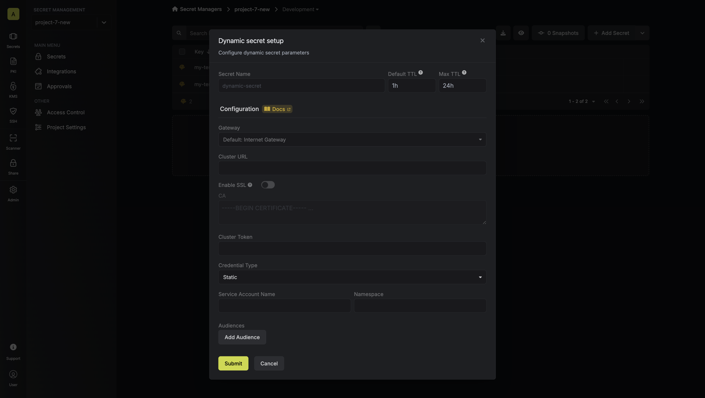

The Infisical Kubernetes dynamic secret allows you to generate short-lived service account tokens on demand.

## Overview

The Kubernetes dynamic secret feature enables you to generate short-lived service account tokens for your Kubernetes clusters. This is particularly useful for:

- **Secure Access Management**: Instead of using long-lived service account tokens, you can generate short-lived tokens that automatically expire, reducing the risk of token exposure.
- **Temporary Access**: Generate tokens with specific TTLs (Time To Live) for temporary access to your Kubernetes clusters.
- **Audit Trail**: Each token generation is tracked, providing better visibility into who accessed your cluster and when.
- **Integration with Private Clusters**: Seamlessly work with private Kubernetes clusters using Infisical's Gateway feature.

<Note>
  Kubernetes service account tokens cannot be revoked once issued. This is why
  it's important to use short TTLs and carefully manage token generation. The
  tokens will automatically expire after their TTL period.
</Note>

<Note>
  Kubernetes service account tokens are JWTs (JSON Web Tokens) with a fixed
  expiration time. Once a token is generated, its lifetime cannot be extended.
  If you need longer access, you'll need to generate a new token.
</Note>

This feature is ideal for scenarios where you need to:

- Provide temporary access to developers or CI/CD pipelines
- Rotate service account tokens frequently
- Maintain a secure audit trail of cluster access
- Manage access to multiple Kubernetes clusters

## Prerequisites

- A Kubernetes cluster with a service account
- Cluster access token with permissions to create service account tokens
- (Optional) [Gateway](/documentation/platform/gateways/overview) for private cluster access

## RBAC Configuration

Before you can start generating dynamic service account tokens, you'll need to configure the appropriate permissions in your Kubernetes cluster. This involves setting up Role-Based Access Control (RBAC) to allow the creation and management of service account tokens.

The RBAC configuration serves a crucial security purpose: it creates a dedicated service account with minimal permissions that can only create and manage service account tokens. This follows the principle of least privilege, ensuring that the token generation process is secure and controlled.

The following RBAC configuration creates the necessary permissions for generating service account tokens:

```yaml
apiVersion: rbac.authorization.k8s.io/v1
kind: ClusterRole
metadata:
  name: tokenrequest
rules:
  - apiGroups: [""]
    resources:
      - "serviceaccounts/token"
      - "serviceaccounts"
    verbs:
      - "create"
      - "get"
---
apiVersion: rbac.authorization.k8s.io/v1
kind: ClusterRoleBinding
metadata:
  name: tokenrequest
roleRef:
  apiGroup: rbac.authorization.k8s.io
  kind: ClusterRole
  name: tokenrequest
subjects:
  - kind: ServiceAccount
    name: infisical-token-requester
    namespace: default
```

This configuration:

1. Creates a `ClusterRole` named `tokenrequest` that allows:
   - Creating and getting service account tokens
   - Getting service account information
2. Creates a `ClusterRoleBinding` that binds the role to a service account named `infisical-token-requester` in the `default` namespace

You can customize the service account name and namespace according to your needs.

## Obtaining the Cluster Token

After setting up the RBAC configuration, you need to obtain a token for the service account that will be used to create dynamic secrets. Here's how to get the token:

1. Create a service account in your Kubernetes cluster that will be used to create service account tokens:

```yaml infisical-service-account.yaml
apiVersion: v1
kind: ServiceAccount
metadata:
  name: infisical-token-requester
  namespace: default
```

```bash
kubectl apply -f infisical-service-account.yaml
```

2. Create a long-lived service account token using this configuration file:

```yaml service-account-token.yaml
apiVersion: v1
kind: Secret
type: kubernetes.io/service-account-token
metadata:
  name: infisical-token-requester-token
  annotations:
    kubernetes.io/service-account.name: "infisical-token-requester"
```

```bash
kubectl apply -f service-account-token.yaml
```

3. Link the secret to the service account:

```bash
kubectl patch serviceaccount infisical-token-requester -p '{"secrets": [{"name": "infisical-token-requester-token"}]}' -n default
```

4. Retrieve the token:

```bash
kubectl get secret infisical-token-requester-token -n default -o=jsonpath='{.data.token}' | base64 --decode
```

This token will be used as the "Cluster Token" in the dynamic secret configuration.

## Set up Dynamic Secrets with Kubernetes

<Steps>
  <Step title="Open Secret Overview Dashboard">
    Open the Secret Overview dashboard and select the environment in which you would like to add a dynamic secret.
  </Step>
  <Step title="Click on the 'Add Dynamic Secret' button">
    
  </Step>
  <Step title="Select Kubernetes">
    
  </Step>
  <Step title="Provide the inputs for dynamic secret parameters">
    <ParamField path="Secret Name" type="string" required>
      Name by which you want the secret to be referenced
    </ParamField>
    <ParamField path="Default TTL" type="string" required>
      Default time-to-live for a generated secret (it is possible to modify this value after a secret is generated)
    </ParamField>
    <ParamField path="Max TTL" type="string" required>
      Maximum time-to-live for a generated secret
    </ParamField>
    <ParamField path="Gateway" type="string">
      Select a gateway for private cluster access. If not specified, the Internet Gateway will be used.
    </ParamField>
    <ParamField path="URL" type="string" required>
      Kubernetes API server URL (e.g., https://kubernetes.default.svc)
    </ParamField>
    <ParamField path="Enable SSL" type="boolean">
      Whether to enable SSL verification for the Kubernetes API server connection.
    </ParamField>
    <ParamField path="CA" type="string">
      Custom CA certificate for the Kubernetes API server. Leave blank to use the system/public CA.
    </ParamField>
    <ParamField path="Cluster Token" type="string" required>
      Token with permissions to create service account tokens
    </ParamField>
    <ParamField path="Service Account Name" type="string" required>
      Name of the service account to generate tokens for
    </ParamField>
    <ParamField path="Namespace" type="string" required>
      Kubernetes namespace where the service account exists
    </ParamField>
    <ParamField path="Audiences" type="array">
      Optional list of audiences to include in the generated token
    </ParamField>

    

  </Step>
  <Step title="Click 'Submit'">
    After submitting the form, you will see a dynamic secret created in the dashboard.
  </Step>
  <Step title="Generate dynamic secrets">
    Once you've successfully configured the dynamic secret, you're ready to generate on-demand service account tokens.
    To do this, simply click on the 'Generate' button which appears when hovering over the dynamic secret item.
    Alternatively, you can initiate the creation of a new lease by selecting 'New Lease' from the dynamic secret lease list section.

    
    

    When generating these secrets, it's important to specify a Time-to-Live (TTL) duration. This will dictate how long the credentials are valid for.

    

    <Tip>
      Ensure that the TTL for the lease fall within the maximum TTL defined when configuring the dynamic secret.
    </Tip>

    Once you click the `Submit` button, a new secret lease will be generated and the service account token will be shown to you.

    

  </Step>
</Steps>

## Audit or Revoke Leases

Once you have created one or more leases, you will be able to access them by clicking on the respective dynamic secret item on the dashboard.
This will allow you to see the lease details and delete the lease ahead of its expiration time.

<Note>
  While you can delete the lease from Infisical, the actual Kubernetes service
  account token cannot be revoked. The token will remain valid until its TTL
  expires. This is why it's crucial to use appropriate TTL values when
  generating tokens.
</Note>


