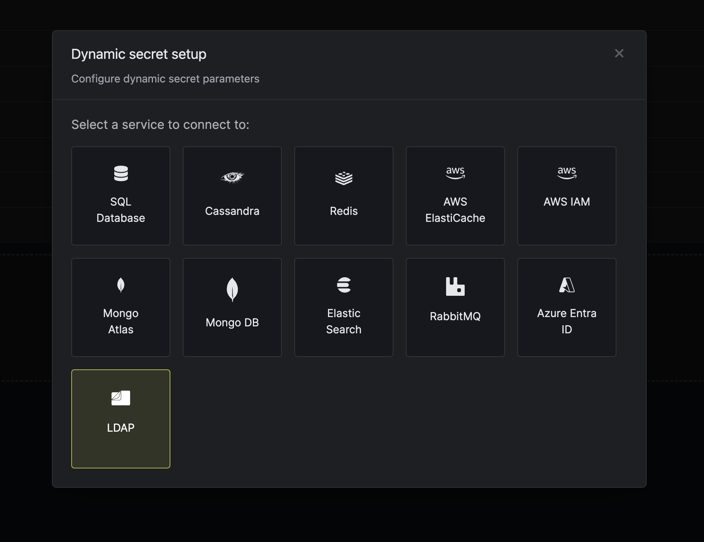

import DynamicSecretUsernameTemplateParamField from "/snippets/documentation/platform/dynamic-secrets/dynamic-secret-username-template-field.mdx";

The Infisical LDAP dynamic secret allows you to generate user credentials on demand via LDAP. The integration is general to any LDAP implementation but has been tested with OpenLDAP and Active directory as of now.

## Prerequisites

1. Create a user with the necessary permissions to create users in your LDAP server.
2. Ensure your LDAP server is reachable via Infisical instance.

## Create LDAP Credentials

<Tabs>
  <Tab title="Dynamic">
    <Steps>
      <Step title="Open Secret Overview Dashboard">
        Open the Secret Overview dashboard and select the environment in which you would like to add a dynamic secret.
      </Step>
      <Step title="Click on the 'Add Dynamic Secret' button">
      
      </Step>
      <Step title="Select 'LDAP'">
      
      </Step>

      <Step title="Provide the inputs for dynamic secret parameters">
        <ParamField path="Secret Name" type="string" required>
          Name by which you want the secret to be referenced
        </ParamField>

        <ParamField path="Default TTL" type="string" required>
          Default time-to-live for a generated secret (it is possible to modify this value after a secret is generated)
        </ParamField>

        <ParamField path="Max TTL" type="string" required>
          Maximum time-to-live for a generated secret.
        </ParamField>

        <ParamField path="URL" type="string" required>
          LDAP url to connect to. _(Example: ldap://your-ldap-ip:389 or ldaps://domain:636)_
        </ParamField>

        <ParamField path="BIND DN" type="string" required>
            DN to bind to. This should have permissions to create a new users.
        </ParamField>

        <ParamField path="BIND Password" type="string" required>
            Password for the given DN.
        </ParamField>

        <ParamField path="CA" type="text">
          CA certificate to use for TLS in case of a secure connection.
        </ParamField>

        <ParamField path="Credential Type" type="enum">
          The type of LDAP credential - select Dynamic.
        </ParamField>

        <ParamField path="Creation LDIF" type="text" required>
          LDIF to run while creating a user in LDAP. This can include extra steps to assign the user to groups or set permissions.
            Here `{{Username}}`, `{{Password}}` and `{{EncodedPassword}}` are templatized variables for the username and password generated by the dynamic secret.

            `{{EncodedPassword}}` is the encoded password required for the `unicodePwd` field in Active Directory as described [here](https://learn.microsoft.com/en-us/troubleshoot/windows-server/active-directory/change-windows-active-directory-user-password).

            **OpenLDAP** Example:
            ```
            dn: uid={{Username}},dc=infisical,dc=com
            changetype: add
            objectClass: top
            objectClass: person
            objectClass: organizationalPerson
            objectClass: inetOrgPerson
            cn: John Doe
            sn: Doe
            uid: jdoe
            mail: jdoe@infisical.com
            userPassword: {{Password}}
            ```

            **Active Directory** Example:
            ```
            dn: CN={{Username}},OU=Test Create,DC=infisical,DC=com
            changetype: add
            objectClass: top
            objectClass: person
            objectClass: organizationalPerson
            objectClass: user
            userPrincipalName: {{Username}}@infisical.com
            sAMAccountName: {{Username}}
            unicodePwd::{{EncodedPassword}}
            userAccountControl: 66048

            dn: CN=test-group,OU=Test Create,DC=infisical,DC=com
            changetype: modify
            add: member
            member:  CN={{Username}},OU=Test Create,DC=infisical,DC=com
            -
            ```
        </ParamField>

        <ParamField path="Revocation LDIF" type="text" required>
          LDIF to run while revoking a user in LDAP. This can include extra steps to remove the user from groups or set permissions.
            Here `{{Username}}` is a templatized variable for the username generated by the dynamic secret.

            **OpenLDAP / Active Directory** Example:
            ```
            dn: CN={{Username}},OU=Test Create,DC=infisical,DC=com
            changetype: delete
            ```
        </ParamField>

        <ParamField path="Rollback LDIF" type="text">
          LDIF to run incase Creation LDIF fails midway.

            For the creation example shown above, if the user is created successfully but not added to a group, this LDIF can be used to remove the user.
            Here `{{Username}}`, `{{Password}}` and `{{EncodedPassword}}` are templatized variables for the username generated by the dynamic secret.

            **OpenLDAP / Active Directory** Example:
            ```
            dn: CN={{Username}},OU=Test Create,DC=infisical,DC=com
            changetype: delete
            ```
        </ParamField>
        <DynamicSecretUsernameTemplateParamField />
      </Step>

      <Step title="Click `Submit`">
        After submitting the form, you will see a dynamic secret created in the dashboard.
      </Step>
      <Step title="Generate dynamic secrets">
      Once you've successfully configured the dynamic secret, you're ready to generate on-demand credentials.
      To do this, simply click on the 'Generate' button which appears when hovering over the dynamic secret item.
      Alternatively, you can initiate the creation of a new lease by selecting 'New Lease' from the dynamic secret lease list section.

        
        

        When generating these secrets, it's important to specify a Time-to-Live (TTL) duration. This will dictate how long the credentials are valid for.

        

        <Tip>
          Ensure that the TTL for the lease falls within the maximum TTL defined when configuring the dynamic secret.
        </Tip>


        Once you click the `Submit` button, a new secret lease will be generated and the credentials from it will be shown to you with an array of DN's altered depending on the Creation LDIF.

        
     </Step>

    </Steps>

  </Tab>
  <Tab title="Static">
    <Steps>
      <Step title="Open Secret Overview Dashboard">
        Open the Secret Overview dashboard and select the environment in which you would like to add a dynamic secret.
      </Step>
      <Step title="Click on the 'Add Dynamic Secret' button">
      
      </Step>
      <Step title="Select 'LDAP'">
      
      </Step>

      <Step title="Provide the inputs for dynamic secret parameters">
        <ParamField path="Secret Name" type="string" required>
          Name by which you want the secret to be referenced
        </ParamField>

        <ParamField path="Default TTL" type="string" required>
          Default time-to-live for a generated secret (it is possible to modify this value after a secret is generated)
        </ParamField>

        <ParamField path="Max TTL" type="string" required>
          Maximum time-to-live for a generated secret.
        </ParamField>

        <ParamField path="URL" type="string" required>
          LDAP url to connect to. _(Example: ldap://your-ldap-ip:389 or ldaps://domain:636)_
        </ParamField>

        <ParamField path="BIND DN" type="string" required>
            DN to bind to. This should have permissions to create a new users.
        </ParamField>

        <ParamField path="BIND Password" type="string" required>
            Password for the given DN.
        </ParamField>

        <ParamField path="CA" type="text">
          CA certificate to use for TLS in case of a secure connection.
        </ParamField>

        <ParamField path="Credential Type" type="enum">
          The type of LDAP credential - select Static.
        </ParamField>

        <ParamField path="Rotation LDIF" type="text" required>
            LDIF to run for rotating the credentals of an LDAP user. This can include extra LDAP steps based on your needs.
            Here `{{Password}}` and `{{EncodedPassword}}` are templatized variables for the password generated by the dynamic secret.

            Note that the `-` characters and the empty lines found at the end of the examples are necessary based on the LDIF format.

            **OpenLDAP** Example:
            ```
            dn: cn=sheencaps capadngan,ou=people,dc=acme,dc=com
            changetype: modify
            replace: userPassword
            password: {{Password}}
            -

            ```

            **Active Directory** Example:
            ```
            dn: cn=sheencaps capadngan,ou=people,dc=acme,dc=com
            changetype: modify
            replace: unicodePwd
            unicodePwd::{{EncodedPassword}}
            -

            ```
            `{{EncodedPassword}}` is the encoded password required for the `unicodePwd` field in Active Directory as described [here](https://learn.microsoft.com/en-us/troubleshoot/windows-server/active-directory/change-windows-active-directory-user-password).

        </ParamField>
      </Step>

      <Step title="Click `Submit`">
        After submitting the form, you will see a dynamic secret created in the dashboard.
      </Step>
      <Step title="Generate dynamic secrets">
      Once you've successfully configured the dynamic secret, you're ready to generate on-demand credentials.
      To do this, simply click on the 'Generate' button which appears when hovering over the dynamic secret item.
      Alternatively, you can initiate the creation of a new lease by selecting 'New Lease' from the dynamic secret lease list section.

        
        

        When generating these secrets, it's important to specify a Time-to-Live (TTL) duration. This will dictate how long the credentials are valid for.

        

        <Tip>
          Ensure that the TTL for the lease falls within the maximum TTL defined when configuring the dynamic secret.
        </Tip>


        Once you click the `Submit` button, a new secret lease will be generated and the credentials from it will be shown to you with an array of DN's altered depending on the Creation LDIF.

        
     </Step>

    </Steps>

  </Tab>
</Tabs>

## Active Directory Integration

- Passwords in Active Directory are set using the `unicodePwd` field. This must be proceeded by two colons `::` as shown in the example. [Source](https://learn.microsoft.com/en-us/troubleshoot/windows-server/active-directory/change-windows-active-directory-user-password)
- Active directory uses the `userAccountControl` field to enable account. [Read More](https://learn.microsoft.com/en-us/troubleshoot/windows-server/active-directory/useraccountcontrol-manipulate-account-properties)
  - `userAccountControl` set to `512` enables a user.
  - To disable AD's password expiration for this dynamic user account. The `userAccountControl` value for this is: `65536`.
  - Since `userAccountControl` flag is cumulative set it to `512 + 65536` = `66048` to do both.
- Active Directory does not permit direct modification of a user's `memberOf` attribute. The member attribute of a group and the `memberOf` attribute of a user are [linked attributes](https://learn.microsoft.com/en-us/windows/win32/ad/linked-attributes), where the member attribute represents the forward link, which can be modified. In the context of AD group membership, the group's `member` attribute serves as the forward link. Therefore, to add a newly created dynamic user to a group, a modification request must be issued to the desired group, updating its membership to include the new user.

## LDIF Entries

User account management is handled through **LDIF entries**.

#### Things to Remember

- **No trailing spaces:** Ensure there are no trailing spaces on any line, including blank lines.
- **Empty lines before modify blocks:** Every modify block must be preceded by an empty line.
- **Multiple modifications:** You can define multiple modifications for a DN within a single modify block. Each modification should end with a single dash (`-`).
