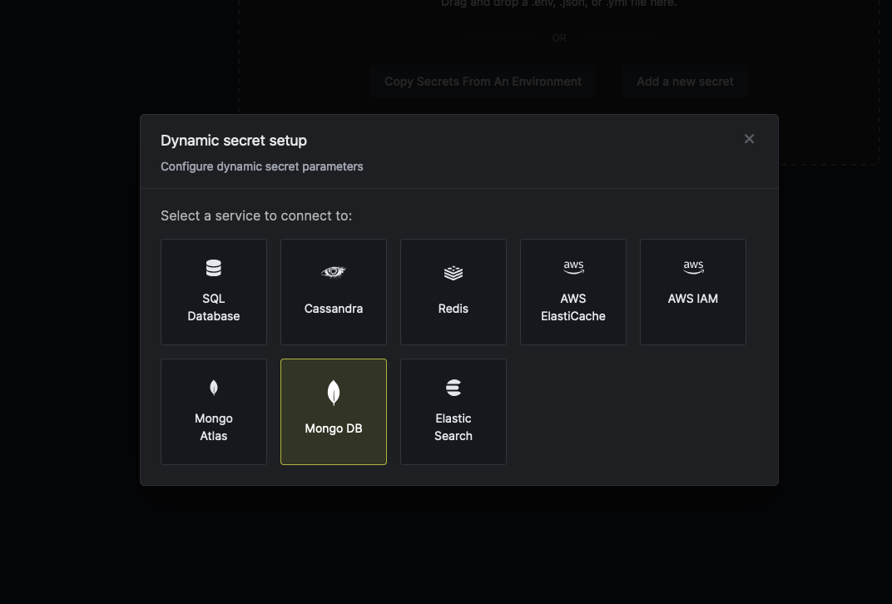
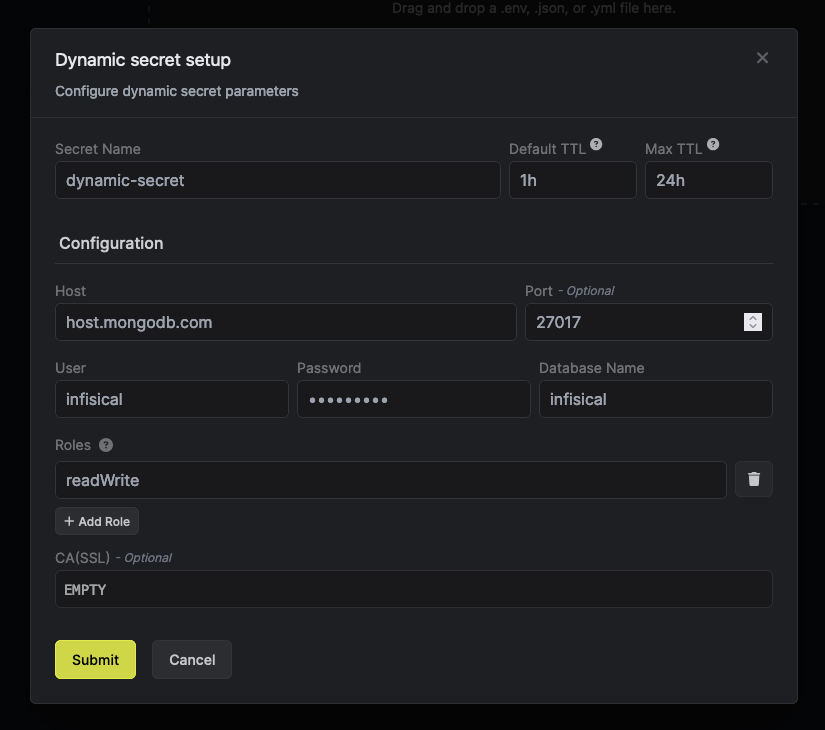

import DynamicSecretUsernameTemplateParamField from "/snippets/documentation/platform/dynamic-secrets/dynamic-secret-username-template-field.mdx";

The Infisical Mongo DB dynamic secret allows you to generate Mongo DB Database credentials on demand based on configured role.

<Info>
				If your using Mongo Atlas, please use [Atlas Dynamic Secret](./mongo-atlas) as MongoDB commands are not supported by atlas.
</Info>

## Prerequisite
Create a user with the required permission in your MongoDB instance. This user will be used to create new accounts on-demand.

## Set up Dynamic Secrets with Mongo DB

<Steps>
  <Step title="Open Secret Overview Dashboard">
	Open the Secret Overview dashboard and select the environment in which you would like to add a dynamic secret.
  </Step>
  <Step title="Click on the 'Add Dynamic Secret' button">
	
  </Step>
  <Step title="Select Mongo DB">
	
  </Step>
  <Step title="Provide the inputs for dynamic secret parameters">
	<ParamField path="Secret Name" type="string" required>
		Name by which you want the secret to be referenced
	</ParamField>

	<ParamField path="Default TTL" type="string" required>
		Default time-to-live for a generated secret (it is possible to modify this value after a secret is generated)
	</ParamField>

	<ParamField path="Max TTL" type="string" required>
		Maximum time-to-live for a generated secret
	</ParamField>

	<ParamField path="Host" type="string" required>
		Database host URL.
	</ParamField>

	<ParamField path="Port" type="number">
		Database port number. If your Mongo DB is cluster you can omit this.
	</ParamField>

	<ParamField path="User" type="string" required>
		Username of the admin user that will be used to create dynamic secrets
	</ParamField>

	<ParamField path="Password" type="string" required>
		Password of the admin user that will be used to create dynamic secrets
	</ParamField>

	<ParamField path="Database Name" type="string" required>
		Name of the database for which you want to create dynamic secrets
	</ParamField>

	<ParamField path="Roles" type="list" required>
		 Human-readable label that identifies a group of privileges assigned to a database user. This value can either be a built-in role or a custom role.
		 - Enum: `atlasAdmin` `backup` `clusterMonitor` `dbAdmin` `dbAdminAnyDatabase` `enableSharding` `read` `readAnyDatabase` `readWrite` `readWriteAnyDatabase` `<a custom role name>`.
	</ParamField>

	<ParamField path="CA(SSL)" type="string">
		A CA may be required if your DB requires it for incoming connections.
	</ParamField>
	<DynamicSecretUsernameTemplateParamField />

	
	</Step>

  <Step title="Click `Submit`">
  	After submitting the form, you will see a dynamic secret created in the dashboard.

	<Note>
		If this step fails, you may have to add the CA certificate.
	</Note>

  </Step>
  <Step title="Generate dynamic secrets">
	Once you've successfully configured the dynamic secret, you're ready to generate on-demand credentials.
	To do this, simply click on the 'Generate' button which appears when hovering over the dynamic secret item.
	Alternatively, you can initiate the creation of a new lease by selecting 'New Lease' from the dynamic secret lease list section.

	
	

	When generating these secrets, it's important to specify a Time-to-Live (TTL) duration. This will dictate how long the credentials are valid for.

	

	<Tip>
		Ensure that the TTL for the lease falls within the maximum TTL defined when configuring the dynamic secret.
	</Tip>

	Once you click the `Submit` button, a new secret lease will be generated and the credentials from it will be shown to you.

	
  </Step>
</Steps>

## Audit or Revoke Leases
Once you have created one or more leases, you will be able to access them by clicking on the respective dynamic secret item on the dashboard.
This will allow you to see the expiration time of the lease or delete a lease before it's set time to live.

## Renew Leases
To extend the life of the generated dynamic secret leases past its initial time to live, simply click on the **Renew** button as illustrated below.

<Warning>
	Lease renewals cannot exceed the maximum TTL set when configuring the dynamic secret
</Warning>
