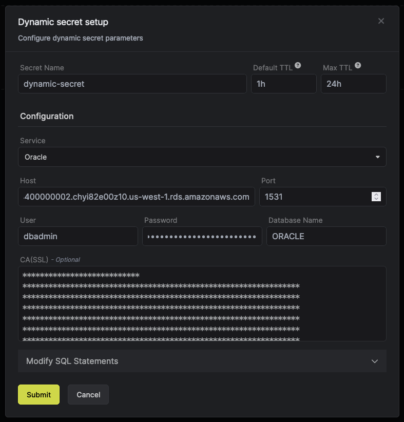

The Infisical Oracle dynamic secret allows you to generate Oracle Database credentials on demand based on configured role.

## Prerequisite

1. Create a user with the required permission in your SQL instance.

## Set up Dynamic Secrets with Oracle

<Steps>
  <Step title="Open Secret Overview Dashboard">
	Open the Secret Overview dashboard and select the environment in which you would like to add a dynamic secret.
  </Step>
  <Step title="Click on the `Add Dynamic Secret` button">
	
  </Step>
  <Step title="Select `SQL Database`">
	
  </Step>
  <Step title="Provide the inputs for dynamic secret parameters">
	<ParamField path="Secret Name" type="string" required>
		Name by which you want the secret to be referenced
	</ParamField>

	<ParamField path="Default TTL" type="string" required>
		Default time-to-live for a generated secret (it is possible to modify this value when a secret is generate)
	</ParamField>

	<ParamField path="Max TTL" type="string" required>
		Maximum time-to-live for a generated secret
	</ParamField>

	<ParamField path="Service" type="string" required>
		Choose the service you want to generate dynamic secrets for. This must be selected as **Oracle**.
	</ParamField>

	<ParamField path="Host" type="string" required>
		Database host
	</ParamField>

	<ParamField path="Port" type="number" required>
		Database port
	</ParamField>

	<ParamField path="User" type="string" required>
		Username that will be used to create dynamic secrets
	</ParamField>

	<ParamField path="Password" type="string" required>
		Password that will be used to create dynamic secrets
	</ParamField>

	<ParamField path="Database Name" type="string" required>
		Name of the database for which you want to create dynamic secrets
	</ParamField>
 
	<ParamField path="CA(SSL)" type="string">
		A CA may be required if your DB requires it for incoming connections. AWS RDS instances with default settings will requires a CA which can be downloaded [here](https://docs.aws.amazon.com/AmazonRDS/latest/UserGuide/UsingWithRDS.SSL.html#UsingWithRDS.SSL.CertificatesAllRegions).
	</ParamField>

	

  </Step>
  <Step title="(Optional) Modify SQL Statements">
  	If you want to provide specific privileges for the future generated dynamic secrets, you are able to specify them as SQL statements. 

	
  </Step>
  <Step title="Click `Submit`">
  	After submitting the form, you will see a dynamic secret creates in the dashboard. 

	<Note>
		If this step fails, you might have to add the CA certficate. 
	</Note>

	
  </Step>
  <Step title="Generate dynamic secrets">
	Once you've successfully created the dynamic secret, you're all set to generate unique secret values. To do this, simply click on the Generate button located in the respective row. Alternatively, you can initiate the creation of a new lease by selecting New Leases from the dynamic secret lease list section, accessible by clicking on the relevant row.

	
	

	When generating these secrets, it's important to specify a Time-to-Live (TTL) duration within the predefined range. Ensure that the TTL falls within the maximum TTL defined in the previous step to maintain consistency and security.

	

	After you click the `Submit` button, a new secret lease will be generated and the Database User and Database Password will be shown. 

	
  </Step>
</Steps>

## Audit or Revoke Leases
As soon as you have generated a few secret leases, you will be able to access them by clicking on the respective dynamic secret row. In this modal, you are able to see the expiration time or delete a secret preemptively.

## Renew Leases

To extend the expiration of generated dynamic secret leases, simply click on the **Renew** button located above, as illustrated. This action also allows for an extension of the Time-to-Live (TTL). 
However, it's crucial to note that the expiry cannot exceed the maximum TTL from created, specified in the configuration settings.
