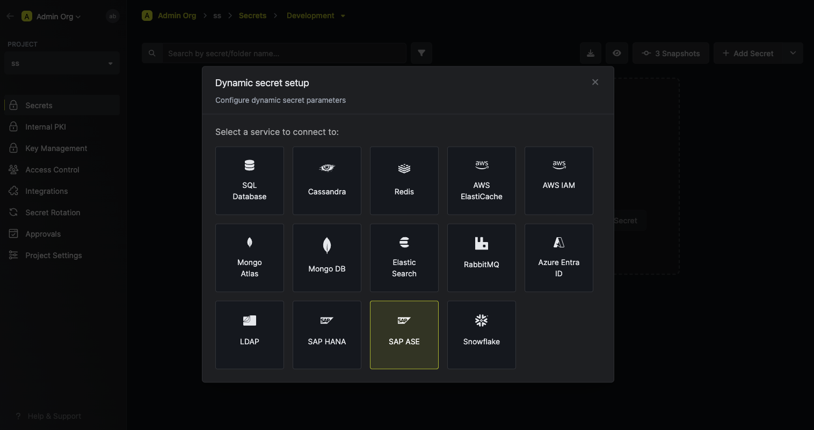
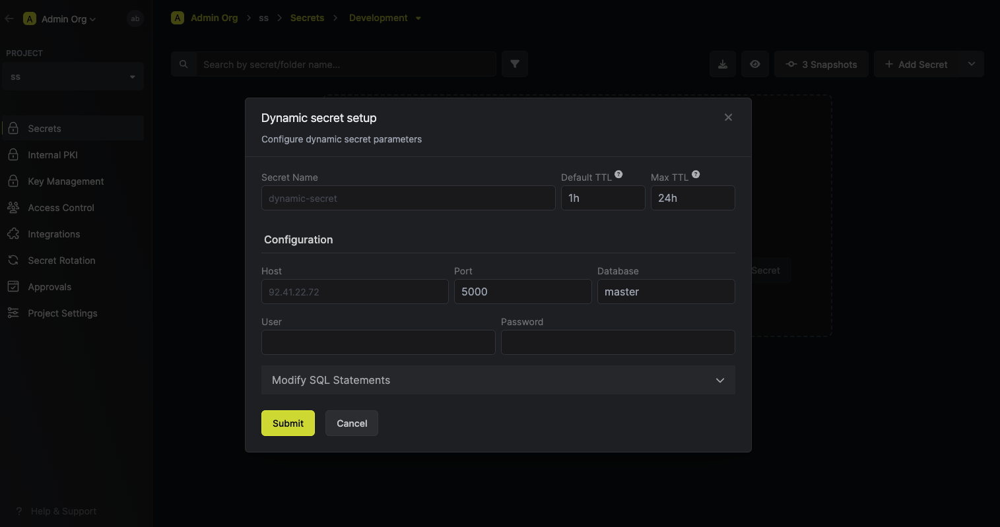
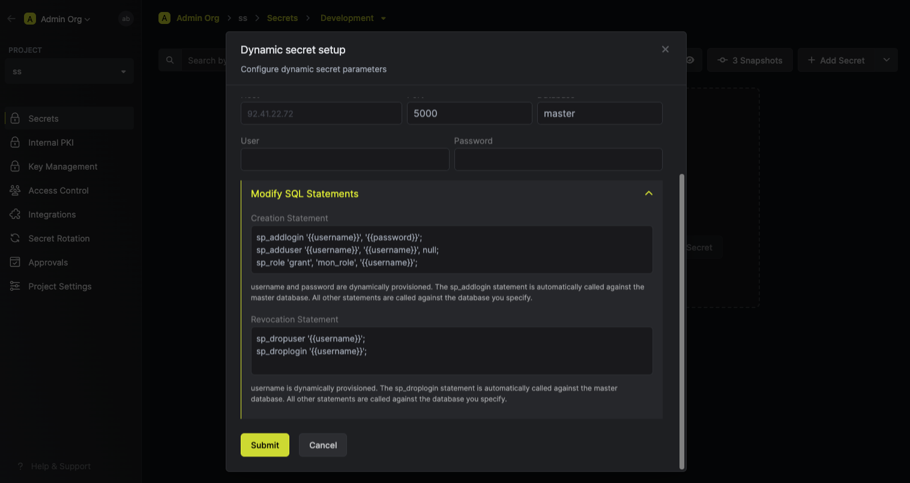

import DynamicSecretUsernameTemplateParamField from "/snippets/documentation/platform/dynamic-secrets/dynamic-secret-username-template-field.mdx";

The Infisical SAP ASE dynamic secret allows you to generate SAP ASE database credentials on demand.

## Prerequisite

- Infisical requires that you have a user in your SAP ASE instance, configured with the appropriate permissions. This user will facilitate the creation of new accounts as needed.
  Ensure the user possesses privileges for creating, dropping, and granting permissions to roles for it to be able to create dynamic secrets.
  The user used for authentication must have access to the `master` database. You can use the `sa` user for this purpose or create a new user with the necessary permissions.

- The SAP ASE instance should be reachable by Infisical.

## Set up Dynamic Secrets with SAP ASE

<Steps>
  <Step title="Open Secret Overview Dashboard">
	Open the Secret Overview dashboard and select the environment in which you would like to add a dynamic secret.
  </Step>
  <Step title="Click on the 'Add Dynamic Secret' button">
	
  </Step>
  <Step title="Select SAP ASE">
	
  </Step>
  <Step title="Provide the inputs for dynamic secret parameters">
	<ParamField path="Secret Name" type="string" required>
		Name by which you want the secret to be referenced
	</ParamField>

    <ParamField path="Default TTL" type="string" required>
    	Default time-to-live for a generated secret (it is possible to modify this value when a secret is generate)
    </ParamField>

    <ParamField path="Max TTL" type="string" required>
    	The maximum time-to-live for a generated secret
    </ParamField>

    <ParamField path="Host" type="string" required>
    	Your SAP ASE instance host (IP or domain)
    </ParamField>

    <ParamField path="Port" type="number" required>
      Your SAP ASE instance port. On default SAP ASE instances this is usually `5000`.
    </ParamField>

    <ParamField path="Database" type="number" required>
      The database name that you want to generate credentials for. This database must exist on the SAP ASE instance.
      Please note that the user/password used for authentication must have access to this database, **and** the `master` database.
    </ParamField>

    <ParamField path="User" type="string" required>
    	Username that will be used to create dynamic secrets
    </ParamField>

    <ParamField path="Password" type="string" required>
    	Password that will be used to create dynamic secrets
    </ParamField>

    

  </Step>
  <Step title="(Optional) Modify SAP SQL Statements">
    
    <DynamicSecretUsernameTemplateParamField />
    <ParamField path="Customize Statement" type="string">

If you want to provide specific privileges for the generated dynamic credentials, you can modify the SQL statement to your needs.
<Warning>
Due to SAP ASE limitations, the attached SQL statements are not executed as a transaction.
</Warning>
</ParamField>

  </Step>
  <Step title="Click 'Submit'">
  	After submitting the form, you will see a dynamic secret created in the dashboard.
  </Step>
  <Step title="Generate dynamic secrets">
	Once you've successfully configured the dynamic secret, you're ready to generate on-demand credentials.
	To do this, simply click on the 'Generate' button which appears when hovering over the dynamic secret item.
	Alternatively, you can initiate the creation of a new lease by selecting 'New Lease' from the dynamic secret lease list section.

    
    

    When generating these secrets, it's important to specify a Time-to-Live (TTL) duration. This will dictate how long the credentials are valid for.

    

    <Tip>
    	Ensure that the TTL for the lease falls within the maximum TTL defined when configuring the dynamic secret in step 4.
    </Tip>

    Once you click the `Submit` button, a new secret lease will be generated and the credentials for it will be shown to you.

    

  </Step>
</Steps>

## Audit or Revoke Leases

Once you have created one or more leases, you will be able to access them by clicking on the respective dynamic secret item on the dashboard.
This will allow you see the lease details and delete the lease ahead of its expiration time.

## Renew Leases

To extend the life of the generated dynamic secret lease past its initial time to live, simply click on the **Renew** as illustrated below.

<Warning>
  Lease renewals cannot exceed the maximum TTL set when configuring the dynamic
  secret.
</Warning>
