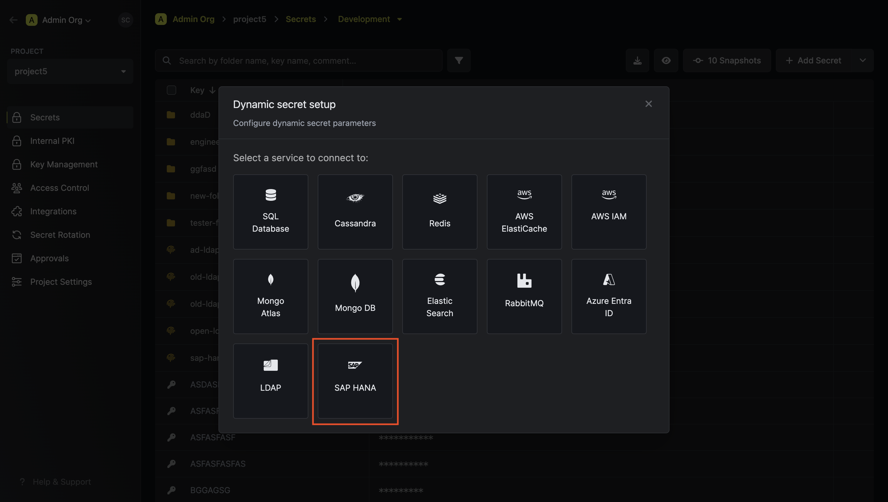
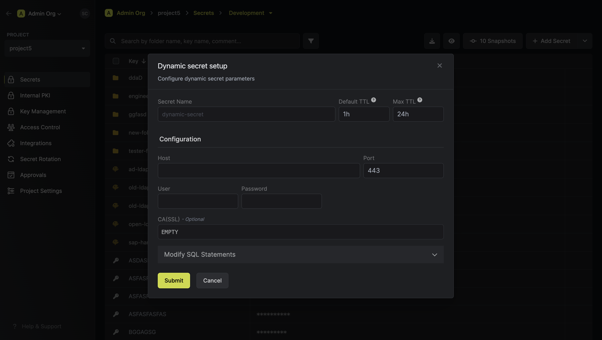
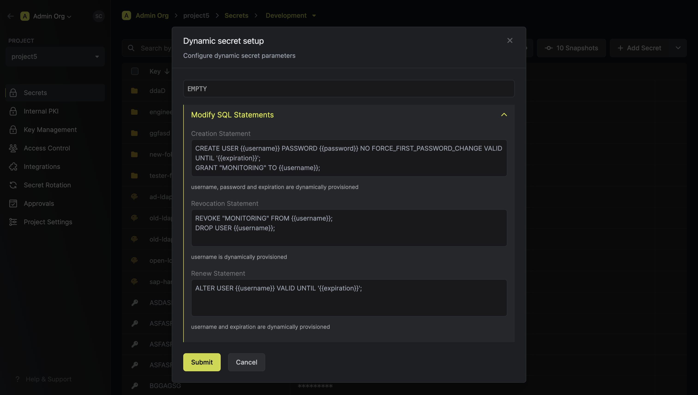

import DynamicSecretUsernameTemplateParamField from "/snippets/documentation/platform/dynamic-secrets/dynamic-secret-username-template-field.mdx";

The Infisical SAP HANA dynamic secret allows you to generate SAP HANA database credentials on demand.

## Prerequisite

- Infisical requires a SAP HANA database user in your instance with the necessary permissions. This user will facilitate the creation of new accounts as needed.
  Ensure the user possesses privileges for creating, dropping, and granting permissions to roles for it to be able to create dynamic secrets.

- The SAP HANA instance should be reachable by Infisical.

## Set up Dynamic Secrets with SAP HANA

<Steps>
  <Step title="Open Secret Overview Dashboard">
	Open the Secret Overview dashboard and select the environment in which you would like to add a dynamic secret.
  </Step>
  <Step title="Click on the 'Add Dynamic Secret' button">
	
  </Step>
  <Step title="Select SAP HANA">
	
  </Step>
  <Step title="Provide the inputs for dynamic secret parameters">
	<ParamField path="Secret Name" type="string" required>
		Name by which you want the secret to be referenced
	</ParamField>

    <ParamField path="Default TTL" type="string" required>
    	Default time-to-live for a generated secret (it is possible to modify this value after a secret is generated)
    </ParamField>

    <ParamField path="Max TTL" type="string" required>
    	Maximum time-to-live for a generated secret
    </ParamField>

    <ParamField path="Host" type="string" required>
    	SAP HANA Host

  </ParamField>

    <ParamField path="Port" type="number" required>
    	SAP HANA Port
    </ParamField>

    <ParamField path="User" type="string" required>
    	Username that will be used to create dynamic secrets
    </ParamField>

    <ParamField path="Password" type="string" required>
    	Password that will be used to create dynamic secrets
    </ParamField>

    <ParamField path="CA(SSL)" type="string">
    	A CA may be required for SSL if you are self-hosting SAP HANA

  </ParamField>

    

  </Step>
  <Step title="(Optional) Modify SAP SQL Statements">
  
    <DynamicSecretUsernameTemplateParamField />
    <ParamField path="Customize Statement" type="string">

    If you want to provide specific privileges for the generated dynamic credentials, you can modify the SQL statement to your needs.

    <Warning>
      Due to SAP HANA limitations, the attached SQL statements are not executed as a transaction.
    </Warning>

</ParamField>

  </Step>
  <Step title="Click 'Submit'">
  	After submitting the form, you will see a dynamic secret created in the dashboard.

    <Note>
    	If this step fails, you may have to add the CA certficate.
    </Note>

  </Step>
  <Step title="Generate dynamic secrets">
	Once you've successfully configured the dynamic secret, you're ready to generate on-demand credentials.
	To do this, simply click on the 'Generate' button which appears when hovering over the dynamic secret item.
	Alternatively, you can initiate the creation of a new lease by selecting 'New Lease' from the dynamic secret lease list section.

    
    

    When generating these secrets, it's important to specify a Time-to-Live (TTL) duration. This will dictate how long the credentials are valid for.

    

    <Tip>
    	Ensure that the TTL for the lease falls within the maximum TTL defined when configuring the dynamic secret in step 4.
    </Tip>

    Once you click the `Submit` button, a new secret lease will be generated and the credentials for it will be shown to you.

    

  </Step>
</Steps>

## Audit or Revoke Leases

Once you have created one or more leases, you will be able to access them by clicking on the respective dynamic secret item on the dashboard.
This will allow you to see the lease details and delete the lease ahead of its expiration time.

## Renew Leases

To extend the life of the generated dynamic secret lease past its initial time to live, simply click on the **Renew** button as illustrated below.

<Warning>
  Lease renewals cannot exceed the maximum TTL set when configuring the dynamic
  secret.
</Warning>
