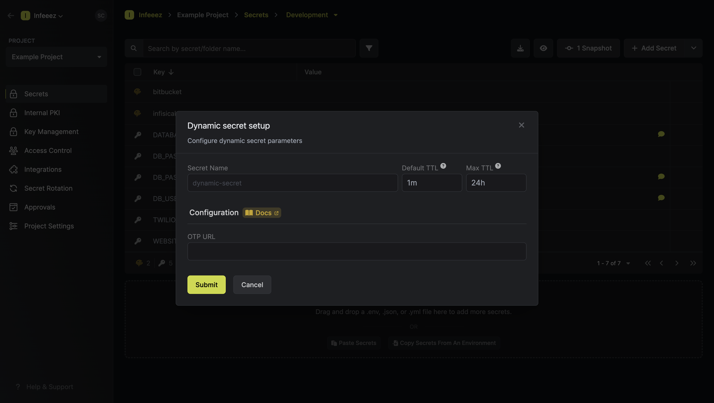

The Infisical TOTP dynamic secret allows you to generate time-based one-time passwords on demand.

## Prerequisite

- Infisical requires the OTP url from the TOTP provider.

## Set up Dynamic Secrets with TOTP

<Steps>
  <Step title="Open Secret Overview Dashboard">
	Open the Secret Overview dashboard and select the environment in which you would like to add a dynamic secret.
  </Step>
  <Step title="Click on the 'Add Dynamic Secret' button">
	
  </Step>
  <Step title="Select TOTP">
	
  </Step>
  <Step title="Provide the inputs for dynamic secret parameters">
	<ParamField path="Secret Name" type="string" required>
		Name by which you want the secret to be referenced
	</ParamField>

    <ParamField path="Default TTL" type="string" required>
    	Default time-to-live for a generated secret (it is possible to modify this value when a secret is generate)
    </ParamField>

    <ParamField path="Max TTL" type="string" required>
    	Maximum time-to-live for a generated secret
    </ParamField>

    <ParamField path="URL" type="string" required>
    	OTP url from the TOTP provider
    </ParamField>

    

  </Step>
  <Step title="Click 'Submit'">
  	After submitting the form, you will see a dynamic secret created in the dashboard.

  </Step>
  <Step title="Generate dynamic secrets">
	Once you've successfully configured the dynamic secret, you're ready to generate on-demand TOTPs. 
	To do this, simply click on the 'Generate' button which appears when hovering over the dynamic secret item. 
	Alternatively, you can initiate the creation of a new lease by selecting 'New Lease' from the dynamic secret lease list section.

    
    

    Once you click the `Generate` or the `New Lease` button, a new secret lease will be generated and the TOTP will be shown to you.

    

  </Step>
</Steps>

## Audit or Revoke Leases

Once you have created one or more leases, you will be able to access them by clicking on the respective dynamic secret item on the dashboard.
This will allow you see the lease details and delete the lease ahead of its expiration time.

## Renew Leases

To extend the life of the generated dynamic secret lease past its initial time to live, simply click on the **Renew** as illustrated below.

<Warning>
  Lease renewals cannot exceed the maximum TTL set when configuring the dynamic
  secret.
</Warning>
